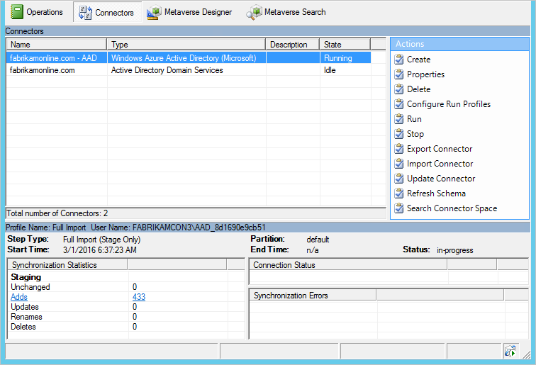
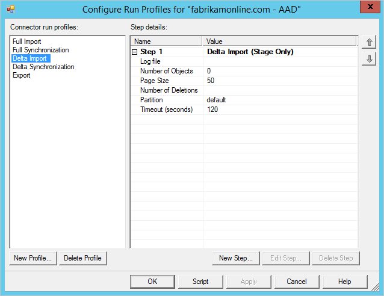
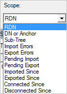
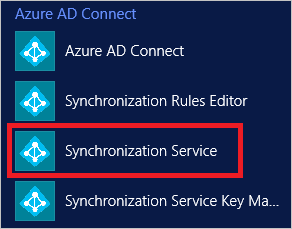

# Using connectors with the Microsoft Entra Connect Sync Service Manager

The Connectors tab is used to manage all systems the sync engine is connected to.

## Connector actions
| Action | Comment |
| --- | --- |
| Create |Do not use. For connecting to additional AD forests, use the installation wizard. |
| Properties |Used for domain and OU filtering. |
| [Delete](#delete) |Used to either delete the data in the connector space or to delete connection to a forest. |
| [Configure Run Profiles](#configure-run-profiles) |Except for domain filtering, nothing to configure here. You can use this action to see already configured run profiles. |
| Run |Used to start a one-off run of a profile. |
| Stop |Stops a Connector currently running a profile. |
| Export Connector |Do not use. |
| Import Connector |Do not use. |
| Update Connector |Do not use. |
| Refresh Schema |Refreshes the cached schema. It is preferred to use the option in the installation wizard instead, since that also updates sync rules. |
| [Search Connector Space](#search-connector-space) |Used to find objects and to Follow an object and its data through the system. |

### Delete
The delete action is used for two different things.  

The option **Delete connector space only** removes all data, but keep the configuration.

The option **Delete Connector and connector space** removes the data, the configuration and all the sync rules associated with the connector. This option is used when you do not want to connect to a forest anymore.

Both options sync all objects and update the metaverse objects. This action is a long running operation.

### Configure Run Profiles
This option allows you to see the run profiles configured for a Connector.

### Search Connector Space
The search connector space action is useful to find objects and troubleshoot data issues.

Start by selecting a **scope**. You can search based on data (RDN, DN, Anchor, Sub-Tree), or state of the object (all other options).  
  
If you for example do a Sub-Tree search, you get all objects in one OU.  
  
From this grid you can select an object, select **properties**, and [follow it](tshoot-connect-object-not-syncing.md) from the source connector space, through the metaverse, and to the target connector space.

### Changing the AD DS account password
If you change the account password, the Synchronization Service will no longer be able to import/export changes to on-premises AD.   You may see the following:

- The import/export step for the AD connector fails with "no-start-credentials" error.
- Under Windows Event Viewer, the application event log contains an error with Event ID 6000 and message “The management agent “contoso.com” failed to run because the credentials were invalid.”

To resolve the issue, update the AD DS user account using the following:

1. Start the Synchronization Service Manager (START → Synchronization Service).
 
2. Go to the **Connectors** tab.
3. Select the AD Connector which is configured to use the AD DS account.
4. Under Actions, select **Properties**.
5. In the pop-up dialog, select Connect to Active Directory Forest:
6. The Forest name indicates the corresponding on premises AD.
7. The User name indicates the AD DS account used for synchronization.
8. Enter the new password of the AD DS account in the Password textbox

9. Click OK to save the new password and restart the Synchronization Service to remove the old password from memory cache.

## Next steps
Learn more about the [Microsoft Entra Connect Sync](how-to-connect-sync-whatis.md) configuration.

Learn more about [Integrating your on-premises identities with Microsoft Entra ID](../whatis-hybrid-identity.md).
