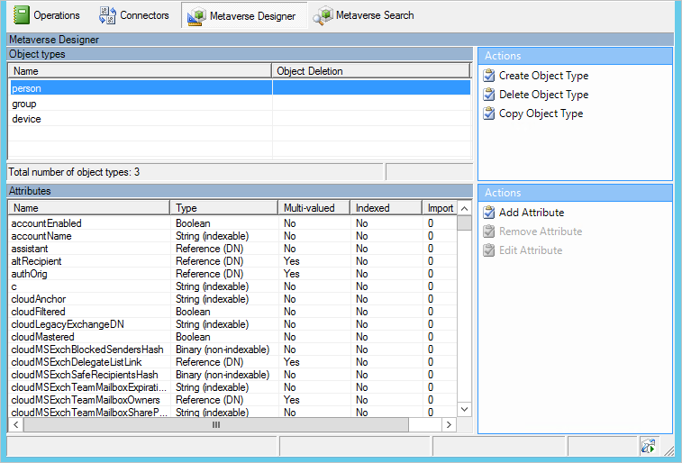

# Sync Service Manager Metaverse Designer

For most customers, there is nothing to configure here.

## Next steps
Learn more about the [Microsoft Entra Connect Sync](how-to-connect-sync-whatis.md) configuration.

Learn more about [Integrating your on-premises identities with Microsoft Entra ID](../whatis-hybrid-identity.md).
