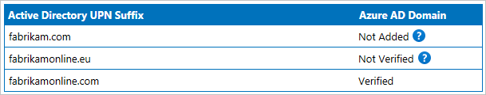

# Microsoft Entra Connect Sync service shadow attributes
Most attributes are represented the same way in Microsoft Entra ID as they are in your on-premises Active Directory. But some attributes have some special handling and the attribute value in Microsoft Entra ID might be different than what Microsoft Entra Connect synchronizes.

## Introducing shadow attributes
Some attributes have two representations in Microsoft Entra ID. Both the on-premises value and a calculated value are stored. These extra attributes are called shadow attributes. The two most common attributes where you see this behavior are **userPrincipalName** and **proxyAddress**. The change in attribute values happens when there are values in these attributes representing non-verified domains. But the sync engine in Connect reads the value in the shadow attribute so from its perspective, the attribute has been confirmed by Microsoft Entra ID.

You cannot see the shadow attributes using the [Microsoft Entra admin center](https://entra.microsoft.com) or with PowerShell. But understanding the concept helps you to troubleshoot certain scenarios where the attribute has different values on-premises and in the cloud.

To better understand the behavior, look at this example from Fabrikam:  
  
They have multiple UPN suffixes in their on-premises Active Directory, but they have only verified one.

### userPrincipalName
A user has the following attribute values in a non-verified domain:

| Attribute | Value |
| --- | --- |
| on-premises userPrincipalName | lee.sperry@fabrikam.com |
| Microsoft Entra shadowUserPrincipalName | lee.sperry@fabrikam.com |
| Microsoft Entra userPrincipalName | lee.sperry@fabrikam.onmicrosoft.com |

The userPrincipalName attribute is the value you see when using PowerShell.

Since the real on-premises attribute value is stored in Microsoft Entra ID, when you verify the fabrikam.com domain, Microsoft Entra ID updates the userPrincipalName attribute with the value from the shadowUserPrincipalName. You do not have to synchronize any changes from Microsoft Entra Connect for these values to be updated.

### proxyAddresses
The same process for only including verified domains also occurs for proxyAddresses, but with some extra logic. The check for verified domains only happens for mailbox users. A mail-enabled user or contact represent a user in another Exchange organization and you can add any values in proxyAddresses to these objects.

For a mailbox user, either on-premises or in Exchange Online, only values for verified domains appear. It could look like this:

| Attribute | Value |
| --- | --- |
| on-premises proxyAddresses | SMTP:abbie.spencer@fabrikamonline.com</br>smtp:abbie.spencer@fabrikam.com</br>smtp:abbie@fabrikamonline.com |
| Exchange Online proxyAddresses | SMTP:abbie.spencer@fabrikamonline.com</br>smtp:abbie@fabrikamonline.com</br>SIP:abbie.spencer@fabrikamonline.com |

In this case **smtp:abbie.spencer\@fabrikam.com** was removed since that domain has not been verified. But Exchange also added **SIP:abbie.spencer\@fabrikamonline.com**. Fabrikam has not used Lync/Skype on-premises, but Microsoft Entra ID and Exchange Online prepare for it.

This logic for proxyAddresses is referred to as **ProxyCalc**. ProxyCalc is invoked with every change on a user when:

- The user has been assigned a service plan that includes Exchange Online even if the user was not licensed for Exchange. For example, if the user is assigned the Office E3 SKU, but only was assigned SharePoint Online. This condition is true even if your mailbox is still on-premises.
- The attribute msExchRecipientTypeDetails has a value.
- You make a change to proxyAddresses or userPrincipalName.

ProxyCalc will sanitize an address if ShadowProxyAddresses contains a non-verified domain and the cloud user has one of the following properties configured. 
- User is licensed with an EXO service type plan enabled (Excluding MyAnalytics)  
- User has MSExchRemoteRecipientType set (not null)  
- User is considered a shared resource

To be considered a shared resource, the cloud user will have one of the following values set in CloudMSExchRecipientDisplayType 

 |Object Display Type|Value (Decimal)|
 |-----|-----|
 |MailboxUser|	0|
 |DistributionGroup|	1|
 |PublicFolder|	2|
 |DynamicDistributionGroup|	3|
 |Organization|	4|
 |PrivateDistributionList|	5|
 |RemoteMailUser|	6|
 |ConferenceRoomMailbox|	7|
 |EquipmentMailbox|	8|
 |ArbitrationMailbox|	10|
 |MailboxPlan|	11|
 |LinkedUser|	12|
 |RoomList|	15|
 |SyncedMailboxUser|	-2147483642|
 |SyncedUDGasUDG|	-2147483391|
 |SyncedUDGasContact|	-2147483386|
 |SyncedPublicFolder|	-2147483130|
 |SyncedDynamicDistributionGroup|	-2147482874|
 |SyncedRemoteMailUser|	-2147482106|
 |SyncedConferenceRoomMailbox|	-2147481850|
 |SyncedEquipmentMailbox|	-2147481594|
 |SyncedUSGasUDG|	-2147481343|
 |SyncedUSGasContact|	-2147481338|
 |ACLableSyncedMailboxUser|	-1073741818|
 |ACLableSyncedRemoteMailUser|	-1073740282|
 |ACLableSyncedUSGasContact|	-1073739514|
 |SyncedUSGasUSG|	-1073739511|
 |SecurityDistributionGroup|	1043741833|
 |SyncedUSGasUSG|	1073739511|
 |ACLableSyncedUSGasContact|	1073739514|
 |RBAC Role Group|	1073741824|
 |ACLableMailboxUser|	1073741824|
 |ACLableRemoteMailUser|	1073741830|


>[!NOTE]
> CloudMSExchRecipientDisplayType is not visible from the Microsoft Entra ID side and can only be viewed by using something like the Exchange Online cmdlet [Get-Recipient](/powershell/module/exchange/get-recipient).  
>
>Example:
> ```PowerShell
>   Get-Recipient admin | fl *type*
> ```
>

ProxyCalc might take some time to process a change on a user and is not synchronous with the Microsoft Entra Connect export process.

> [!NOTE]
> The ProxyCalc logic has some additional behaviors for advanced scenarios not documented in this topic. This topic is provided for you to understand the behavior and not document all internal logic.

### Quarantined attribute values
Shadow attributes are also used when there are duplicate attribute values. For more information, see [duplicate attribute resiliency](how-to-connect-syncservice-duplicate-attribute-resiliency.md).

## See also
* [Microsoft Entra Connect Sync](how-to-connect-sync-whatis.md)
* [Integrating your on-premises identities with Microsoft Entra ID](../whatis-hybrid-identity.md).
