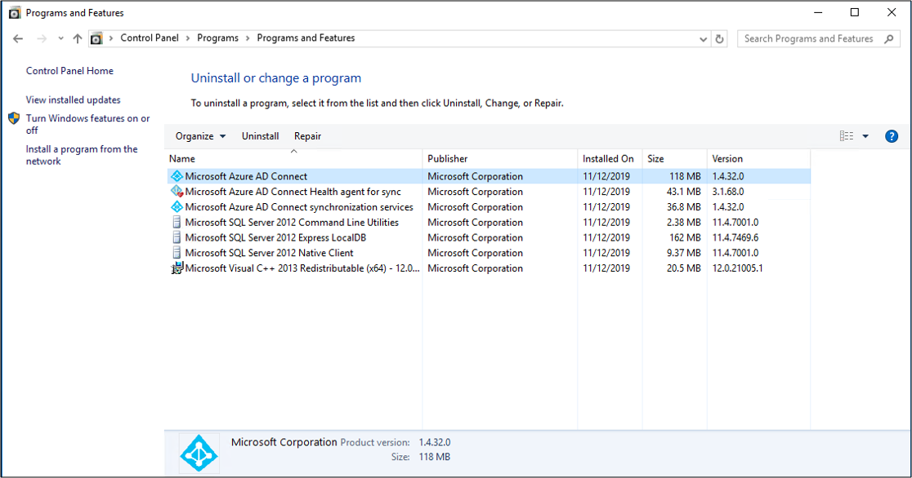
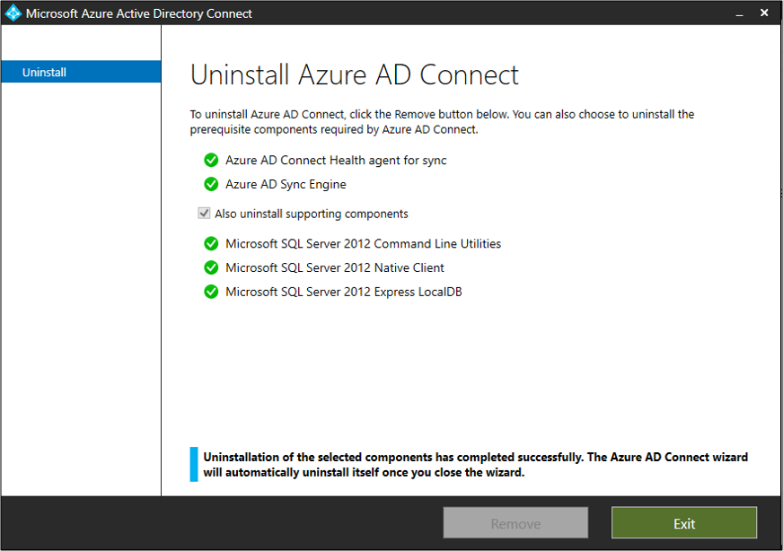

# Uninstall Microsoft Entra Connect

This document describes how to correctly uninstall Microsoft Entra Connect.

## Uninstall Microsoft Entra Connect from the server
The first thing you need to do is remove Microsoft Entra Connect from the server that it is running on.  Use the following steps:

 1. On the server running Microsoft Entra Connect, navigate to **Control Panel**.
 2. Click **Uninstall a program**
  
 
 3. Select **Microsoft Entra Connect**.
  
 
 4. When prompted, click **Yes** to confirm.
 5. This confirmation will bring up the Microsoft Entra Connect screen.  Click **Remove**.
  
 
 6. Once this action completes, click **Exit**.
 7.  
 
 8. Back in **Control Panel** click **Refresh** and all of the components should have been removed.

## Next steps

- Learn more about [Integrating your on-premises identities with Microsoft Entra ID](../whatis-hybrid-identity.md).
- [Install Microsoft Entra Connect using an existing ADSync database](how-to-connect-install-existing-database.md)
- [Install Microsoft Entra Connect using SQL delegated administrator permissions](how-to-connect-install-sql-delegation.md)
