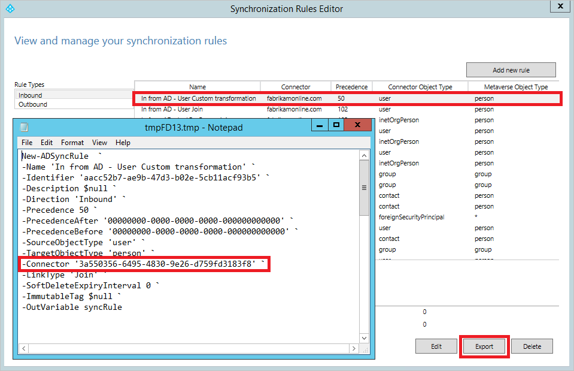

# Microsoft Entra Connect: Upgrade from a previous version to the latest

[!INCLUDE [Choose cloud sync](../../../../includes/choose-cloud-sync.md)]

This topic describes the different methods that you can use to upgrade your Microsoft Entra Connect installation to the latest release. Microsoft recommends using the steps in the [Swing migration](#swing-migration) section when you make a substantial configuration change or upgrade from older 1.x versions.

>[!NOTE]
> It's important that you keep your servers current with the latest releases of Microsoft Entra Connect. We are constantly making upgrades to AADConnect, and these upgrades include fixes to security issues and bugs, as well as serviceability, performance, and scalability improvements.
> To see what the latest version is, and to learn what changes have been made between versions, please refer to the [release version history](./reference-connect-version-history.md)

Any versions older than Microsoft Entra Connect 2.x are currently deprecated, see [Introduction to Microsoft Entra Connect V2.0](whatis-azure-ad-connect-v2.md) for more information. It's currently supported to upgrade from any version of Microsoft Entra Connect to the current version. In-place upgrades of DirSync or ADSync aren't supported, and a swing migration is required. If you want to upgrade from DirSync, see [Upgrade from Azure AD Sync tool (DirSync)](how-to-dirsync-upgrade-get-started.md) or the [Swing migration](#swing-migration) section.

In practice, customers on old versions may encounter problems not directly related to Microsoft Entra Connect. Servers that have been in production for several years typically have had several patches applied to them and not all of these can be accounted for. Customers who haven't upgraded in 12-18 months (about 1 and a half years) should consider a swing upgrade instead as this is the most conservative and least risky option.

There are a few different strategies that you can use to upgrade Microsoft Entra Connect.

| Method | Description | Pros | Cons |
| --- | --- | --- | --- |
| [Automatic upgrade](how-to-connect-install-automatic-upgrade.md) |This is the easiest method for customers with an express installation |No manual intervention |Auto-upgrade version might not include the latest features |
| [In-place upgrade](#in-place-upgrade) |If you have a single server, you can upgrade the installation in-place on the same server |- Doesn't require another server<br/><br/> - Safest approach and smoother transition to a newer version. Supports Windows OS (Operating Systems) upgrade. Sync is not interrupted and doesn't impose a risk to production |- If there's an issue while in-place upgrading, you can't roll back the new release or configuration and change the active server when you are ready <br/><br/>- Requires another server|

For permissions information, see the [permissions required for an upgrade](reference-connect-accounts-permissions.md#upgrade).

> [!NOTE]
> After you've enabled your new Microsoft Entra Connect server to start synchronizing changes to Microsoft Entra ID, you must not roll back to using DirSync or Azure AD Sync. Downgrading from Microsoft Entra Connect to legacy clients, including DirSync and Azure AD Sync, is not supported and can lead to issues such as data loss in Microsoft Entra ID.

## In-place upgrade
An in-place upgrade works for moving from Azure AD Sync or Microsoft Entra Connect. It doesn't work for moving from DirSync or for a solution with Forefront Identity Manager (FIM) + Microsoft Entra Connector.

This method is preferred when you have a single server and less than about 100,000 objects. If there are any changes to the out-of-box sync rules, a full import and full synchronization will occur after the upgrade. This method ensures that the new configuration is applied to all existing objects in the system. This run might take a few hours, depending on the number of objects that are in scope of the sync engine. The normal delta synchronization scheduler (which synchronizes every 30 minutes by default) is suspended, but password synchronization continues. You might consider doing the in-place upgrade during the weekend. If there are no changes to the out-of-box configuration with the new Microsoft Entra Connect release, then a normal delta import/sync starts instead.


If you've made changes to the out-of-box synchronization rules, then these rules are set back to the default configuration on upgrade. To make sure that your configuration is kept between upgrades, make sure that you make changes as they're described in [Best practices for changing the default configuration](how-to-connect-sync-best-practices-changing-default-configuration.md). If you already changed the default sync rules, please see how to [Fix modified default rules in Microsoft Entra Connect](./how-to-connect-sync-best-practices-changing-default-configuration.md), before starting the upgrade process.

During in-place upgrade, there may be changes introduced that require specific synchronization activities (including Full Import step and Full Synchronization step) to be executed after upgrade completes. To defer such activities, refer to section [How to defer full synchronization after upgrade](#how-to-defer-full-synchronization-after-upgrade).

If you are using Microsoft Entra Connect with non-standard connector (for example, Generic LDAP (Lightweight Directory Access Protocol) Connector and Generic SQL Connector), you must refresh the corresponding connector configuration in the [Synchronization Service Manager](./how-to-connect-sync-service-manager-ui-connectors.md) after in-place upgrade. For details on how to refresh the connector configuration, refer to the article section [Connector Version Release History - Troubleshooting](/microsoft-identity-manager/reference/microsoft-identity-manager-2016-connector-version-history#troubleshooting). If you do not refresh the configuration, import and export run steps will not work correctly for the connector. You will receive the following error in the application event log:

```
Assembly version in AAD Connector configuration ("X.X.XXX.X") is earlier than the actual version ("X.X.XXX.X") of "C:\Program Files\Microsoft Azure AD Sync\Extensions\Microsoft.IAM.Connector.GenericLdap.dll".
```

## Swing migration
For some customers, an in-place upgrade can impose a considerable risk to production in case there's an issue while upgrading and the server can't be rolled back. A single production server might also be impractical as the initial sync cycle might take multiple days, and during this time, no delta changes are processed. 

The recommended method for these scenarios is to use a swing migration. You can also use this method when you need to upgrade the Windows Server operating system, or you plan to make substantial changes to your environment configuration, which need to be tested before they're pushed to  production.

You need (at least) two servers - one active server and one staging server. The active server (shown with solid blue lines in the following diagram) is responsible for the active production load. The staging server (shown with dashed purple lines) is prepared with the new release or configuration. When it's fully ready, this server is made active. The previous active server, which now has the outdated version or configuration installed, is made into the staging server and is upgraded.

The two servers can use different versions. For example, the active server that you plan to decommission can use Azure AD Sync, and the new staging server can use Microsoft Entra Connect. If you use swing migration to develop a new configuration, it's a good idea to have the same versions on the two servers.


> [!NOTE]
> Some customers prefer to have three or four servers for this scenario. When the staging server is upgraded, you don't have a backup server for [disaster recovery](how-to-connect-sync-staging-server.md#disaster-recovery). With three or four servers, you can prepare one set of primary/standby servers with the updated version, which ensures that there's always a staging server that's ready to take over.

These steps also work to move from Azure AD Sync or a solution with FIM + Microsoft Entra Connector. These steps don't work for DirSync, but the same swing migration method (also called parallel deployment) with steps for DirSync is in [Upgrade Azure Active Directory Sync (DirSync)](how-to-dirsync-upgrade-get-started.md).

### Use a swing migration to upgrade
1. If you only have one Microsoft Entra Connect server, if you are upgrading from AD Sync, or upgrading from an old version, it's a good idea to install the new version on a new Windows Server. If you already have two Microsoft Entra Connect servers, upgrade the staging server first. and promote the staging to active. It's recommended to always keep a pair of active/staging server running the same version, but it's not required.
2. If you have made a custom configuration and your staging server doesn't have it, follow the steps under [Move a custom configuration from the active server to the staging server](#move-a-custom-configuration-from-the-active-server-to-the-staging-server).
3. Let the sync engine run full import and full synchronization on your staging server.
4. Verify that the new configuration did not cause any unexpected changes by using the steps under "Verify" in [Verify the configuration of a server](how-to-connect-sync-staging-server.md#verify-the-configuration-of-a-server). If something is not as expected, correct it, run a sync cycle, and verify the data until it looks good.
5. Before upgrading the other server, switch it to staging mode and promote the staging server to be the active server. This is the last step "Switch active server" in the process to [Verify the configuration of a server](how-to-connect-sync-staging-server.md#verify-the-configuration-of-a-server).
6. Upgrade the server that is now in staging mode to the latest release. Follow the same steps as before to get the data and configuration upgraded. If you upgrade from Azure AD Sync, you can now turn off and decommission your old server.

> [!NOTE]
> It's important to fully decommission old Microsoft Entra Connect servers as these may cause synchronization issues, difficult to troubleshoot, when an old sync server is left on the network or is powered up again later by mistake. Such “rogue” servers tend to overwrite Microsoft Entra data with its old information because, they may no longer be able to access on-premises Active Directory (for example, when the computer account is expired, the connector account password has changed, etcetera), but can still connect to Microsoft Entra ID and cause attribute values to continually revert in every sync cycle (for example, every 30 minutes). To fully decommission a Microsoft Entra Connect server, make sure you completely uninstall the product and its components or permanently delete the server if it's a virtual machine.

### Move a custom configuration from the active server to the staging server
If you have made configuration changes to the active server, you need to make sure that the same changes are applied to the new staging server. To help with this move, you can use the feature for [exporting and importing synchronization settings](./how-to-connect-import-export-config.md). With this feature you can deploy a new staging server in a few steps, with the exact same settings as another Microsoft Entra Connect server in your network.


### Moving individual custom sync rules
For individual custom sync rules that you have created, you can move them by using PowerShell. If you must apply other changes the same way on both systems, and you can't migrate the changes, then you might have to manually do the following configurations on both servers:

* Connection to the same forests
* Any domain and OU filtering
* The same optional features, such as password sync and password writeback

**Copy custom synchronization rules**  
To copy custom synchronization rules to another server, do the following:

1. Open **Synchronization Rules Editor** on your active server.
2. Select a custom rule. Click **Export**. This brings up a Notepad window. Save the temporary file with a PS1 extension. This makes it a PowerShell script. Copy the PS1 file to the staging server.

   

3. The Connector GUID (globally unique identifier) is different on the staging server, and you must change it. To get the GUID, start **Synchronization Rules Editor**, select one of the out-of-box rules that represent the same connected system, and click **Export**. Replace the GUID in your PS1 file with the GUID from the staging server.
4. In a PowerShell prompt, run the PS1 file. This creates the custom synchronization rule on the staging server.
5. Repeat this for all your custom rules.

## How to defer full synchronization after upgrade
During in-place upgrade, there may be changes introduced that require specific synchronization activities (including Full Import step and Full Synchronization step) to be executed. For example, connector schema changes require **full import** step and out-of-box synchronization rule changes require **full synchronization** step to be executed on affected connectors. During upgrade, Microsoft Entra Connect determines what synchronization activities are required and records them as *overrides*. In the following synchronization cycle, the synchronization scheduler picks up these overrides and executes them. Once an override is successfully executed, it's removed.

There may be situations where you do not want these overrides to take place immediately after upgrade. For example, you have numerous synchronized objects, and you would like these synchronization steps to occur after business hours. To remove these overrides:

1. During upgrade, **uncheck** the option **Start the synchronization process when configuration completes**. This disables the synchronization scheduler and prevents synchronization cycle from taking place automatically before the overrides are removed.

   

2. After upgrade completes, run the following cmdlet to find out what overrides have been added: `Get-ADSyncSchedulerConnectorOverride | fl`

   >[!NOTE]
   > The overrides are connector specific. In the following example, Full Import step and Full Synchronization step have been added to both the on-premises AD Connector and Microsoft Entra Connector.

   

3. Note down the existing overrides that have been added.
   
4. To remove the overrides for both full import and full synchronization on an arbitrary connector, run the following cmdlet: `Set-ADSyncSchedulerConnectorOverride -ConnectorIdentifier <Guid-of-ConnectorIdentifier> -FullImportRequired $false -FullSyncRequired $false`

   To remove the overrides on all connectors, execute the following PowerShell script:

   ```
   foreach ($connectorOverride in Get-ADSyncSchedulerConnectorOverride)
   {
       Set-ADSyncSchedulerConnectorOverride -ConnectorIdentifier $connectorOverride.ConnectorIdentifier.Guid -FullSyncRequired $false -FullImportRequired $false
   }
   ```

5. To resume the scheduler, run the following cmdlet: `Set-ADSyncScheduler -SyncCycleEnabled $true`

   >[!IMPORTANT]
   > Remember to execute the required synchronization steps at your earliest convenience. You can either manually execute these steps using the Synchronization Service Manager or add the overrides back using the Set-ADSyncSchedulerConnectorOverride cmdlet.

To add the overrides for both full import and full synchronization on an arbitrary connector, run the following cmdlet:  `Set-ADSyncSchedulerConnectorOverride -ConnectorIdentifier <Guid> -FullImportRequired $true -FullSyncRequired $true`

## Upgrading the server Operating System

If you need to upgrade the operating system of your Microsoft Entra Connect server, do not use an in-place upgrade of the OS (Operating System). Instead, prepare a new server with the desired operating system and perform a [swing migration](#swing-migration).

## Troubleshooting
The following section contains troubleshooting and information that you can use if you encounter an issue upgrading Microsoft Entra Connect.

<a name='azure-active-directory-connector-missing-error-during-azure-ad-connect-upgrade'></a>

### Microsoft Entra connector missing error during Microsoft Entra Connect upgrade

When you upgrade Microsoft Entra Connect from a previous version, you might hit the following error at the beginning of the upgrade:


This error happens because the Microsoft Entra connector with identifier, b891884f-051e-4a83-95af-2544101c9083, doesn't exist in the current Microsoft Entra Connect configuration. To verify this is the case, open a PowerShell window, run Cmdlet `Get-ADSyncConnector -Identifier b891884f-051e-4a83-95af-2544101c9083`

```
PS C:\> Get-ADSyncConnector -Identifier b891884f-051e-4a83-95af-2544101c9083
Get-ADSyncConnector : Operation failed because the specified MA could not be found.
At line:1 char:1
+ Get-ADSyncConnector -Identifier b891884f-051e-4a83-95af-2544101c9083
+ ~~~~~~~~~~~~~~~~~~~~~~~~~~~~~~~~~~~~~~~~~~~~~~~~~~~~~~~~~~~~~~~~~~~~
    + CategoryInfo          : ReadError: (Microsoft.Ident...ConnectorCmdlet:GetADSyncConnectorCmdlet) [Get-ADSyncConne
   ctor], ConnectorNotFoundException
    + FullyQualifiedErrorId : Operation failed because the specified MA could not be found.,Microsoft.IdentityManageme
   nt.PowerShell.Cmdlet.GetADSyncConnectorCmdlet

```

The PowerShell Cmdlet reports the error **the specified MA could not be found**.

This error occurs because the current Microsoft Entra Connect configuration is not supported for upgrade.

If you want to install a newer version of Microsoft Entra Connect: close the Microsoft Entra Connect wizard, uninstall the existing Microsoft Entra Connect, and perform a clean install of the newer Microsoft Entra Connect.

## Next steps
Learn more about [integrating your on-premises identities with Microsoft Entra ID](../whatis-hybrid-identity.md).
