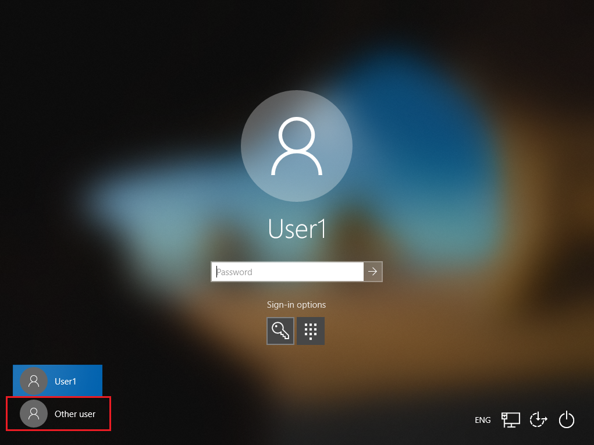

# Plan and troubleshoot User Principal Name changes in Azure Active Directory

The User Principal Name (UPN) attribute is an internet communication standard for user accounts. A UPN consists of a prefix (user account name) and a suffix (DNS domain name). The prefix joins the suffix using the "\@" symbol. For example, someone@example.com. Ensure the UPN is unique among security principal objects in a directory forest. 

> [!NOTE]
>This article assumes the UPN is the user identifier. It addresses UPN-change planning, and recovering from issues that might result from changes.
>For developers, we recommend you use the user objectID as the immutable identifier, rather than UPN or email addresses.

## UPN and their changes

Sign-in pages often prompt users to enter an email address, when the value is their UPN. Therefore, change user UPN when their primary email address changes. User primary email address might change:

* Rebranding
* Employee moves to another division 
* Mergers and acquisitions
* Employee name change

### UPN change types

Change the prefix, suffix, or both.

* **Change the prefix**:
  * BSimon@contoso.com becomes BJohnson@contoso.com
  * Bsimon@contoso.com becomes Britta.Simon@contoso.com
* **Changing the suffix**:
  * Britta.Simon@contoso.com becomes Britta.Simon@contosolabs.com, or
  * Britta.Simon@corp.contoso.com becomes Britta.Simon@labs.contoso.com 

We recommend you change user UPN when their primary email address changes. During initial synchronization from Active Directory to Azure AD, ensure user emails are identical to their UPNs.

### UPNs in Active Directory

In Active Directory, the default UPN suffix is the domain DNS name where you created the user account. In most cases, you register this domain name as the enterprise domain. If you create the user account in the contoso.com domain, the default UPN is: username@contoso.com. However, you can add more UPN suffixes by using Active Directory domains and trusts. Learn more: [Add your custom domain name using the Azure portal](../../fundamentals/add-custom-domain.md).

For example, if you add labs.contoso.com and change the user UPNs and email to reflect that, the result is: username@labs.contoso.com.

   >[!IMPORTANT]
   > If you change the suffix in Active Directory, add and verify a matching custom domain name in Azure AD. 
   > [Add your custom domain name using the Azure Active Directory portal](../../fundamentals/add-custom-domain.md)

   

### UPNs in Azure Active Directory

Users sign in to Azure AD with their userPrincipalName attribute value. 

When you use Azure AD with on-premises Active Directory, user accounts are synchronized by using the Azure AD Connect service. The Azure AD Connect wizard uses the userPrincipalName attribute from the on-premises Active Directory as the UPN in Azure AD. You can change it to a different attribute in a custom installation.

   >[!NOTE]
   > Define a process for when you update a User Principal Name (UPN) of a user, or for your organization. 

When you synchronize user accounts from Active Directory to Azure AD, ensure the UPNs in Active Directory map to verified domains in Azure AD.

   

If the userPrincipalName attribute value doesn't correspond to a verified domain in Azure AD, synchronization replaces the suffix with .onmicrosoft.com.

### Bulk UPN change rollout

Use our best practices to test bulk UPN changes. Have a tested roll-back plan for reverting UPNs if issues can't be resolved. After your pilot is running, target small user sets, with organizational roles, and sets of apps or devices. This process helps you understand the user experience. Include this information in your communications to stakeholders and users.

Learn more: [Azure Active Directory deployment plans](../../fundamentals/deployment-plans.md)

Create a procedure to change UPNs for individual users. We recommend a procedure that includes documentation about known issues and workarounds.

Read the following sections for known issues and workarounds during UPN change.

## Apps known issues and workarounds

Software as a service (SaaS) and line of business (LoB) applications often rely on UPNs to find users and store user profile information, including roles. Applications potentially affected by UPN changes use just-in-time (JIT) provisioning to create a user profile when users initially sign in to the app.

Learn more:

* [What is SaaS?](https://azure.microsoft.com/overview/what-is-saas/)
* [What is app provisioning in Azure Active Directory?](../../app-provisioning/user-provisioning.md)

### Known issues

Changing user UPN can break the relationship between the Azure AD user and the user profile on the application. If the application uses JIT provisioning, it might create a new user profile. Then, the application administrator makes manual changes to fix the relationship.

### Workarounds

Use automated app provisioning in Azure AD to create, maintain, and remove user identities in supported cloud applications. Configure automated user provisioning on your applications to update UPNs on the applications. Test the applications to validate they aren't affected by UPN changes. If you're a developer, consider adding SCIM support to your application to enable automatic user provisioning. 

Learn more:

* [What is app provisioning in Azure Active Directory?](../../app-provisioning/user-provisioning.md)
* [Tutorial: Develop and plan provisioning for a SCIM endpoint in Azure Active Directory](../../app-provisioning/use-scim-to-provision-users-and-groups.md)

## Managed devices known issues and workarounds

If you bring your devices to Azure AD, you maximize user productivity with single sign-on (SSO) across cloud and on-premises resources. 

Learn more: [What is a device identity?](../../devices/overview.md)

### Azure AD joined devices

Azure AD joined devices are joined to Azure AD. Users sign in to the device using their organization identity.

Learn more: [Azure AD joined devices](../../devices/concept-directory-join.md)

### Known issues and resolution

Users might experience single sign-on issues with applications that depend on Azure AD for authentication. This issue was fixed in the Windows 10 May-2020 update (2004).

### Workaround

Allow enough time for the UPN change to sync to Azure AD. After you verify the new UPN appears in the Azure portal, ask the user to select the "Other user" tile to sign in with their new UPN. You can verify using Microsoft Graph PowerShell. See, [Get-MgUser](/powershell/module/microsoft.graph.users/get-mguser). After users sign in with a new UPN, references to the old UPN might appear on the **Access work or school** Windows setting.

   

### Hybrid Azure AD joined devices

Hybrid Azure AD joined devices are joined to Active Directory and Azure AD. You can implement Hybrid Azure AD join if your environment has an on-premises Active Directory footprint.
 
Learn more: [Hybrid Azure AD joined devices](../../devices/concept-hybrid-join.md)

### Known issues and resolution

Windows 10 Hybrid Azure AD joined devices are likely to experience unexpected restarts and access issues. If users sign in to Windows before the new UPN synchronizes to Azure AD, or they continue using a Windows session, they might experience single sign-on (SSO) issues with apps that use Azure AD for authentication. This situation occurs if Conditional Access is configured to enforce the use of hybrid joined devices to access resources. 

In addition, the following message can appear, which forces a restart after one minute:

Your PC will automatically restart in one minute. Windows ran into a problem and needs to restart. You should close this message now and save your work.

This issue was fixed in the Windows 10 May-2020 update (2004).

### Workaround

1. Unjoin the device from Azure AD and restart. 
2. The device joins Azure AD.
3. The user signs in by selecting the **Other user** tile. 

To unjoin a device from Azure AD, run the following command at a command prompt: dsregcmd/leave

>[!NOTE]
>The user re-enrolls for Windows Hello for Business, if it's in use. 

>[!TIP]
>Windows 7 and 8.1 devices are not affected by this issue.

## Mobile Application Management app protection policies

### Known issues

Your organization might use Mobile Application Management (MAM) to protect corporate data in apps on user devices. MAM app protection policies aren't resilient during UPN changes, which can break the connection between MAM enrollments and active users in MAM integrated applications. This scenario could leave data in an unprotected state.

Learn more: 

* [App protection policies overview](/mem/intune/apps/app-protection-policy)
* [Frequently asked questions about MAM and app protection](/mem/intune/apps/mam-faq)

### Workaround

IT admins can wipe data from affected devices, after UPN changes. This forces users to reauthenticate and reenroll with new UPNs.

Learn more: [How to wipe only corporate data from Intune-managed apps](/mem/intune/apps/apps-selective-wipe)

## Microsoft Authenticator known issues and workarounds

Your organization might require the Microsoft Authenticator app to sign in and access applications and data. Although a username might appear in the app, the account isn't a verification method until the user completes registration. 

Learn more: [How to use the Microsoft Authenticator app](https://support.microsoft.com/account-billing/how-to-use-the-microsoft-authenticator-app-9783c865-0308-42fb-a519-8cf666fe0acc)

Microsoft Authenticator app has four main functions:

* **Multi-factor authentication** with push notification or verification code
* **Authentication broker** on iOS and Android devices fir SSO for applications using brokered authentication
  * [Enable cross-app SSO on Android using MSAL](../../develop/msal-android-single-sign-on.md)
* **Device registration** or workplace join, to Azure AD, which is a requirement for Intune App Protection and Device Enrolment/Management
* **Phone sign in**, which requires MFA and device registration

### Multi-factor authentication with Android devices

Use the Microsoft Authenticator app for out-of-band verification. Instead of an automated phone call, or SMS, to the user during sign-in, MFA pushes a notification to the Microsoft Authenticator app on the user device. The user selects **Approve**, or the user enters a PIN or biometric and selects **Authenticate**.

Learn more: [How it works: Azure AD Multi-Factor Authentication](../../authentication/concept-mfa-howitworks.md)

**Known issues** 

When you change user UPN, the old UPN appears on the user account and notification might not be received. Use verification codes.

Learn more: [Common questions about the Microsoft Authenticator app](https://prod.support.services.microsoft.com/account-billing/common-questions-about-the-microsoft-authenticator-app-12d283d1-bcef-4875-9ae5-ac360e2945dd)

**Workaround**

If notification appears, instruct the user to dismiss it, open the Authenticator app, select **Check for notifications** and approve the MFA prompt. The UPN on the account updates. Note the updated UPN might appear as a new account. This change is due to other Authenticator functionality. For more information, see the known issues in this article.

### Brokered authentication

On Android and iOS. brokers like Microsoft Authenticator enable:

* **SSO** - Users don't sign in to each application
* **Device identification** - The broker accesses the device certificate created on the device when it was workplace-joined
* **Application identification verification** - When an application calls the broker, it passes its redirect URL, and the broker verifies it

In addition, applications can participate in other features:

* [Azure AD Conditional Access documentation](../../conditional-access/index.yml)
* [Use Microsoft Authenticator or Intune Company Portal on Xamarin applications](../../develop/msal-net-use-brokers-with-xamarin-apps.md).

### Known issues

Due to a mismatch, between the login_hint passed by the application and the UPN stored on the broker, the user experiences more interactive authentication prompts on new applications that use broker-assisted sign-in.

### Workaround

The user manually removes the account from Microsoft Authenticator and starts a new sign-in from a broker-assisted application. The account is added after initial authentication.

### Device registration

The Microsoft Authenticator app registers the device in Azure AD, which allows the device to authenticate to Azure AD. This registration is a requirement for:

* Intune app protection
* Intune device enrollment
* Phone sign-in

### Known issues

If you change UPN, a new account with the new UPN appears on the Microsoft Authenticator app. The account with the old UPN remains listed. Also, the old UPN appears on the Device Registration section in app settings. There's no change in functionality of Device Registration or dependant scenarios.

### Workaround

To remove references to the old UPN on the Microsoft Authenticator app, the user removes the old and new accounts from Microsoft Authenticator, re-registers for MFA, and rejoins the device.

### Phone sign-in

User phone sign-in for users to sign in to Azure AD without a password. To enable this feature, the user registers for MFA using the Authenticator app and then enables phone sign-in on Authenticator. The device registers with Azure AD.

### Known issues

Users can't use phone sign-in because they don't receive notification. If the user selects **Check for Notifications**, an error appears.

### Workaround

The user selects the drop-down menu on the account enabled for phone sign-in. Next, the user selects **Disable phone sign-in**. Phone sign-in can be re-enabled.

## Security key (FIDO2) known issues and workarounds

### Known issues

When multiple users are registered on the same key, the sign-in screen shows account selection where the old UPN appears. Sign-in with security keys isn't affected by UPN changes.  

### Workaround

To remove references to old UPNs, users reset the security key and re-register.

Learn more: [Enable passwordless security key sign-in, Known issue, UPN changes](../../authentication/howto-authentication-passwordless-security-key.md#known-issues)

## OneDrive known issues and workarounds

OneDrive users are known to experience issues after UPN changes. 

Learn more: [How UPN changes affect the OneDrive URL and OneDrive features](/sharepoint/upn-changes)

## Teams Meeting Notes known issues and workarounds 

Use Teams Meeting Notes to take and share notes.  

### Known issues

When a user UPN changes, meeting notes created under the old UPN are not accessible with Microsoft Teams or the Meeting Notes URL.   

### Workaround

After the UPN change, users can recover meeting notes by downloading them from OneDrive 

1. Go to **My Files**.
2. Select **Microsoft Teams Data**.
3. Select **Wiki**. 

New meeting notes created after the UPN change aren't affected.  

## Next steps

* [Azure AD Connect: Design concepts](./plan-connect-design-concepts.md)
* [Azure AD UserPrincipalName population](./plan-connect-userprincipalname.md)
* [Microsoft identity platform ID tokens](../../develop/id-tokens.md)
