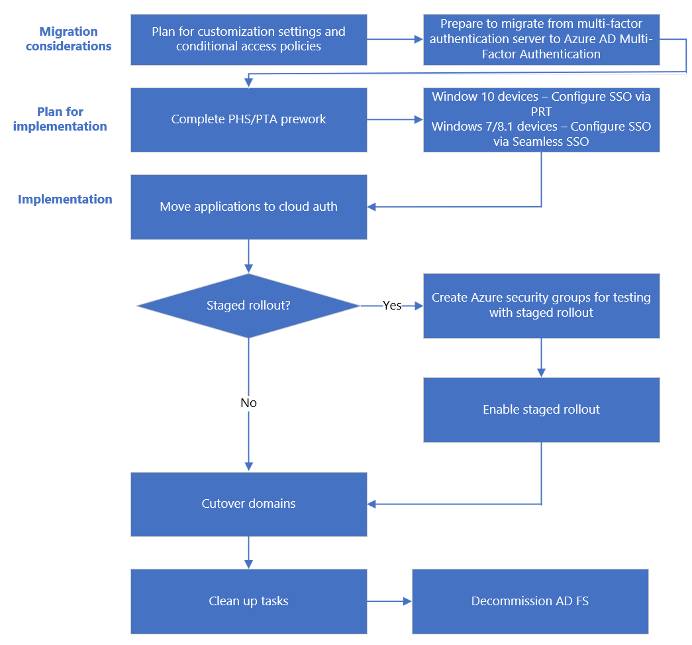
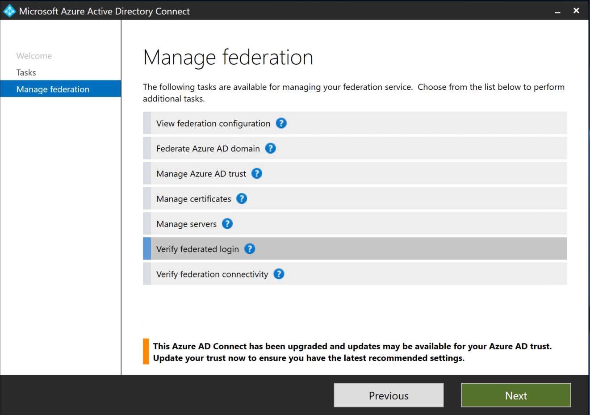
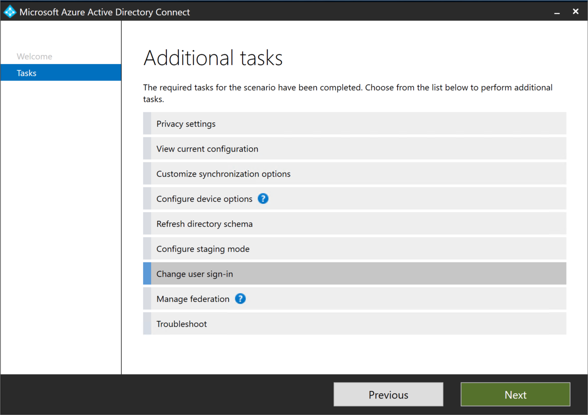
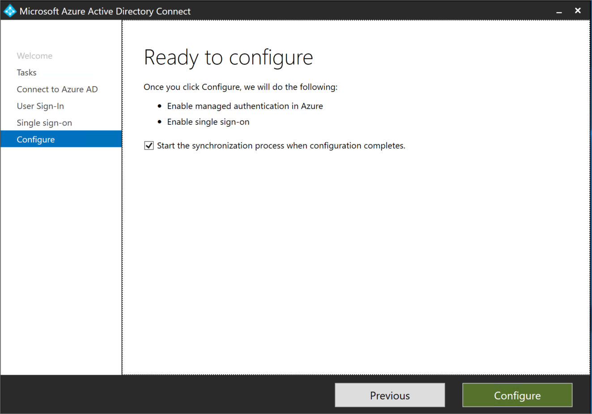
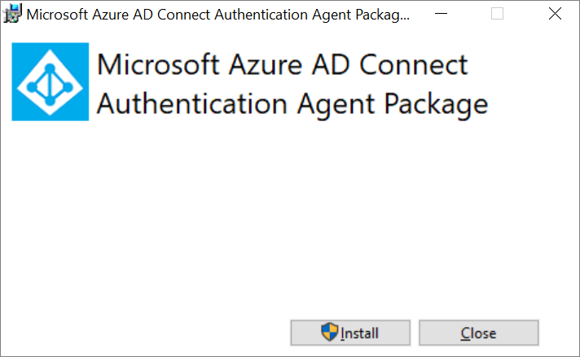
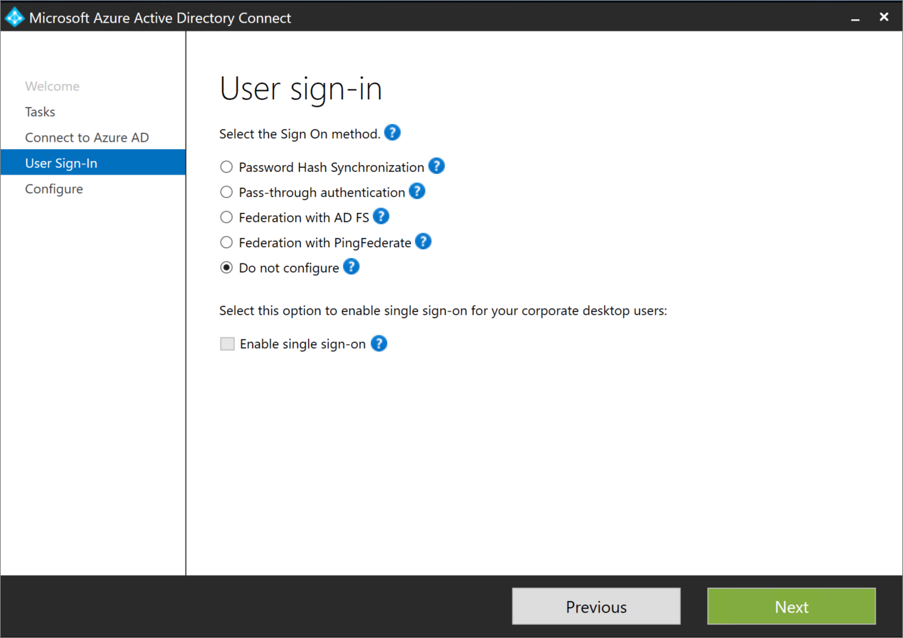

# Migrate from federation to cloud authentication  

In this article, you learn how to deploy cloud user authentication with either Microsoft Entra ID [Password hash synchronization (PHS)](whatis-phs.md) or [Pass-through authentication (PTA)](how-to-connect-pta.md). While we present the use case for moving from [Active Directory Federation Services (AD FS)](whatis-fed.md) to cloud authentication methods, the guidance substantially applies to other on premises systems as well.

Before you continue, we suggest that you review our guide on [choosing the right authentication method](choose-ad-authn.md) and compare methods most suitable for your organization.

We recommend using PHS for cloud authentication.

## Staged rollout

> [!VIDEO https://www.microsoft.com/videoplayer/embed/RE3inQJ]

Staged rollout is a great way to selectively test groups of users with cloud authentication capabilities like Microsoft Entra multifactor authentication, Conditional Access, Identity Protection for leaked credentials, Identity Governance, and others, before cutting over your domains. 

Refer to the staged rollout implementation plan to understand the [supported](how-to-connect-staged-rollout.md#supported-scenarios) and [unsupported scenarios](how-to-connect-staged-rollout.md#unsupported-scenarios). We recommend using staged rollout to test before cutting over domains.

To learn how to configure staged rollout, see the [staged rollout interactive guide](https://mslearn.cloudguides.com/guides/Test%20migration%20to%20cloud%20authentication%20using%20staged%20rollout%20in%20Azure%20AD) migration to cloud authentication using staged rollout in Microsoft Entra ID).

## Migration process flow



## Prerequisites

Before you begin your migration, ensure that you meet these prerequisites.

### Required roles

For staged rollout, you need to be a Hybrid Identity Administrator on your tenant. 

<a name='step-up-azure-ad-connect-server'></a>

### Step up Microsoft Entra Connect server

Install [Microsoft Entra Connect](https://www.microsoft.com/download/details.aspx?id=47594) (Microsoft Entra Connect) or [upgrade to the latest version](how-to-upgrade-previous-version.md). When you step up Microsoft Entra Connect server, it reduces the time to migrate from AD FS to the cloud authentication methods from potentially hours to minutes. 

### Document current federation settings

To find your current federation settings, run [Get-MgDomainFederationConfiguration](/powershell/module/microsoft.graph.identity.directorymanagement/get-mgdomainfederationconfiguration?view=graph-powershell-beta&preserve-view=true).

```powershell
Get-MgDomainFederationConfiguration –DomainID yourdomain.com
```

Verify any settings that might have been customized for your federation design and deployment documentation. Specifically, look for customizations in **PreferredAuthenticationProtocol**, **federatedIdpMfaBehavior**, **SupportsMfa** (if **federatedIdpMfaBehavior** isn't set), and **PromptLoginBehavior**.

### Back up federation settings

Although this deployment changes no other relying parties in your AD FS farm, you can back up your settings:

 - Use Microsoft [AD FS Rapid Restore Tool](/windows-server/identity/ad-fs/operations/ad-fs-rapid-restore-tool) to restore an existing farm or create a new farm.

- Export the Microsoft 365 Identity Platform relying party trust and any associated custom claim rules you added using the following PowerShell example:

    ```powershell

    (Get-AdfsRelyingPartyTrust -Name "Microsoft Office 365 Identity Platform") | Export-CliXML "C:\temp\O365-RelyingPartyTrust.xml"

    ```

## Plan the project

When technology projects fail, it's typically because of mismatched expectations on impact, outcomes, and responsibilities. To avoid these pitfalls, [ensure that you're engaging the right stakeholders](../../architecture/deployment-plans.md) and that stakeholder roles in the project are well understood.

### Plan communications

After migrating to cloud authentication, the user sign-in experience for accessing Microsoft 365 and other resources that are authenticated through Microsoft Entra ID changes. Users who are outside the network see only the Microsoft Entra sign-in page. 

Proactively communicate with your users how their experience changes, when it changes, and how to gain support if they experience issues.

### Plan the maintenance window

Modern authentication clients (Office 2016 and Office 2013, iOS, and Android apps) use a valid refresh token to obtain new access tokens for continued access to resources instead of returning to AD FS. These clients are immune to any password prompts resulting from the domain conversion process. The clients continue to function without extra configuration.

>[!NOTE] 
>When you migrate from federated to cloud authentication, the process to convert the domain from federated to managed may take up to 60 minutes. During this process, users might not be prompted for credentials for any new logins to [Microsoft Entra admin center](https://entra.microsoft.com) or other browser based applications protected with Microsoft Entra ID. We recommend that you include this delay in your maintenance window.

### Plan for rollback

> [!TIP]
> Consider planning cutover of domains during off-business hours in case of rollback requirements. 

To plan for rollback, use the [documented current federation settings](#document-current-federation-settings) and check the [federation design and deployment documentation](/windows-server/identity/ad-fs/deployment/windows-server-2012-r2-ad-fs-deployment-guide). 

The rollback process should include converting managed domains to federated domains by using the [New-MgDomainFederationConfiguration](/powershell/module/microsoft.graph.identity.directorymanagement/new-mgdomainfederationconfiguration?view=graph-powershell-1.0&preserve-view=true) cmdlet. If necessary, configuring extra claims rules.

## Migration considerations 

Here are key migration considerations.

### Plan for customizations settings 

The onload.js file can't be duplicated in Microsoft Entra ID. If your AD FS instance is heavily customized and relies on specific customization settings in the onload.js file, verify if Microsoft Entra ID can meet your current customization requirements and plan accordingly. Communicate these upcoming changes to your users.

#### Sign-in experience

You can't customize Microsoft Entra sign-in experience. No matter how your users signed-in earlier, you need a fully qualified domain name such as User Principal Name (UPN) or email to sign into Microsoft Entra ID. 

#### Organization branding

You can [customize the Microsoft Entra sign-in page](../../fundamentals/how-to-customize-branding.md). Some visual changes from AD FS on sign-in pages should be expected after the conversion. 

>[!NOTE] 
>Organization branding isn't available in free Microsoft Entra ID licenses unless you've a Microsoft 365 license.

### Plan for Conditional Access policies

Evaluate if you're currently using Conditional Access for authentication, or if you use access control policies in AD FS. 

Consider replacing AD FS access control policies with the equivalent Microsoft Entra [Conditional Access policies](../../conditional-access/overview.md) and [Exchange Online Client Access Rules](/exchange/clients-and-mobile-in-exchange-online/client-access-rules/client-access-rules). You can use either Microsoft Entra ID or on-premises groups for Conditional Access.

**Disable Legacy Authentication** - Due to the increased risk associated with legacy authentication protocols create [Conditional Access policy to block legacy authentication](../../conditional-access/howto-conditional-access-policy-block-legacy.md).

### Plan support for MFA

For federated domains, MFA may be enforced by Microsoft Entra Conditional Access or by the on-premises federation provider. You can enable protection to prevent bypassing of Microsoft Entra multifactor authentication by configuring the security setting **federatedIdpMfaBehavior**. Enable the protection for a federated domain in your Microsoft Entra tenant. Make sure that Microsoft Entra multifactor authentication is always performed when a federated user accesses an application that is governed by a Conditional Access policy that requires MFA. This includes performing Microsoft Entra multifactor authentication even when federated identity provider has issued federated token claims that on-premises MFA has been performed. Enforcing Microsoft Entra multifactor authentication every time assures that a bad actor can't bypass Microsoft Entra multifactor authentication by imitating that identity provider already performed MFA and is highly recommended unless you perform MFA for your federated users using a third party MFA provider.

The following table explains the behavior for each option. For more information, see **federatedIdpMfaBehavior**.

| Value | Description |
| :--- | :--- |
| acceptIfMfaDoneByFederatedIdp | Microsoft Entra ID accepts MFA that federated identity provider performs. If the federated identity provider didn't perform MFA, Microsoft Entra ID performs the MFA. |
| enforceMfaByFederatedIdp | Microsoft Entra ID accepts MFA that federated identity provider performs.  If the federated identity provider didn't perform MFA, it redirects the request to federated identity provider to perform MFA. |
| rejectMfaByFederatedIdp | Microsoft Entra ID always performs MFA and rejects MFA that federated identity provider performs. |

>[!NOTE]
> The **federatedIdpMfaBehavior** setting is an evolved version of the **SupportsMfa** property of the [Set-MsolDomainFederationSettings MSOnline v1 PowerShell cmdlet](/powershell/module/microsoft.graph.identity.directorymanagement/new-mgdomainfederationconfiguration?view=graph-powershell-1.0&preserve-view=true). 

For domains that have already set the **SupportsMfa** property, these rules determine how **federatedIdpMfaBehavior** and **SupportsMfa** work together:

- Switching between **federatedIdpMfaBehavior** and **SupportsMfa** isn't supported.
- Once **federatedIdpMfaBehavior** property is set, Microsoft Entra ID ignores the **SupportsMfa** setting.
- If the **federatedIdpMfaBehavior** property is never set, Microsoft Entra ID continues to honor the **SupportsMfa** setting.
- If neither **federatedIdpMfaBehavior** nor **SupportsMfa** is set, Microsoft Entra ID defaults to `acceptIfMfaDoneByFederatedIdp` behavior.

You can check the status of protection by running [Get-MgDomainFederationConfiguration](/powershell/module/microsoft.graph.identity.directorymanagement/get-mgdomainfederationconfiguration?view=graph-powershell-beta&preserve-view=true):

```powershell
Get-MgDomainFederationConfiguration -DomainId yourdomain.com
``` 

You can also check the status of your SupportsMfa flag with [Get-MsolDomainFederationSettings](/powershell/module/msonline/get-msoldomainfederationsettings):

```powershell
Get-MsolDomainFederationSettings –DomainName yourdomain.com
```

>[!NOTE] 
>Microsoft MFA Server is nearing the end of support life, and if you're using it you must move to Microsoft Entra multifactor authentication. 
For more information, see **[Migrate from Microsoft MFA Server to Azure multifactor authentication documentation](../../authentication/how-to-migrate-mfa-server-to-azure-mfa.md)**.
>If you plan to use Microsoft Entra multifactor authentication, we recommend that you use **[combined registration for self-service password reset (SSPR) and multifactor authentication](../../authentication/concept-registration-mfa-sspr-combined.md)** to have your users register their authentication methods once. 

## Plan for implementation

This section includes prework before you switch your sign-in method and convert the domains.

### Create necessary groups for staged rollout

*If you're not using staged rollout, skip this step.*

Create groups for staged rollout and also for Conditional Access policies if you decide to add them.

We recommend you use a group mastered in Microsoft Entra ID, also known as a cloud-only group. You can use Microsoft Entra security groups or Microsoft 365 Groups for both moving users to MFA and for Conditional Access policies. For more information, see [creating a Microsoft Entra security group](../../fundamentals/how-to-manage-groups.md), and this [overview of Microsoft 365 Groups for administrators](/microsoft-365/admin/create-groups/office-365-groups).

The members in a group are automatically enabled for staged rollout. Nested and dynamic groups aren't supported for staged rollout.

### Prework for SSO

The version of SSO that you use is dependent on your device OS and join state.

- **For Windows 10, Windows Server 2016 and later versions**, we recommend using SSO via [Primary Refresh Token (PRT)](../../devices/concept-primary-refresh-token.md) with [Microsoft Entra joined devices](../../devices/concept-directory-join.md), [Microsoft Entra hybrid joined devices](../../devices/concept-hybrid-join.md) and [Microsoft Entra registered devices](../../devices/concept-device-registration.md). 

- **For macOS and iOS devices**, we recommend using SSO via the [Microsoft Enterprise SSO plug-in for Apple devices](../../develop/apple-sso-plugin.md). This feature requires that your Apple devices are managed by an MDM. If you use Intune as your MDM then follow the [Microsoft Enterprise SSO plug-in for Apple Intune deployment guide](/mem/intune/configuration/use-enterprise-sso-plug-in-ios-ipados-macos). If you use another MDM then follow the [Jamf Pro / generic MDM deployment guide](/mem/intune/configuration/use-enterprise-sso-plug-in-ios-ipados-macos-with-jamf-pro). 

- **For Windows 7 and 8.1 devices**, we recommend using [seamless SSO](how-to-connect-sso.md) with domain-joined to register the computer in Microsoft Entra ID. You don't have to sync these accounts like you do for Windows 10 devices. However, you must complete this [prework for seamless SSO using PowerShell](how-to-connect-staged-rollout.md#prework-for-seamless-sso).

### Prework for PHS and PTA

Depending on the choice of sign-in method, complete the [prework for PHS](how-to-connect-staged-rollout.md#prework-for-password-hash-sync) or [for PTA](how-to-connect-staged-rollout.md#prework-for-pass-through-authentication).

## Implement your solution

Finally, you switch the sign-in method to PHS or PTA, as planned and convert the domains from federation to cloud authentication. 

### Using staged rollout

If you're using staged rollout, follow the steps in the links below:

1. [Enable staged rollout of a specific feature on your tenant.](how-to-connect-staged-rollout.md#enable-staged-rollout)

2. Once testing is complete, [convert domains from federated to be managed](#convert-domains-from-federated-to-managed).

### Without using staged rollout 

You've two options for enabling this change:

- **Option A:** Switch using Microsoft Entra Connect.
  
  *Available if you initially configured your AD FS/ ping-federated environment by using Microsoft Entra Connect*.

- **Option B:** Switch using Microsoft Entra Connect and PowerShell
 
  *Available if you didn't initially configure your federated domains by using Microsoft Entra Connect or if you're using third-party federation services*.

To choose one of these options, you must know what your current settings are.

<a name='verify-current-azure-ad-connect-settings'></a>

#### Verify current Microsoft Entra Connect settings

[!INCLUDE [sign in](../../../../includes/cloud-sync-sign-in.md)]

3. Verify the **USER SIGN_IN** settings as shown in this diagram:


**To verify how federation was configured:**

1. On your Microsoft Entra Connect server, open **Microsoft Entra Connect** and select **Configure**.

2. Under **Additional Tasks > Manage Federation**, select **View federation configuration**. 

    

    If the AD FS configuration appears in this section, you can safely assume that AD FS was originally configured by using Microsoft Entra Connect. See the image below as an example-

    

    If AD FS isn't listed in the current settings, you must manually convert your domains from federated identity to managed identity by using PowerShell.

#### Option A

**Switch from federation to the new sign-in method by using Microsoft Entra Connect**

1. On your Microsoft Entra Connect server, open **Microsoft Entra Connect** and select **Configure**.

2. Under **Additional tasks** page, select **Change user sign-in**, and then select **Next**.
   
    

3. On the **Connect to Microsoft Entra ID** page, enter your Global Administrator account credentials.

4. On the **User sign-in** page:

    - If you select **Pass-through authentication** option button, and if SSO is needed for Windows 7 and 8.1 devices, check **Enable single sign-on**, and then select **Next**.

    - If you select the **Password hash synchronization** option button, make sure to select the **Do not convert user accounts** check box. The option is deprecated. If SSO is needed for Windows 7 and 8.1 devices, check **Enable single sign-on**, and then select **Next**.

      

   Learn more: [Enable seamless SSO by using PowerShell](how-to-connect-staged-rollout.md#prework-for-seamless-sso). 
5. On the **Enable single sign-on** page, enter the credentials of a Domain Administrator account, and then select **Next**.

    

    Domain Administrator account credentials are required to enable seamless SSO. The process completes the following actions, which require these elevated permissions:
      - A computer account named AZUREADSSO (which represents Microsoft Entra ID) is created in your on-premises Active Directory instance.
      - The computer account's Kerberos decryption key is securely shared with Microsoft Entra ID.
      - Two Kerberos service principal names (SPNs) are created to represent two URLs that are used during Microsoft Entra sign-in.

    The domain administrator credentials aren't stored in Microsoft Entra Connect or Microsoft Entra ID and get discarded when the process successfully finishes. They are  used to turn ON this feature.

    Learn more: [Seamless SSO technical deep dive.](how-to-connect-sso-how-it-works.md) 

6. On the **Ready to configure** page, make sure that the **Start the synchronization process when configuration completes** check box is selected. Then, select **Configure**.

    

    > [!IMPORTANT] 
    > At this point, all your federated domains changes to managed authentication. Your selected User sign-in method is the new method of authentication.

7. In the [Microsoft Entra admin center](https://entra.microsoft.com), select **Microsoft Entra ID**, and then select **Microsoft Entra Connect**.

8. Verify these settings:

      - **Federation** is set to **Disabled**.
      - **Seamless single sign-on** is set to **Enabled**.
      - **Password Hash Sync** is set to **Enabled**.

   

9. In case you're switching to PTA, follow the next steps.

##### Deploy more authentication agents for PTA

>[!NOTE]
> PTA requires deploying lightweight agents on the Microsoft Entra Connect server and on your on-premises computer that's running Windows server. To reduce latency, install the agents as close as possible to your Active Directory domain controllers.

For most customers, two or three authentication agents are sufficient to provide high availability and the required capacity. A tenant can have a maximum of 12 agents registered. The first agent is always installed on the Microsoft Entra Connect server itself. To learn about agent limitations and agent deployment options, see [Microsoft Entra pass-through authentication: Current limitations](how-to-connect-pta-current-limitations.md).

1. Select **Pass-through authentication**.
2. On the **Pass-through authentication** page, select the **Download** button.
3. On the **Download agent** page, select **Accept terms and download**.f

    More authentication agents start to download. Install the secondary authentication agent on a domain-joined server.

4. Run the authentication agent installation. During installation, you must enter the credentials of a Global Administrator account.

    

5. When the authentication agent is installed, you can return to the PTA health page to check the status of the more agents.

#### Option B

**Switch from federation to the new sign-in method by using Microsoft Entra Connect and PowerShell**

*Available if you didn't initially configure your federated domains by using Microsoft Entra Connect or if you're using third-party federation services.*

On your Microsoft Entra Connect server, follow the steps 1- 5 in [Option A](#option-a). Notice that on the User sign-in page, the **Do not configure** option is preselected.



1. In the [Microsoft Entra admin center](https://entra.microsoft.com), select **Microsoft Entra ID**, and then select **Microsoft Entra Connect**. 

2. Verify these settings:

  - **Federation** is set to **Enabled**.
  - **Seamless single sign-on** is set to **Disabled**.
  - **Password Hash Sync** is set to **Enabled**.

    ](media/deploy-cloud-user-authentication/verify-current-user-settings-on-azure-ad-portal.png)

**In case of PTA only**, follow these steps to install more PTA agent servers.

1. In the [Microsoft Entra admin center](https://entra.microsoft.com), select **Microsoft Entra ID**, and then select **Microsoft Entra Connect**.

2. Select **Pass-through authentication**. Verify that the status is **Active**.

    

   If the authentication agent isn't active, complete these [troubleshooting steps](tshoot-connect-pass-through-authentication.md) before you continue with the domain conversion process in the next step. You risk causing an authentication outage if you convert your domains before you validate that your PTA agents are successfully installed and that their status is **Active** in the [Microsoft Entra admin center](https://entra.microsoft.com).

3. [Deploy more authentication agents](#deploy-more-authentication-agents-for-pta).

### Convert domains from federated to managed

**At this point, federated authentication is still active and operational for your domains**. To continue with the deployment, you must convert each domain from federated identity to managed identity.

>[!IMPORTANT]
> You don't have to convert all domains at the same time. You might choose to start with a test domain on your production tenant or start with your domain that has the lowest number of users.

**Complete the conversion by using the Microsoft Graph PowerShell SDK:**

1. In PowerShell, sign in to Microsoft Entra ID by using a Global Administrator account.
   ```powershell
    Connect-MGGraph -Scopes "Domain.ReadWrite.All", "Directory.AccessAsUser.All"
    ```

2. To convert the first domain, run the following command:
   ```powershell
    Update-MgDomain -DomainId <domain name> -AuthenticationType "Managed"
    ```


3. In the [Microsoft Entra admin center](https://entra.microsoft.com), select **Microsoft Entra ID > Microsoft Entra Connect**.

4. Verify that the domain has been converted to managed by running the command below.  The Authentication type should be set to managed.
    ```powershell
    Get-MgDomain -DomainId yourdomain.com
    ```
## Complete your migration

Complete the following tasks to verify the sign-up method and to finish the conversion process.

### Test the new sign-in method

When your tenant used federated identity, users were redirected from the Microsoft Entra sign-in page to your AD FS environment. Now that the tenant is configured to use the new sign-in method instead of federated authentication, users aren't redirected to AD FS. 

**Instead, users sign in directly on the Microsoft Entra sign-in page.**

Follow the steps in this link - [Validate sign-in with PHS/ PTA and seamless SSO](how-to-connect-staged-rollout.md#validation) (where required)

### Remove a user from staged rollout

If you used staged rollout, you should remember to turn off the staged rollout features once you've finished cutting over. 

**To disable the staged rollout feature, slide the control back to Off.**

### Sync UserPrincipalName updates

Historically, updates to the **UserPrincipalName** attribute, which uses the sync service from the on-premises environment, are blocked unless both of these conditions are true:

   - The user is in a managed (nonfederated) identity domain.
   - The user hasn't been assigned a license.

To learn how to verify or turn on this feature, see [Sync userPrincipalName updates](how-to-connect-syncservice-features.md).

## Manage your implementation

### Roll over the seamless SSO Kerberos decryption key

We recommend that you roll over the Kerberos decryption key at least every 30 days to align with the way that Active Directory domain members submit password changes. There is no associated device attached to the AZUREADSSO computer account object, so you must perform the rollover manually.

See FAQ [How do I roll over the Kerberos decryption key of the AZUREADSSO computer account?](how-to-connect-sso-faq.yml#how-can-i-roll-over-the-kerberos-decryption-key-of-the--azureadsso--computer-account-).

### Monitoring and logging

Monitor the servers that run the authentication agents to maintain the solution availability. In addition to general server performance counters, the authentication agents expose performance objects that can help you understand authentication statistics and errors.

Authentication agents log operations to the Windows event logs that are located under Application and Service logs. You can also turn on logging for troubleshooting.

To confirm the various actions performed on staged rollout, you can [Audit events for PHS, PTA, or seamless SSO](how-to-connect-staged-rollout.md#auditing).

### Troubleshoot

Your support team should understand how to troubleshoot any authentication issues that arise either during, or after the change from federation to managed. Use the following troubleshooting documentation to help your support team familiarize themselves with the common troubleshooting steps and appropriate actions that can help to isolate and resolve the issue.

-  [Microsoft Entra PHS](tshoot-connect-password-hash-synchronization.md)
- [Microsoft Entra PTA](tshoot-connect-pass-through-authentication.md)
- [Microsoft Entra seamless SSO](tshoot-connect-sso.md)

## Decommission AD FS infrastructure

<a name='migrate-app-authentication-from-ad-fs-to-azure-ad'></a>

### Migrate app authentication from AD FS to Microsoft Entra ID

Migration requires assessing how the application is configured on-premises, and then mapping that configuration to Microsoft Entra ID.

> [!VIDEO https://www.youtube.com/embed/D0M-N-RQw0I]

If you plan to keep using AD FS with on-premises & SaaS Applications using SAML / WS-FED or Oauth protocol, you'll use both AD FS and Microsoft Entra ID after you convert the domains for user authentication. In this case, you can protect your on-premises applications and resources with Secure Hybrid Access (SHA) through [Microsoft Entra application proxy](../../app-proxy/what-is-application-proxy.md) or one of [Microsoft Entra ID partner integrations](../../manage-apps/secure-hybrid-access.md). Using Application Proxy or one of our partners can provide secure remote access to your on-premises applications. Users benefit by easily connecting to their applications from any device after a [single sign-on](../../manage-apps/add-application-portal-setup-sso.md).

You can move SaaS applications that are currently federated with ADFS to Microsoft Entra ID. Reconfigure to authenticate with Microsoft Entra ID either via a built-in connector from the [Azure App gallery](https://azuremarketplace.microsoft.com/marketplace/apps/category/azure-active-directory-apps), or by [registering the application in Microsoft Entra ID](../../develop/quickstart-register-app.md).

For more information, see – 

- [Moving application authentication from Active Directory Federation Services to Microsoft Entra ID](../../manage-apps/migrate-adfs-apps-stages.md) and
- [AD FS to Microsoft Entra application migration playbook for developers](/samples/azure-samples/ms-identity-adfs-to-aad/ms-identity-dotnet-adfs-to-aad)

### Remove relying party trust

If you've Microsoft Entra Connect Health, you can [monitor usage](how-to-connect-health-adfs.md) from the [Microsoft Entra admin center](https://entra.microsoft.com). In case the usage shows no new auth req and you validate that all users and clients are successfully authenticating via Microsoft Entra ID, it's safe to remove the Microsoft 365 relying party trust.

If you don't use AD FS for other purposes (that is, for other relying party trusts), you can decommission AD FS at this point.

### Remove AD FS

For a full list of steps to take to completely remove AD FS from the environment follow the [Active Directory Federation Services (AD FS) decommission guide](/windows-server/identity/ad-fs/decommission/adfs-decommission-guide). 

## Next steps

- [Learn about migrating applications](../../manage-apps/migration-resources.md)
- [Deploy other identity features](../../architecture/deployment-plans.md)
