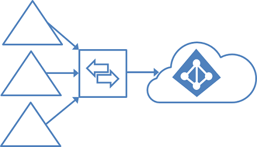
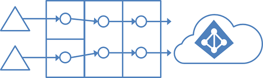
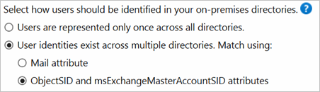
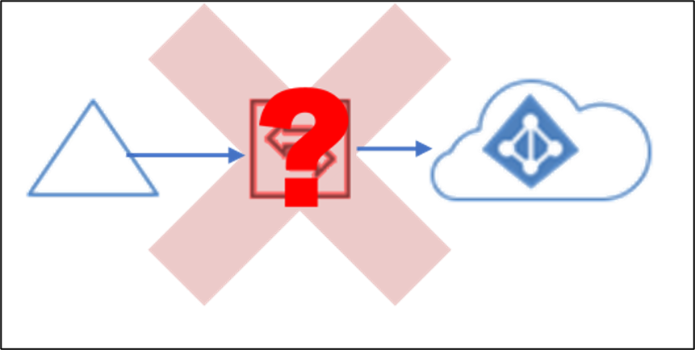

# Topologies for Microsoft Entra Connect
This article describes various on-premises and Microsoft Entra topologies that use Microsoft Entra Connect Sync as the key integration solution. This article includes both supported and unsupported configurations.

Here's the legend for pictures in the article:

| Description | Symbol |
| --- | --- |
| On-premises Active Directory forest | |
| On-premises Active Directory with filtered import | |
| Microsoft Entra Connect Sync server | |
| Microsoft Entra Connect Sync server “staging mode” | |
| GALSync with Forefront Identity Manager (FIM) 2010 or Microsoft Identity Manager (MIM) 2016 | |
| Microsoft Entra Connect Sync server, detailed | |
| Microsoft Entra ID | |
| Unsupported scenario | |

> [!IMPORTANT]
> Microsoft doesn't support modifying or operating Microsoft Entra Connect Sync outside of the configurations or actions that are formally documented. Any of these configurations or actions might result in an inconsistent or unsupported state of Microsoft Entra Connect Sync. As a result, Microsoft can't provide technical support for such deployments.

## Single forest, single Microsoft Entra tenant

The most common topology is a single on-premises forest, with one or multiple domains, and a single Microsoft Entra tenant. For Microsoft Entra authentication, password hash synchronization is used. The express installation of Microsoft Entra Connect supports only this topology.

### Single forest, multiple sync servers to one Microsoft Entra tenant

Having multiple Microsoft Entra Connect Sync servers connected to the same Microsoft Entra tenant is not supported, except for a [staging server](#staging-server). It's unsupported even if these servers are configured to synchronize with a mutually exclusive set of objects. You might have considered this topology if you can't reach all domains in the forest from a single server, or if you want to distribute load across several servers. (No errors occur when a new Azure AD Sync Server is configured for a new Microsoft Entra forest and a new verified child domain.) 

## Multiple forests, single Microsoft Entra tenant

Many organizations have environments with multiple on-premises Active Directory forests. There are various reasons for having more than one on-premises Active Directory forest. Typical examples are designs with account-resource forests and the result of a merger or acquisition.

When you have multiple forests, all forests must be reachable by a single Microsoft Entra Connect Sync server. The server must be joined to a domain. If necessary to reach all forests, you can place the server in a perimeter network (also known as DMZ, demilitarized zone, and screened subnet).

The Microsoft Entra Connect installation wizard offers several options to consolidate users who are represented in multiple forests. The goal is that a user is represented only once in Microsoft Entra ID. There are some common topologies that you can configure in the custom installation path in the installation wizard. On the **Uniquely identifying your users** page, select the corresponding option that represents your topology. The consolidation is configured only for users. Duplicated groups are not consolidated with the default configuration.

Common topologies are discussed in the sections about separate topologies, [full mesh](#multiple-forests-full-mesh-with-optional-galsync), and [the account-resource topology](#multiple-forests-account-resource-forest).

The default configuration in Microsoft Entra Connect Sync assumes:

* Each user has only one enabled account, and the forest where this account is located is used to authenticate the user. This assumption is for password hash sync, pass-through authentication and federation. UserPrincipalName and sourceAnchor/immutableID come from this forest.
* Each user has only one mailbox.
* The forest that hosts the mailbox for a user has the best data quality for attributes visible in the Exchange Global Address List (GAL). If there's no mailbox for the user, any forest can be used to contribute these attribute values.
* If you have a linked mailbox, there's also an account in a different forest used for sign-in.

If your environment does not match these assumptions, the following things happen:

* If you have more than one active account or more than one mailbox, the sync engine picks one and ignores the other.
* A linked mailbox with no other active account is not exported to Microsoft Entra ID. The user account is not represented as a member in any group. A linked mailbox in DirSync is always represented as a normal mailbox. This change is intentionally a different behavior to better support multiple-forest scenarios.

You can find more details in [Understanding the default configuration](concept-azure-ad-connect-sync-default-configuration.md).

### Multiple forests, multiple sync servers to one Microsoft Entra tenant

Having more than one Microsoft Entra Connect Sync server connected to a single Microsoft Entra tenant is not supported. The exception is the use of a [staging server](#staging-server).

This topology differs from the one below in that **multiple sync servers** connected to a single Microsoft Entra tenant is not supported. (While not supported, this still works.)

### Multiple forests, single sync server, users are represented in only one directory

In this environment, all on-premises forests are treated as separate entities. No user is present in any other forest. Each forest has its own Exchange organization, and there's no GALSync between the forests. This topology might be the situation after a merger/acquisition or in an organization where each business unit operates independently. These forests are in the same organization in Microsoft Entra ID and appear with a unified GAL. In the preceding picture, each object in every forest is represented once in the metaverse and aggregated in the target Microsoft Entra tenant.

### Multiple forests: match users
Common to all these scenarios is that distribution and security groups can contain a mix of users, contacts, and Foreign Security Principals (FSPs). FSPs are used in Active Directory Domain Services (AD DS) to represent members from other forests in a security group. All FSPs are resolved to the real object in Microsoft Entra ID.

### Multiple forests: full mesh with optional GALSync

A full mesh topology allows users and resources to be located in any forest. Commonly, there are two-way trusts between the forests.

If Exchange is present in more than one forest, there might be (optionally) an on-premises GALSync solution. Every user is then represented as a contact in all other forests. GALSync is commonly implemented through FIM 2010 or MIM 2016. Microsoft Entra Connect cannot be used for on-premises GALSync.

In this scenario, identity objects are joined via the mail attribute. A user who has a mailbox in one forest is joined with the contacts in the other forests.

### Multiple forests: account-resource forest

In an account-resource forest topology, you have one or more *account* forests with active user accounts. You also have one or more *resource* forests with disabled accounts.

In this scenario, one (or more) resource forest trusts all account forests. The resource forest typically has an extended Active Directory schema with Exchange and Lync. All Exchange and Lync services, along with other shared services, are located in this forest. Users have a disabled user account in this forest, and the mailbox is linked to the account forest.

## Microsoft 365 and topology considerations
Some Microsoft 365 workloads have certain restrictions on supported topologies:

| Workload | Restrictions |
| --------- | --------- |
| Exchange Online | For more information about hybrid topologies supported by Exchange Online, see [Hybrid deployments with multiple Active Directory forests](/Exchange/hybrid-deployment/hybrid-with-multiple-forests). |
| Skype for Business | When you're using multiple on-premises forests, only the account-resource forest topology is supported. For more information, see [Environmental requirements for Skype for Business Server 2015](/skypeforbusiness/plan-your-deployment/requirements-for-your-environment/environmental-requirements). |

If you are a larger organization, then you should consider to use the [Microsoft 365 PreferredDataLocation](how-to-connect-sync-feature-preferreddatalocation.md) feature. It allows you to define in which datacenter region the user's resources are located.

## Staging server

Microsoft Entra Connect supports installing a second server in *staging mode*. A server in this mode reads data from all connected directories but does not write anything to connected directories. It uses the normal synchronization cycle and therefore has an updated copy of the identity data.

In a disaster where the primary server fails, you can fail over to the staging server. You do this in the Microsoft Entra Connect wizard. This second server can be located in a different datacenter because no infrastructure is shared with the primary server. You must manually copy any configuration change made on the primary server to the second server.

You can use a staging server to test a new custom configuration and the effect that it has on your data. You can preview the changes and adjust the configuration. When you're happy with the new configuration, you can make the staging server the active server and set the old active server to staging mode.

You can also use this method to replace the active sync server. Prepare the new server and set it to staging mode. Make sure it's in a good state, disable staging mode (making it active), and shut down the currently active server.

It's possible to have more than one staging server when you want to have multiple backups in different datacenters.

## Multiple Microsoft Entra tenants
We recommend having a single tenant in Microsoft Entra ID for an organization. Before you plan to use multiple Microsoft Entra tenants, see the article [Administrative units management in Microsoft Entra ID](../../roles/administrative-units.md). It covers common scenarios where you can use a single tenant.

### Sync AD objects to multiple Microsoft Entra tenants

This topology implements the following use cases:

* AADConnect can synchronize the users, groups, and contacts from a single Active Directory to multiple Microsoft Entra tenants. These tenants can be in different Azure environments, such as the Microsoft Azure operated by 21Vianet environment or the Azure Government environment, but they could also be in the same Azure environment, such as two tenants that are both in Azure Commercial. For more details on options, see [Planning identity for Azure Government applications] (/azure/azure-government/documentation-government-plan-identity).
*	The same Source Anchor can be used for a single object in separate tenants (but not for multiple objects in the same tenant). (The verified domain can't be the same in two tenants. More details are needed to enable the same object to have two UPNs.)
*	You will need to deploy an AADConnect server for every Microsoft Entra tenant you want to synchronize to - one AADConnect server cannot synchronize to more than one Microsoft Entra tenant.
*	It is supported to have different sync scopes and different sync rules for different tenants.
*	Only one Microsoft Entra tenant sync can be configured to write back to Active Directory for the same object. This includes device and group writeback as well as Hybrid Exchange configurations – these features can only be configured in one tenant. The only exception here is Password Writeback – see below.
*	It is supported to configure Password Hash Sync from Active Directory to multiple Microsoft Entra tenants for the same user object. If Password Hash Sync is enabled for a tenant, then Password Writeback may be enabled as well, and this can be done on multiple tenants: if the password is changed on one tenant, then password writeback will update it in Active Directory, and Password Hash Sync will update the password in the other tenants.
*	It is not supported to add and verify the same custom domain name in more than one Microsoft Entra tenant, even if these tenants are in different Azure environments.
*	It is not supported to configure hybrid experiences that utilize forest level configuration in AD, such as Seamless SSO and Microsoft Entra hybrid join (non-targeted approach), with more than one tenant.  Doing so would overwrite the configuration of the other tenant, making it no longer usable.  You can find additional information in [Plan your Microsoft Entra hybrid join deployment](../../devices/hybrid-join-plan.md#hybrid-azure-ad-join-for-single-forest-multiple-azure-ad-tenants). 
*	You can synchronize device objects to more than one tenant but a device can be Microsoft Entra hybrid joined to only one tenant.
* Each Microsoft Entra Connect instance should be running on a domain-joined machine.

>[!NOTE]
>Global Address List Synchronization (GalSync) is not done automatically in this topology and requires an additional custom MIM implementation to ensure each tenant has a complete Global Address List (GAL) in Exchange Online and Skype for Business Online.

### GALSync by using writeback
 

### GALSync with on-premises sync server

You can use FIM 2010 or MIM 2016 on-premises to sync users (via GALSync) between two Exchange organizations. The users in one organization appear as foreign users/contacts in the other organization. These different on-premises Active Directory instances can then be synchronized with their own Microsoft Entra tenants.

### Using unauthorized clients to access the Microsoft Entra Connect backend

The Microsoft Entra Connect server communicates with Microsoft Entra ID through the Microsoft Entra Connect backend. The only software that can be used to communicate with this backend is Microsoft Entra Connect. It is not supported to communicate with the Microsoft Entra Connect backend using any other software or method. 

## Next steps
To learn how to install Microsoft Entra Connect for these scenarios, see [Custom installation of Microsoft Entra Connect](how-to-connect-install-custom.md).

Learn more about the [Microsoft Entra Connect Sync](how-to-connect-sync-whatis.md) configuration.

Learn more about [integrating your on-premises identities with Microsoft Entra ID](../whatis-hybrid-identity.md).
