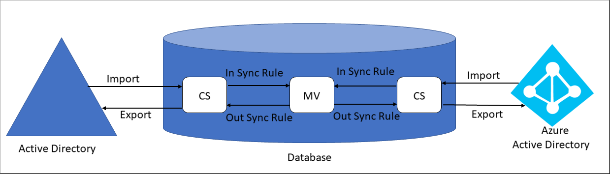
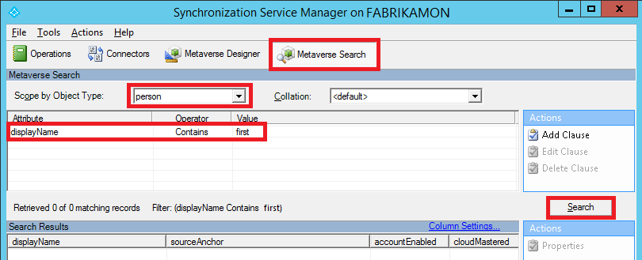
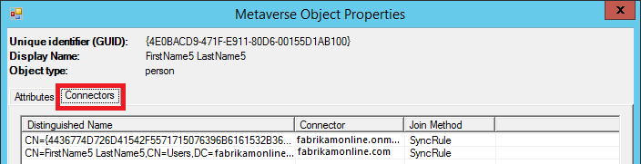
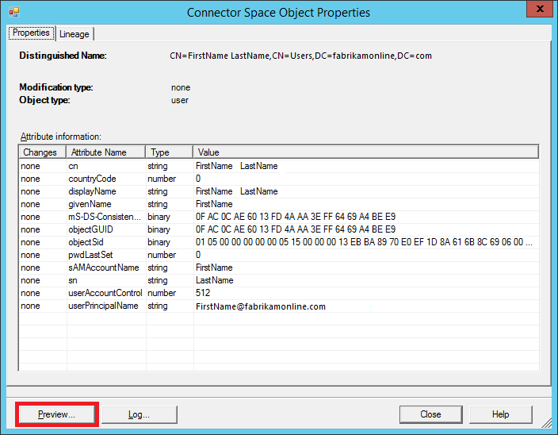
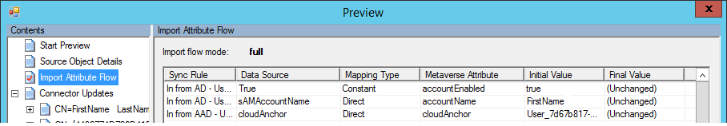

# Troubleshoot an attribute not synchronizing in Microsoft Entra Connect

## **Recommended Steps**

Before investigating attribute syncing issues, let’s understand the **Microsoft Entra Connect** syncing process:

  

### **Terminology**

* **CS:** Connector Space, a table in database.
* **MV:** Metaverse, a table in database.
* **AD:** Active Directory

### **Synchronization Steps**

* Import from AD: Active Directory objects are brought into AD CS.

* Import from Microsoft Entra ID: Microsoft Entra objects are brought into Microsoft Entra CS.

* Synchronization: **Inbound Synchronization Rules** and **Outbound Synchronization Rules** are run in the order of precedence number from lower to higher. To view the Synchronization Rules, you can go to **Synchronization Rules Editor** from the desktop applications. The **Inbound Synchronization Rules** brings in data from CS to MV. The **Outbound Synchronization Rules** moves data from MV to CS.

* Export to AD: After running Synchronization, objects are exported from AD CS to **Active Directory**.

* Export to Microsoft Entra ID: After running Synchronization, objects are exported from Microsoft Entra CS to **Microsoft Entra ID**.

### **Step by Step Investigation**

* We'll start our search from the **Metaverse** and look at the attribute mapping from source to target.

* Launch **Synchronization Service Manager** from the desktop applications, as shown below:

  

* On the **Synchronization Service Manager**, select the **Metaverse Search**, select **Scope by Object Type**, select the object using an attribute, and click **Search** button.

  

* Double click the object found in the **Metaverse** search to view all its attributes. You can click on the **Connectors** tab to look at corresponding object in all the **Connector Spaces**.

  

* Double click on the **Active Directory Connector** to view the **Connector Space** attributes. Click on the **Preview** button, on the following dialog click on the **Generate Preview** button.

  

* Now click on the **Import Attribute Flow**, this shows flow of attributes from **Active Directory Connector Space** to the **Metaverse**. **Sync Rule** column shows which **Synchronization Rule** contributed to that attribute. **Data Source** column shows you the attributes from the **Connector Space**. **Metaverse Attribute** column shows you the attributes in the **Metaverse**. You can look for the attribute not syncing here. If you don't find the attribute here, then this isn't mapped and you have to create new custom **Synchronization Rule** to map the attribute.

  

* Click on the **Export Attribute Flow** in the left pane to view the attribute flow from **Metaverse** back to **Active Directory Connector Space** using **Outbound Synchronization Rules**.

  

* Similarly, you can view the **Microsoft Entra Connector Space** object and can generate the **Preview** to view attribute flow from **Metaverse** to the **Connector Space** and vice versa, this way you can investigate why an attribute isn't syncing.

## **Recommended Documents**
* [Microsoft Entra Connect Sync: Technical Concepts](./how-to-connect-sync-technical-concepts.md)
* [Microsoft Entra Connect Sync: Understanding the architecture](./concept-azure-ad-connect-sync-architecture.md)
* [Microsoft Entra Connect Sync: Understanding Declarative Provisioning](./concept-azure-ad-connect-sync-declarative-provisioning.md)
* [Microsoft Entra Connect Sync: Understanding Declarative Provisioning Expressions](./concept-azure-ad-connect-sync-declarative-provisioning-expressions.md)
* [Microsoft Entra Connect Sync: Understanding the default configuration](./concept-azure-ad-connect-sync-default-configuration.md)
* [Microsoft Entra Connect Sync: Understanding Users, Groups, and Contacts](./concept-azure-ad-connect-sync-user-and-contacts.md)
* [Microsoft Entra Connect Sync: Shadow attributes](./how-to-connect-syncservice-shadow-attributes.md)

## Next Steps

- [Microsoft Entra Connect Sync](how-to-connect-sync-whatis.md).
- [What is hybrid identity?](../whatis-hybrid-identity.md).
