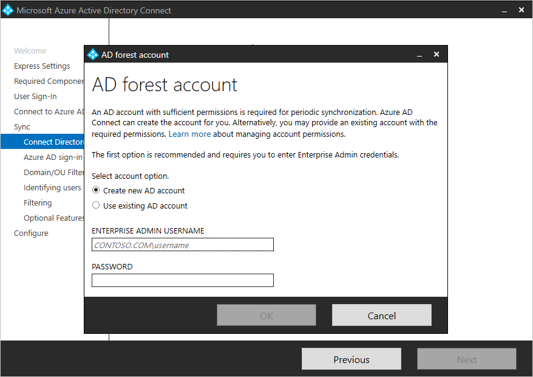

# Troubleshoot: Microsoft Entra Connect install issues

## **Recommended Steps**
Please check which [Microsoft Entra Connect installation type](./how-to-connect-install-select-installation.md) is suitable for you. If you meet the criteria of express installation, then we highly recommend you to go with the express installation. The express installation gives you minimal options needed to finish the installation, therefore there is less likelihood of any issues. 

However, if you don’t meet the express installation criteria and must do the custom installation then here are some best practices you can follow to avoid common issues. For the sake of simplicity only selective options are mentioned here:

* Ensure you are an administrator on the machine on which you are installing Microsoft Entra Connect. Log in on to the machine with same administrator credentials.

* Let all the options to be default on the following page, except for “Use an existing SQL Server”, if you want to use existing SQL Server. Here are [more details](./how-to-connect-install-custom.md) about how to use custom installation options. 

    

* On the following page, pick option “Create new AD account", to avoid any permission issues with existing account.

    

### **Common Issues**

* [Connectivity issues with on-premises Active Directory](./reference-connect-adconnectivitytools.md).

* [Connectivity issues with online Microsoft Entra ID](./tshoot-connect-connectivity.md).

* [Permission issues with on-premises Active Directory](./how-to-connect-configure-ad-ds-connector-account.md).

## **Recommended Documents**
* [Prerequisites for Microsoft Entra Connect](./how-to-connect-install-prerequisites.md)
* [Select which installation type to use for Microsoft Entra Connect](./how-to-connect-install-select-installation.md)
* [Getting started with Microsoft Entra Connect using express settings](./how-to-connect-install-express.md)
* [Custom installation of Microsoft Entra Connect](./how-to-connect-install-custom.md)
* [Microsoft Entra Connect: Upgrade from a previous version to the latest](./how-to-upgrade-previous-version.md)
* [Microsoft Entra Connect: What is staging server?](./plan-connect-topologies.md#staging-server)
* [What is the `ADConnectivityTool` PowerShell module?](./how-to-connect-adconnectivitytools.md)

## Next steps
- [Microsoft Entra Connect Sync](how-to-connect-sync-whatis.md).
- [What is hybrid identity?](../whatis-hybrid-identity.md)
