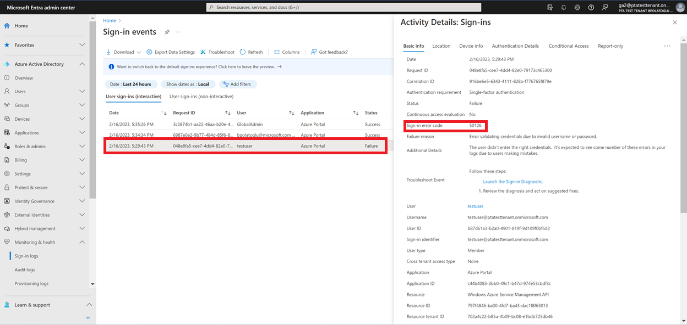
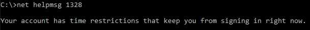
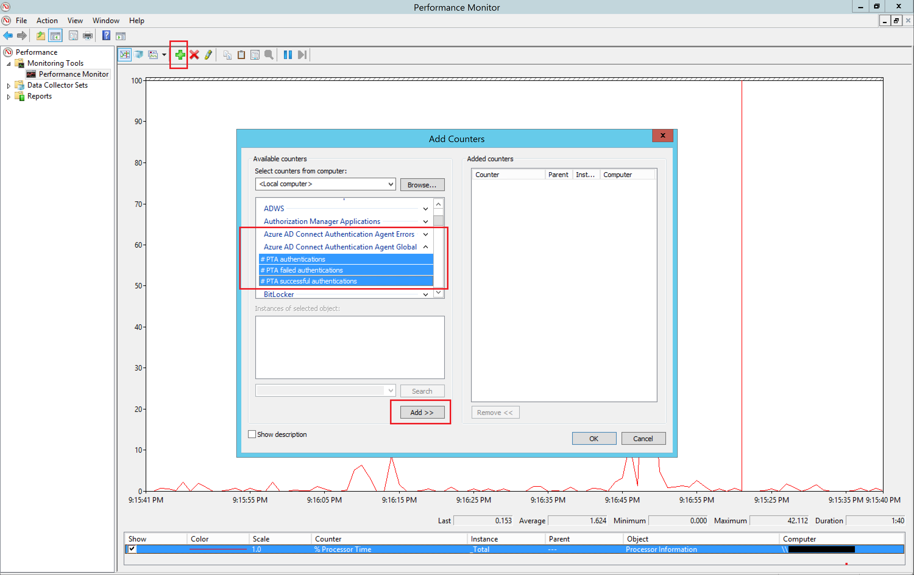

# Troubleshoot Microsoft Entra pass-through authentication

This article helps you find troubleshooting information about common issues regarding Microsoft Entra pass-through authentication.

> [!IMPORTANT]
> If you are facing user sign-in issues with Pass-through Authentication, don't disable the feature or uninstall Pass-through Authentication Agents without having a cloud-only Global Administrator account or a Hybrid Identity Administrator account to fall back on. Learn about [adding a cloud-only Global Administrator account](../../fundamentals/add-users.md). Doing this step is critical and ensures that you don't get locked out of your tenant.

## General issues

### Check status of the feature and Authentication Agents

Ensure that the Pass-through Authentication feature is still **Enabled** on your tenant and the status of Authentication Agents shows **Active**, and not **Inactive**. You can check status by going to the **Microsoft Entra Connect** blade on the [Microsoft Entra admin center](https://entra.microsoft.com/).


### User-facing sign-in error messages

If the user is unable to sign into using Pass-through Authentication, they may see one of the following user-facing errors on the Microsoft Entra sign-in screen:

|Error|Description|Resolution
| --- | --- | ---
|AADSTS80001|Unable to connect to Active Directory|Ensure that agent servers are members of the same AD forest as the users whose passwords need to be validated and they are able to connect to Active Directory.
|AADSTS80002|A timeout occurred connecting to Active Directory|Check to ensure that Active Directory is available and is responding to requests from the agents.
|AADSTS80004|The username passed to the agent was not valid|Ensure the user is attempting to sign in with the right username.
|AADSTS80005|Validation encountered unpredictable WebException|A transient error. Retry the request. If it continues to fail, contact Microsoft support.
|AADSTS80007|An error occurred communicating with Active Directory|Check the agent logs for more information and verify that Active Directory is operating as expected.

### Users get invalid username/password error

This can happen when a user's on-premises UserPrincipalName (UPN) is different than the user's cloud UPN.

To confirm that this is the issue, first test that the Pass-through Authentication agent is working correctly:

1. Create a test account.

2. Import the PowerShell module on the agent machine:

   ```powershell
   Import-Module "C:\Program Files\Microsoft Azure AD Connect Authentication Agent\Modules\PassthroughAuthPSModule\PassthroughAuthPSModule.psd1"
   ```

3. Run the Invoke PowerShell command:

   ```powershell
   Invoke-PassthroughAuthOnPremLogonTroubleshooter 
   ```

4. When you are prompted to enter credentials, enter the same username and password that are used to sign in to (https://login.microsoftonline.com).

If you get the same username/password error, this means that the Pass-through Authentication agent is working correctly and the issue may be that the on-premises UPN is non-routable. To learn more, see [Configuring Alternate Login ID](/windows-server/identity/ad-fs/operations/configuring-alternate-login-id).

> [!IMPORTANT]
> If the Microsoft Entra Connect server isn't domain joined, a requirement mentioned in [Microsoft Entra Connect: Prerequisites](./how-to-connect-install-prerequisites.md#installation-prerequisites), the invalid username/password issue occurs.

### Sign-in failure reasons on the [Microsoft Entra admin center](https://entra.microsoft.com) (needs Premium license)

If your tenant has a Microsoft Entra ID P1 or P2 license associated with it, you can also look at the [sign-in activity report](../../reports-monitoring/concept-sign-ins.md) on the [Microsoft Entra admin center](https://entra.microsoft.com/).

[](./media/tshoot-connect-pass-through-authentication/sign-in-report.png#lightbox)

Navigate to **Microsoft Entra ID** -> **Sign-ins** on the [[Microsoft Entra admin center](https://entra.microsoft.com)](https://portal.azure.com/) and click a specific user's sign-in activity. Look for the **SIGN-IN ERROR CODE** field. Map the value of that field to a failure reason and resolution using the following table:

|Sign-in error code|Sign-in failure reason|Resolution
| --- | --- | ---
| 50144 | User's Active Directory password has expired. | Reset the user's password in your on-premises Active Directory.
| 80001 | No Authentication Agent available. | Install and register an Authentication Agent.
| 80002	| Authentication Agent's password validation request timed out. | Check if your Active Directory is reachable from the Authentication Agent.
| 80003 | Invalid response received by Authentication Agent. | If the problem is consistently reproducible across multiple users, check your Active Directory configuration.
| 80004 | Incorrect User Principal Name (UPN) used in sign-in request. | Ask the user to sign in with the correct username.
| 80005 | Authentication Agent: Error occurred. | Transient error. Try again later.
| 80007 | Authentication Agent unable to connect to Active Directory. | Check if your Active Directory is reachable from the Authentication Agent.
| 80010 | Authentication Agent unable to decrypt password. | If the problem is consistently reproducible, install and register a new Authentication Agent. And uninstall the current one.
| 80011 | Authentication Agent unable to retrieve decryption key. | If the problem is consistently reproducible, install and register a new Authentication Agent. And uninstall the current one.
| 80014 | Validation request responded after maximum elapsed time exceeded. | Authentication agent timed out. Open a support ticket with the error code, correlation ID, and timestamp to get more details on this error

> [!IMPORTANT]
> Pass-through Authentication Agents authenticate Microsoft Entra users by validating their usernames and passwords against Active Directory by calling the [Win32 LogonUser API](/windows/win32/api/winbase/nf-winbase-logonusera). As a result, if you have set the "Logon To" setting in Active Directory to limit workstation logon access, you will have to add servers hosting Pass-through Authentication Agents to the list of "Logon To" servers as well. Failing to do this will block your users from signing into Microsoft Entra ID.

## Authentication Agent installation issues

### An unexpected error occurred

[Collect agent logs](#collecting-pass-through-authentication-agent-logs) from the server and contact Microsoft Support with your issue.

## Authentication Agent registration issues

### Registration of the Authentication Agent failed due to blocked ports

Ensure that the server on which the Authentication Agent has been installed can communicate with our service URLs and ports listed [here](how-to-connect-pta-quick-start.md#step-1-check-the-prerequisites).

### Registration of the Authentication Agent failed due to token or account authorization errors

Ensure that you use a cloud-only Global Administrator account or a Hybrid Identity Administrator account for all Microsoft Entra Connect or standalone Authentication Agent installation and registration operations. There is a known issue with MFA-enabled Global Administrator accounts; turn off MFA temporarily (only to complete the operations) as a workaround.

### An unexpected error occurred

[Collect agent logs](#collecting-pass-through-authentication-agent-logs) from the server and contact Microsoft Support with your issue.

## Authentication Agent uninstallation issues

<a name='warning-message-when-uninstalling-azure-ad-connect'></a>

### Warning message when uninstalling Microsoft Entra Connect

If you have Pass-through Authentication enabled on your tenant and you try to uninstall Microsoft Entra Connect, it shows you the following warning message: "Users will not be able to sign-in to Microsoft Entra ID unless you have other Pass-through Authentication agents installed on other servers."

Ensure that your setup is [highly available](how-to-connect-pta-quick-start.md#step-4-ensure-high-availability) before you uninstall Microsoft Entra Connect to avoid breaking user sign-in.

## Issues with enabling the feature

### Enabling the feature failed because there were no Authentication Agents available

You need to have at least one active Authentication Agent to enable Pass-through Authentication on your tenant. You can install an Authentication Agent by either installing Microsoft Entra Connect or a standalone Authentication Agent.

### Enabling the feature failed due to blocked ports

Ensure that the server on which Microsoft Entra Connect is installed can communicate with our service URLs and ports listed [here](how-to-connect-pta-quick-start.md#step-1-check-the-prerequisites).

### Enabling the feature failed due to token or account authorization errors

Ensure that you use a cloud-only Global Administrator account when enabling the feature. There is a known issue with multi-factor authentication (MFA)-enabled Global Administrator accounts; turn off MFA temporarily (only to complete the operation) as a workaround.

## Collecting Pass-through Authentication Agent logs

Depending on the type of issue you may have, you need to look in different places for Pass-through Authentication Agent logs.

<a name='azure-ad-connect-logs'></a>

### Microsoft Entra Connect logs

For errors related to installation, check the Microsoft Entra Connect logs at `%ProgramData%\AADConnect\trace-*.log`.

### Authentication Agent event logs

For errors related to the Authentication Agent, open up the Event Viewer application on the server and check under **Application and Service Logs\Microsoft\AzureAdConnect\AuthenticationAgent\Admin**.

For detailed analytics, enable the "Session" log (right-click inside the Event Viewer application to find this option). Don't run the Authentication Agent with this log enabled during normal operations; use only for troubleshooting. The log contents are only visible after the log is disabled again.

### Detailed trace logs

To troubleshoot user sign-in failures, look for trace logs at **%ProgramData%\Microsoft\Azure AD Connect Authentication Agent\Trace\\**. These logs include reasons why a specific user sign-in failed using the Pass-through Authentication feature. These errors are also mapped to the sign-in failure reasons shown in the preceding sign-in failure reasons table. Following is an example log entry:

```
    AzureADConnectAuthenticationAgentService.exe Error: 0 : Passthrough Authentication request failed. RequestId: 'df63f4a4-68b9-44ae-8d81-6ad2d844d84e'. Reason: '1328'.
        ThreadId=5
        DateTime=xxxx-xx-xxTxx:xx:xx.xxxxxxZ
```

You can get descriptive details of the error ('1328' in the preceding example) by opening up the command prompt and running the following command (Note: Replace '1328' with the actual error number that you see in your logs):

`Net helpmsg 1328`



### Pass-through Authentication sign-in logs

If audit logging is enabled, additional information can be found in the security logs of your Pass-through Authentication server. A simple way to query sign-in requests is to filter security logs using the following query:

```
    <QueryList>
    <Query Id="0" Path="Security">
    <Select Path="Security">*[EventData[Data[@Name='ProcessName'] and (Data='C:\Program Files\Microsoft Azure AD Connect Authentication Agent\AzureADConnectAuthenticationAgentService.exe')]]</Select>
    </Query>
    </QueryList>
```

## Performance Monitor counters

Another way to monitor Authentication Agents is to track specific Performance Monitor counters on each server where the Authentication Agent is installed. Use the following Global counters (**# PTA authentications**, **#PTA failed authentications** and **#PTA successful authentications**) and Error counters (**# PTA authentication errors**):



> [!IMPORTANT]
> Pass-through Authentication provides high availability using multiple Authentication Agents, and _not_ load balancing. Depending on your configuration, _not_ all your Authentication Agents receive roughly _equal_ number of requests. It is possible that a specific Authentication Agent receives no traffic at all.
