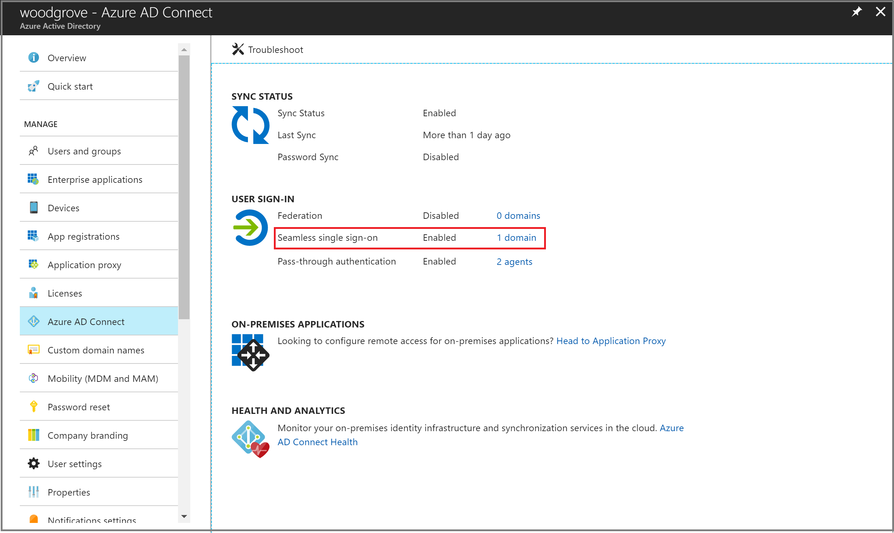
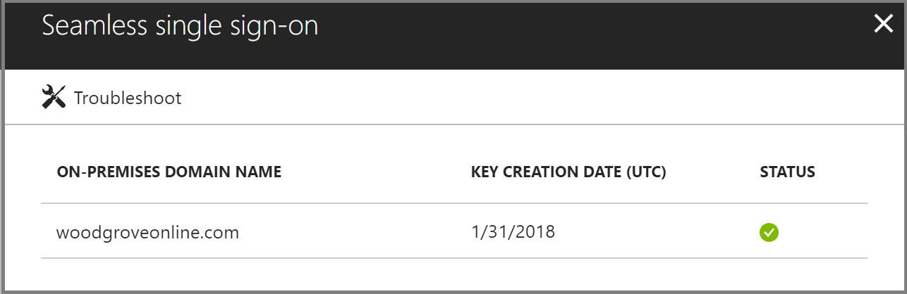
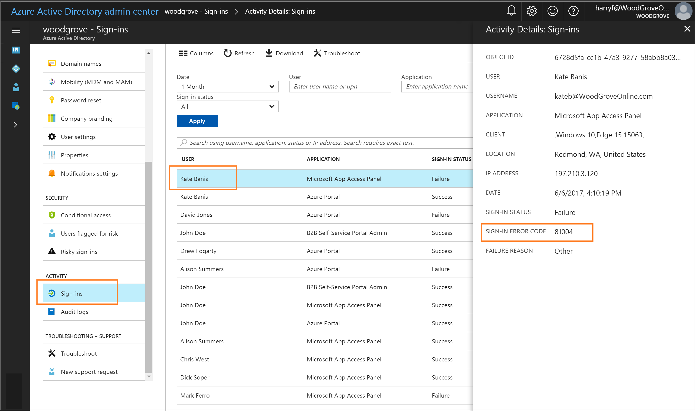

# Troubleshoot Microsoft Entra seamless single sign-on

This article helps you find troubleshooting information about common problems regarding Microsoft Entra seamless single sign-on (Seamless SSO).

## Known issues

- In a few cases, enabling Seamless SSO can take up to 30 minutes.
- If you disable and re-enable Seamless SSO on your tenant, users will not get the single sign-on experience till their cached Kerberos tickets, typically valid for 10 hours, have expired.
- If Seamless SSO succeeds, the user does not have the opportunity to select **Keep me signed in**. Due to this behavior, [SharePoint and OneDrive mapping scenarios](https://support.microsoft.com/help/2616712/how-to-configure-and-to-troubleshoot-mapped-network-drives-that-connec) don't work.
- Microsoft 365 Win32 clients (Outlook, Word, Excel, and others) with versions 16.0.8730.xxxx and above are supported using a non-interactive flow. Other versions are not supported; on those versions, users will enter their usernames, but not passwords, to sign-in. For OneDrive, you will have to activate the [OneDrive silent config feature](https://techcommunity.microsoft.com/t5/Microsoft-OneDrive-Blog/Previews-for-Silent-Sync-Account-Configuration-and-Bandwidth/ba-p/120894) for a silent sign-on experience.
- Seamless SSO doesn't work in private browsing mode on Firefox.
- Seamless SSO doesn't work in Internet Explorer when Enhanced Protected mode is turned on.
- Microsoft Edge (legacy) is no longer supported
- Seamless SSO doesn't work on mobile browsers on iOS and Android.
- If a user is part of too many groups in Active Directory, the user's Kerberos ticket will likely be too large to process, and this will cause Seamless SSO to fail. Microsoft Entra HTTPS requests can have headers with a maximum size of 50 KB; Kerberos tickets need to be smaller than that limit to accommodate other Microsoft Entra artifacts (typically, 2 - 5 KB) such as cookies. Our recommendation is to reduce user's group memberships and try again.
- If you're synchronizing 30 or more Active Directory forests, you can't enable Seamless SSO through Microsoft Entra Connect. As a workaround, you can [manually enable](#manual-reset-of-the-feature) the feature on your tenant.
- Adding the Microsoft Entra service URL (`https://autologon.microsoftazuread-sso.com`) to the Trusted sites zone instead of the Local intranet zone *blocks users from signing in*.
- Seamless SSO supports the AES256_HMAC_SHA1, AES128_HMAC_SHA1 and RC4_HMAC_MD5 encryption types for Kerberos. It is recommended that the encryption type for the AzureADSSOAcc$ account is set to AES256_HMAC_SHA1, or one of the AES types vs. RC4 for added security. The encryption type is stored on the msDS-SupportedEncryptionTypes attribute of the account in your Active Directory.  If the AzureADSSOAcc$ account encryption type is set to RC4_HMAC_MD5, and you want to change it to one of the AES encryption types, please make sure that you first roll over the Kerberos decryption key of the AzureADSSOAcc$ account as explained in the [FAQ document](how-to-connect-sso-faq.yml) under the relevant question, otherwise Seamless SSO will not happen.
-  If you have more than one forest with forest trust, enabling SSO in one of the forests, will enable SSO in all trusted forests. If you enable SSO in a forest where SSO is already enabled, you'll get an error saying that SSO is already enabled in the forest.
-  The policy that enables Seamless SSO has a 25600 char limit. This limit is for everything included in the policy, including the forest names you want Seamless SSO to be enabled on. You may hit the char limit if you have a high number of forests in your environment. If your forests have trust between them, it’s enough to enable Seamless SSO only on one forests. For example, if you have contoso.com and fabrikam.com and there’s trust between the two, you can enable Seamless SSO only on contoso.com and that will apply on fabrikam.com as well. This way, you can reduce the number of forests enabled in the policy and avoid hitting the policy char limit.

## Check status of feature

Ensure that the Seamless SSO feature is still **Enabled** on your tenant. You can check the status by going to the **Identity** > **Hybrid management** > **Microsoft Entra Connect** > **Connect Sync** pane in the [[Microsoft Entra admin center](https://entra.microsoft.com)](https://portal.azure.com/).



Click through to see all the AD forests that have been enabled for Seamless SSO.



## Sign-in failure reasons in the [Microsoft Entra admin center](https://entra.microsoft.com) (needs a Premium license)

If your tenant has a Microsoft Entra ID P1 or P2 license associated with it, you can also look at the [sign-in activity report](../../reports-monitoring/concept-sign-ins.md) inside of Microsoft Entra ID in the [Microsoft Entra admin center](https://entra.microsoft.com).



Browse to **Identity** > **Monitoring & health** > **Sign-ins** in the [[Microsoft Entra admin center](https://entra.microsoft.com)](https://portal.azure.com/), and then select a specific user's sign-in activity. Look for the **SIGN-IN ERROR CODE** field. Map the value of that field to a failure reason and resolution by using the following table:

|Sign-in error code|Sign-in failure reason|Resolution
| --- | --- | ---
| 81001 | User's Kerberos ticket is too large. | Reduce the user's group memberships and try again.
| 81002 | Unable to validate the user's Kerberos ticket. | See the [troubleshooting checklist](#troubleshooting-checklist).
| 81003 | Unable to validate the user's Kerberos ticket. | See the [troubleshooting checklist](#troubleshooting-checklist).
| 81004 | Kerberos authentication attempt failed. | See the [troubleshooting checklist](#troubleshooting-checklist).
| 81008 | Unable to validate the user's Kerberos ticket. | See the [troubleshooting checklist](#troubleshooting-checklist).
| 81009 | Unable to validate the user's Kerberos ticket. | See the [troubleshooting checklist](#troubleshooting-checklist).
| 81010 | Seamless SSO failed because the user's Kerberos ticket has expired or is invalid. | The user needs to sign in from a domain-joined device inside your corporate network.
| 81011 | Unable to find the user object based on the information in the user's Kerberos ticket. | Use Microsoft Entra Connect to synchronize the user's information into Microsoft Entra ID.
| 81012 | The user trying to sign in to Microsoft Entra ID is different from the user that is signed in to the device. | The user needs to sign in from a different device.
| 81013 | Unable to find the user object based on the information in the user's Kerberos ticket. |Use Microsoft Entra Connect to synchronize the user's information into Microsoft Entra ID. 

## Troubleshooting checklist

Use the following checklist to troubleshoot Seamless SSO problems:

- Ensure that the Seamless SSO feature is enabled in Microsoft Entra Connect. If you can't enable the feature (for example, due to a blocked port), ensure that you have all the [prerequisites](how-to-connect-sso-quick-start.md#step-1-check-the-prerequisites) in place.
- If you have enabled both [Microsoft Entra join](../../devices/overview.md) and Seamless SSO on your tenant, ensure that the issue is not with Microsoft Entra join. SSO from Microsoft Entra join takes precedence over Seamless SSO if the device is both registered with Microsoft Entra ID and domain-joined. With SSO from Microsoft Entra join the user sees a sign-in tile that says "Connected to Windows".
- Ensure that the Microsoft Entra URL (`https://autologon.microsoftazuread-sso.com`) is part of the user's Intranet zone settings.
- Ensure that the corporate device is joined to the Active Directory domain. The device _doesn't_ need to be [Microsoft Entra joined](../../devices/overview.md) for Seamless SSO to work.
- Ensure that the user is logged on to the device through an Active Directory domain account.
- Ensure that the user's account is from an Active Directory forest where Seamless SSO has been set up.
- Ensure that the device is connected to the corporate network.
- Ensure that the device's time is synchronized with the time in both Active Directory and the domain controllers, and that they are within five minutes of each other.
- Ensure that the `AZUREADSSOACC` computer account is present and enabled in each AD forest that you want Seamless SSO enabled. If the computer account has been deleted or is missing, you can use [PowerShell cmdlets](#manual-reset-of-the-feature) to re-create them.
- List the existing Kerberos tickets on the device by using the `klist` command from a command prompt. Ensure that the tickets issued for the `AZUREADSSOACC` computer account are present. Users' Kerberos tickets are typically valid for 10 hours. You might have different settings in Active Directory.
- If you disabled and re-enabled Seamless SSO on your tenant, users will not get the single sign-on experience till their cached Kerberos tickets have expired.
- Purge existing Kerberos tickets from the device by using the `klist purge` command, and try again.
- To determine if there are JavaScript-related problems, review the console logs of the browser (under **Developer Tools**).
- Review the [domain controller logs](#domain-controller-logs).

### Domain controller logs

If you enable success auditing on your domain controller, then every time a user signs in through Seamless SSO, a security entry is recorded in the event log. You can find these security events by using the following query. (Look for event **4769** associated with the computer account **AzureADSSOAcc$**.)

```
  <QueryList>
    <Query Id="0" Path="Security">
      <Select Path="Security">*[EventData[Data[@Name='ServiceName'] and (Data='AZUREADSSOACC$')]]</Select>
    </Query>
  </QueryList>
```

## Manual reset of the feature

If troubleshooting didn't help, you can manually reset the feature on your tenant. Follow these steps on the on-premises server where you're running Microsoft Entra Connect.

### Step 1: Import the Seamless SSO PowerShell module

1. First, download, and install [Azure AD PowerShell](/powershell/azure/active-directory/overview).
2. Browse to the `%programfiles%\Microsoft Azure Active Directory Connect` folder.
3. Import the Seamless SSO PowerShell module by using this command: `Import-Module .\AzureADSSO.psd1`.

### Step 2: Get the list of Active Directory forests on which Seamless SSO has been enabled

1. Run PowerShell as an administrator. In PowerShell, call `New-AzureADSSOAuthenticationContext`. When prompted, enter your tenant's Hybrid Identity Administrator or hybrid identity administrator credentials.
2. Call `Get-AzureADSSOStatus`. This command provides you with the list of Active Directory forests (look at the "Domains" list) on which this feature has been enabled.

### Step 3: Disable Seamless SSO for each Active Directory forest where you've set up the feature

1. Call `$creds = Get-Credential`. When prompted, enter the domain administrator credentials for the intended Active Directory forest.

   > [!NOTE]
   >The domain administrator credentials username must be entered in the SAM account name format  (contoso\johndoe or contoso.com\johndoe). We use the domain portion of the username to locate the Domain Controller of the Domain Administrator using DNS.

   >[!NOTE]
   >The domain administrator account used must not be a member of the Protected Users group. If so, the operation will fail.

2. Call `Disable-AzureADSSOForest -OnPremCredentials $creds`. This command removes the `AZUREADSSOACC` computer account from the on-premises domain controller for this specific Active Directory forest.

   >[!NOTE]
   >If for any reason you can't access your AD on-premises, you can skip **steps 3.1** and **3.2** and instead call `Disable-AzureADSSOForest -DomainFqdn <Domain name from the output list in step 2>`. 
   
3. Repeat the preceding steps for each Active Directory forest where you’ve set up the feature.
 
### Step 4: Enable Seamless SSO for each Active Directory forest

1. Call `Enable-AzureADSSOForest`. When prompted, enter the domain administrator credentials for the intended Active Directory forest.

   > [!NOTE]
   >The domain administrator credentials username must be entered in the SAM account name format  (contoso\johndoe or contoso.com\johndoe). We use the domain portion of the username to locate the Domain Controller of the Domain Administrator using DNS.

   >[!NOTE]
   >The domain administrator account used must not be a member of the Protected Users group. If so, the operation will fail.

2. Repeat the preceding step for each Active Directory forest where you want to set up the feature.

### Step 5: Enable the feature on your tenant

To turn on the feature on your tenant, call `Enable-AzureADSSO -Enable $true`.
