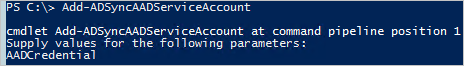

# Change the Azure AD Connector account password
The Azure AD Connector account is supposed to be service free. If you need to reset its credentials, then this topic is for you. For example, if a Global Administrator has by mistake reset the password on the account using PowerShell.

## Reset the credentials
If the Azure AD Connector account cannot contact Azure AD due to authentication problems, the password can be reset.

1. Sign in to the Azure AD Connect sync server and start PowerShell.
2. Run `Add-ADSyncAADServiceAccount`.
   
3. Provide Azure AD Global admin credentials.

This cmdlet resets the password for the service account and update it both in Azure AD and in the sync engine.

## Known issues these steps can solve
This section is a list of errors reported by customers that were fixed by a credentials reset on the Azure AD Connector account.

---
Event 6900
The server encountered an unexpected error while processing a password change notification:
AADSTS70002: Error validating credentials. AADSTS50054: Old password is used for authentication.

---
Event 659
Error while retrieving password policy sync configuration. Microsoft.IdentityModel.Clients.ActiveDirectory.AdalServiceException:
AADSTS70002: Error validating credentials. AADSTS50054: Old password is used for authentication.

## Next steps
**Overview topics**

* [Azure AD Connect sync: Understand and customize synchronization](how-to-connect-sync-whatis.md)
* [Integrating your on-premises identities with Azure Active Directory](whatis-hybrid-identity.md)
