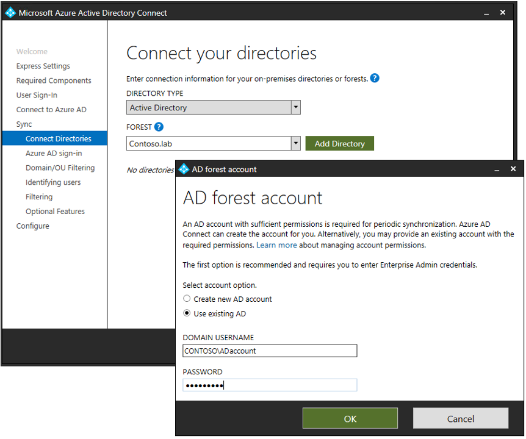
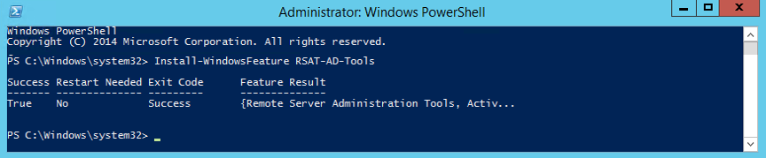

# Azure AD Connect: Configure AD DS Connector Account Permissions 

The PowerShell Module named [ADSyncConfig.psm1](reference-connect-adsyncconfig.md) was introduced with build 1.1.880.0 (released in August 2018) that includes a collection of cmdlets to help you configure the correct Active Directory permissions for your Azure AD Connect deployment. 

## Overview 
The following PowerShell cmdlets can be used to setup Active Directory permissions of the AD DS Connector account, for each feature that you select to enable in Azure AD Connect. To prevent any issues, you should prepare Active Directory permissions in advance whenever you want to install Azure AD Connect using a custom domain account to connect to your forest. This ADSyncConfig module can also be used to configure permissions after Azure AD Connect is deployed.



For Azure AD Connect Express installation, an automatically generated account (MSOL_nnnnnnnnnn) is created in Active Directory with all the necessary permissions, so there’s no need to use this ADSyncConfig module unless you have blocked permissions inheritance on organizational units or on specific Active Directory objects that you want to synchronize to Azure AD. 
 
### Permissions summary 
The following table provides a summary of the permissions required on AD objects: 

| Feature | Permissions |
| --- | --- |
| ms-DS-ConsistencyGuid feature |Read and Write permissions to the ms-DS-ConsistencyGuid attribute documented in [Design Concepts - Using ms-DS-ConsistencyGuid as sourceAnchor](plan-connect-design-concepts.md#using-ms-ds-consistencyguid-as-sourceanchor). | 
| Password hash sync |<li>Replicate Directory Changes</li>  <li>Replicate Directory Changes All |
| Exchange hybrid deployment |Read and Write permissions to the attributes documented in [Exchange hybrid writeback](reference-connect-sync-attributes-synchronized.md#exchange-hybrid-writeback) for users, groups, and contacts. |
| Exchange Mail Public Folder |Read permissions to the attributes documented in [Exchange Mail Public Folder](reference-connect-sync-attributes-synchronized.md#exchange-mail-public-folder) for public folders. | 
| Password writeback |Read and Write permissions to the attributes documented in [Getting started with password management](../authentication/howto-sspr-writeback.md) for users. |
| Device writeback |Read and Write permissions to device objects and containers documented in [device writeback](how-to-connect-device-writeback.md). |
| Group writeback |Read, Create, Update, and Delete group objects for synchronized **Office 365 groups**.|

## Using the ADSyncConfig PowerShell Module 
The ADSyncConfig module requires the [Remote Server Administration Tools (RSAT) for AD DS](https://docs.microsoft.com/windows-server/remote/remote-server-administration-tools) since it depends on the AD DS PowerShell module and tools. To install RSAT for AD DS, open a Windows PowerShell window with ‘Run As Administrator’ and execute: 

``` powershell
Install-WindowsFeature RSAT-AD-Tools 
```


>[!NOTE]
>You can also copy the file **C:\Program Files\Microsoft Azure Active Directory Connect\AdSyncConfig\ADSyncConfig.psm1** to a Domain Controller which already has RSAT for AD DS installed and use this PowerShell module from there.

To start using the ADSyncConfig you need to load the module in a Windows PowerShell window: 

``` powershell
Import-Module "C:\Program Files\Microsoft Azure Active Directory Connect\AdSyncConfig\AdSyncConfig.psm1" 
```

To check all the cmdlets included in this module you can type:  

``` powershell
Get-Command -Module AdSyncConfig  
```


Each cmdlet has the same parameters to input the AD DS Connector Account and an AdminSDHolder switch. To specify your AD DS Connector Account, you can provide the account name and domain, or just the account Distinguished Name (DN),

e.g.:

```powershell
Set-ADSyncPasswordHashSyncPermissions -ADConnectorAccountName <ADAccountName> -ADConnectorAccountDomain <ADDomainName>
```

Or;

```powershell
Set-ADSyncPasswordHashSyncPermissions -ADConnectorAccountDN <ADAccountDN>
```

Make sure to replace `<ADAccountName>`, `<ADDomainName>` and `<ADAccountDN>` with the proper values for your environment.

In case you don’t want to modify permissions on the AdminSDHolder container, use the switch `-SkipAdminSdHolders`. 

By default, all the set permissions cmdlets will try to set AD DS permissions on the root of each Domain in the Forest, meaning that the user running the PowerShell session requires Domain Administrator rights on each domain in the Forest.  Because of this requirement, it is recommended to use an Enterprise Administrator from the Forest root. If your Azure AD Connect deployment has multiple AD DS Connectors, it will be required to run the same cmdlet on each forest that has an AD DS Connector. 

You can also set permissions on a specific OU or AD DS object by using the parameter `-ADobjectDN` followed by the DN of the target object where you want to set permissions. When using a target ADobjectDN, the cmdlet will set permissions on this object only and not on the domain root or AdminSDHolder container. This parameter can be useful when you have certain OUs or AD DS objects that have permission inheritance disabled (see Locate AD DS objects with permission inheritance disabled) 

Exceptions to these common parameters are the `Set-ADSyncRestrictedPermissions` cmdlet which is used to set the permissions on the AD DS Connector Account itself, and the `Set-ADSyncPasswordHashSyncPermissions` cmdlet since the permissions required for Password Hash Sync are only set at the domain root, hence this cmdlet does not include the `-ObjectDN` or `-SkipAdminSdHolders` parameters.

### Determine your AD DS Connector Account 
In case Azure AD Connect is already installed and you want to check what is the AD DS Connector Account currently in use by Azure AD Connect, you can execute the cmdlet: 

``` powershell
Get-ADSyncADConnectorAccount 
```
### Locate AD DS objects with permission inheritance disabled 
In case you want to check if there is any AD DS object with permission inheritance disabled, you can run: 

``` powershell
Get-ADSyncObjectsWithInheritanceDisabled -SearchBase '<DistinguishedName>' 
```
By default, this cmdlet will only look for OUs with disabled inheritance, but you can specify other AD DS object classes in `-ObjectClass` parameter or use ‘*’ for all object classes, as follows: 

``` powershell
Get-ADSyncObjectsWithInheritanceDisabled -SearchBase '<DistinguishedName>' -ObjectClass * 
```
 
### View AD DS permissions of an object 
You can use the cmdlet below to view the list of permissions currently set on an Active Directory object by providing its DistinguishedName: 

``` powershell
Show-ADSyncADObjectPermissions -ADobjectDN '<DistinguishedName>' 
```

## Configure AD DS Connector Account Permissions 
 
### Configure Basic Read-Only Permissions 
To set basic read-only permissions for the AD DS Connector account when not using any Azure AD Connect feature, run: 

``` powershell
Set-ADSyncBasicReadPermissions -ADConnectorAccountName <String> -ADConnectorAccountDomain <String> [-SkipAdminSdHolders] [<CommonParameters>] 
```


or; 

``` powershell
Set-ADSyncBasicReadPermissions -ADConnectorAccountDN <String> [-ADobjectDN <String>] [<CommonParameters>] 
```


This cmdlet will set the following permissions: 
 

|Type |Name |Access |Applies To| 
|-----|-----|-----|-----|
|Allow |AD DS Connector Account |Read all properties |Descendant device objects| 
|Allow |AD DS Connector Account|Read all properties |Descendant InetOrgPerson objects| 
|Allow |AD DS Connector Account |Read all properties |Descendant Computer objects| 
|Allow |AD DS Connector Account |Read all properties |Descendant foreignSecurityPrincipal objects| 
|Allow |AD DS Connector Account |Read all properties |Descendant Group objects| 
|Allow |AD DS Connector Account |Read all properties |Descendant User objects| 
|Allow |AD DS Connector Account |Read all properties |Descendant Contact objects| 

 
### Configure MS-DS-Consistency-Guid Permissions 
To set permissions for the AD DS Connector account when using the ms-Ds-Consistency-Guid attribute as the source anchor (also known as “Let Azure manage the source anchor for me” option) , run: 

``` powershell
Set-ADSyncMsDsConsistencyGuidPermissions -ADConnectorAccountName <String> -ADConnectorAccountDomain <String> [-SkipAdminSdHolders] [<CommonParameters>] 
```

or; 

``` powershell
Set-ADSyncMsDsConsistencyGuidPermissions -ADConnectorAccountDN <String> [-ADobjectDN <String>] [<CommonParameters>] 
```

This cmdlet will set the following permissions: 

|Type |Name |Access |Applies To|
|-----|-----|-----|-----| 
|Allow|AD DS Connector Account|Read/Write property|Descendant User objects|

### Permissions for Password Hash Synchronization 
To set permissions for the AD DS Connector account when using Password Hash Synchronization, run: 

``` powershell
Set-ADSyncPasswordHashSyncPermissions -ADConnectorAccountName <String> -ADConnectorAccountDomain <String> [<CommonParameters>] 
```


or; 

``` powershell
Set-ADSyncPasswordHashSyncPermissions -ADConnectorAccountDN <String> [<CommonParameters>] 
```

This cmdlet will set the following permissions: 

|Type |Name |Access |Applies To|
|-----|-----|-----|-----| 
|Allow |AD DS Connector Account |Replicating Directory Changes |This object only (Domain root)| 
|Allow |AD DS Connector Account |Replicating Directory Changes All |This object only (Domain root)| 
  
### Permissions for Password Writeback 
To set permissions for the AD DS Connector account when using Password Writeback, run: 

``` powershell
Set-ADSyncPasswordWritebackPermissions -ADConnectorAccountName <String> -ADConnectorAccountDomain <String> [-SkipAdminSdHolders] [<CommonParameters>] 
```


or;

``` powershell
Set-ADSyncPasswordWritebackPermissions -ADConnectorAccountDN <String> [-ADobjectDN <String>] [<CommonParameters>] 
```
This cmdlet will set the following permissions: 

|Type |Name |Access |Applies To|
|-----|-----|-----|-----| 
|Allow |AD DS Connector Account |Reset Password |Descendant User objects| 
|Allow |AD DS Connector Account |Write property lockoutTime |Descendant User objects| 
|Allow |AD DS Connector Account |Write property pwdLastSet |Descendant User objects| 

### Permissions for Group Writeback 
To set permissions for the AD DS Connector account when using Group Writeback, run: 

``` powershell
Set-ADSyncUnifiedGroupWritebackPermissions -ADConnectorAccountName <String> -ADConnectorAccountDomain <String> [-SkipAdminSdHolders] [<CommonParameters>] 
```
or; 

``` powershell
Set-ADSyncUnifiedGroupWritebackPermissions -ADConnectorAccountDN <String> [-ADobjectDN <String>] [<CommonParameters>]
```
 
This cmdlet will set the following permissions: 

|Type |Name |Access |Applies To|
|-----|-----|-----|-----| 
|Allow |AD DS Connector Account |Generic Read/Write |All attributes of object type group and subobjects| 
|Allow |AD DS Connector Account |Create/Delete child object |All attributes of object type group and subobjects| 
|Allow |AD DS Connector Account |Delete/Delete tree objects|All attributes of object type group and subobjects|

### Permissions for Exchange Hybrid Deployment 
To set permissions for the AD DS Connector account when using Exchange Hybrid deployment, run: 

``` powershell
Set-ADSyncExchangeHybridPermissions -ADConnectorAccountName <String> -ADConnectorAccountDomain <String> [-SkipAdminSdHolders] [<CommonParameters>] 
```


or; 

``` powershell
Set-ADSyncExchangeHybridPermissions -ADConnectorAccountDN <String> [-ADobjectDN <String>] [<CommonParameters>] 
```

This cmdlet will set the following permissions:  
 

|Type |Name |Access |Applies To|
|-----|-----|-----|-----| 
|Allow |AD DS Connector Account |Read/Write all properties |Descendant User objects| 
|Allow |AD DS Connector Account |Read/Write all properties |Descendant InetOrgPerson objects| 
|Allow |AD DS Connector Account |Read/Write all properties |Descendant Group objects| 
|Allow |AD DS Connector Account |Read/Write all properties |Descendant Contact objects| 

### Permissions for Exchange Mail Public Folders (Preview) 
To set permissions for the AD DS Connector account when using Exchange Mail Public Folders feature, run: 

``` powershell
Set-ADSyncExchangeMailPublicFolderPermissions -ADConnectorAccountName <String> -ADConnectorAccountDomain <String> [-SkipAdminSdHolders] [<CommonParameters>] 
```


or; 

``` powershell
Set-ADSyncExchangeMailPublicFolderPermissions -ADConnectorAccountDN <String> [-ADobjectDN <String>] [<CommonParameters>] 
```
This cmdlet will set the following permissions: 

|Type |Name |Access |Applies To|
|-----|-----|-----|-----| 
|Allow |AD DS Connector Account |Read all properties |Descendant PublicFolder objects| 

### Restrict Permissions on the AD DS Connector Account 
This PowerShell script will tighten permissions for the AD Connector Account provided as a parameter. Tightening permissions involves the following steps: 

- Disable inheritance on the specified object 
- Remove all ACEs on the specific object, except ACEs specific to SELF as we want to keep the default permissions intact when it comes to SELF. 
 
  The -ADConnectorAccountDN parameter is the AD account whose permissions need to be tightened. This is typically the MSOL_nnnnnnnnnnnn domain account that is configured in the AD DS Connector (see Determine your AD DS Connector Account). The -Credential parameter is necessary to specify the Administrator account that has the necessary privileges to restrict Active Directory permissions on the target AD object. This is typically the Enterprise or Domain Administrator.  

``` powershell
Set-ADSyncRestrictedPermissions [-ADConnectorAccountDN] <String> [-Credential] <PSCredential> [-DisableCredentialValidation] [-WhatIf] [-Confirm] [<CommonParameters>] 
```
 
For Example: 

``` powershell
$credential = Get-Credential 
Set-ADSyncRestrictedPermissions -ADConnectorAccountDN'CN=ADConnectorAccount,CN=Users,DC=Contoso,DC=com' -Credential $credential  
```

This cmdlet will set the following permissions: 

|Type |Name |Access |Applies To|
|-----|-----|-----|-----| 
|Allow |SYSTEM |Full Control |This object 
|Allow |Enterprise Admins |Full Control |This object 
|Allow |Domain Admins |Full Control |This object 
|Allow |Administrators |Full Control |This object 
|Allow |Enterprise Domain Controllers |List Contents |This object 
|Allow |Enterprise Domain Controllers |Read All Properties |This object 
|Allow |Enterprise Domain Controllers |Read Permissions |This object 
|Allow |Authenticated Users |List Contents |This object 
|Allow |Authenticated Users |Read All Properties |This object 
|Allow |Authenticated Users |Read Permissions |This object 

## Next Steps
- [Azure AD Connect: Accounts and permissions](reference-connect-accounts-permissions.md)
- [Express Installation](how-to-connect-install-express.md)
- [Custom Installation](how-to-connect-install-custom.md)
- [ADSyncConfig Reference](reference-connect-adsyncconfig.md)

