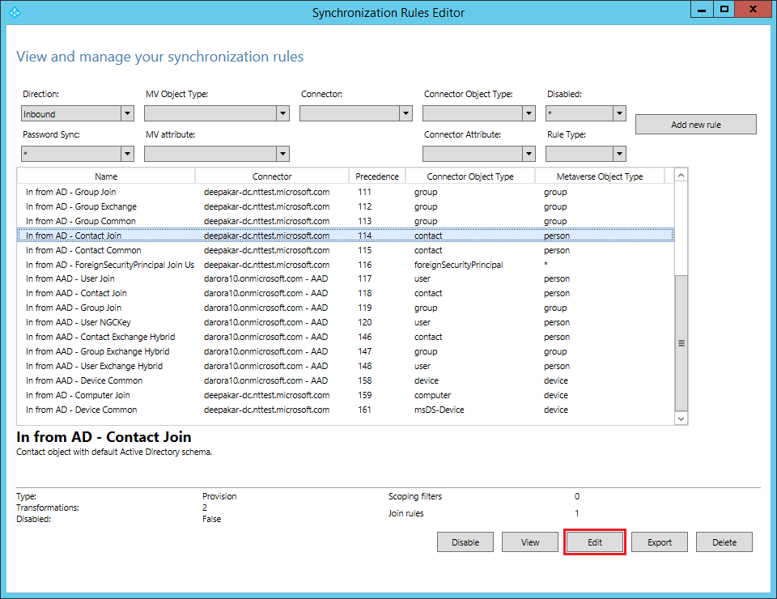

# How to customize a synchronization rule

## **Recommended Steps**

You can use the synchronization rule editor to edit or create a new synchronization rule. You need to be an advanced user to make changes to synchronization rules. Any wrong changes may result in deletion of objects from your target directory. Please read [Recommended Documents](#recommended-documents) to gain expertise in synchronization rules. To modify a synchronization rule go through following steps:

* Launch the synchronization editor from the application menu in desktop as shown below:

    

* In order to customize a default synchronization rule, clone the existing rule by clicking the “Edit” button on the Synchronization Rules Editor, which will create a copy of the standard default rule and disable it. Save the cloned rule with a precedence less than 100.  Precedence determines what rule wins(lower numeric value) a conflict resolution if there is an attribute flow conflict.

    

* When modifying a specific attribute, ideally you should only keep the modifying attribute in the cloned rule.  Then enable the default rule so that modified attribute comes from cloned rule and other attributes are picked from default standard rule. 

* Please note that in the case where the calculated value of the modified attribute is NULL in your cloned rule and is not NULL in the default standard rule then, the not NULL value will win and will replace the NULL value. If you don’t want a NULL value to be replace with a not NULL value then assign AuthoritativeNull in your cloned rule.

* To modify an **Outbound** rule, change filter from the synchronization rule editor.

## **Recommended Documents**
* [Azure AD Connect sync: Technical Concepts](https://docs.microsoft.com/azure/active-directory/hybrid/how-to-connect-sync-technical-concepts)
* [Azure AD Connect sync: Understanding the architecture](https://docs.microsoft.com/azure/active-directory/hybrid/concept-azure-ad-connect-sync-architecture)
* [Azure AD Connect sync: Understanding Declarative Provisioning](https://docs.microsoft.com/azure/active-directory/hybrid/concept-azure-ad-connect-sync-declarative-provisioning)
* [Azure AD Connect sync: Understanding Declarative Provisioning Expressions](https://docs.microsoft.com/azure/active-directory/hybrid/concept-azure-ad-connect-sync-declarative-provisioning-expressions)
* [Azure AD Connect sync: Understanding the default configuration](https://docs.microsoft.com/azure/active-directory/hybrid/concept-azure-ad-connect-sync-default-configuration)
* [Azure AD Connect sync: Understanding Users, Groups, and Contacts](https://docs.microsoft.com/azure/active-directory/hybrid/concept-azure-ad-connect-sync-user-and-contacts)
* [Azure AD Connect sync: Shadow attributes](https://docs.microsoft.com/azure/active-directory/hybrid/how-to-connect-syncservice-shadow-attributes)

## Next Steps
- [Azure AD Connect sync](how-to-connect-sync-whatis.md).
- [What is hybrid identity?](whatis-hybrid-identity.md).
