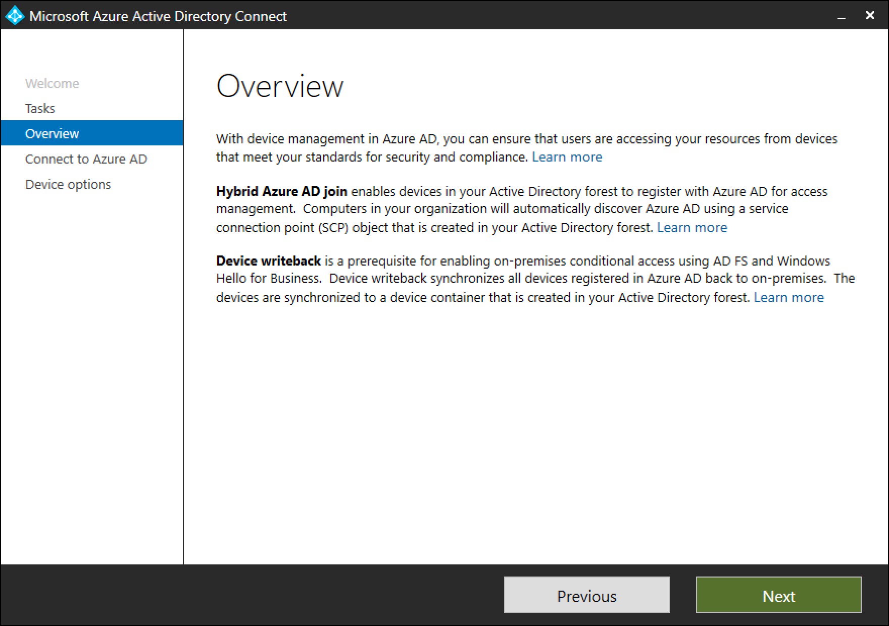

# Azure AD Connect: Device options

The following documentation provides information about the various device options available in Azure AD Connect. You can use Azure AD Connect to configure the following two operations: 
* **Hybrid Azure AD join**: If your environment has an on-premises AD footprint and you want the benefits of Azure AD, you can implement hybrid Azure AD joined devices. These devices are joined  both to your on-premises Active Directory, and your Azure Active Directory.
* **Device writeback**: Device writeback is used to enable Conditional Access based on devices to AD FS (2012 R2 or higher) protected devices

## Configure device options in Azure AD Connect

1.	Run Azure AD Connect. In the **Additional tasks** page, select **Configure device options**.  Click **Next**.
     

    The **Overview** page displays the details.
    

    >[!NOTE]
    > The new Configure device options is available only in version 1.1.819.0 and newer.

2.	After providing the credentials for Azure AD, you can chose the operation to be performed on the Device options page.
    

## Next steps

* [Configure Hybrid Azure AD join](../device-management-hybrid-azuread-joined-devices-setup.md)
* [Configure / Disable device writeback](how-to-connect-device-writeback.md)

