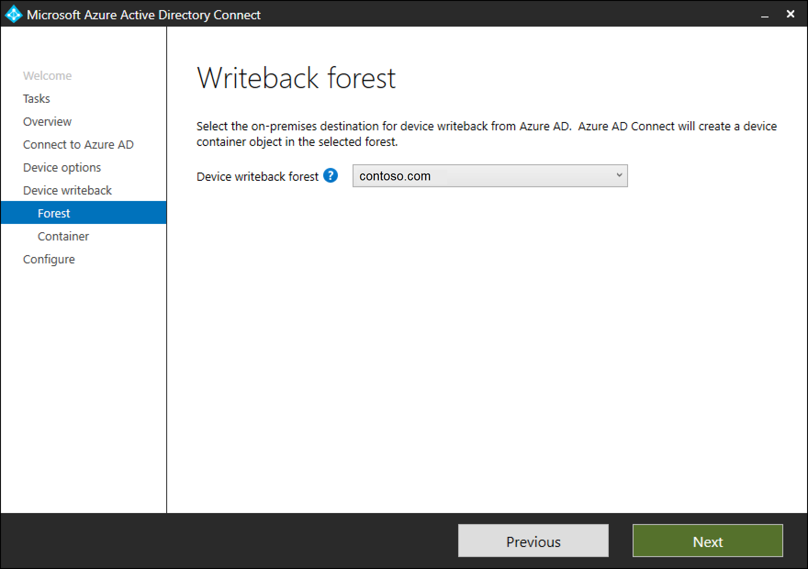
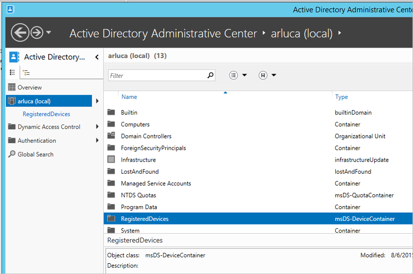
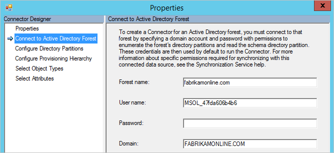
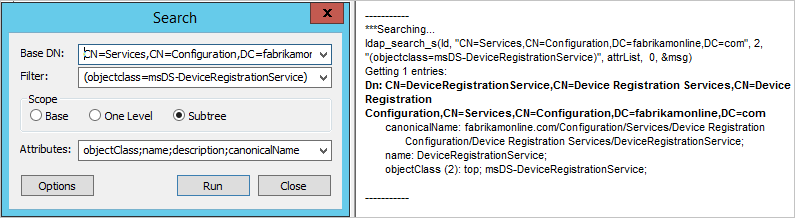
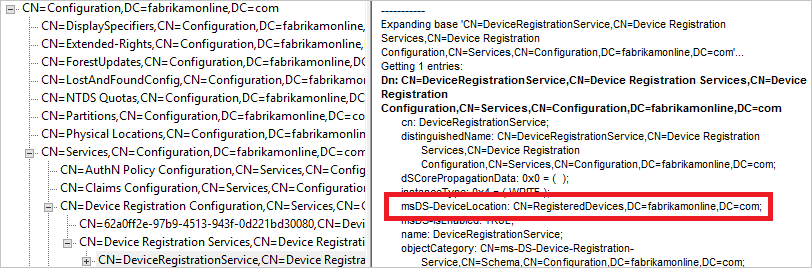

# Azure AD Connect: Enabling device writeback
> [!NOTE]
> A subscription to Azure AD Premium is required for device writeback.
> 
> 

The following documentation provides information on how to enable the device writeback feature in Azure AD Connect. Device Writeback is used in the following scenarios:

* Enable [Windows Hello for Business using hybrid certificate trust deployment](https://docs.microsoft.com/windows/security/identity-protection/hello-for-business/hello-hybrid-cert-trust-prereqs#device-registration)
* Enable Conditional Access based on devices to ADFS (2012 R2 or higher) protected applications (relying party trusts).

This provides additional security and assurance that access to applications is granted only to trusted devices. For more information on Conditional Access, see [Managing Risk with Conditional Access](../active-directory-conditional-access-azure-portal.md) and [Setting up On-premises Conditional Access using Azure Active Directory Device Registration](../../active-directory/active-directory-device-registration-on-premises-setup.md).

> [!IMPORTANT]
> <li>Devices must be located in the same forest as the users. Since devices must be written back to a single forest, this feature does not currently support a deployment with multiple user forests.</li>
> <li>Only one device registration configuration object can be added to the on-premises Active Directory forest. This feature is not compatible with a topology where the on-premises Active Directory is synchronized to multiple Azure AD directories.</li>

## Part 1: Install Azure AD Connect
Install Azure AD Connect using Custom or Express settings. Microsoft recommends to start with all users and groups successfully synchronized before you enable device writeback.

## Part 2: Enable device writeback in Azure AD Connect
1. Run the installation wizard again. Select **Configure device options** from the Additional Tasks page and click **Next**. 

    

    >[!NOTE]
    > The new Configure device options is available only in version 1.1.819.0 and newer.

2. On the device options page, select **Configure device writeback**. Option to **Disable device writeback** will not be available until device writeback is enabled. Click on **Next** to move to the next page in the wizard.
    

3. On the writeback page, you will see the supplied domain as the default Device writeback forest.
   

4. **Device container** page provides option of preparing the active directory by using one of the two available options:

    a. **Provide enterprise administrator credentials**: If the enterprise administrator credentials are provided for the forest where devices need to be written back, Azure AD Connect will prepare the forest automatically during the configuration of device writeback.

    b. **Download PowerShell script**: Azure AD Connect auto-generates a PowerShell script that can prepare the active directory for device writeback. In case the enterprise administrator credentials cannot be provided in Azure AD Connect, it is suggested to download the PowerShell script. Provide the downloaded PowerShell script **CreateDeviceContainer.psq** to the enterprise administrator of the forest where devices will be written back to.
    
    
    The following operations are performed for preparing the active directory forest:
    * If they do not exist already, creates and configures new containers and objects under CN=Device Registration Configuration,CN=Services,CN=Configuration,[forest-dn].
    * If they do not exist already, creates and configures new containers and objects under CN=RegisteredDevices,[domain-dn]. Device objects will be created in this container.
    * Sets necessary permissions on the Azure AD Connector account, to manage devices on your Active Directory.
    * Only needs to run on one forest, even if Azure AD Connect is being installed on multiple forests.

## Verify Devices are synchronized to Active Directory
Device writeback should now be working properly. Be aware that it can take up to 3 hours for device objects to be written-back to AD.  To verify that your devices are being synced properly, do the following after the sync rules complete:

1. Launch Active Directory Administrative Center.
2. Expand RegisteredDevices, within the Domain that is being federated.

   

3. Current registered devices will be listed there.

   

## Enable Conditional Access
Detailed instructions to enable this scenario are available within [Setting up On-premises Conditional Access using Azure Active Directory Device Registration](../../active-directory/active-directory-device-registration-on-premises-setup.md).

## Troubleshooting
### The writeback checkbox is still disabled
If the checkbox for device writeback is not enabled even though you have followed the steps above, the following steps will guide you through what the installation wizard is verifying before the box is enabled.

First things first:

* The forest where the devices are present must have the forest schema upgraded to Windows 2012 R2 level so that the device object and associated attributes are present .
* If the installation wizard is already running, then any changes will not be detected. In this case, complete the installation wizard and run it again.
* Make sure the account you provide in the initialization script is actually the correct user used by the Active Directory Connector. To verify this, follow these steps:
  * From the start menu, open **Synchronization Service**.
  * Open the **Connectors** tab.
  * Find the Connector with type Active Directory Domain Services and select it.
  * Under **Actions**, select **Properties**.
  * Go to **Connect to Active Directory Forest**. Verify that the domain and user name specified on this screen match the account provided to the script.
    

Verify configuration in Active Directory:

* Verify that the Device Registration Service is located in the location below (CN=DeviceRegistrationService,CN=Device Registration Services,CN=Device Registration Configuration,CN=Services,CN=Configuration) under configuration naming context.

* Verify there is only one configuration object by searching the configuration namespace. If there is more than one, delete the duplicate.

* On the Device Registration Service object, make sure the attribute msDS-DeviceLocation is present and has a value. Lookup this location and make sure it is present with the objectType msDS-DeviceContainer.

* Verify the account used by the Active Directory Connector has required permissions on the Registered Devices container found by the previous step. This is the expected permissions on this container:

* Verify the Active Directory account has permissions on the CN=Device Registration Configuration,CN=Services,CN=Configuration object.

## Additional Information
* [Managing Risk With Conditional Access](../active-directory-conditional-access-azure-portal.md)
* [Setting up On-premises Conditional Access using Azure Active Directory Device Registration](../../active-directory/active-directory-device-registration-on-premises-setup.md)

## Next steps
Learn more about [Integrating your on-premises identities with Azure Active Directory](whatis-hybrid-identity.md).

