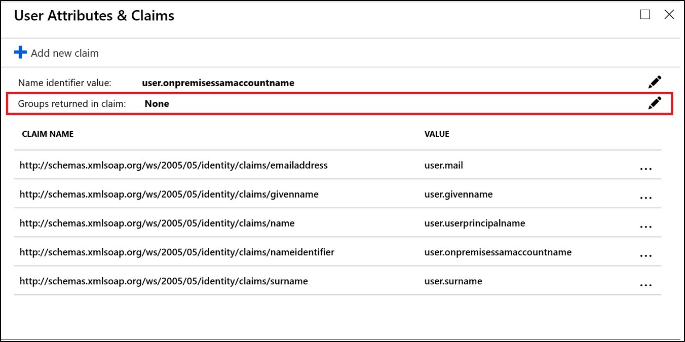
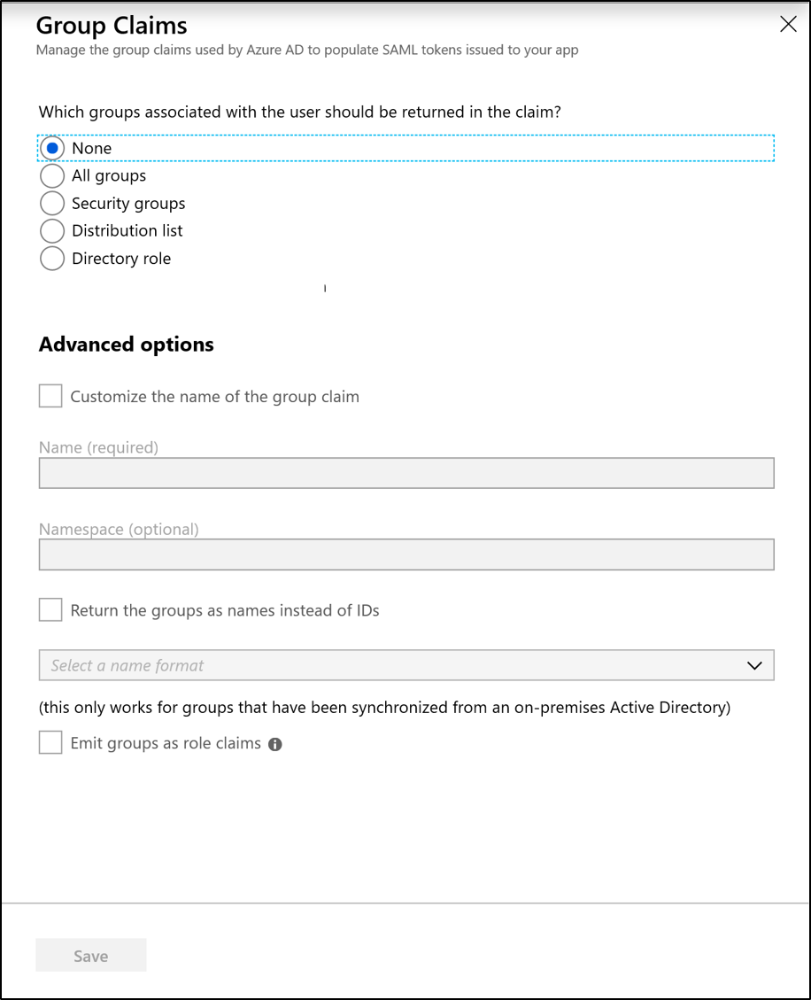
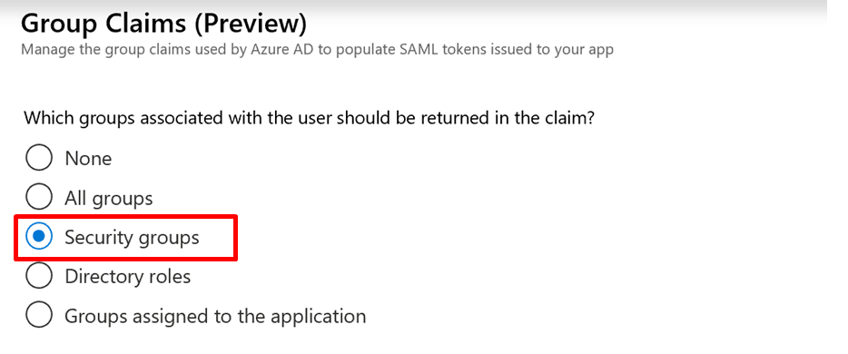
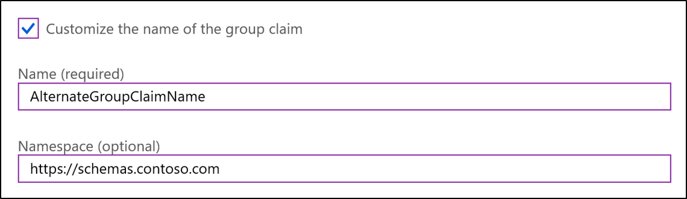
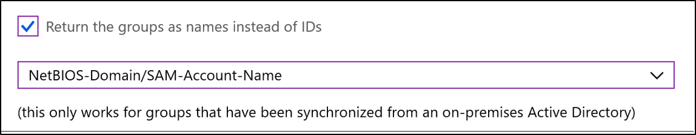
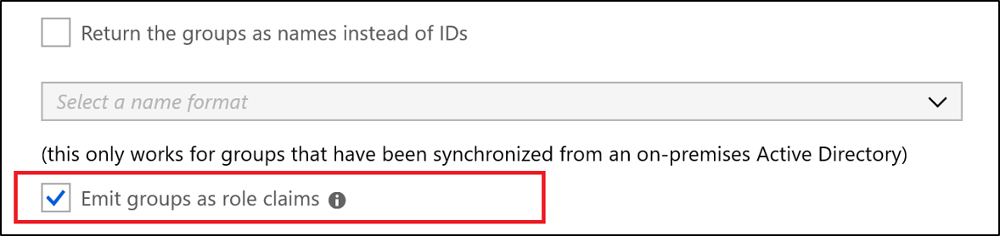

# Configure group claims for applications with Azure Active Directory (Public Preview)

Azure Active Directory can provide a users group membership information in tokens for use within applications.  Two main patterns are supported:

- Groups identified by their Azure Active Directory object identifier (OID) attribute (Generally Available)
- Groups identified by sAMAccountName or GroupSID attributes for Active Directory (AD) synchronized groups and users (Public Preview)

> [!IMPORTANT]
> There are a number of caveats to note for this preview functionality:
>
>- Support for use of sAMAccountName and security identifier (SID) attributes synced from on-premises is designed to enable moving existing applications from AD FS and other identity providers. Groups managed in Azure AD do not contain the attributes necessary to emit these claims.
>- In larger organizations the number of groups a user is a member of may exceed the limit that Azure Active Directory will add to a token. 150 groups for a SAML token, and 200 for a JWT. This can lead to unpredictable results. If this is a potential issue we recommend testing and if necessary waiting until we add enhancements to allow you to restrict the claims to the relevant groups for the application.  
>- For new application development, or in cases where the application can be configured for it, and where nested group support isn't required, we recommend that in-app authorization is based on application roles rather than groups.  This limits the amount of infomation that needs to go into the token, is more secure, and separates user assignment from app configuration.

## Group claims for applications migrating from AD FS and other identity providers

Many applications that are configured to authenticate with AD FS rely on group membership information in the form of Windows AD group attributes.   These attributes are the group sAMAccountName, which may be qualified by-domain name, or the Windows Group Security Identifier (GroupSID).  When the application is federated with AD FS, AD FS uses the TokenGroups function to retrieve the group memberships for the user.

To match the token an app would receive from AD FS, group and role claims may be emitted containing the domain qualified sAMAccountName rather than the group's Azure Active Directory objectID.

The supported formats for group claims are:

- **Azure Active Directory Group ObjectId** (Available for all groups)
- **sAMAccountName** (Available for groups synchronized from Active Directory)
- **NetbiosDomain\sAMAccountName** (Available for groups synchronized from Active Directory)
- **DNSDomainName\sAMAccountName** (Available for groups synchronized from Active Directory)
- **On Premises Group Security Identifier** (Available for groups synchronized from Active Directory)

> [!NOTE]
> sAMAccountName and On Premises Group SID attributes are only available on Group objects synced from Active Directory.   They aren't available on groups created in Azure Active Directory or Office365.   Applications configured in Azure Active Directory to get synced on-premises group attributes get them for synced groups only.

## Options for applications to consume group information

One way for applications to obtain group information is to call the Graph groups endpoint in order to retrieve the group membership for the authenticated user. This call ensures that all the groups a user is a member of are available even when there are a large number of groups involved and the application needs to enumerate all groups the user is a member of.  Group enumeration is then independent of token size limitations.

However, if an existing application already expects to consume group information via claims in the token it receives, Azure Active Directory can be configured with a number of different claims options to fit the needs of the application.  Consider the following options:

- When using group membership for in-application authorization purposes it’s preferable to use the Group ObjectID, which is immutable and unique in Azure Active Directory and available for all groups.
- If using the on-premises group sAMAccountName for authorization, use domain qualified names;  there’s less chance of situations arising were names clash. sAMAccountName on its own may be unique within an Active Directory domain, but if more than one Active Directory domain is synchronized with an Azure Active Directory tenant there is a possibility for more than one group to have the same name.
- Consider using [Application Roles](../../active-directory/develop/howto-add-app-roles-in-azure-ad-apps.md) to provide a layer of indirection between the group membership and the application.   The application then makes internal authorization decisions based on role clams in the token.
- If the application is configured to get group attributes that are synced from Active Directory and a Group doesn't contain those attributes it won't be included in the claims.
- Group claims in tokens include nested groups.   If a user is a member of GroupB and GroupB is a member of GroupA, then the group claims for the user will contain both GroupA and GroupB. For organizations with heavy usage of nested groups and users with large numbers of group memberships the number of groups listed in the token can grow the token size.   Azure Active Directory limits the number of groups it will emit in a token to 150 for SAML assertions, and 200 for JWT to prevent tokens getting too large.  If a user is a member of a larger number of groups than the limit, the groups are emitted and a link to the Graph endpoint to obtain group information.

> Prerequisites for using Group attributes synchronized from Active Directory:   The groups must be synchronized from Active Directory using Azure AD Connect.

There are two steps to configuring Azure Active Directory to emit group names for Active Directory Groups.

1. **Synchronize group names from Active Directory**
Before Azure Active Directory can emit the group names or on premises group SID in group or role claims, the required attributes need to be synchronized from Active Directory.  You must be running Azure AD Connect version 1.2.70 or later.   Prior to version 1.2.70 Azure AD Connect will synchronize the group objects from Active Directory, but doesn’t include the required group name attributes by default.  You should upgrade to the current version.

2. **Configure the application registration in Azure Active Directory to include group claims in tokens**
Group claims can be configured either in the Enterprise Applications section of the portal for a Gallery or Non-Gallery SAML SSO application, or using the Application Manifest in the Application Registrations section.  To configure group claims in the application manifest see “Configuring the Azure Active Directory Application Registration for group attributes” below.

## Configure group claims for SAML applications using SSO configuration

To configure Group Claims for a Gallery or Non-Gallery SAML application, open Enterprise Applications, click on the application in the list and select Single Sign On configuration.

Select the edit icon next to "Groups returned in token"



Use the radio buttons to select which groups should be included in the token



| Selection | Description |
|----------|-------------|
| **All groups** | Emits security groups and distribution lists.   It also causes Directory Roles the user is assigned to be emitted in a 'wids' claim, and any application roles the user is assigned to be emitted in the roles claim. |
| **Security groups** | Emits security groups the user is a member of in the groups claim |
| **Distribution lists** | Emits distribution lists the user is a member of |
| **Directory roles** | If the user is assigned directory roles they are emitted as a 'wids' claim (groups claim won't be emitted) |

For example, to emit all the Security Groups the user is a member of, select Security Groups



To emit groups using Active Directory attributes synced from Active Directory instead of Azure AD objectIDs select the required format from the drop-down.  This replaces the object ID in the claims with string values containing group names.   Only groups synchronized from Active Directory will be included in the claims.



### Advanced options

The way group claims are emitted can be modified by the settings under Advanced options

Customize the name of the group claim:  If selected, a different claim type can be specified for group claims.   Enter the claim type in the Name field and the optional namespace for the claim in the namespace field.



Some applications require the group membership information to appear in the 'role' claim. You can optionally emit the user's groups as roles by checking the 'Emit groups a role claims' box.



> [!NOTE]
> If the option to emit group data as roles is used, only groups will appear in the role claim.  Any Application Roles the user is assigned will not appear in the role claim.

## Configure the Azure AD Application Registration for group attributes

Group claims can also be configured in the [Optional Claims](../../active-directory/develop/active-directory-optional-claims.md) section of the [Application Manifest](../../active-directory/develop/reference-app-manifest.md).

1. In the portal ->Azure Active Directory -> Application Registrations->Select Application->Manifest

2. Enable group membership claims by changing the groupMembershipClaim

   The valid values are:

   - "All"
   - "SecurityGroup"
   - "DistributionList"
   - "DirectoryRole"

   For example:

   ```json
   "groupMembershipClaims": "SecurityGroup"
   ```

   By default Group ObjectIDs will be emitted in the group claim value.  To modify the claim value to contain on premises group attributes, or to change the claim type to role, use OptionalClaims configuration as follows:

3. Set group name configuration optional claims.

   If you want the groups in the token to contain the on premises AD group attributes in the optional claims section specify which token type optional claim should be applied to, the name of optional claim requested and any additional properties desired.  Multiple token types can be listed:

   - idToken for the OIDC ID token
   - accessToken for the OAuth/OIDC access token
   - Saml2Token for SAML tokens.

   > [!NOTE]
   > The Saml2Token type applies to both SAML1.1 and SAML2.0 format tokens

   For each relevant token type, modify the groups claim to use the OptionalClaims section in the manifest. The OptionalClaims schema is as follows:

   ```json
   {
   "name": "groups",
   "source": null,
   "essential": false,
   "additionalProperties": []
   }
   ```

   | Optional Claims Schema | Value |
   |----------|-------------|
   | **name:** | Must be "groups" |
   | **source:** | Not used. Omit or specify null |
   | **essential:** | Not used. Omit or specify false |
   | **additionalProperties:** | List of additional properties.  Valid options are "sam_account_name", “dns_domain_and_sam_account_name”, “netbios_domain_and_sam_account_name”, "emit_as_roles" |

   In additionalProperties only one of "sam_account_name", “dns_domain_and_sam_account_name”, “netbios_domain_and_sam_account_name” are required.  If more than one is present, the first is used and any others ignored.

   Some applications require group information about the user in the role claim.  To change the claim type to from a group claim to a role claim, add “emit_as_roles” to additional properties.  The group values will be emitted in the role claim.

   > [!NOTE]
   > If "emit_as_roles" is used any Application Roles configured that the user is assigned will not appear in the role claim

### Examples

Emit groups as group names in OAuth access tokens in dnsDomainName\SAMAccountName format

```json
"optionalClaims": {
    "accessToken": [{
        "name": "groups",
        "additionalProperties": ["dns_domain_and_sam_account_name"]
    }]
}
 ```

To emit group names to be returned in netbiosDomain\samAccountName format as the roles claim in SAML and OIDC ID Tokens:

```json
"optionalClaims": {
    "saml2Token": [{
        "name": "groups",
        "additionalProperties": ["netbios_name_and_sam_account_name", "emit_as_roles"]
    }],

    "idToken": [{
        "name": "groups",
        "additionalProperties": ["netbios_name_and_sam_account_name", "emit_as_roles"]
    }]
 }
 ```

## Next steps

[What is hybrid identity?](whatis-hybrid-identity.md)
