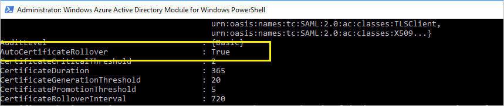

# Renew federation certificates for Office 365 and Azure Active Directory
## Overview
For successful federation between Azure Active Directory (Azure AD) and Active Directory Federation Services (AD FS), the certificates used by AD FS to sign security tokens to Azure AD should match what is configured in Azure AD. Any mismatch can lead to broken trust. Azure AD ensures that this information is kept in sync when you deploy AD FS and Web Application Proxy (for extranet access).

This article provides you additional information to manage your token signing certificates and keep them in sync with Azure AD, in the following cases:

* You are not deploying the Web Application Proxy, and therefore the federation metadata is not available in the extranet.
* You are not using the default configuration of AD FS for token signing certificates.
* You are using a third-party identity provider.

## Default configuration of AD FS for token signing certificates
The token signing and token decrypting certificates are usually self-signed certificates, and are good for one year. By default, AD FS includes an auto-renewal process called **AutoCertificateRollover**. If you are using AD FS 2.0 or later, Office 365 and Azure AD automatically update your certificate before it expires.

### Renewal notification from the Microsoft 365 admin center or an email
> [!NOTE]
> If you received an email or a portal notification asking you to renew your certificate for Office, see [Managing changes to token signing certificates](#managecerts) to check if you need to take any action. Microsoft is aware of a possible issue that can lead to notifications for certificate renewal being sent, even when no action is required.
>
>

Azure AD attempts to monitor the federation metadata, and update the token signing certificates as indicated by this metadata. 30 days before the expiration of the token signing certificates, Azure AD checks if new certificates are available by polling the federation metadata.

* If it can successfully poll the federation metadata and retrieve the new certificates, no email notification or warning in the Microsoft 365 admin center is issued to the user.
* If it cannot retrieve the new token signing certificates, either because the federation metadata is not reachable or automatic certificate rollover is not enabled, Azure AD issues an email notification and a warning in the Microsoft 365 admin center.


> [!IMPORTANT]
> If you are using AD FS, to ensure business continuity, please verify that your servers have the following updates so that authentication failures for known issues do not occur. This mitigates known AD FS proxy server issues for this renewal and future renewal periods:
>
> Server 2012 R2 - [Windows Server May 2014 rollup](https://support.microsoft.com/kb/2955164)
>
> Server 2008 R2 and 2012 - [Authentication through proxy fails in Windows Server 2012 or Windows 2008 R2 SP1](https://support.microsoft.com/kb/3094446)
>
>

## Check if the certificates need to be updated <a name="managecerts"></a>
### Step 1: Check the AutoCertificateRollover state
On your AD FS server, open PowerShell. Check that the AutoCertificateRollover value is set to True.

```azurepowershell-interactive
Get-Adfsproperties
```



>[!NOTE] 
>If you are using AD FS 2.0, first run Add-Pssnapin Microsoft.Adfs.Powershell.

### Step 2: Confirm that AD FS and Azure AD are in sync
On your AD FS server, open the MSOnline PowerShell prompt, and connect to Azure AD.

> [!NOTE]
> MSOL-Cmdlets are part of the MSOnline PowerShell module.
> You can download the MSOnline PowerShell Module directly from the PowerShell Gallery.
> 
>

```azurepowershell-interactive
Install-Module MSOnline
```

Connect to Azure AD using the MSOnline PowerShell-Module.

```azurepowershell-interactive
Import-Module MSOnline
Connect-MsolService
```

Check the certificates configured in AD FS and Azure AD trust properties for the specified domain.

```azurepowershell-interactive
Get-MsolFederationProperty -DomainName <domain.name> | FL Source, TokenSigningCertificate
```


If the thumbprints in both the outputs match, your certificates are in sync with Azure AD.

### Step 3: Check if your certificate is about to expire
In the output of either Get-MsolFederationProperty or Get-AdfsCertificate, check for the date under "Not After." If the date is less than 30 days away, you should take action.

| AutoCertificateRollover | Certificates in sync with Azure AD | Federation metadata is publicly accessible | Validity | Action |
|:---:|:---:|:---:|:---:|:---:|
| Yes |Yes |Yes |- |No action needed. See [Renew token signing certificate automatically](#autorenew). |
| Yes |No |- |Less than 15 days |Renew immediately. See [Renew token signing certificate manually](#manualrenew). |
| No |- |- |Less than 30 days |Renew immediately. See [Renew token signing certificate manually](#manualrenew). |

\[-]  Does not matter

## Renew the token signing certificate automatically (recommended) <a name="autorenew"></a>
You don't need to perform any manual steps if both of the following are true:

* You have deployed Web Application Proxy, which can enable access to the federation metadata from the extranet.
* You are using the AD FS default configuration (AutoCertificateRollover is enabled).

Check the following to confirm that the certificate can be automatically updated.

**1. The AD FS property AutoCertificateRollover must be set to True.** This indicates that AD FS will automatically generate new token signing and token decryption certificates, before the old ones expire.

**2. The AD FS federation metadata is publicly accessible.** Check that your federation metadata is publicly accessible by navigating to the following URL from a computer on the public internet (off of the corporate network):

https://(your_FS_name)/federationmetadata/2007-06/federationmetadata.xml

where `(your_FS_name)` is replaced with the federation service host name your organization uses, such as fs.contoso.com.  If you are able to verify both of these settings successfully, you do not have to do anything else.  

Example: `https://fs.contoso.com/federationmetadata/2007-06/federationmetadata.xml`
## Renew the token signing certificate manually <a name="manualrenew"></a>
You may choose to renew the token signing certificates manually. For example, the following scenarios might work better for manual renewal:

* Token signing certificates are not self-signed certificates. The most common reason for this is that your organization manages AD FS certificates enrolled from an organizational certificate authority.
* Network security does not allow the federation metadata to be publicly available.

In these scenarios, every time you update the token signing certificates, you must also update your Office 365 domain by using the PowerShell command, Update-MsolFederatedDomain.

### Step 1: Ensure that AD FS has new token signing certificates
**Non-default configuration**

If you are using a non-default configuration of AD FS (where **AutoCertificateRollover** is set to **False**), you are probably using custom certificates (not self-signed). For more information about how to renew the AD FS token signing certificates, see [Guidance for customers not using AD FS self-signed certificates](https://msdn.microsoft.com/library/azure/JJ933264.aspx#BKMK_NotADFSCert).

**Federation metadata is not publicly available**

On the other hand, if **AutoCertificateRollover** is set to **True**, but your federation metadata is not publicly accessible, first make sure that new token signing certificates have been generated by AD FS. Confirm you have new token signing certificates by taking the following steps:

1. Verify that you are logged on to the primary AD FS server.
2. Check the current signing certificates in AD FS by opening a PowerShell command window, and running the following command:

    PS C:\>Get-ADFSCertificate –CertificateType token-signing

   > [!NOTE]
   > If you are using AD FS 2.0, you should run Add-Pssnapin Microsoft.Adfs.Powershell first.
   >
   >
3. Look at the command output at any certificates listed. If AD FS has generated a new certificate, you should see two certificates in the output: one for which the **IsPrimary** value is **True** and the **NotAfter** date is within 5 days, and one for which **IsPrimary** is **False** and **NotAfter** is about a year in the future.
4. If you only see one certificate, and the **NotAfter** date is within 5 days, you need to generate a new certificate.
5. To generate a new certificate, execute the following command at a PowerShell command prompt: `PS C:\>Update-ADFSCertificate –CertificateType token-signing`.
6. Verify the update by running the following command again: PS C:\>Get-ADFSCertificate –CertificateType token-signing

Two certificates should be listed now, one of which has a **NotAfter** date of approximately one year in the future, and for which the **IsPrimary** value is **False**.

### Step 2: Update the new token signing certificates for the Office 365 trust
Update Office 365 with the new token signing certificates to be used for the trust, as follows.

1. Open the Microsoft Azure Active Directory Module for Windows PowerShell.
2. Run $cred=Get-Credential. When this cmdlet prompts you for credentials, type your cloud service administrator account credentials.
3. Run Connect-MsolService –Credential $cred. This cmdlet connects you to the cloud service. Creating a context that connects you to the cloud service is required before running any of the additional cmdlets installed by the tool.
4. If you are running these commands on a computer that is not the AD FS primary federation server, run Set-MSOLAdfscontext -Computer &lt;AD FS primary server&gt;, where &lt;AD FS primary server&gt; is the internal FQDN name of the primary AD FS server. This cmdlet creates a context that connects you to AD FS.
5. Run Update-MSOLFederatedDomain –DomainName &lt;domain&gt;. This cmdlet updates the settings from AD FS into the cloud service, and configures the trust relationship between the two.

> [!NOTE]
> If you need to support multiple top-level domains, such as contoso.com and fabrikam.com, you must use the **SupportMultipleDomain** switch with any cmdlets. For more information, see [Support for Multiple Top Level Domains](how-to-connect-install-multiple-domains.md).
>


## Repair Azure AD trust by using Azure AD Connect <a name="connectrenew"></a>
If you configured your AD FS farm and Azure AD trust by using Azure AD Connect, you can use Azure AD Connect to detect if you need to take any action for your token signing certificates. If you need to renew the certificates, you can use Azure AD Connect to do so.

For more information, see [Repairing the trust](how-to-connect-fed-management.md).

## AD FS and Azure AD certificate update steps
Token signing certificates are standard X509 certificates that are used to securely sign all tokens that the federation server issues. Token decryption certificates are standard X509 certificates that are used to decrypt any incoming tokens. 

By default, AD FS is configured to generate token signing and token decryption certificates automatically, both at the initial configuration time and when the certificates are approaching their expiration date.

Azure AD tries to retrieve a new certificate from your federation service metadata 30 days before the expiry of the current certificate. In case a new certificate is not available at that time, Azure AD will continue to monitor the metadata on regular daily intervals. As soon as the new certificate is available in the metadata, the federation settings for the domain are updated with the new certificate information. You can use `Get-MsolDomainFederationSettings` to verify if you see the new certificate in the NextSigningCertificate / SigningCertificate.

For more information on Token Signing certificates in AD FS see [Obtain and Configure Token Signing and Token Decryption Certificates for AD FS](https://docs.microsoft.com/windows-server/identity/ad-fs/operations/configure-ts-td-certs-ad-fs)
