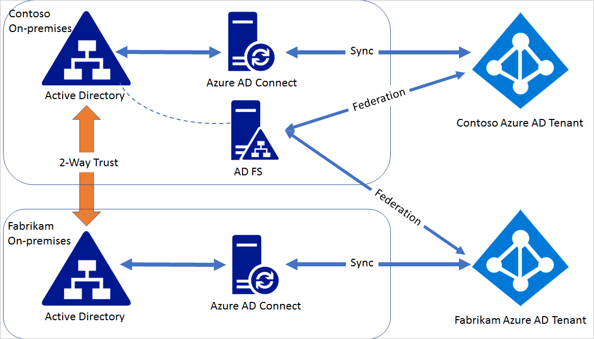

# Federate multiple instances of Azure AD with single instance of AD FS

A single high available AD FS farm can federate multiple forests if they have 2-way trust between them. These multiple forests may or may not correspond to the same Azure Active Directory. This article provides instructions on how to configure federation between a single AD FS deployment and more than one forests that sync to different Azure AD.

 
> [!NOTE]
> Device writeback and automatic device join are not supported in this scenario.

> [!NOTE]
> Azure AD Connect cannot be used to configure federation in this scenario as Azure AD Connect can configure federation for domains in a single Azure AD.

## Steps for federating AD FS with multiple Azure AD

Consider a domain contoso.com in Azure Active Directory contoso.onmicrosoft.com is already federated with the AD FS on-premises installed in contoso.com on-premises Active Directory environment. Fabrikam.com is a domain in fabrikam.onmicrosoft.com Azure Active Directory.

## Step 1: Establish a two-way trust
 
For AD FS in contoso.com to be able to authenticate users in fabrikam.com, a two-way trust is needed between contoso.com and fabrikam.com. Follow the guideline in this [article](https://technet.microsoft.com/library/cc816590.aspx) to create the two-way trust.
 
## Step 2: Modify contoso.com federation settings 
 
The default issuer set for a single domain federated to AD FS is "http\://ADFSServiceFQDN/adfs/services/trust", for example, `http://fs.contoso.com/adfs/services/trust`. Azure Active Directory requires unique issuer for each federated domain. Since the same AD FS is going to federate two domains, the issuer value needs to be modified so that it is unique for each domain AD FS federates with Azure Active Directory. 
 
On the AD FS server, open Azure AD PowerShell (ensure that the MSOnline module is installed) and perform the following steps:
 
Connect to the Azure Active Directory that contains the domain contoso.com
    Connect-MsolService
Update the federation settings for contoso.com
    Update-MsolFederatedDomain -DomainName contoso.com –SupportMultipleDomain
 
Issuer in the domain federation setting will be changed to "http\://contoso.com/adfs/services/trust" and an issuance claim rule will be added for the Azure AD Relying Party Trust to issue the correct issuerId value based on the UPN suffix.
 
## Step 3: Federate fabrikam.com with AD FS
 
In Azure AD powershell session perform the following steps:
Connect to Azure Active Directory that contains the domain fabrikam.com

    Connect-MsolService
Convert the fabrikam.com managed domain to federated:

    Convert-MsolDomainToFederated -DomainName fabrikam.com -Verbose -SupportMultipleDomain
 
The above operation will federate the domain fabrikam.com with the same AD FS. You can verify the domain settings by using Get-MsolDomainFederationSettings for both domains.

## Next steps
[Connect Active Directory with Azure Active Directory](whatis-hybrid-identity.md)
