# Fix modified default rules in Azure AD Connect

Azure AD Connect ships with default rules for synchronization.  Unfortunately these rules do not apply universally to all organizations and there may be times, based on your requirements, when you need to modify them.

 If you have modified the default rules or are planning to modify them, then please take a moment to read this document.

This document presents 2 examples of the most common customizations done by users and explains the correct way to achieve these customizations.

>[!NOTE] 
> Modifying existing default rule(s) to achieve a needed customization is not supported - by doing this you will prevent updating these rules to the latest version in future releases. This will prevent you getting needed bug fixes and new features.  This document will explain how to achieve the same result without modifying the existing default rules. 

## How to identify modified default rules?
Starting with version 1.3.7.0 of **Azure AD Connect**, it is now easy to identify the modified default rule. You can go to Apps on Desktop and click on **Synchronization Rules Editor**.

In the Editor, any modified default rules will be shown with an icon in front of the name as shown below:

 Also you will see a disabled rule with same name next to it which is the standard default rule:

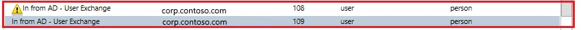

## Common customizations
The following are common customizations to the default rules:

- [Changing attribute flow](#changing-attribute-flow)
- [Changing scoping filter](#changing-scoping-filter)
- [Changing join condition](#changing-join-condition)

## Before changing any rules
- Disable the sync scheduler.  The scheduler runs every 30 minutes by default. Make sure it is not starting while you are making changes and troubleshooting your new rules. To temporarily disable the scheduler, start PowerShell and run `Set-ADSyncScheduler -SyncCycleEnabled $false`.
 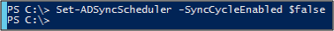

- The change in scoping filter may result in deletion of objects in the target directory. Please be careful before making any changes in the scoping of objects. It’s recommended to make changes to a staging server before making changes on the active server.
- Please run a preview on a single object as mentioned in [Validate Sync Rule](#validate-sync-rule) section, after adding any new Rule.
- Please run a full sync after adding a new rule or modifying any custom sync rule. This sync will apply new rules to all the objects.

## Changing attribute flow
There are 3 different scenarios for the attribute flow, let’s look at how to achieve it without altering standard default rules.
- Adding new attribute
- Overriding value of existing attribute
- Don’t sync existing attribute

### Adding new attribute:
If you find that an attribute is not flowing from your source directory to the target directory then you can use the [Azure AD Connect sync: Directory extensions](how-to-connect-sync-feature-directory-extensions.md) to flow the new attributes.

Please note that your first choice should be to use [Azure AD Connect sync: Directory extensions](how-to-connect-sync-feature-directory-extensions.md), an out of box feature provided by Azure AD Connect. However, if it didn’t work for you then go through following steps to flow an attribute without modifying existing standard default sync rule, you can do this by adding two new sync rules.

#### Add an inbound sync rule:
Inbound sync rule means the source for the attribute is a connector space and target is metaverse. For example, to flow a new attribute from on-premises Active Directory to Azure Active Directory, create a new inbound sync rule by launching the **Synchronization Rule Editor**, then select Direction as **Inbound** and click **Add new rule**. 

 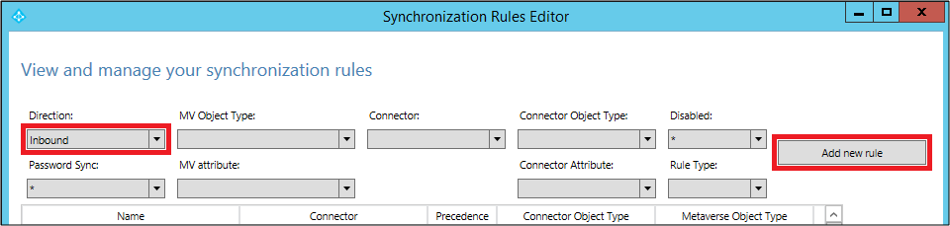

Follow your own naming convention to name the rule, here we used **Custom In from AD - User**, this means that the rule is a custom rule and is an inbound rule from AD connector space to the Metaverse.   

 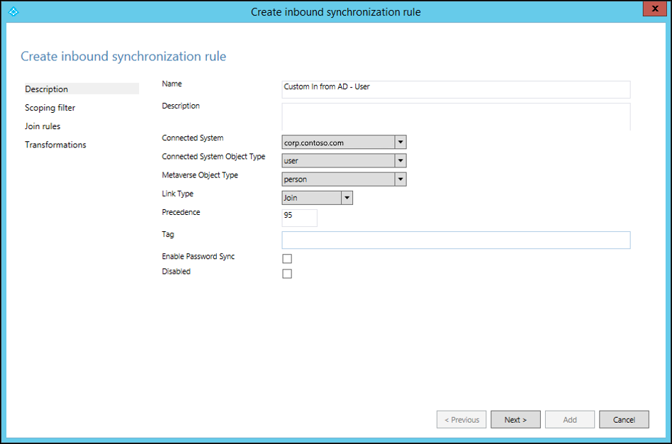

Give your own description of the rule so that the future maintenance of the rule is easy, like what’s the objective of this rule and why it was needed.
Select a Connected System (the forest) - the attribute source. Then, select the Connected System Object Type and the Metaverse Object Type.

Specify the precedence value between 0 – 99 (lower the number, higher the precedence). Keep other fields like ‘Tag’, ‘Enable Password Sync’ and ‘Disabled’ as default.

Keep ‘Scoping filter’ empty, this means that the rule will apply to all the objects joined between AD Connected System and Metaverse.

Keep the ‘Join rules’ empty which means this rule will piggyback on the join condition defined in the standard default rule. This is another reason not to disable/delete the standard default rule because if there is no join condition to piggyback then the attribute will not flow. 

Add appropriate transformation for your attribute, you can assign constant to flow a constant value to your target attribute, or direct mapping between source or target attribute, or an expression for the attribute. Here are various [expression functions](https://docs.microsoft.com/azure/active-directory/hybrid/reference-connect-sync-functions-reference) you can use.

#### Add an outbound sync rule:
So far by adding just an inbound sync rule we have done half the work, because the attribute is not yet linked to the target directory. To link the attribute to the target director you need to create an outbound rule, which means source is metaverse and the target is connected system. To create an outbound rule, launch **Synchronization Rule Editor**, change the **Direction** to **Outbound** and click **Add new rule**. 

As in the inbound rule, you can use your own naming convention to **Name** the rule. Select the **Connected System** as Azure AD tenant, select the connected system object to which you want to set the attribute value. Set the precedence between 0 - 99. 

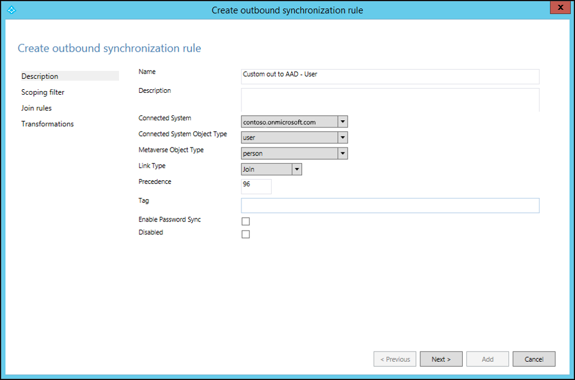

Keep **Scoping filter** empty, keep **Join rules** empty, fill in the transformation as Constant, Direct or expression. 

In this example we have demonstrated how to flow new attribute for a user object from Active Directory to Azure Active Directory. You can use these steps to map any attribute from any object to source and target.  For more information see [Creating custom sync rules](how-to-connect-create-custom-sync-rule.md) and [Prepare to provision users](https://docs.microsoft.com/office365/enterprise/prepare-for-directory-synchronization).

### Overriding value of existing attribute
It’s possible that you want to override the value of already mapped attribute, for example you always want to set Null value to an attribute in Azure AD, you can do this by simply creating only an inbound rule as mentioned in previous step and flow **AuthoritativeNull** constant value for the target attribute. Please note that we have used AuthoritativeNulll instead of Null in this case. This is because the non-null value will replace the Null value even if it has lower precedence (higher number value in the rule). However, the AuthoritativeNull will be treated as Null and will not be replaced with non-null value by other rules. 

### Don’t sync existing attribute
If you want to exclude an attribute from syncing, then you can use the attribute filtering feature provided in Azure AD Connect. Launch **Azure AD Connect** from desktop icon, and then select **Customize synchronization options**.

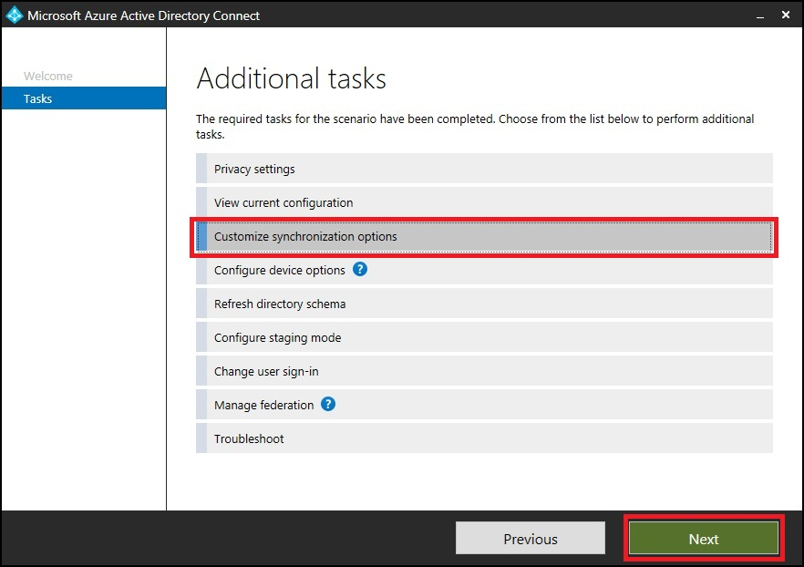

 Make sure **Azure AD app and attribute filtering** is selected and click **Next**.

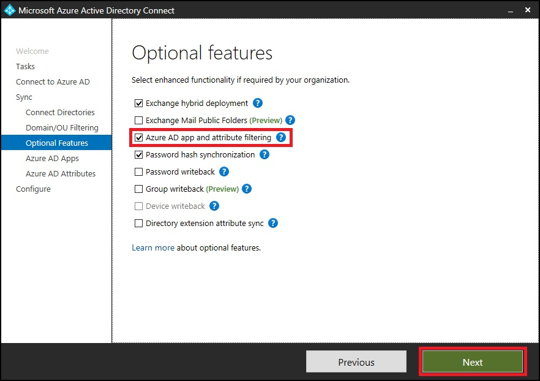

Uncheck the attributes that you want to exclude from syncing.

## Changing scoping filter
Azure AD Sync takes care of most of the objects, you can reduce the scope of objects and reduce it fewer objects to be exported in a supported manner without changing the standard default sync rules. In case you want to increase the scope of objects then you can **Edit** the existing rule, clone it and disable the original rule. Microsoft recommends you not to increase the scope configured by Azure AD Connect. Increase in scope of objects will make it hard for support team to understand the customizations and support the product.

Here is how you can reduce the scope of objects synced to Azure AD. Please note that if you reduce the scope of the **users** being synced then the password hash syncing will also stop for the filtered-out users. If the objects are already syncing, then after reducing scope, the filtered-out objects will be deleted from the target directory, please work on scoping very carefully.
Here are the supported ways to reduce the scope of the objects you are syncing.

- [cloudFiltered attribute](#cloudfiltered-attribute)
- [OU filtering](#ou-filtering)

### cloudFiltered attribute
Please note that this is not an attribute which can be set in Active Directory. You need to set the value of this attribute by adding a new inbound rule as mentioned in **Overriding value of existing attribute** section. You can then use the **Transformation** and use **Expression** to set this attribute in the Metaverse. Here is an example that you don’t want to sync all the user’s whose department name starts with case insensitive **HRD**:

`cloudFiltered <= IIF(Left(LCase([department]), 3) = "hrd", True, NULL)`

We have first converted the department from source (Active Directory) to lower case. Then using Left function, we took only first 3 characters and compared it with hrd. If it matched, then set the value to True otherwise NULL. Please note that we are setting the value NULL, so that some other rule with lower precedence (higher number value) can write to it with different condition. Please run preview on one object to validate sync rule as mentioned in [Validate Sync Rule](#validate-sync-rule) section.

### OU Filtering
You can create one or more OUs and move the objects you don’t want to sync to these OUs. Then configure the OU filtering in Azure AD Connect by launching **Azure AD Connect** from the desktop icon and select the options as shown below. You can also configure the OU filtering at the time of installation of Azure AD Connect. 

Follow the wizard and then unselect the OUs you don’t want to sync.

## Changing join condition
Microsoft recommends you that you use the default join conditions configured by Azure AD Connect. Changing default join conditions will make it hard for support team to understand the customizations and support the product.

## Validate sync rule
You can validate the newly added sync rule by using the preview feature without running full sync cycle. Launch **Synchronization Service** UI.

Click on the **Metaverse Search**, select scope object as **person**, **Add Clause** and mention your search criteria. Click on **Search** button and double-click on the object in the **Search Results** Please note that you run the import and sync on the forest before you run this step, this is to ensure the data in Azure AD Connect is up-to-date for that object.

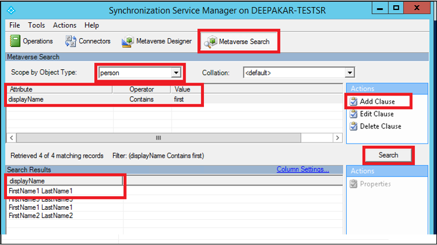

Select **Connectors**, select the object in corresponding connector(forest), click **Properties…**.

Click on the **Preview…**

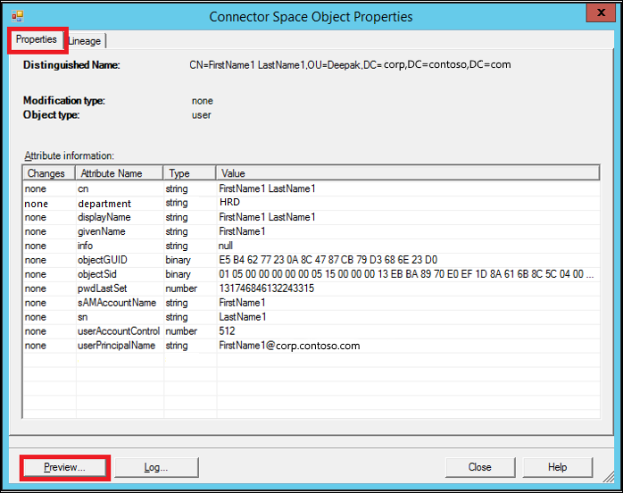

Click on **Generate Preview** and **Import Attribute Flow** in the left pane.

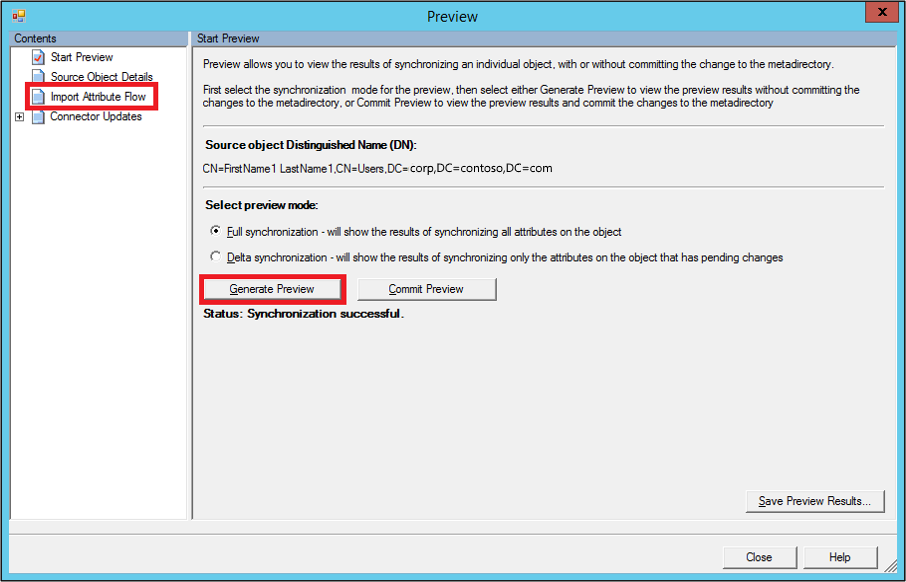
 
Here you will notice that the newly added rule is run on the object and has set the cloudFiltered attribute to True.

 
How to compare modified rule with default rule?
You can export both the rules separately as text files. These rules will be exported as powershell script file. You can compare them using any file comparison tool to see what kind of changes are done. Here in this example I used windiff to compare two files.
 
You can notice that in user modified rule, msExchMailboxGuid attribute is changed to **Expression** type instead of **Direct** with value as **NULL** and **ExecuteOnce** option. You can ignore Identified and Precedence differences. 

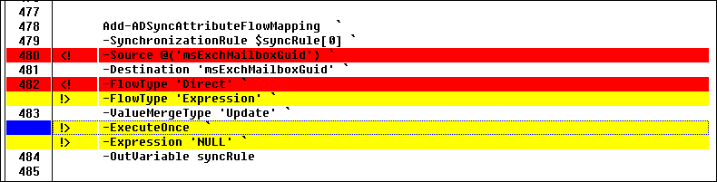
 
How to fix a modified default rule?
To fix your rules to default settings, you can delete the modified rule and enable the default rule as shown below and then run a **Full Synchronization**. Before doing that please take corrective actions as mentioned above so that you don’t lose the customization you are trying to achieve## Next Steps

## Next Steps
- [Hardware and prerequisites](how-to-connect-install-prerequisites.md) 
- [Express settings](how-to-connect-install-express.md)
- [Customized settings](how-to-connect-install-custom.md)

