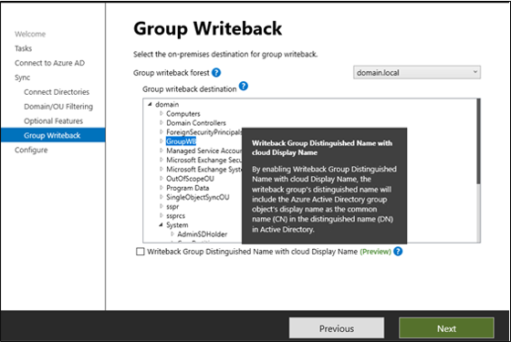

# Azure AD Connect group writeback

Group Writeback is the feature that allows you to write cloud groups back to your on-premises Active Directory using the Azure AD Connect Sync client. This feature enables you to manage groups in the cloud, while controlling access to on-premises applications and resources.  Group Writeback  provides the following capabilities: 
  1. Microsoft 365 groups can be written as Distribution groups, Security groups, or Mail-Enabled Security groups.  
  2. Azure AD Security groups will be written back as Security groups.  
  3. All groups are written back to AD as scope universal. 
  4. Allows you to configure group writeback settings for all M365 groups within a tenant.  
  5. Nested cloud groups and devices, (if device writeback is also enabled) that are members of groups, enabled for writeback, will be written back with scope universal. 
  6. Now, you can change the common name in an Active Directory group’s distinguished name when configuring group writeback in Azure AD Connect. 
  7. You can now configure Azure AD groups to writeback using the Azure AD Admin portal, Graph Explorer, and PowerShell. 

The following document will walk you through how you can enable Group Writeback . 


>[!NOTE]
>This document covers Azure AD Connect group writeback version 2.0. To take advantage of the new features you will need to deploy [Azure AD Connect version from 2021 December or later (2.0.89.0)](https://www.microsoft.com/download/details.aspx?id=47594).


## Pre-requisites

The following pre-requisites must be met in order to enable group writeback.

- Azure AD Premium license
- Azure AD Connect version 2021 December release or later.  
- Enable Azure AD Connect group writeback
- **Optional** - On-Prem Exchange Server 2016 CU15 or later.  Only needed for configuring cloud groups with exchange hybrid - optional.  See [Configure Microsoft 365 Groups with on-premises Exchange hybrid](/exchange/hybrid-deployment/set-up-microsoft-365-groups#prerequisites) for more information. If you don't have Exchange hybrid and/or an on-premises Exchange Server, the mail components of a group won't be written back.

The latest version of Group Writeback is enabled tenant-wide and not per Azure AD Connect server. The default values for writeback settings on cloud groups are backward compatible. 

## Deployment guidance
You will need to deploy [Azure AD Connect version from 2021 December or later (2.0.89.0)](https://www.microsoft.com/download/details.aspx?id=47594) to use the latest version of the group writeback feature. Older builds of Azure AD Connect don't support the new version of Group Writeback and will write back Microsoft 365 groups only as Distribution lists, when Group Writeback is enabled.      

It's recommended that you follow the [swing migration](how-to-upgrade-previous-version.md#swing-migration) method for rolling out the new group writeback feature in your environment. This method will provide a clear contingency plan in the event, that a major rollback is necessary.

>[!NOTE]  
> If you are using an older build of group writeback in Azure AD Connect, the M365 groups being written back as universal distribution groups, will continue to be written back.  The new version of group writeback is backwards compatible.   

## Enable group writeback
Enabling group writeback's new features is a two step process.  One step is done via Azure AD Connect.  This step enables the original group writeback features.  The second one is done using PowerShell and enables the new writeback features once the original features are enabled.  To enable group writeback complete the steps in the table below

Steps|Description|
|-----|-----|
|[Enable group writeback using Azure AD Connect](#enable-group-writeback-using-azure-ad-connect)|Enables group writeback with the original features included in Azure AD Connect.  That is, it will writeback M365 groups as distribution groups. This option is **only** available if you have Exchange present in your on-premises Active Directory.|
|[Enabling group writeback using PowerShell](#enable-group-writeback-using-powershell)|Enables the new group writeback features outlined in this article.

>[!NOTE]
>You must enable group writeback via Azure AD Connect before enabling group writeback via PowerShell to receive the new features outlined in this article.  You must do both and in the correct order.

### Enable group writeback using Azure AD Connect

To enable group writeback, use the following steps:

1. Open the Azure AD Connect wizard, select **Configure** and then click **Next**.
2. Select **Customize synchronization options** and then click **Next**.
3. On the **Connect to Azure AD** page, enter your credentials. Click **Next**.
4. On the **Optional features** page, verify that the options you previously configured are still selected.
5. Select **Group Writeback** and then click **Next**.
6. On the **Writeback page**, select an Active Directory organizational unit (OU) to store objects that are synchronized from Microsoft 365 to your on-premises organization, and then click **Next**.
7. On the **Ready** to configure page, click **Configure**.
8. When the wizard is complete, click **Exit** on the Configuration complete page.  Group Writeback will be automatically configured.

>[!NOTE]
>The following is performed automatically after the last step above.  However, if you experience permission issues while exporting the object to AD then do the following:
>
>Open the Windows PowerShell as an Administrator on the Azure Active Directory Connect server, and run the following commands.  This step is optional
>
> ```powershell
> $AzureADConnectSWritebackAccountDN =  <MSOL_ account DN>
> Import-Module "C:\Program Files\Microsoft Azure Active Directory Connect\AdSyncConfig\AdSyncConfig.psm1"
>
>
>
 ># To grant the <MSOL_account> permission to all domains in the forest:
 >Set-ADSyncUnifiedGroupWritebackPermissions -ADConnectorAccountDN $AzureADConnectSWritebackAccountDN
>
 ># To grant the <MSOL_account> permission to specific OU (eg. the OU chosen to writeback Office 365 Groups to):
 >$GroupWritebackOU = <DN of OU where groups are to be written back to>
 >Set-ADSyncUnifiedGroupWritebackPermissions -ADConnectorAccountDN $AzureADConnectSWritebackAccountDN -ADObjectDN $GroupWritebackOU
 >```

For more information on configuring the Microsoft 365 groups, see [Configure Microsoft 365 Groups with on-premises Exchange hybrid](/exchange/hybrid-deployment/set-up-microsoft-365-groups#enable-group-writeback-in-azure-ad-connect).

### Enable group writeback using PowerShell

To enable group writeback via PowerShell:

 1. Open a PowerShell prompt as administrator. 
 2. Disable the sync scheduler after verifying that no synchronization operations are running: 
    ```powershell
    Set-ADSyncScheduler -SyncCycleEnabled $false 
    ```
 3.	Import the ADSync module: 
    ```powershell
    Import-Module  'C:\Program Files\Microsoft Azure AD Sync\Bin\ADSync\ADSync.psd1'
    ```
 4.	Enable the group writeback feature for the tenant: 
    ```powershell
    Set-ADSyncAADCompanyFeature -GroupWritebackV2 $true
    ```
 5. Re-enable the Sync Scheduler 
    ```powershell
    Set-ADSyncScheduler -SyncCycleEnabled $true 
    ```

You've now enabled the group writeback feature. 

### Optional Configuration 

To make it easier to find groups being written back from Azure AD to Active Directory, there's an option to writeback the group distinguished name with the cloud display name. 

   - Default format:  
    `CN=Group_3a5c3221-c465-48c0-95b8-e9305786a271, OU=WritebackContainer, DC=domain, DC=com`  

  - New Format:</br>
    `CN=Administrators_e9305786a271, OU=WritebackContainer, DC=domain, DC=com`  

 

When configuring group writeback, there will be a checkbox at the bottom of the Group Writeback configuration window.  Select the box to enable this feature. 

[](./media/how-to-connect-group-writeback/group-1.png#lightbox)

>[!NOTE] 
> Groups being written back from Azure AD to AD will have a source of authority of the cloud. This means any changes made on-premises to groups that are written back from Azure AD will be overwritten on the next sync cycle. 


## Disabling group writeback

To disable Group Writeback, use the following steps:

1. Launch the Azure Active Directory Connect wizard and navigate to the Additional Tasks page. Select the **Customize synchronization options** task and click **next**.
2. On the **Optional Features** page, uncheck group writeback.  You'll receive a warning letting you know that groups will be deleted.  Click **Yes**.
   > [!IMPORTANT]
   > Disabling Group Writeback will cause any groups that were previously created by this feature to be deleted from your local Active Directory on the next synchronization cycle.

   

3. Click **Next**.
4. Click **Configure**.

 > [!NOTE]
 > Disabling Group Writeback will set the Full Import and Full Synchronization flags to 'true' on the Azure Active Directory Connector, causing the rule changes to propagate through on the next synchronization cycle, deleting the groups that were previously written back to your Active Directory.


## Rolling back group writeback
To disable or rollback group writeback via powershell, do the following:

 1. Open a PowerShell prompt as administrator. 
 2. Disable the sync scheduler after verifying that no synchronization operations are running: 
    ```powershell
    Set-ADSyncScheduler -SyncCycleEnabled $false 
    ```
 3.	Import the ADSync module: 
    ```powershell
    Import-Module  'C:\Program Files\Microsoft Azure AD Sync\Bin\ADSync\ADSync.psd1'
    ```
 4.	Disable the group writeback feature for the tenant: 
    ```powershell
    Set-ADSyncAADCompanyFeature -GroupWritebackV2 $false
    ```
 5. Re-enable the Sync Scheduler 
    ```powershell
    Set-ADSyncScheduler -SyncCycleEnabled $true 
    ```

## Public preview limitations  
While this release has undergone extensive testing, you may still encounter issues. One of the goals of this public preview release is to find and fix any such issues before moving to General Availability.  
While support is provided for this public preview release, Microsoft may not always be able to fix all issues you may encounter immediately. For this reason, it's recommended that you use your best judgment before deploying this release in your production environment.  
Limitations and known issues specific to Group Writeback:
- Group Writeback doesn't support writeback of nested group members with scope ‘Domain local’ since Azure AD security groups are written back with scope ‘Universal’. If you've a nested group like this, you’ll see an export error in Azure AD Connect with the message “A universal group can't have a local group as a member” and the resolution is it remove the member with scope ‘Domain local’ from the Azure AD group.  
- Group Writeback only supports writing back groups to a single Organization Unit (OU). Once the feature is enabled, you can't change the OU you selected. A workaround is to disable group writeback entirely in Azure AD Connect and then select a different OU when you re-enable the feature.  
- Group Writeback setting to manage new **security** group writeback at scale isn't yet available. You'll need to configure writeback for specific groups. 
- Group setting templates, for configuring group writeback, on M365 groups, are only available in PowerShell and MS Graph. 
- Groups with memberships larger than 250,000 members won't be written back to on-premises. 


## Next steps

Learn more about [Integrating your on-premises identities with Azure Active Directory](whatis-hybrid-identity.md).