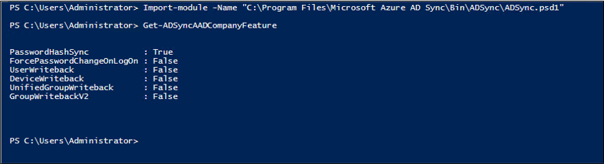
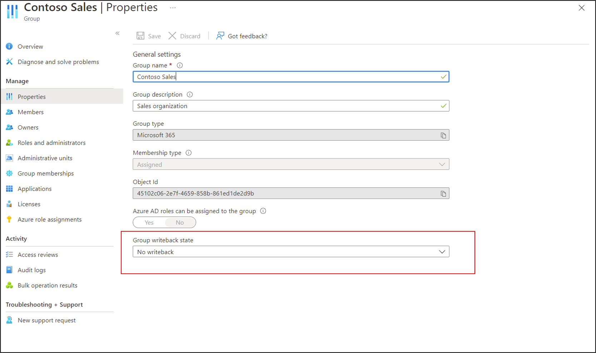

# Plan for Azure AD Connect group writeback
 
Group writeback allows you to write cloud groups back to your on-premises Active Directory using Azure AD Connect Sync. This feature enables you to manage groups in the cloud, while controlling access to on-premises applications and resources.  

There are two versions of group writeback. The original version is in general availability and is limited to writing back Microsoft 365 groups to your on-premises Active Directory as distribution groups. The new, expanded version of group writeback is in public preview and enables the following capabilities:  

- Microsoft 365 groups can be written back as Distribution groups, Security groups, or Mail-Enabled Security groups.  
- Azure AD Security groups can be written back as Security groups.  
- All groups are written back with a group scope of universal.  
- Groups with assigned and dynamic memberships can be written back. 
- Directory settings can be configured to control whether newly created Microsoft 365 groups are written back by default.  
- Group nesting in Azure AD will be written back if both groups exist in AD. 
- Written back groups nested as members of on-premises AD synced groups will be synced up to Azure AD as nested. 
- Devices that are members of writeback enabled groups in Azure AD, will be written back as members to AD. Azure AD registered and Azure AD Joined devices require device writeback to be enabled for group membership to be written back.
- The common name in an Active Directory group’s distinguished name can be configured to include the group’s display name when written back.  
- The Azure AD Admin portal, Graph Explorer, and PowerShell can be used to configure which Azure AD groups are written back. 

The new version is only available in the [Azure AD Connect version 2.0.89.0 or later](https://www.microsoft.com/download/details.aspx?id=47594). or later and must be enabled in addition to the original version. 

The following document will walk you through what you need to know before you enable group writeback for your tenant. 

 

## Plan your implementation 
There are a few activities that you'll want to complete before enabling the latest public preview of group writeback. These activities include discovering your current configuration, verifying the prerequisites, and choosing the deployment approach. 

## Discovery 
The following sections describe various methods of discovery and how you can discover if group writeback in enabled.

### Discover if group writeback is enabled in your environment

To discover if Azure AD Connect group writeback is already enabled in your environment, use the `Get-ADSyncAADCompanyFeature` PowerShell cmdlet.

The cmdlet is part of the [ADSync PowerShell](reference-connect-adsync.md) module that is installed with Azure AD Connect. 

 

The `UnifiedGroupWriteback` refers to the original version, while `GroupWritebackV2` refers to the new version. 

A value of **False** indicates that the feature is not enabled. 

### Discover the current writeback settings for existing Microsoft 365 groups 

You can view the existing writeback settings on Microsoft 365 groups in the portal.  Navigate to the group and select its properties.  You can see the Group write-back state on the group.

 

You can also view the writeback state via MS Graph: [Get group](/graph/api/group-get?tabs=http&view=graph-rest-beta)  

 Example: `GET https://graph.microsoft.com/beta/groups?$filter=groupTypes/any(c:c eq 'Unified')&$select=id,displayName,writebackConfiguration`  

   - If isEnabled is null or true, the group will be written back. 
   - If isEnabled is false, the group won't be written back.  

Finally, you can also view the writeback state via PowerShell using the  [Microsoft Identity Tools PowerShell Module](https://www.powershellgallery.com/packages/MSIdentityTools/2.0.16) 

 Example: `Get-mggroup -filter "groupTypes/any(c:c eq 'Unified')" | Get-MsIdGroupWritebackConfiguration` 

### Discover the default writeback setting for newly created Microsoft 365 groups 

For groups that haven't been created yet, you can view whether or not they're going to be automatically written back.

To see the default behavior in your environment for newly created groups use MS Graph: [directorySetting](/graph/api/resources/directorysetting?view=graph-rest-beta) 

 Example: `GET https://graph.microsoft.com/beta/Settings` 

 If a `directorySetting` named **Group.Unified** doesn't exist, the default directory setting is applied and newly created Microsoft 365 groups **will automatically** be written back. 

 If a `directorySetting` named **Group.Unified** exists with a `NewUnifiedGroupWritebackDefault` value of **false**, Microsoft 365 groups **won't automatically** be enabled for write-back when they're created.  If the value is not specified or it is set to true, newly created Microsoft 365 groups **will automatically** be written back.  

You can also use the PowerShell cmdlet [AzureADDirectorySetting](../enterprise-users/groups-settings-cmdlets.md) 

 Example: `(Get-AzureADDirectorySetting | ? { $_.DisplayName -eq "Group.Unified"} | FL *).values` 

 If nothing is returned, you are using the default directory settings, and newly created Microsoft 365 groups **will automatically** be written back. 

 If a `directorySetting` is returned with a `NewUnifiedGroupWritebackDefault` value of **false**, Microsoft 365 groups **won't automatically** be enabled for write-back when they're created.  If the value is not specified or it is set to **true**, newly created Microsoft 365 groups **will automatically** be written back. 

### Discover if AD has been prepared for Exchange 
To verify if Active Directory has been prepared for Exchange, see [Prepare Active Directory and domains for Exchange Server, Active Directory Exchange Server, Exchange Server Active Directory, Exchange 2019 Active Directory](/Exchange/plan-and-deploy/prepare-ad-and-domains?view=exchserver-2019#how-do-you-know-this-worked)

## Public preview prerequisites 
The following are prerequisites for group writeback.

   - An Azure AD Premium 1 license 
   - Azure AD Connect version 2.0.89.0 or later
   - **Optional**: Exchange Server 2016 CU15 or later   
     - Only needed for configuring cloud groups with Exchange Hybrid. 
     - See [Configure Microsoft 365 Groups with on-premises Exchange hybrid](/exchange/hybrid-deployment/set-up-microsoft-365-groups#prerequisites) for more information. 
     - If you haven't [prepared AD for Exchange](/Exchange/plan-and-deploy/prepare-ad-and-domains?view=exchserver-2019), mail related attributes of groups won't be written back. 

## Choosing the right approach 
Choosing the right deployment approach for your organization will depend on the current state of group writeback in your environment and the desired writeback behavior. 

When enabling group writeback, the following default behavior will be experienced: 

 - All existing Microsoft 365 groups will automatically be written back to Active Directory, including all future Microsoft 365 groups created. Azure AD Security groups are not automatically written back, they must each be enabled for writeback. 
 - Groups that have been written back won't be deleted in AD, if they're disabled for writeback or soft deleted. They will remain in AD until they're hard deleted in Azure AD. Changes made to these groups in Azure AD won't be written back, until the groups are re-enabled for writeback or restored from soft delete state. This requirement protects the AD groups from accidental deletion, should they be unintentionally disabled for writeback or soft deleted in Azure AD. 
 - Microsoft 365 groups with over 50,000 members and Azure AD security groups with over 250,000 cannot be written back to on-premises. 
To keep the default behavior, continue to the [enable group writeback](how-to-connect-group-writeback-enable.md) article.  

The default behavior can be modified as follows: 

 - Only groups that are configured for write-back will be written back, including newly created Microsoft 365 groups. 
 - Groups that are written to on-premises will be deleted in AD when they're either disabled for group writeback, soft deleted, or hard deleted in Azure AD. 
 - Microsoft 365 groups with up to 250,000 members can be written back to on-premises. 

If you plan to make changes to the default behavior, we recommend that you do so prior to enabling group writeback. However, you can still modify the default behavior, if group writeback is already enabled. To modify the default behavior, see [Modifying group writeback](how-to-connect-modify-group-writeback.md). 

 
 ## Public preview limitations  

While this release has undergone extensive testing, you may still encounter issues. One of the goals of this public preview release is to find and fix any such issues before moving to General Availability.  While support is provided for this public preview release, Microsoft may not always be able to fix all issues you may encounter immediately. For this reason, it's recommended that you use your best judgment before deploying this release in your production environment.  Limitations and known issues specific to Group writeback: 

- Cloud [distribution list groups](/exchange/recipients-in-exchange-online/manage-distribution-groups/manage-distribution-groups) created in Exchange Online cannot be written back to AD, only Microsoft 365 and Azure AD security groups are supported. 
- To be backwards compatible with the current version of group writeback, when you enable group writeback, all existing Microsoft 365 groups are written back and created as distribution groups, by default. This behavior can be modified by following the steps detailed in [Modifying group writeback](how-to-connect-modify-group-writeback.md). 
- When you disable writeback for a group, the group won't automatically be removed from your on-premises Active Directory, until hard deleted in Azure AD. This behavior can be modified by following the steps detailed in [Modifying group writeback](how-to-connect-modify-group-writeback.md) 
- Group Writeback does not support writeback of nested group members that have a scope of ‘Domain local’ in AD, since Azure AD security groups are written back with scope ‘Universal’. If you have a nested group like this, you'll see an export error in Azure AD Connect with the message “A universal group cannot have a local group as a member.”  The resolution is to remove the member with scope ‘Domain local’ from the Azure AD group or update the nested group member scope in AD to ‘Global’ or ‘Universal’ group. 
- Group Writeback only supports writing back groups to a single Organization Unit (OU). Once the feature is enabled, you cannot change the OU you selected. A workaround is to disable group writeback entirely in Azure AD Connect and then select a different OU when you re-enable the feature.  
- Nested cloud groups that are members of writeback enabled groups must also be enabled for writeback to remain nested in AD. 
- Group Writeback setting to manage new security group writeback at scale is not yet available. You will need to configure writeback for each group.  

 
 

## Next steps: 

- [Modify Azure AD Connect group writeback default behavior](how-to-connect-modify-group-writeback.md) 
- [Enable Azure AD Connect group writeback](how-to-connect-group-writeback-enable.md)
- [Disable Azure AD Connect group writeback](how-to-connect-group-writeback-disable.md)
