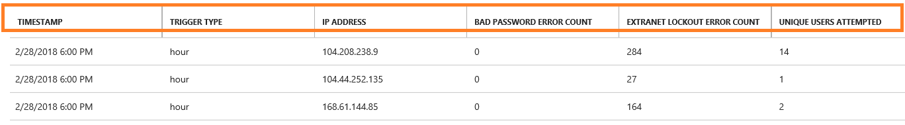
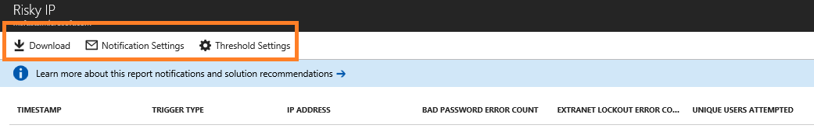

# Risky IP report (public preview)
AD FS customers may expose password authentication endpoints to the internet to provide authentication services for end users to access SaaS applications such as Office 365. In this case, it is possible for a bad actor to attempt logins against your AD FS system to guess an end user’s password and get access to application resources. AD FS provides the extranet account lockout functionality to prevent these types of attacks since AD FS in Windows Server 2012 R2. If you are on a lower version, we strongly recommend that you upgrade your AD FS system to Windows Server 2016.  

Additionally, it is possible for a single IP address to attempt multiple logins against multiple users. In these cases, the number of attempts per user may be under the threshold for account lockout protection in AD FS. Azure AD Connect Health now provides the “Risky IP report” that detects this condition and notifies administrators when this occurs. The following are the key benefits for this report: 
- Detection of IP addresses that exceed a threshold of failed password-based logins
- Supports failed logins due to bad password or due to extranet lockout state
- Email notification to alert administrators as soon as this occurs with customizable email settings
- Customizable threshold settings that match with the security policy of an organization
- Downloadable reports for offline analysis and integration with other systems via automation

> [!NOTE]
> To use this report, you must ensure that AD FS auditing is enabled. For more information, see [Enable Auditing for AD FS](how-to-connect-health-agent-install.md#enable-auditing-for-ad-fs).  
> To access preview, Global Admin or [Security Reader](https://docs.microsoft.com/azure/role-based-access-control/built-in-roles#security-reader) permission is required.  
> 

## What is in the report?
The failed sign in activity client IP addresses are aggregated through Web Application Proxy servers. Each item in the Risky IP report shows aggregated information about failed AD FS sign-in activities which exceed designated threshold. It provides the following information:

| Report Item | Description |
| ------- | ----------- |
| Time Stamp | Shows the time stamp based on Azure portal local time when the detection time window starts.  All daily events are generated at mid-night UTC time.  Hourly events have the timestamp rounded to the beginning of the hour. You can find first activity start time from “firstAuditTimestamp” in the exported file. |
| Trigger Type | Shows the type of detection time window. The aggregation trigger types are per hour or per day. This is helpful to detect versus a high frequency brute force attack versus a slow attack where the number of attempts is distributed throughout the day. |
| IP Address | The single risky IP address that had either bad password or extranet lockout sign-in activities. This could be an IPv4 or an IPv6 address. |
| Bad Password Error Count | The count of Bad Password error occurred from the IP address during the detection time window. The Bad Password errors can happen multiple times to certain users. Notice this does not include failed attempts due to expired passwords. |
| Extranet Lock Out Error Count | The count of Extranet Lockout error occurred from the IP address during the detection time window. The Extranet Lockout errors can happen multiple times to certain users. This will only be seen if Extranet Lockout is configured in AD FS (versions 2012R2 or higher). <b>Note</b> We strongly recommend turning this feature on if you allow extranet logins using passwords. |
| Unique Users Attempted | The count of unique user accounts attempted from the IP address during the detection time window. This provides a mechanism to differentiate a single user attack pattern versus multi-user attack pattern.  |

For example, the below report item indicates from the 6pm to 7pm hour window on 02/28/2018, IP address <i>104.2XX.2XX.9</i> had no bad password errors and 284 extranet lockout errors. 14 unique users were impacted within the criteria. The activity event exceeded the designated report hourly threshold. 

> [!NOTE]
> - Only activities exceeding designated threshold will be showing in the report list. 
> - This report can be trace back at most 30 days.
> - This alert report does not show Exchange IP addresses or private IP addresses. They are still included in the export list. 
>

## Load balancer IP addresses in the list
Load balancer aggregate failed sign-in activities and hit the alert threshold. If you are seeing load balancer IP addresses, it is highly likely that your external load balancer is not sending the client IP address when it passes the request to the Web Application Proxy server. Please configure your load balancer correctly to pass forward client IP address. 

## Download risky IP report 
Using the **Download** functionality, the whole risky IP address list in the past 30 days can be exported from the Connect Health Portal
The export result will include all the failed AD FS sign-in activities in each detection time window, so you can customize the filtering after the export. 
Besides the highlighted aggregations in the portal, the export result also shows more details about failed sign-in activities per IP address:

|  Report Item  |  Description  | 
| ------- | ----------- | 
| firstAuditTimestamp | Shows the first timestamp when the failed activities started during the detection time window.  | 
| lastAuditTimestamp | Shows the last timestamp when the failed activities ended during the detection time window.  | 
| attemptCountThresholdIsExceeded | The flag if the current activities are exceeding the alerting threshold.  | 
| isWhitelistedIpAddress | The flag if the IP address is filtered from alerting and reporting. Private IP addresses (<i>10.x.x.x, 172.x.x.x & 192.168.x.x</i>) and Exchange IP addresses are filtered and marked as True. If you are seeing private IP address ranges, it is highly likely that your external load balancer is not sending the client IP address when it passes the request to the Web Application Proxy server.  | 

## Configure notification settings
Admin contacts of the report can be updated through the **Notification Settings**. By default, the risky IP alert email notification is in off state. You can enable the notification by toggle the button under “Get email notifications for IP addresses exceeding failed activity threshold report”
Like generic alert notification settings in Connect Health, it allows you to customize designated notification recipient list about risky IP report from here. You can also notify all global admins while making the change. 

## Configure threshold settings
Alerting threshold can be updated through Threshold Settings. To start with, system has threshold set by default. There are four categories in the risk IP report threshold settings:

| Threshold Item | Description |
| --- | --- |
| (Bad U/P + Extranet Lockout) / Day  | Threshold setting to report the activity and trigger alert notification when the count of Bad Password plus the count of Extranet Lockout exceeds it per **day**. |
| (Bad U/P + Extranet Lockout) / Hour | Threshold setting to report the activity and trigger alert notification when the count of Bad Password plus the count of Extranet Lockout exceeds it per **hour**. |
| Extranet Lockout / Day | Threshold setting to report the activity and trigger alert notification when the count of Extranet Lockout exceeds it per **day**. |
| Extranet Lockout / Hour| Threshold setting to report the activity and trigger alert notification when the count of Extranet Lockout exceeds it per **hour**. |

> [!NOTE]
> - The change of report threshold will be applied after an hour of the setting change. 
> - Existing reported items will not be affected by the threshold change. 
> - We recommend that you analyze the number of events seen within your environment and adjust the threshold appropriately. 
>
>

## FAQ
**Why am I seeing private IP address ranges in the report?**   
Private IP addresses (<i>10.x.x.x, 172.x.x.x & 192.168.x.x</i>) and Exchange IP addresses are filtered and marked as True in the IP whitelist. If you are seeing private IP address ranges, it is highly likely that your external load balancer is not sending the client IP address when it passes the request to the Web Application Proxy server.

**Why am I seeing load balancer IP addresses in the report?**   
If you are seeing load balancer IP addresses, it is highly likely that your external load balancer is not sending the client IP address when it passes the request to the Web Application Proxy server. Please configure your load balancer correctly to pass forward client IP address. 

**What do I do to block the IP address?**   
You should add identified malicious IP address to the firewall or block in Exchange.    

**Why am I not seeing any items in this report?**  
- Failed sign-in activities are not exceeding the threshold settings.
- Ensure no “Health service is not up to date” alert active in your AD FS server list.  Read more about [how to troubleshoot this alert](how-to-connect-health-data-freshness.md).
- Audits is not enabled in AD FS farms.

**Why am I seeing no access to the report?**   
Global Admin or [Security Reader](https://docs.microsoft.com/azure/role-based-access-control/built-in-roles#security-reader) permission is required. Please contact your global admin to get access.

## Next steps
* [Azure AD Connect Health](whatis-hybrid-identity-health.md)
* [Azure AD Connect Health Agent Installation](how-to-connect-health-agent-install.md)
