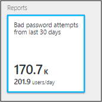

# Monitor AD FS using Azure AD Connect Health
The following documentation is specific to monitoring your AD FS infrastructure with Azure AD Connect Health. For information on monitoring Azure AD Connect (Sync) with Azure AD Connect Health, see [Using Azure AD Connect Health for Sync](how-to-connect-health-sync.md). Additionally, for information on monitoring Active Directory Domain Services with Azure AD Connect Health, see [Using Azure AD Connect Health with AD DS](how-to-connect-health-adds.md).

## Alerts for AD FS
The Azure AD Connect Health Alerts section provides you the list of active alerts. Each alert includes relevant information, resolution steps, and links to related documentation.

You can double-click an active or resolved alert, to open a new blade with additional information, steps you can take to resolve the alert, and links to relevant documentation. You can also view historical data on alerts that were resolved in the past.

## Usage Analytics for AD FS
Azure AD Connect Health Usage Analytics analyzes the authentication traffic of your federation servers. You can double-click the usage analytics box, to open the usage analytics blade, which shows you several metrics and groupings.

> [!NOTE]
> To use Usage Analytics with AD FS, you must ensure that AD FS auditing is enabled. For more information, see [Enable Auditing for AD FS](how-to-connect-health-agent-install.md#enable-auditing-for-ad-fs).
>
>

To select additional metrics, specify a time range, or to change the grouping, right-click on the usage analytics chart and select Edit Chart. Then you can specify the time range, select a different metric, and change the grouping. You can view the distribution of the authentication traffic based on different "metrics" and group each metric using relevant "group by" parameters described in the following section:

**Metric : Total Requests** - Total number of requests processed by AD FS servers.

|Group By | What the grouping means and why it's useful? |
| --- | --- |
| All | Shows the count of total number of requests processed by all AD FS servers.|
| Application | Groups the total requests based on the targeted relying party. This grouping is useful to understand which application is receiving how much percentage of the total traffic. |
|  Server |Groups the total requests based on the server that processed the request. This grouping is useful to understand the load distribution of the total traffic.
| Workplace Join |Groups the total requests based on whether they are coming from devices that are workplace joined (known). This grouping is useful to understand if your resources are accessed using devices that are unknown to the identity infrastructure. |
|  Authentication Method | Groups the total requests based on the authentication method used for authentication. This grouping is useful to understand the common authentication method that gets used for authentication. Following are the possible authentication methods <ol> <li>Windows Integrated Authentication (Windows)</li> <li>Forms Based Authentication (Forms)</li> <li>SSO (Single Sign On)</li> <li>X509 Certificate Authentication (Certificate)</li>  If the federation servers receive the request with an SSO Cookie, that request is counted as SSO (Single Sign On). In such cases, if the cookie is valid, the user is not asked to provide credentials and gets seamless access to the application. This behavior is common if you have multiple relying parties protected by the federation servers. |
| Network Location | Groups the total requests based on the network location of the user. It can be either intranet or extranet. This grouping is useful to know what percentage of the traffic is coming from the intranet versus extranet. |

**Metric: Total Failed Request** - The total number failed requests processed by the federation service. (This metric is only available on AD FS for Windows Server 2012 R2)

|Group By | What the grouping means and why it's useful? |
| --- | --- |
| Error Type | Shows the number of errors based on predefined error types. This grouping is useful to understand the common types of errors. <ul><li>Incorrect Username or Password: Errors due to incorrect username or password.</li> <li>"Extranet Lockout": Failures due to the requests received from a user that was locked out from extranet </li><li> "Expired Password": Failures due to users logging in with an expired password.</li><li>"Disabled Account": Failures due to users logging with a disabled account.</li><li>"Device Authentication": Failures due to users failing to authenticate using Device Authentication.</li><li>"User Certificate Authentication": Failures due to users failing to authenticate because of an invalid certificate.</li><li>"MFA": Failures due to user failing to authenticate using Multi-Factor Authentication.</li><li>"Other Credential": "Issuance Authorization": Failures due to authorization failures.</li><li>"Issuance Delegation": Failures due to issuance delegation errors.</li><li>"Token Acceptance": Failures due to ADFS rejecting the token from a third-party Identity Provider.</li><li>"Protocol": Failure due to protocol errors.</li><li>"Unknown": Catch all. Any other failures that do not fit into the defined categories.</li> |
| Server | Groups the errors based on the server. This grouping is useful to understand the error distribution across servers. Uneven distribution could be an indicator of a server in a faulty state. |
| Network Location | Groups the errors based on the network location of the requests (intranet vs extranet). This grouping is useful to understand the type of requests that are failing. |
|  Application | Groups the failures based on the targeted application (relying party). This grouping is useful to understand which targeted application is seeing most number of errors. |

**Metric : User Count** - Average number of unique users actively authenticating using AD FS

|Group By | What the grouping means and why it's useful? |
| --- | --- |
|All |This metric provides a count of average number of users using the federation service in the selected time slice. The users are not grouped.  The average depends on the time slice selected. |
| Application |Groups the average number of users based on the targeted application (relying party). This grouping is useful to understand how many users are using which application. |

## Performance Monitoring for AD FS
Azure AD Connect Health Performance Monitoring provides monitoring information on metrics. Selecting the Monitoring box, opens a new blade with detailed information on the metrics.

By selecting the Filter option at the top of the blade, you can filter by server to see an individual server’s metrics. To change metric, right-click on the monitoring chart under the monitoring blade and select Edit Chart (or select the Edit Chart button). From the new blade that opens up, you can select additional metrics from the drop-down and specify a time range for viewing the performance data.

## Top 50 Users with failed Username/Password logins
One of the common reasons for a failed authentication request on an AD FS server is a request with invalid credentials, that is, a wrong username or password. Usually happens to users due to complex passwords, forgotten passwords, or typos.

But there are other reasons that can result in an unexpected number of requests being handled by your AD FS servers, such as: An application that caches user credentials and the credentials expire or a malicious user attempting to sign into an account with a series of well-known passwords. These two examples are valid reasons that could lead to a surge in requests.

Azure AD Connect Health for ADFS provides a report about top 50 Users with failed login attempts due to invalid username or password. This report is achieved by processing the audit events generated by all the AD FS servers in the farms.

Within this report you have easy access to the following pieces of information:

* Total # of failed requests with wrong username/password in the last 30 days
* Average # of users that failed with a bad username/password login per day.

Clicking this part takes you to the main report blade that provides additional details. This blade includes a graph with trending information to help establish a baseline about requests with wrong username or password. Additionally, it provides the list of top 50 users with the number of failed attempts during the past week. Notice top 50 users from the past week could help identify bad password spikes.  

The graph provides the following information:

* The total # of failed logins due to a bad username/password on a per-day basis.
* The total # of unique users that failed logins on a per-day basis.
* Client IP address of for last request

The report provides the following information:

| Report Item | Description |
| --- | --- |
| User ID |Shows the user ID that was used. This value is what the user typed, which in some cases is the wrong user ID being used. |
| Failed Attempts |Shows the total # of failed attempts for that specific user ID. The table is sorted with the most number of failed attempts in descending order. |
| Last Failure |Shows the time stamp when the last failure occurred. |
| Last Failure IP |Shows the Client IP address from the latest bad request. If you see more than one IP addresses in this value, it may include forward client IP together with user's last attempt request IP.  |

> [!NOTE]
> This report is automatically updated after every 12 hours with the new information collected within that time. As a result, login attempts within the last 12 hours may not be included in the report.
>
>

## Risky IP Report (Public Preview)
AD FS customers may expose password authentication endpoints to the internet to provide authentication services for end users to access SaaS applications such as Office 365. In this case, it is possible for a bad actor to attempt logins against your AD FS system to guess an end user’s password and get access to application resources. AD FS provides the extranet account lockout functionality to prevent these types of attacks since AD FS in Windows Server 2012 R2. If you are on a lower version, we strongly recommend that you upgrade your AD FS system to Windows Server 2016.  
Additionally, it is possible for a single IP address to attempt multiple logins against multiple users. In these cases, the number of attempts per user may be under the threshold for account lockout protection in AD FS. Azure AD Connect Health now provides the “Risky IP report” that detects this condition and notifies administrators when this occurs. The following are the key benefits for this report: 
- Detection of IP addresses that exceed a threshold of failed password-based logins
- Supports failed logins due to bad password or due to extranet lockout state
- Email notification to alert administrators as soon as this occurs with customizable email settings
- Customizable threshold settings that match with the security policy of an organization
- Downloadable reports for offline analysis and integration with other systems via automation

> [!NOTE]
> To use this report, you must ensure that AD FS auditing is enabled. For more information, see [Enable Auditing for AD FS](how-to-connect-health-agent-install.md#enable-auditing-for-ad-fs).  
> To access preview, Global Admin or [Security Reader](https://docs.microsoft.com/azure/role-based-access-control/built-in-roles#security-reader) permission is required.  
> 

### What is in the report
Each item in the Risky IP report shows aggregated information about failed AD FS sign-in activities which exceed designated threshold. It provides the following information:

| Report Item | Description |
| ------- | ----------- |
| Time Stamp | Shows the time stamp based on Azure portal local time when the detection time window starts.  All daily events are generated at mid-night UTC time.  Hourly events have the timestamp rounded to the beginning of the hour. You can find first activity start time from “firstAuditTimestamp” in the exported file. |
| Trigger Type | Shows the type of detection time window. The aggregation trigger types are per hour or per day. This is helpful to detect versus a high frequency brute force attack versus a slow attack where the number of attempts is distributed throughout the day. |
| IP Address | The single risky IP address that had either bad password or extranet lockout sign-in activities. This could be a IPv4 or an IPv6 address. |
| Bad Password Error Count | The count of Bad Password error occurred from the IP address during the detection time window. The Bad Password errors can happen multiple times to certain users. Notice this does not include failed attempts due to expired passwords. |
| Extranet Lock Out Error Count | The count of Extranet Lockout error occurred from the IP address during the detection time window. The Extranet Lockout errors can happen multiple times to certain users. This will only be seen if Extranet Lockout is configured in AD FS (versions 2012R2 or higher). <b>Note</b> We strongly recommend turning this feature on if you allow extranet logins using passwords. |
| Unique Users Attempted | The count of unique user accounts attempted from the IP address during the detection time window. This provides a mechanism to differentiate a single user attack pattern versus multi-user attack pattern.  |

For example, the below report item indicates from the 6pm to 7pm hour window on 02/28/2018, IP address <i>104.2XX.2XX.9</i> had no bad password errors and 284 extranet lockout errors. 14 unique users were impacted within the criteria. The activity event exceeded the designated report hourly threshold. 

> [!NOTE]
> - Only activities exceeding designated threshold will be showing in the report list. 
> - This report can be trace back at most 30 days.
> - This alert report does not show Exchange IP addresses or private IP addresses. They are still included in the export list. 
>

### Load Balancer IP addresses in the list
Load balancer aggregate failed sign-in activities and hit the alert threshold. If you are seeing load balancer IP addresses, it is highly likely that your external load balancer is not sending the client IP address when it passes the request to the Web Application Proxy server. Please configure your load balancer correctly to pass forward client IP address. 

### Download Risky IP report 
Using the **Download** functionality, the whole risky IP address list in the past 30 days can be exported from the Connect Health Portal
The export result will include all the failed AD FS sign-in activities in each detection time window, so you can customize the filtering after the export. 
Besides the highlighted aggregations in the portal, the export result also shows more details about failed sign-in activities per IP address:

|  Report Item  |  Description  | 
| ------- | ----------- | 
| firstAuditTimestamp | Shows the first timestamp when the failed activities started during the detection time window.  | 
| lastAuditTimestamp | Shows the last timestamp when the failed activities ended during the detection time window.  | 
| attemptCountThresholdIsExceeded | The flag if the current activities are exceeding the alerting threshold.  | 
| isWhitelistedIpAddress | The flag if the IP address is filtered from alerting and reporting. Private IP addresses (<i>10.x.x.x, 172.x.x.x & 192.168.x.x</i>) and Exchange IP addresses are filtered and marked as True. If you are seeing private IP address ranges, it is highly likely that your external load balancer is not sending the client IP address when it passes the request to the Web Application Proxy server.  | 

### Configure Notification Settings
Admin contacts of the report can be updated through the **Notification Settings**. By default, the risky IP alert email notification is in off state. You can enable the notification by toggle the button under “Get email notifications for IP addresses exceeding failed activity threshold report”
Like generic alert notification settings in Connect Health, it allows you to customize designated notification recipient list about risky IP report from here. You can also notify all global admins while making the change. 

### Configure Threshold settings
Alerting threshold can be updated through Threshold Settings. To start with, system has threshold set by default. There are four categories in the risk IP report threshold settings:

| Threshold Item | Description |
| --- | --- |
| (Bad U/P + Extranet Lockout) / Day  | Threshold setting to report the activity and trigger alert notification when the count of Bad Password plus the count of Extranet Lockout exceeds it per **day**. |
| (Bad U/P + Extranet Lockout) / Hour | Threshold setting to report the activity and trigger alert notification when the count of Bad Password plus the count of Extranet Lockout exceeds it per **hour**. |
| Extranet Lockout / Day | Threshold setting to report the activity and trigger alert notification when the count of Extranet Lockout exceeds it per **day**. |
| Extranet Lockout / Hour| Threshold setting to report the activity and trigger alert notification when the count of Extranet Lockout exceeds it per **hour**. |

> [!NOTE]
> - The change of report threshold will be applied after an hour of the setting change. 
> - Existing reported items will not be affected by the threshold change. 
> - We recommend that you analyze the number of events seen within your environment and adjust the threshold appropriately. 
>
>

### FAQ
1. Why am I seeing private IP address ranges in the report?   
Private IP addresses (<i>10.x.x.x, 172.x.x.x & 192.168.x.x</i>) and Exchange IP addresses are filtered and marked as True in the IP whitelist. If you are seeing private IP address ranges, it is highly likely that your external load balancer is not sending the client IP address when it passes the request to the Web Application Proxy server.

2. Why am I seeing load balancer IP addresses in the report?   
If you are seeing load balancer IP addresses, it is highly likely that your external load balancer is not sending the client IP address when it passes the request to the Web Application Proxy server. Please configure your load balancer correctly to pass forward client IP address. 

3. What do I do to block the IP address?   
You should add identified malicious IP address to the firewall or block in Exchange.    

4. Why am I not seeing any items in this report?  
   - Failed sign-in activities are not exceeding the threshold settings. 
   - Ensure no “Health service is not up to date” alert active in your AD FS server list.  Read more about [how to troubleshoot this alert](how-to-connect-health-data-freshness.md).
   - Audits is not enabled in AD FS farms.
 
5. Why am I seeing no access to the report?   
Global Admin or [Security Reader](https://docs.microsoft.com/azure/role-based-access-control/built-in-roles#security-reader) permission is required. Please contact your global admin to get access.

## Related links
* [Azure AD Connect Health](whatis-hybrid-identity-health.md)
* [Azure AD Connect Health Agent Installation](how-to-connect-health-agent-install.md)
* [Azure AD Connect Health Operations](how-to-connect-health-operations.md)
* [Using Azure AD Connect Health for sync](how-to-connect-health-sync.md)
* [Using Azure AD Connect Health with AD DS](how-to-connect-health-adds.md)
* [Azure AD Connect Health FAQ](reference-connect-health-faq.md)
* [Azure AD Connect Health Version History](reference-connect-health-version-history.md)
