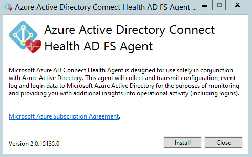
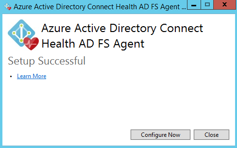
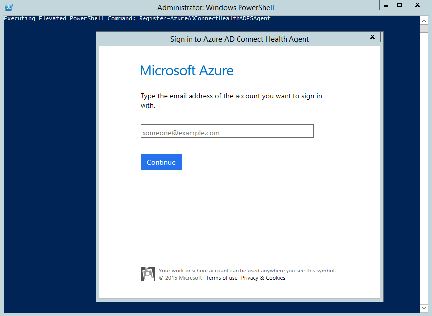
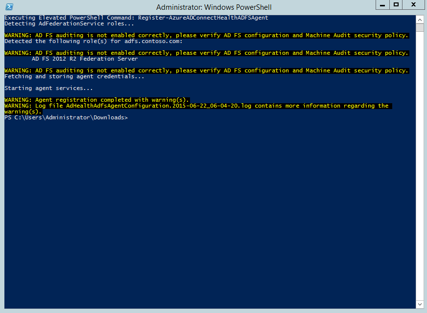
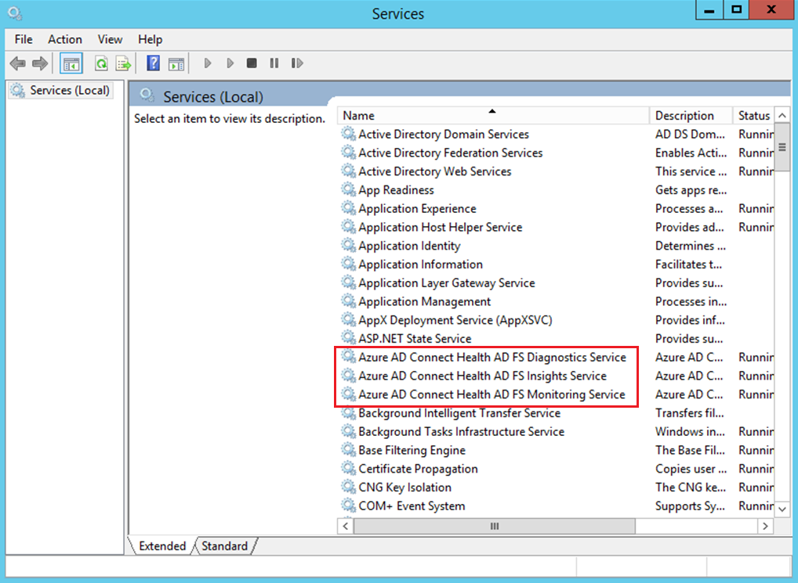
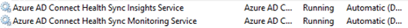
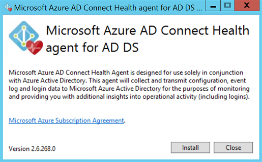
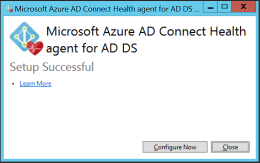
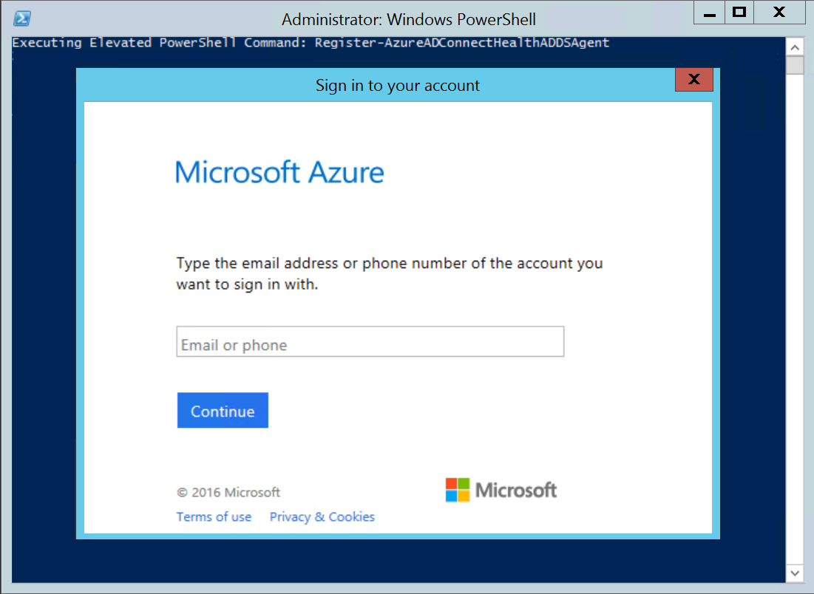
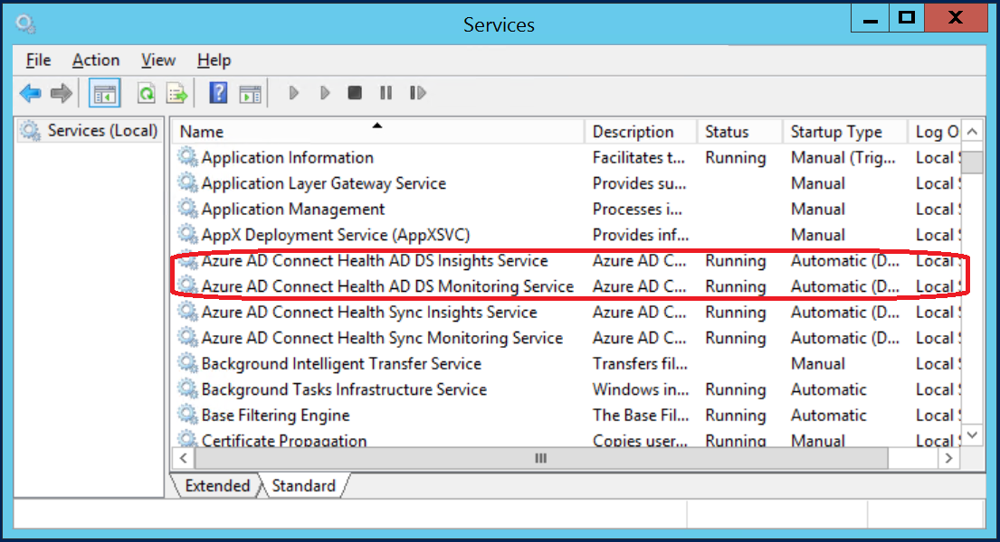

# Azure AD Connect Health Agent Installation
This document walks you through installing and configuring the Azure AD Connect Health Agents. You can download the agents from [here](how-to-connect-install-roadmap.md#download-and-install-azure-ad-connect-health-agent).

## Requirements
The following table is a list of requirements for using Azure AD Connect Health.

| Requirement | Description |
| --- | --- |
| Azure AD Premium |Azure AD Connect Health is an Azure AD Premium feature and requires Azure AD Premium. </br></br>For more information, see [Getting started with Azure AD Premium](../fundamentals/active-directory-get-started-premium.md) </br>To start a free 30-day trial, see [Start a trial.](https://azure.microsoft.com/trial/get-started-active-directory/) |
| You must be a global administrator of your Azure AD to get started with Azure AD Connect Health |By default, only the global administrators can install and configure the health agents to get started, access the portal, and perform any operations within Azure AD Connect Health. For more information, see [Administering your Azure AD directory](../fundamentals/active-directory-administer.md). <br><br> Using Role Based Access Control you can allow access to Azure AD Connect Health to other users in your organization. For more information, see [Role Based Access Control for Azure AD Connect Health.](how-to-connect-health-operations.md#manage-access-with-role-based-access-control) </br></br>**Important:** The account used when installing the agents must be a work or school account. It cannot be a Microsoft account. For more information, see [Sign up for Azure as an organization](../fundamentals/sign-up-organization.md) |
| Azure AD Connect Health Agent is installed on each targeted server | Azure AD Connect Health requires the Health Agents to be installed and configured on targeted servers to receive the data and provide the Monitoring and Analytics capabilities. </br></br>For example, to get data from your AD FS infrastructure, the agent must be installed on the AD FS and Web Application Proxy servers. Similarly, to get data on your on-premises AD DS infrastructure, the agent must be installed on the domain controllers. </br></br> |
| Outbound connectivity to the Azure service endpoints | During installation and runtime, the agent requires connectivity to Azure AD Connect Health service endpoints. If outbound connectivity is blocked using Firewalls, ensure that the following endpoints are added to the allowed list. See [outbound connectivity endpoints](how-to-connect-health-agent-install.md#outbound-connectivity-to-the-azure-service-endpoints) | 
|Outbound connectivity based on IP Addresses | For IP address based filtering on firewalls, refer to the [Azure IP Ranges](https://www.microsoft.com/download/details.aspx?id=41653).|
| SSL Inspection for outbound traffic is filtered or disabled | The agent registration step or data upload operations may fail if there is SSL inspection or termination for outbound traffic at the network layer. Read more about [how to setup SSL inspection](https://technet.microsoft.com/library/ee796230.aspx) |
| Firewall ports on the server running the agent |The agent requires the following firewall ports to be open in order for the agent to communicate with the Azure AD Health service endpoints.</br></br><li>TCP port 443</li><li>TCP port 5671</li> </br>Read more about [enable firewall ports](https://technet.microsoft.com/library/ms345310(v=sql.100).aspx) |
| Allow the following websites if IE Enhanced Security is enabled |If IE Enhanced Security is enabled, then the following websites must be allowed on the server that is going to have the agent installed.</br></br><li>https:\//login.microsoftonline.com</li><li>https:\//secure.aadcdn.microsoftonline-p.com</li><li>https:\//login.windows.net</li><li>The federation server for your organization trusted by Azure Active Directory. For example: https:\//sts.contoso.com</li> Read more about [how to configure IE](https://support.microsoft.com/help/815141/internet-explorer-enhanced-security-configuration-changes-the-browsing) |
| Ensure PowerShell v4.0 or newer is installed | <li>Windows Server 2008 R2 ships with PowerShell v2.0, which is insufficient for the agent.  Update PowerShell as explained below under [Agent installation on Windows Server 2008 R2 Servers](#agent-installation-on-windows-server-2008-r2-servers).</li><li>Windows Server 2012 ships with PowerShell v3.0, which is insufficient for the agent.  [Update](http://www.microsoft.com/download/details.aspx?id=40855) the Windows Management Framework.</li><li>Windows Server 2012 R2 and later ship with a sufficiently recent version of PowerShell.</li>|
|Disable FIPS|FIPS is not supported by Azure AD Connect Health agents.|

### Outbound connectivity to the Azure service endpoints
 During installation and runtime, the agent requires connectivity to Azure AD Connect Health service endpoints. If outbound connectivity is blocked using Firewalls, ensure that the following endpoints are added to the allowed list. Read more about [check outbound connectivity](https://docs.microsoft.com/azure/load-balancer/load-balancer-outbound-connections)  
 
| Domain Environment | Required Azure service endpoints |
| --- | --- |
| General Public | <li>&#42;.blob.core.windows.net </li><li>&#42;.aadconnecthealth.azure.com </li><li>&#42;.queue.core.windows.net </li><li>&#42;.servicebus.windows.net - Port: 5671 </li><li>&#42;.table.core.windows.net </li><li>&#42;.adhybridhealth.azure.com/</li><li>https:\//management.azure.com </li><li>https:\//policykeyservice.dc.ad.msft.net/</li><li>https:\//login.windows.net</li><li>https:\//login.microsoftonline.com</li><li>https:\//secure.aadcdn.microsoftonline-p.com </li><li>https:\//www.office.com *this endpoint is only used for discovery purposes during registration.</li> | 
| Azure Germany | <li>&#42;.blob.core.cloudapi.de </li><li>&#42;.queue.core.cloudapi.de </li><li>&#42;.servicebus.cloudapi.de </li><li>&#42;.table.core.cloudapi.de </li><li>&#42;.aadconnecthealth.microsoftazure.de </li><li>https:\//management.microsoftazure.de </li><li>https:\//policykeyservice.aadcdi.microsoftazure.de </li><li>https:\//login.microsoftonline.de </li><li>https:\//secure.aadcdn.microsoftonline-p.de </li><li>https:\//www.office.de *this endpoint is only used for discovery purposes during registration.</li> |
| Azure Government | <li>&#42;.blob.core.usgovcloudapi.net </li><li>&#42;.queue.core.usgovcloudapi.net </li> <li>&#42;.servicebus.usgovcloudapi.net </li> <li>&#42;.table.core.usgovcloudapi.net </li><li>&#42;.aadconnecthealth.microsoftazure.us </li> <li>https:\//management.usgovcloudapi.net </li><li>https:\//policykeyservice.aadcdi.azure.us </li><li>https:\//login.microsoftonline.us </li><li>https:\//secure.aadcdn.microsoftonline-p.com </li><li>https:\//www.office.com *this endpoint is only used for discovery purposes during registration.</li> |  
 

## Download and install the Azure AD Connect Health Agent
* Make sure that you [satisfy the requirements](how-to-connect-health-agent-install.md#requirements) for Azure AD Connect Health.
* Get started using Azure AD Connect Health for AD FS
    * [Download Azure AD Connect Health Agent for AD FS.](http://go.microsoft.com/fwlink/?LinkID=518973)
    * [See the installation instructions](#installing-the-azure-ad-connect-health-agent-for-ad-fs).
* Get started using Azure AD Connect Health for sync
    * [Download and install the latest version of Azure AD Connect](http://go.microsoft.com/fwlink/?linkid=615771). The Health Agent for sync will be installed as part of the Azure AD Connect installation (version 1.0.9125.0 or higher).
* Get started using Azure AD Connect Health for AD DS
    * [Download Azure AD Connect Health Agent for AD DS](http://go.microsoft.com/fwlink/?LinkID=820540).
    * [See the installation instructions](#installing-the-azure-ad-connect-health-agent-for-ad-ds).

## Installing the Azure AD Connect Health Agent for AD FS
> [!NOTE]
> AD FS server should be different from your Sync server. Do not install AD FS agent to your Sync server.
>
  
Before installation, make sure your AD FS server host name is unique and not present in the AD FS service.   
To start the agent installation, double-click the .exe file that you downloaded. On the first screen, click Install.



Once the installation is finished, click Configure Now.



This launches a PowerShell window to initiate the agent registration process. When prompted, sign in with an Azure AD account that has access to perform agent registration. By default the Global Admin account has access.



After signing in, PowerShell will continue. Once it completes, you can close PowerShell and the configuration is complete.

At this point, the agent services should be started automatically allowing the agent upload the required data to the cloud service in a secure manner.

If you have not met all the pre-requisites outlined in the previous sections, warnings appear in the PowerShell window. Be sure to complete the [requirements](how-to-connect-health-agent-install.md#requirements) before installing the agent. The following screenshot is an example of these errors.



To verify the agent has been installed, look for the following services on the server. If you completed the configuration, they should already be running. Otherwise, they are stopped until the configuration is complete.

* Azure AD Connect Health AD FS Diagnostics Service
* Azure AD Connect Health AD FS Insights Service
* Azure AD Connect Health AD FS Monitoring Service



### Agent installation on Windows Server 2008 R2 Servers
Steps for Windows Server 2008 R2 servers:

1. Ensure that the server is running at Service Pack 1 or higher.
2. Turn off IE ESC for agent installation:
3. Install Windows PowerShell 4.0 on each of the servers ahead of installing the AD Health agent. To install Windows PowerShell 4.0:
   * Install [Microsoft .NET Framework 4.5](https://www.microsoft.com/download/details.aspx?id=40779) using the following link to download the offline installer.
   * Install PowerShell ISE (From Windows Features)
   * Install the [Windows Management Framework 4.0.](https://www.microsoft.com/download/details.aspx?id=40855)
   * Install Internet Explorer version 10 or above on the server. (Required by the Health Service to authenticate, using your Azure Admin credentials.)
4. For more information on installing Windows PowerShell 4.0 on Windows Server 2008 R2, see the wiki article [here](http://social.technet.microsoft.com/wiki/contents/articles/20623.step-by-step-upgrading-the-powershell-version-4-on-2008-r2.aspx).

### Enable Auditing for AD FS
> [!NOTE]
> This section only applies to AD FS servers. You do not have to follow these steps on the Web Application Proxy Servers.
>

In order for the Usage Analytics feature to gather and analyze data, the Azure AD Connect Health agent needs the information in the AD FS Audit Logs. These logs are not enabled by default. Use the following procedures to enable AD FS auditing and to locate the AD FS audit logs, on your AD FS servers.

#### To enable auditing for AD FS on Windows Server 2008 R2
1. Click **Start**, point to **Programs**, point to **Administrative Tools**, and then click **Local Security Policy**.
2. Navigate to the **Security Settings\Local Policies\User Rights Assignment** folder, and then double-click **Generate security audits**.
3. On the **Local Security Setting** tab, verify that the AD FS 2.0 service account is listed. If it is not present, click **Add User or Group** and add it to the list, and then click **OK**.
4. To enable auditing, open a Command Prompt with elevated privileges and run the following command: <code>auditpol.exe /set /subcategory:"Application Generated" /failure:enable /success:enable</code>
5. Close **Local Security Policy**.
<br>   -- **The following steps are only required for primary AD FS servers.** -- </br>
6. Open the **AD FS Management** snap-in. To open the AD FS Management snap-in, click **Start**, point to **Programs**, point to **Administrative Tools**, and then click **AD FS 2.0 Management**.
7. In the **Actions** pane, click **Edit Federation Service Properties**.
8. In the **Federation Service Properties** dialog box, click the **Events** tab.
9. Select the **Success audits** and **Failure audits** check boxes.
10. Click **OK**.

#### To enable auditing for AD FS on Windows Server 2012 R2
1. Open **Local Security Policy** by opening **Server Manager** on the Start screen, or Server Manager in the taskbar on the desktop, then click **Tools/Local Security Policy**.
2. Navigate to the **Security Settings\Local Policies\User Rights Assignment** folder, and then double-click **Generate security audits**.
3. On the **Local Security Setting** tab, verify that the AD FS service account is listed. If it is not present, click **Add User or Group** and add it to the list, and then click **OK**.
4. To enable auditing, open a command prompt with elevated privileges and run the following command: ```auditpol.exe /set /subcategory:"Application Generated" /failure:enable /success:enable```.
5. Close **Local Security Policy**.
<br>   -- **The following steps are only required for primary AD FS servers.** -- </br>
6. Open the **AD FS Management** snap-in (in Server Manager, click Tools, and then select AD FS Management).
7. In the **Actions** pane, click **Edit Federation Service Properties**.
8. In the **Federation Service Properties** dialog box, click the **Events** tab.
9. Select the **Success audits and Failure audits** check boxes and then click **OK**.

#### To enable auditing for AD FS on Windows Server 2016
1. Open **Local Security Policy** by opening **Server Manager** on the Start screen, or Server Manager in the taskbar on the desktop, then click **Tools/Local Security Policy**.
2. Navigate to the **Security Settings\Local Policies\User Rights Assignment** folder, and then double-click **Generate security audits**.
3. On the **Local Security Setting** tab, verify that the AD FS service account is listed. If it is not present, click **Add User or Group** and add the AD FS service account to the list, and then click **OK**.
4. To enable auditing, open a command prompt with elevated privileges and run the following command: <code>auditpol.exe /set /subcategory:"Application Generated" /failure:enable /success:enable.</code>
5. Close **Local Security Policy**.
<br>   -- **The following steps are only required for primary AD FS servers.** -- </br>
6. Open the **AD FS Management** snap-in (in Server Manager, click Tools, and then select AD FS Management).
7. In the **Actions** pane, click **Edit Federation Service Properties**.
8. In the **Federation Service Properties** dialog box, click the **Events** tab.
9. Select the **Success audits and Failure audits** check boxes and then click **OK**. This should be enabled by default.
10. Open a PowerShell window and run the following command: ```Set-AdfsProperties -AuditLevel Verbose```.

Note that "basic" audit level is enabled by default. Read more about the [AD FS Audit enhancement in Windows Server 2016](https://docs.microsoft.com/windows-server/identity/ad-fs/technical-reference/auditing-enhancements-to-ad-fs-in-windows-server)


#### To locate the AD FS audit logs
1. Open **Event Viewer**.
2. Go to Windows Logs and select **Security**.
3. On the right, click **Filter Current Logs**.
4. Under Event Source, select **AD FS Auditing**.

    And quick [FAQ note](reference-connect-health-faq.md#operations-questions) for Audit logs.


> [!WARNING]
> A group policy can disable AD FS auditing. If AD FS auditing is disabled, usage analytics about login activities are not available. Ensure that you don’t have a group policy that  disables AD FS auditing.>
>


## Installing the Azure AD Connect Health agent for sync
> [!NOTE]
> Sync server should be different from your AD FS server. Do not install Sync agent to your AD FS server.
>

The Azure AD Connect Health agent for sync is installed automatically in the latest build of Azure AD Connect. To use Azure AD Connect for sync, you need to download the latest version of Azure AD Connect and install it. You can download the latest version [here](http://www.microsoft.com/download/details.aspx?id=47594).

To verify the agent has been installed, look for the following services on the server. If you completed the configuration, they should already be running. Otherwise, they are stopped until the configuration is complete.

* Azure AD Connect Health Sync Insights Service
* Azure AD Connect Health Sync Monitoring Service



> [!NOTE]
> Remember that using Azure AD Connect Health requires Azure AD Premium. If you do not have Azure AD Premium, you are unable to complete the configuration in the Azure portal. For more information, see the [requirements page](how-to-connect-health-agent-install.md#requirements).
>
>

## Manual Azure AD Connect Health for Sync registration
If the Azure AD Connect Health for Sync agent registration fails after successfully installing Azure AD Connect, you can use the following PowerShell command to manually register the agent.

> [!IMPORTANT]
> Using this PowerShell command is only required if the agent registration fails after installing Azure AD Connect.
>
>

The following PowerShell command is required ONLY when the health agent registration fails even after a successful installation and configuration of Azure AD Connect. The Azure AD Connect Health services will start after the agent has been successfully registered.

You can manually register the Azure AD Connect Health agent for sync using the following PowerShell command:

`Register-AzureADConnectHealthSyncAgent -AttributeFiltering $false -StagingMode $false`

The command takes following parameters:

* AttributeFiltering: $true (default) - if Azure AD Connect is not syncing the default attribute set and has been customized to use a filtered attribute set. $false otherwise.
* StagingMode: $false (default) - if the Azure AD Connect server is NOT in staging mode, $true if the server is configured to be in staging mode.

When prompted for authentication you should use the same global admin account (such as admin@domain.onmicrosoft.com) that was used for configuring Azure AD Connect.

## Installing the Azure AD Connect Health Agent for AD DS
To start the agent installation, double-click the .exe file that you downloaded. On the first screen, click Install.



Once the installation is finished, click Configure Now.



A command prompt is launched, followed by some PowerShell that executes Register-AzureADConnectHealthADDSAgent. When prompted to sign in to Azure, go ahead and sign in.



After signing in, PowerShell will continue. Once it completes, you can close PowerShell and the configuration is complete.

At this point, the services should be started automatically allowing the agent to monitor and gather data. If you have not met all the pre-requisites outlined in the previous sections, warnings appear in the PowerShell window. Be sure to complete the [requirements](how-to-connect-health-agent-install.md#requirements) before installing the agent. The following screenshot is an example of these errors.


To verify the agent has been installed, look for the following services on the domain controller.

* Azure AD Connect Health AD DS Insights Service
* Azure AD Connect Health AD DS Monitoring Service

If you completed the configuration, these services should already be running. Otherwise, they are stopped until the configuration is complete.




## Agent Registration using PowerShell
After installing the appropriate agent setup.exe, you can perform the agent registration step using the following PowerShell commands depending on the role. Open a PowerShell Window and execute the appropriate command:

```
    Register-AzureADConnectHealthADFSAgent
    Register-AzureADConnectHealthADDSAgent
    Register-AzureADConnectHealthSyncAgent

```

These commands accept "Credential" as a parameter to complete the registration in a non-interactive manner or on a Server-Core machine.
* The Credential can be captured in a PowerShell variable that is passed as a parameter.
* You can provide any Azure AD Identity that has access to register the agents and does NOT have MFA enabled.
* By default Global Admins have access to perform agent registration. You can also allow other less privileged identities to perform this step. Read more about [Role Based Access Control](how-to-connect-health-operations.md#manage-access-with-role-based-access-control).

```
    $cred = Get-Credential
    Register-AzureADConnectHealthADFSAgent -Credential $cred

```

## Configure Azure AD Connect Health Agents to use HTTP Proxy
You can configure Azure AD Connect Health Agents to work with an HTTP Proxy.

> [!NOTE]
> * Using “Netsh WinHttp set ProxyServerAddress” is not supported as the agent uses System.Net to make web requests instead of Microsoft Windows HTTP Services.
> * The configured Http Proxy address is used to pass-through encrypted Https messages.
> * Authenticated proxies (using HTTPBasic) are not supported.
>
>

### Change Health Agent Proxy Configuration
You have the following options to configure Azure AD Connect Health Agent to use an HTTP Proxy.

> [!NOTE]
> All Azure AD Connect Health Agent services must be restarted, in order for the proxy settings to be updated. Run the following command:<br>
> Restart-Service AdHealth*
>
>

#### Import existing proxy Settings
##### Import from Internet Explorer
Internet Explorer HTTP proxy settings can be imported, to be used by the Azure AD Connect Health Agents. On each of the servers running the Health agent, execute the following PowerShell command:

    Set-AzureAdConnectHealthProxySettings -ImportFromInternetSettings

##### Import from WinHTTP
WinHTTP proxy settings can be imported, to be used by the Azure AD Connect Health Agents. On each of the servers running the Health agent, execute the following PowerShell command:

    Set-AzureAdConnectHealthProxySettings -ImportFromWinHttp

#### Specify Proxy addresses manually
You can manually specify a proxy server on each of the servers running the Health Agent, by executing the following PowerShell command:

    Set-AzureAdConnectHealthProxySettings -HttpsProxyAddress address:port

Example: *Set-AzureAdConnectHealthProxySettings -HttpsProxyAddress myproxyserver: 443*

* "address" can be a DNS resolvable server name or an IPv4 address
* "port" can be omitted. If omitted then 443 is chosen as default port.

#### Clear existing proxy configuration
You can clear the existing proxy configuration by running the following command:

    Set-AzureAdConnectHealthProxySettings -NoProxy


### Read current proxy settings
You can read the currently configured proxy settings by running the following command:

    Get-AzureAdConnectHealthProxySettings


## Test Connectivity to Azure AD Connect Health Service
It is possible that issues may arise that cause the Azure AD Connect Health agent to lose connectivity with the Azure AD Connect Health service. These include network issues, permission issues, or various other reasons.

If the agent is unable to send data to the Azure AD Connect Health service for longer than two hours, it is indicated with the following alert in the portal: "Health Service data is not up to date." You can confirm if the affected Azure AD Connect Health agent is able to upload data to the Azure AD Connect Health service by running the following PowerShell command:

    Test-AzureADConnectHealthConnectivity -Role ADFS

The role parameter currently takes the following values:

* ADFS
* Sync
* ADDS

> [!NOTE]
> To use the connectivity tool, you must first complete the agent registration. If you are not able to complete the agent registration, make sure that you have met all the [requirements](how-to-connect-health-agent-install.md#requirements) for Azure AD Connect Health. This connectivity test is performed by default during agent registration.
>
>

## Related links
* [Azure AD Connect Health](whatis-hybrid-identity-health.md)
* [Azure AD Connect Health Operations](how-to-connect-health-operations.md)
* [Using Azure AD Connect Health with AD FS](how-to-connect-health-adfs.md)
* [Using Azure AD Connect Health for sync](how-to-connect-health-sync.md)
* [Using Azure AD Connect Health with AD DS](how-to-connect-health-adds.md)
* [Azure AD Connect Health FAQ](reference-connect-health-faq.md)
* [Azure AD Connect Health Version History](reference-connect-health-version-history.md)
