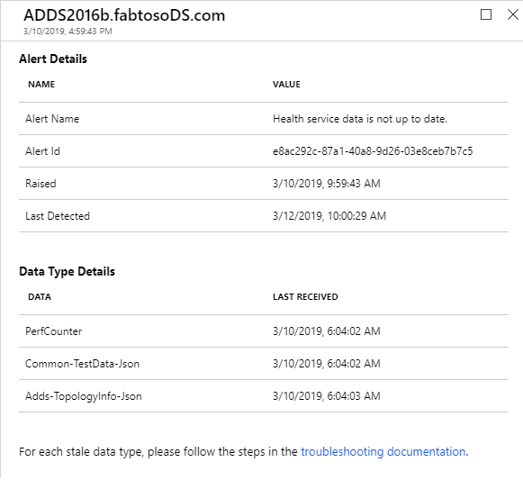

# Health service data is not up to date alert

## Overview
The Agents on the on-premise machines that Azure AD Connect Health monitors periodically uploads data to Azure AD Connect Health Service. If the service does not receive data from an agent, the information presented in portal will be stale. To highlight the issue, the service will raise **Health service data is not up to date** alert. It is generated when the service has not received completed data in the last two hours.  

* The **Warning** status alert fires if the Health Service has received only **partial** data types sent from the server in the last two hours. Warning status alert does not trigger email notifications to configured recipients. 
* The **Error** status alert fires if the Health Service has not received any data types from the server in the last two hours. Error status alert triggers email notifications to configured recipients.

The Service gets the data from Agents that are running on the on-premise machines. Depending on the Service Type, the following table lists the agents that run on the machine, what they do as well as the Data Types that are generated by the service. In some cases, there are multiple services involved in the process, so either of them could be the culprit. 

## Understanding the alert
The Alert Details blade indicates the time when the Alert is raised and last detected. The Alert is generated/re-evaluated by a background process which runs every two hours. In the example below, the initial alert was raised at 03/10 at 9:59 AM. It has continued to exist even at 03/12 10:00 AM when the alert was evaluated again.
 The blade also details the time when a particular Data Type was last received by the Health Service. 
 
 
 
Below is the map of service types and corresponding required data type.

| Service Type | Agent (Windows Service name) | Purpose | Data Type generated  |
| --- | --- | --- | --- |  
| Azure AD Connect (Sync) | Azure AD Connect Health Sync Insights Service | Collect AAD Connect specific information (Connectors, Synchronization rules etc.) | - AadSyncService-SynchronizationRules    - AadSyncService-Connectors   - AadSyncService-GlobalConfigurations     - AadSyncService-RunProfileResults   - AadSyncService-ServiceConfigurations   - AadSyncService-ServiceStatus   |
|  | Azure AD Connect Health Sync Monitoring Service | Collect (AAD Connect specific) Perf Counters, ETW Traces, Files | Performance Counter |
| AD DS | Azure AD Connect Health AD DS Insights Service | Perform Synthetic Tests, Collect Topology Information, Replication Metadata |  - Adds-TopologyInfo-Json   - Common-TestData-Json (Creates the test results)   | 
|  | Azure AD Connect Health AD DS Monitoring Service | Collect (ADDS-specific) Perf Counters, ETW Traces, Files | - Performance Counter    - Common-TestData-Json (Uploads the test results)  |
| AD FS | Azure AD Connect Health AD FS Diagnostics Service | Perform Synthetic tests | TestResult (Creates the test results) | 
| | Azure AD Connect Health AD FS Insights Service  | Collect ADFS Usage Metrics | Adfs-UsageMetrics |
| | Azure AD Connect Health AD FS Monitoring Service | Collect (ADFS-specific) Perf Counters, ETW Traces, Files | TestResult (Uploads the test results) |

## Troubleshooting steps 

The steps required to diagnose the issue is given below. The first is a set of basic checks that are common to all Service Types. The table below that lists out specific steps for each Service Type and Data Type. 

> [!IMPORTANT] 
> This alert follows Connect Health [data retention policy](reference-connect-health-user-privacy.md#data-retention-policy)

* Make sure the latest versions of the agents are installed. View [release history](reference-connect-health-version-history.md). 
* Make sure that Azure AD Connect Health Agents services are **running** on the machine. For example, Connect Health for AD FS should have three services.
  

* Make sure to go over and meet the [requirements section](how-to-connect-health-agent-install.md#requirements).
* Use [test connectivity tool](how-to-connect-health-agent-install.md#test-connectivity-to-azure-ad-connect-health-service) to discover connectivity issues.
* If you have an HTTP Proxy, follow these [configuration steps](how-to-connect-health-agent-install.md#configure-azure-ad-connect-health-agents-to-use-http-proxy). 

## Next steps
If any of the above steps identified an issue, fix it and wait for the alert to resolve. The alert background process runs every 2 hours, so it will take up to 2 hours to resolve the alert. 

* [Azure AD Connect Health data retention policy](reference-connect-health-user-privacy.md#data-retention-policy)
* [Azure AD Connect Health FAQ](reference-connect-health-faq.md)
