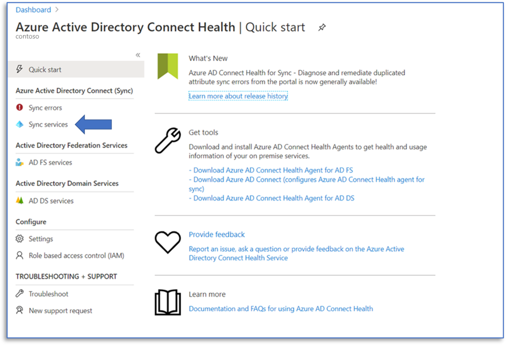
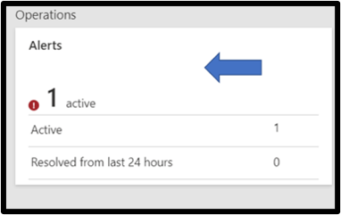
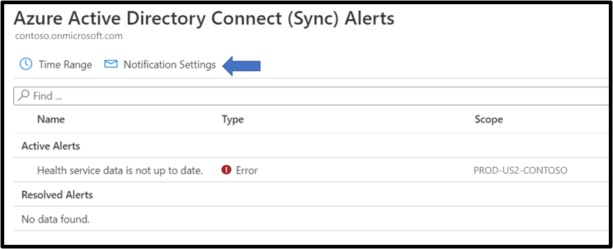
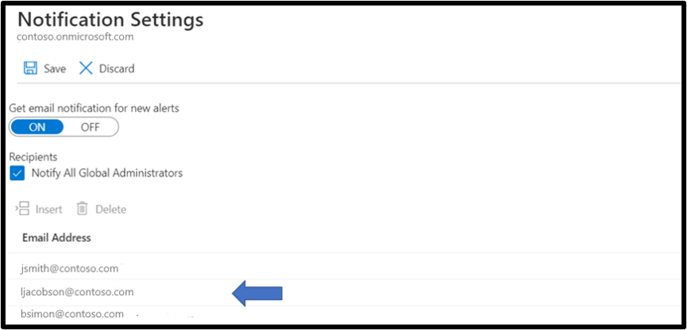
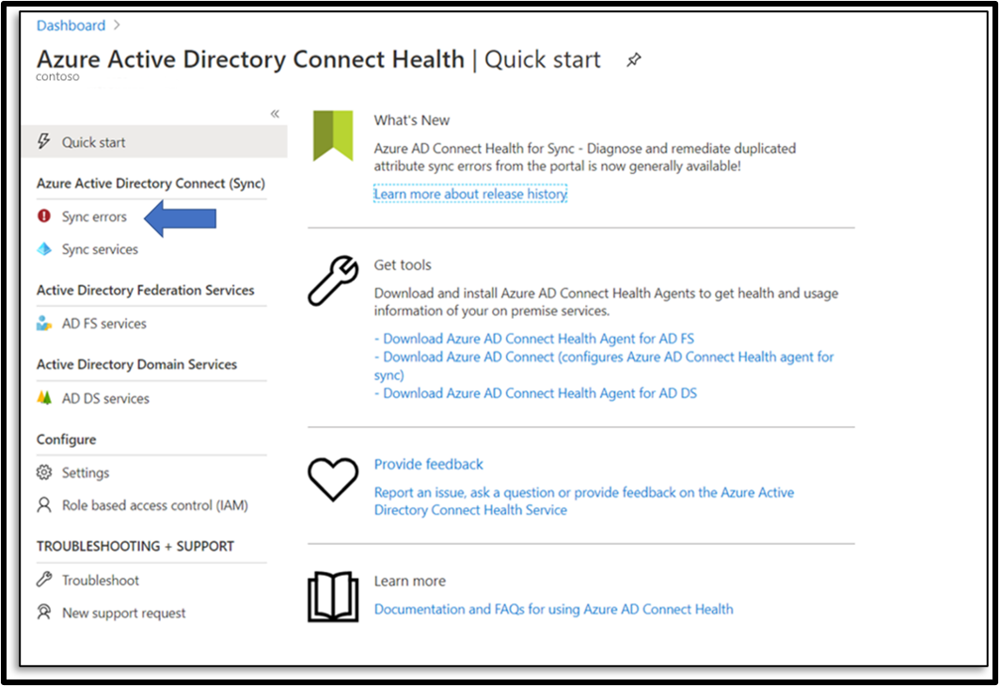

# Azure AD Connect Health instructions for data retrieval

The [European Union General Data Protection Regulation (GDPR)](https://ec.europa.eu/info/law/law-topic/data-protection_en) gives rights to people (known in the regulation as data subjects) to manage the personal data that has been collected by an employer or other type of agency or organization (known as the data controller or just controller). Personal data is defined broadly under the GDPR as any data that relates to an identified or identifiable natural person. The GDPR gives data subjects specific rights to their personal data; these rights include obtaining copies of it, requesting changes to it, restricting the processing of it, deleting it, or receiving it in an electronic format so it can be moved to another controller. 

Similarly, the [California Consumer Privacy Act (CCPA)](https://docs.microsoft.com/microsoft-365/compliance/offering-ccpa?view=o365-worldwide), provides privacy rights and obligations to California consumers, including rights similar to GDPR's Data Subject Rights, such as the right to delete, access and receive (portability) their personal information. 

This document describes how to use Azure AD Connect to retrieve data to assist you in the type of requests outlined above.

## Retrieve all email addresses for users configured for health alerts.

To retrieve the email addresses for all of your users that are configured in Azure AD Connect Health to receive alerts, use the following steps.

1.	Start at the Azure Active Directory Connect health blade and select **Sync Services** from the left-hand navigation bar.
 

2.	Click on the **Alerts** tile. 
 

3.	Click on **Notification Settings**.
 

4.	On the **Notification Setting** blade, you will find the list of email addresses that have been enabled as recipients for health Alert notifications.
 
 
## Retrieve accounts that were flagged with AD FS Bad Password attempts

To retrieve accounts that were flagged with AD FS Bad Password attempts, use the following steps.

1.	Starting on the Azure Active Directory Health blade, select **Sync Errors**.
 

2.	In the **Sync Errors** blade, click on **Export**. This will export a list of the recorded sync errors.
 

## Next Steps
* [Azure AD Connect Health](./whatis-azure-ad-connect.md)
* [Azure AD Connect Health Agent Installation](how-to-connect-health-agent-install.md)
* [Azure AD Connect Health Operations](how-to-connect-health-operations.md)
* [Azure AD Connect Health FAQ](reference-connect-health-faq.md)
* [Azure AD Connect Health Version History](reference-connect-health-version-history.md)