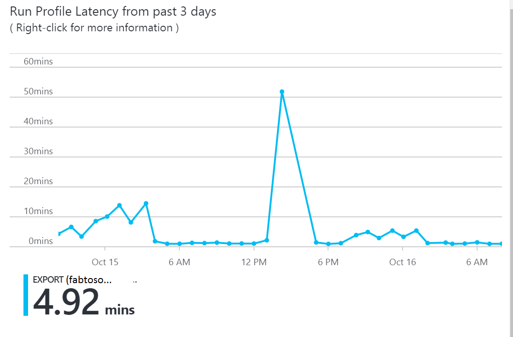
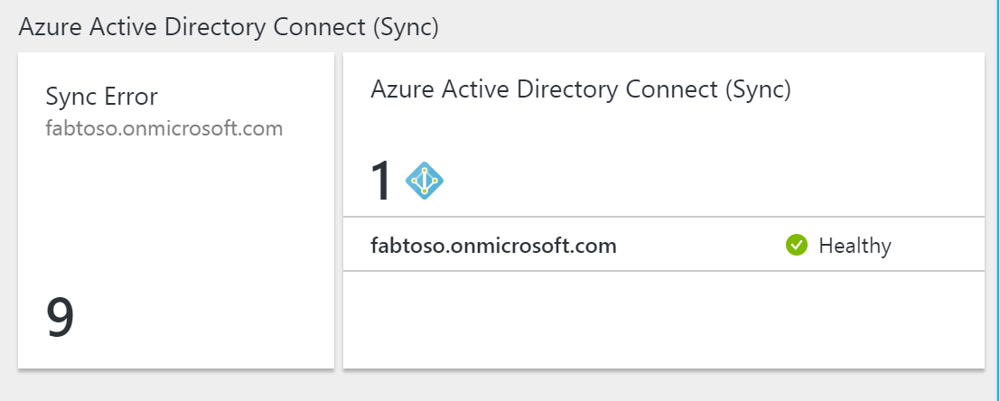

# Monitor Azure AD Connect sync with Azure AD Connect Health
The following documentation is specific to monitoring Azure AD Connect (Sync) with Azure AD Connect Health.  For information on monitoring AD FS with Azure AD Connect Health see [Using Azure AD Connect Health with AD FS](how-to-connect-health-adfs.md). Additionally, for information on monitoring Active Directory Domain Services with Azure AD Connect Health see [Using Azure AD Connect Health with AD DS](how-to-connect-health-adds.md).

## Alerts for Azure AD Connect Health for sync
The Azure AD Connect Health Alerts for sync section provides you the list of active alerts. Each alert includes relevant information, resolution steps, and links to related documentation. By selecting an active or resolved alert you will see a new blade with additional information, as well as steps you can take to resolve the alert, and links to additional documentation. You can also view historical data on alerts that were resolved in the past.

By selecting an alert you will be provided with additional information as well as steps you can take to resolve the alert and links to additional documentation.

### Limited Evaluation of Alerts
If Azure AD Connect is NOT using the default configuration (for example, if Attribute Filtering is changed from the default configuration to a custom configuration), then the Azure AD Connect Health agent will not upload the error events related to Azure AD Connect.

This limits the evaluation of alerts by the service. You will see a banner that indicates this condition in the Azure Portal under your service.

You can change this by clicking "Settings" and allowing Azure AD Connect Health agent to upload all error logs.

## Sync Insight
Admins Frequently want to know about the time it takes to sync changes to Azure AD and the amount of changes taking place. This feature provides an easy way to visualize this using the below graphs:   

* Latency of sync operations
* Object Change trend

### Sync Latency
This feature provides a graphical trend of latency of the sync operations (import, export, etc.) for connectors.  This provides a quick and easy way to understand not only the latency of your operations (larger if you have a large set of changes occurring) but also a way to detect anomalies in the latency that may require further investigation.

By default, only the latency of the 'Export' operation for the Azure AD connector is shown.  To see more operations on the connector or to view operations from other connectors, right-click on the chart,  select Edit Chart or click on the "Edit Latency Chart" button and choose the specific operation and connectors.

### Sync Object Changes
This feature provides a graphical trend of the number of changes that are being evaluated and exported to Azure AD.  Today, trying to gather this information from the sync logs is difficult.  The chart gives you, not only a simpler way of monitoring the number of changes that are occurring in your environment, but also a visual view of the failures that are occurring.

## Object Level Synchronization Error Report
This feature provides a report about synchronization errors that can occur when identity data is synchronized between Windows Server AD and Azure AD using Azure AD Connect.

* The report covers errors recorded by the sync client (Azure AD Connect version 1.1.281.0 or higher)
* It includes the errors that occurred in the last synchronization operation on the sync engine. ("Export" on the Azure AD Connector.)
* Azure AD Connect Health agent for sync must have outbound connectivity to the required end points for the report to include the latest data.
* The report is **updated after every 30 minutes** using the data uploaded by Azure AD Connect Health agent for sync.
  It provides the following key capabilities

  * Categorization of errors
  * List of objects with error per category
  * All the data about the errors at one place
  * Side by side comparison of Objects with error due to a conflict
  * Download the error report as a CVS

### Categorization of Errors
The report categorizes the existing synchronization errors in the following categories:

| Category | Description |
| --- | --- |
| Duplicate Attribute |Errors when Azure AD Connect attempts create or update objects with duplicated values of one or more attributes in Azure AD that must be unique in a Tenant, such as proxyAddresses, UserPrincipalName. |
| Data Mismatch |Errors when the soft-match fails to match objects that result in synchronization errors. |
| Data Validation Failure |Errors due to invalid data, such as unsupported characters in critical attributes such as UserPrincipalName, format errors that fail validation before being written in Azure AD. |
| Federated Domain Change | Errors when accounts use a different federated domain. |
| Large Attribute |Errors when one or more attributes are larger than the allowed size, length or count. |
| Other |All other errors that don't fit in the above categories. Based on feedback, this category will be split in sub categories. |

### List of objects with error per category
Drilling into each category will provide the list of objects having the error in that category.

### Error Details
Following data is available in the detailed view for each error

* Highlighted conflicting attribute
* Identifiers for the *AD Object* involved
* Identifiers for the *Azure AD Object* involved (as applicable)
* Error description and how to fix

### Download the error report as CSV
By selecting the "Export" button you can download a CSV file with all the details about all the errors.

### Diagnose and remediate sync errors 
For specific duplicated attribute sync error scenario involving user Source Anchor update, you can fix them directly from the portal. 
Read more about [Diagnose and remediate duplicated attribute sync errors](how-to-connect-health-diagnose-sync-errors.md)

## Related links
* [Troubleshooting Errors during synchronization](tshoot-connect-sync-errors.md)
* [Duplicate Attribute Resiliency](how-to-connect-syncservice-duplicate-attribute-resiliency.md)
* [Azure AD Connect Health](whatis-hybrid-identity-health.md)
* [Azure AD Connect Health Agent Installation](how-to-connect-health-agent-install.md)
* [Azure AD Connect Health Operations](how-to-connect-health-operations.md)
* [Using Azure AD Connect Health with AD FS](how-to-connect-health-adfs.md)
* [Using Azure AD Connect Health with AD DS](how-to-connect-health-adds.md)
* [Azure AD Connect Health FAQ](reference-connect-health-faq.md)
* [Azure AD Connect Health Version History](reference-connect-health-version-history.md)
