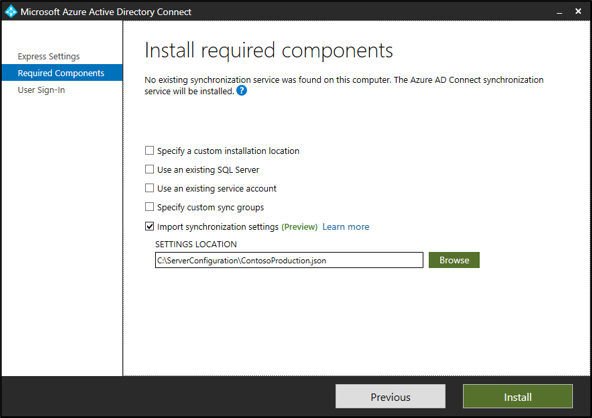
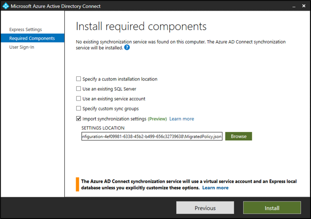

# Importing and exporting Azure AD Connect configuration settings (Public Preview) 

Azure AD Connect deployments vary from a single forest Express Mode install, to complex deployments that synchronize across multiple forests using custom synchronization rules. Due to the large number of configuration options and mechanisms, it is essential to understand what settings are in effect and be able to quickly deploy a server with an identical configuration. This feature introduces the ability to catalog the configuration of a given synchronization server and import the settings into a new deployment. Different synchronization settings snapshots can be compared to easily visualize the differences between two servers, or the same server over time. 

Each time the configuration is changed from the Azure AD Connect wizard, a new time stamped JSON settings file is automatically exported to **%ProgramData%\AADConnect**. The settings filename is of the form **Applied-SynchronizationPolicy-*.JSON** where the last part of the filename is a timestamp. 

> [!IMPORTANT]
> Only changes made by Azure AD Connect are automatically exported. Any changes made using PowerShell, the Synchronization Service Manager, or the Synchronization Rules Editor, must be exported on demand as needed to maintain an up-to-date copy. Export on demand can also be used to place a copy of the settings in a secure location for disaster recovery purposes. 

## Exporting Azure AD Connect Settings 

To view a summary of your configuration settings, open the Azure AD Connect tool and choose the additional task named: View or Export Current Configuration. A quick summary of your settings is shown along with the ability to export the full configuration of your server. 

By default the settings will be exported to **%ProgramData%\AADConnect**, however you may choose to save the settings to a protected location to ensure availability in the event of a disaster. Settings are exported using the JSON file format and should not be hand created or edited to ensure logical consistency. Importing hand created or edited file is not supported and may lead to unexpected results. 

## Importing Azure AD Connect Settings 

To import previously exported settings, do the following:
 
1. Install **Azure AD Connect** on a new server. 
2. Select **Customize** option after the **Welcome** page. 
3. Click **Import synchronization settings**. Browse for the previously exported json settings file.  
4. Click **Install**.

> [!NOTE]
> Please override settings on this page, like use of SQL Server instead of LocalDB or use of existing service account instead of default VSA etc. These settings are not imported from the configuration settings file but are there for information and comparison purposes.

### Import Installation Experience 

Import installation experience is intentionally kept simple with minimal inputs from the user to easy provide reproducibility of an existing server.  

Here are the only changes that can be made during the installation experience. All other changes can be made after the installation from the Azure AD Connect wizard.: 
- **Azure Active Directory Credentials** – the account name for the Azure Global Administrator used to configure the original server is suggested by default, and **MUST** be changed if you wish to synchronize information to a new directory.
- **User Sign-In** – the sign-on options configured for your original server are selected by default and will automatically prompt for credentials or other information needed during configuration. In rare cases, there may be a need to set up a server with different options to avoid changing the behavior of the active server. Otherwise just press Next to use the same settings. 
- **On-premises Directory Credentials** – for each on-premises directory included in your synchronization settings, you must provide credentials to create a synchronization account or supply a pre-created custom synchronization account. This procedure is identical to the clean install experience with the exception you cannot add or remove directories. 
- **Configuration Options** – as with a clean install, you may choose to configure the initial settings for whether to start automatic synchronization or enable staging mode. The main difference is that Staging Mode is intentionally enabled by default to allow comparison of the configuration and synchronization results prior to actively exporting the results to Azure. 

> [!NOTE]
> Only one synchronization server can be in the primary role and actively exporting configuration changes to Azure. All other servers must be placed in Staging mode. 

## Migrating Settings from an Existing Server 

If an existing server does not support settings management, you may either choose to upgrade the server in-place or migrate the settings for use on a new staging server.  

Migration requires running a PowerShell script that extracts the existing settings for use in a new installation.  This method is recommended to catalog the settings of your existing server then apply them to a newly installed staging sever.  Comparing the settings for the original server to newly created server will quickly visualize the changes between the servers.  As always, follow your organization’s certification process to ensure no additional configuration is required.  

### Migration Process 
To migrate the settings, do the following:

1. Launch **AzureADConnect.msi** on the new staging server and stop at the Welcome page of Azure AD Connect.

2. Copy **MigrateSettings.ps1** from the Microsoft Azure AD Connect\Tools directory to a location on the existing server.  For example, C:\setup.  Where setup is a directory that was created on the existing server.

   

3. Run the script as shown below and save the entire down-level server configuration directory. Copy this directory to the new staging server. Please note you need to copy the entire **Exported-ServerConfiguration-*** folder to the new server.

   
   

5. Launch **Azure AD Connect** by double clicking the icon on the desktop. Accept EULA, on the next page click the **Customize** button. 
6. Select **Import synchronization settings** checkbox and click the **Browse** button to browse the copied over Exported-ServerConfiguration-* folder and select the MigratedPolicy.json to import the migrated settings.

   

7. To compare the migrated settings with that of applied settings, look for the latest **Migrated-SynchronizationPolicy-*.JSON** and **Applied-SynchronizationPolicy-*.JSON** (* is the time stamp) under **%ProgramData%\AADConnect**. Use your favorite file comparison tool to compare the parity. 

## Post Installation Verification 

Comparing the originally imported settings file, with the exported settings file, of the newly deployed server is an essential step in understanding any differences between the intended, versus the resulting deployment. Using your favorite side-by-side text comparison application yields an instant visualization that quickly highlights any desired or accidental changes. While many formerly manual configuration steps are now eliminated, you should still follow your organization’s certification process to ensure no additional configuration is required. This configuration may occur if you leverage advanced settings, which are not currently captured in the public preview release of settings management. 

Known limitations include the following: 
- **Synchronization Rules** – the precedence for a custom rule must be in the reserved range of 0-99 to avoid conflicts with Microsoft’s standard rules. Placing a custom rule outside the reserved range may result in your custom rule being shifted around as standard rules are added to the configuration. A similar issue will occur if your configuration contains modified standard rules. Modifying a standard rule is strongly discouraged and rule placement is likely to be incorrect. 
- **Device Writeback** – these settings are cataloged however they are not currently applied during configuration. If device writeback was enabled for your original server, you must manually configure the feature on the newly deployed server. 
- **Synchronized Object Types** – although it is possible to constrain the list of synchronized object types (users, contacts, groups, etc.) using the Synchronization Service Manager, this feature is currently not supported via synchronization settings. After completing installation, you must manually reapply the advanced configuration. 
- **Custom Run Profiles** - although it is possible to modify the default set of run profiles using the Synchronization Service Manager, this feature is currently not supported via synchronization settings. After completing installation, you must manually reapply the advanced configuration. 
- **Configuring the Provisioning Hierarchy** – this advanced feature of the Synchronization Service Manager is not supported via synchronization settings and must be manually reconfigured after completing the initial deployment. 
- **AD FS and PingFederate Authentication** – the sign-on methods associated with these authentication features will be automatically pre-selected, however you must interactively supply all other required configuration parameters. 
- **A disabled custom synchronization rule will be imported as enabled**
A disabled custom synchronization rule will be imported as enabled. Make sure to disable it on the new server as well.

 ## Next Steps

- [Hardware and prerequisites](how-to-connect-install-prerequisites.md) 
- [Express settings](how-to-connect-install-express.md)
- [Customized settings](how-to-connect-install-custom.md)
- [Install Azure AD Connect Health agents](how-to-connect-health-agent-install.md) 
