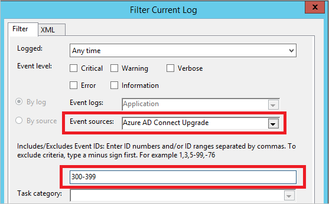

# Azure AD Connect: Automatic upgrade
This feature was introduced with build [1.1.105.0 (released February 2016)](reference-connect-version-history.md#111050).  This feature was updated in [build 1.1.561](reference-connect-version-history.md#115610) and now supports additional scenarios that were previously not supported.

## Overview
Making sure your Azure AD Connect installation is always up to date has never been easier with the **automatic upgrade** feature. This feature is enabled by default for express installations and DirSync upgrades. When a new version is released, your installation is automatically upgraded.
Automatic upgrade is enabled by default for the following:

* Express settings installation and DirSync upgrades.
* Using SQL Express LocalDB, which is what Express settings always use. DirSync with SQL Express also use LocalDB.
* The AD account is the default MSOL_ account created by Express settings and DirSync.
* Have less than 100,000 objects in the metaverse.

The current state of automatic upgrade can be viewed with the PowerShell cmdlet `Get-ADSyncAutoUpgrade`. It has the following states:

| State | Comment |
| --- | --- |
| Enabled |Automatic upgrade is enabled. |
| Suspended |Set by the system only. The system is **not currently** eligible to receive automatic upgrades. |
| Disabled |Automatic upgrade is disabled. |

You can change between **Enabled** and **Disabled** with `Set-ADSyncAutoUpgrade`. Only the system should set the state **Suspended**.  Prior to 1.1.750.0 the Set-ADSyncAutoUpgrade cmdlet would block Autoupgrade if the auto-upgrade state was set to Suspended. This functionality has now changed so it does not block AutoUpgrade.

Automatic upgrade is using Azure AD Connect Health for the upgrade infrastructure. For automatic upgrade to work, make sure you have opened the URLs in your proxy server for **Azure AD Connect Health** as documented in [Office 365 URLs and IP address ranges](https://support.office.com/article/Office-365-URLs-and-IP-address-ranges-8548a211-3fe7-47cb-abb1-355ea5aa88a2).

If the **Synchronization Service Manager** UI is running on the server, then the upgrade is suspended until the UI is closed.

## Troubleshooting
If your Connect installation does not upgrade itself as expected, then follow these steps to find out what could be wrong.

First, you should not expect the automatic upgrade to be attempted the first day a new version is released. There is an intentional randomness before an upgrade is attempted so don't be alarmed if your installation isn't upgraded immediately.

If you think something is not right, then first run `Get-ADSyncAutoUpgrade` to ensure automatic upgrade is enabled.

If the state is suspended, you can use the `Get-ADSyncAutoUpgrade -Detail` to view the reason.  The suspension reason can contain any string value but will usually contain the string value of the UpgradeResult, that is, `UpgradeNotSupportedNonLocalDbInstall` or `UpgradeAbortedAdSyncExeInUse`.  A compound value may also be returned, such as `UpgradeFailedRollbackSuccess-GetPasswordHashSyncStateFailed`.

It is also possible to get a result that is not an UpgradeResult i.e. 'AADHealthEndpointNotDefined' or 'DirSyncInPlaceUpgradeNonLocalDb'.

Then, make sure you have opened the required URLs in your proxy or firewall. Automatic update is using Azure AD Connect Health as described in the [overview](#overview). If you use a proxy, make sure Health has been configured to use a [proxy server](how-to-connect-health-agent-install.md#configure-azure-ad-connect-health-agents-to-use-http-proxy). Also test the [Health connectivity](how-to-connect-health-agent-install.md#test-connectivity-to-azure-ad-connect-health-service) to Azure AD.

With the connectivity to Azure AD verified, it is time to look into the eventlogs. Start the event viewer and look in the **Application** eventlog. Add an eventlog filter for the source **Azure AD Connect Upgrade** and the event id range **300-399**.  
  

You can now see the eventlogs associated with the status for automatic upgrade.  
  

The result code has a prefix with an overview of the state.

| Result code prefix | Description |
| --- | --- |
| Success |The installation was successfully upgraded. |
| UpgradeAborted |A temporary condition stopped the upgrade. It will be retried again and the expectation is that it succeeds later. |
| UpgradeNotSupported |The system has a configuration that is blocking the system from being automatically upgraded. It will be retried to see if the state is changing, but the expectation is that the system must be upgraded manually. |

Here is a list of the most common messages you find. It does not list all, but the result message should be clear with what the problem is.

| Result Message | Description |
| --- | --- |
| **UpgradeAborted** | |
| UpgradeAbortedCouldNotSetUpgradeMarker |Could not write to the registry. |
| UpgradeAbortedInsufficientDatabasePermissions |The built-in administrators group does not have permissions to the database. Manually upgrade to the latest version of Azure AD Connect to address this issue. |
| UpgradeAbortedInsufficientDiskSpace |There is not enough disc space to support an upgrade. |
| UpgradeAbortedSecurityGroupsNotPresent |Could not find and resolve all security groups used by the sync engine. |
| UpgradeAbortedServiceCanNotBeStarted |The NT Service **Microsoft Azure AD Sync** failed to start. |
| UpgradeAbortedServiceCanNotBeStopped |The NT Service **Microsoft Azure AD Sync** failed to stop. |
| UpgradeAbortedServiceIsNotRunning |The NT Service **Microsoft Azure AD Sync** is not running. |
| UpgradeAbortedSyncCycleDisabled |The SyncCycle option in the [scheduler](how-to-connect-sync-feature-scheduler.md) has been disabled. |
| UpgradeAbortedSyncExeInUse |The [synchronization service manager UI](how-to-connect-sync-service-manager-ui.md) is open on the server. |
| UpgradeAbortedSyncOrConfigurationInProgress |The installation wizard is running or a sync was scheduled outside the scheduler. |
| **UpgradeNotSupported** | |
| UpgradeNotSupportedCustomizedSyncRules |You have added your own custom rules to the configuration. |
| UpgradeNotSupportedInvalidPersistedState |The installation is not an Express settings or a DirSync upgrade. |
| UpgradeNotSupportedNonLocalDbInstall |You are not using a SQL Server Express LocalDB database. |
|UpgradeNotSupportedLocalDbSizeExceeded|Local DB size is greater than or equal to 8 GB|
|UpgradeNotSupportedAADHealthUploadDisabled|Health data uploads have been disabled from the portal|

## Next steps
Learn more about [Integrating your on-premises identities with Azure Active Directory](whatis-hybrid-identity.md).
