# Custom installation of Azure AD Connect
Azure AD Connect **Custom settings** is used when you want more options for the installation. It is used if you have multiple forests or if you want to configure optional features not covered in the express installation. It is used in all cases where the [**express installation**](how-to-connect-install-express.md) option does not satisfy your deployment or topology.

Before you start installing Azure AD Connect, make sure to [download Azure AD Connect](https://go.microsoft.com/fwlink/?LinkId=615771) and complete the pre-requisite steps in [Azure AD Connect: Hardware and prerequisites](how-to-connect-install-prerequisites.md). Also make sure you have required accounts available as described in [Azure AD Connect accounts and permissions](reference-connect-accounts-permissions.md).

If customized settings does not match your topology, for example to upgrade DirSync, see related documentation for other scenarios.

## Custom settings installation of Azure AD Connect
### Express Settings
On this page, click **Customize** to start a customized settings installation.

### Install required components
When you install the synchronization services, you can leave the optional configuration section unchecked and Azure AD Connect sets up everything automatically. It sets up a SQL Server 2012 Express LocalDB instance, create the appropriate groups, and assign permissions. If you wish to change the defaults, you can use the following table to understand the optional configuration options that are available.

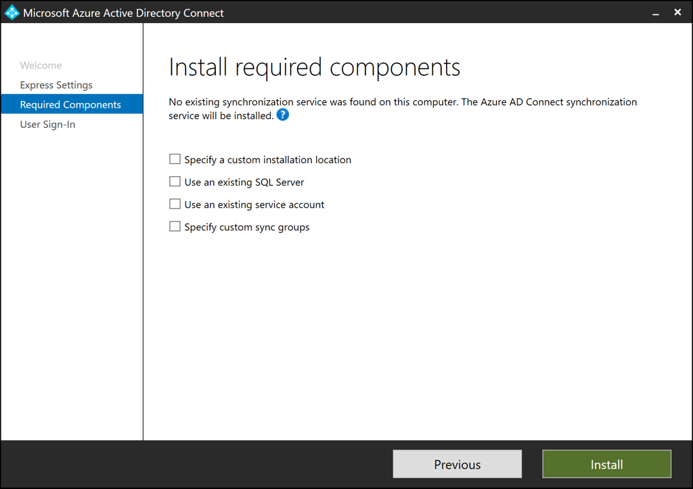

| Optional Configuration | Description |
| --- | --- |
| Use an existing SQL Server |Allows you to specify the SQL Server name and the instance name. Choose this option if you already have a database server that you would like to use. Enter the instance name followed by a comma and port number in **Instance Name** if your SQL Server does not have browsing enabled.  Then specify the name of the Azure AD Connect database.  Your SQL privileges determine whether a new database will be created or your SQL administrator must create the database in advance.  If you have SQL SA permissions see [How to install using an existing database](how-to-connect-install-existing-database.md).  If you have been delegated permissions (DBO) see [Install Azure AD Connect with SQL delegated administrator permissions](how-to-connect-install-sql-delegation.md). |
| Use an existing service account |By default Azure AD Connect uses a virtual service account for the synchronization services to use. If you use a remote SQL server or use a proxy that requires authentication, you need to use a **managed service account** or use a service account in the domain and know the password. In those cases, enter the account to use. Make sure the user running the installation is an SA in SQL so a login for the service account can be created.  See [Azure AD Connect accounts and permissions](reference-connect-accounts-permissions.md#adsync-service-account).   With the latest build, provisioning the database can now be performed out of band by the SQL administrator and then installed by the Azure AD Connect administrator with database owner rights.  For more information see [Install Azure AD Connect using SQL delegated administrator permissions](how-to-connect-install-sql-delegation.md).|
| Specify custom sync groups |By default Azure AD Connect creates four groups local to the server when the synchronization services are installed. These groups are: Administrators group, Operators group, Browse group, and the Password Reset Group. You can specify your own groups here. The groups must be local on the server and cannot be located in the domain. |

### User sign-in
After installing the required components, you are asked to select your users single sign-on method. The following table provides a brief description of the available options. For a full description of the sign-in methods, see [User sign-in](plan-connect-user-signin.md).

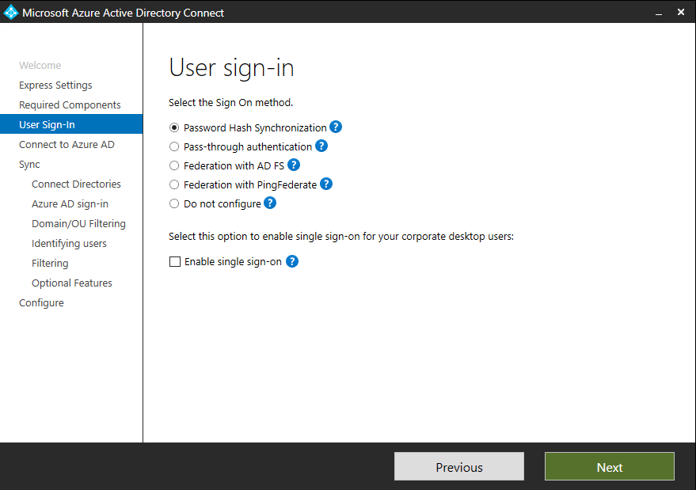

| Single Sign On option | Description |
| --- | --- |
| Password Hash Sync |Users are able to sign in to Microsoft cloud services, such as Office 365, using the same password they use in their on-premises network. The users passwords are synchronized to Azure AD as a password hash and authentication occurs in the cloud. See [Password hash synchronization](how-to-connect-password-hash-synchronization.md) for more information. |
|Pass-through Authentication|Users are able to sign in to Microsoft cloud services, such as Office 365, using the same password they use in their on-premises network.  The users password is passed through to the on-premises Active Directory domain controller to be validated.
| Federation with AD FS |Users are able to sign in to Microsoft cloud services, such as Office 365, using the same password they use in their on-premises network.  The users are redirected to their on-premises AD FS instance to sign in and authentication occurs on-premises. |
| Federation with PingFederate|Users are able to sign in to Microsoft cloud services, such as Office 365, using the same password they use in their on-premises network.  The users are redirected to their on-premises PingFederate instance to sign in and authentication occurs on-premises. |
| Do not configure |No user sign-in feature is installed and configured. Choose this option if you already have a 3rd party federation server or another existing solution in place. |
|Enable Single Sign on|This options is available with both password hash sync and pass-through authentication and provides a single sign on experience for desktop users on the corporate network. See [Single sign-on](how-to-connect-sso.md) for more information.  Note for AD FS customers this option is not available because AD FS already offers the same level of single sign on. 

### Connect to Azure AD
On the Connect to Azure AD screen, enter a global admin account and password. If you selected **Federation with AD FS** on the previous page, do not sign in with an account in a domain you plan to enable for federation. A recommendation is to use an account in the default **onmicrosoft.com** domain, which comes with your Azure AD tenant.

This account is only used to create a service account in Azure AD and is not used after the wizard has completed.  
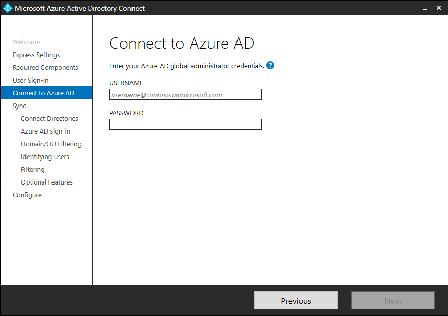

If your global admin account has MFA enabled, then you need to provide the password again in the sign-in popup and complete the MFA challenge. The challenge could be a providing a verification code or a phone call.  
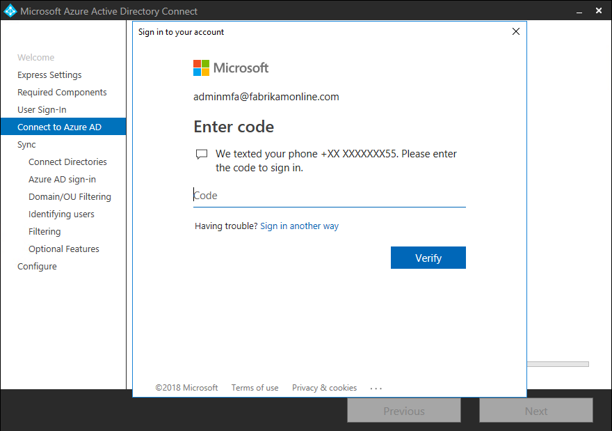

The global admin account can also have [Privileged Identity Management](../privileged-identity-management/pim-getting-started.md) enabled.

If you receive an error and have problems with connectivity, then see [Troubleshoot connectivity problems](tshoot-connect-connectivity.md).

## Pages under the Sync section

### Connect your directories
To connect to your Active Directory Domain Service, Azure AD Connect needs the forest name and credentials of an account with sufficient permissions.

After entering the forest name and clicking  **Add Directory**, a pop-up dialog appears and prompts you with the following options:

| Option | Description |
| --- | --- |
| Create new account | Select this option if you want Azure AD Connect wizard to create the AD DS account required by Azure AD Connect for connecting to the AD forest during directory synchronization. When this option is selected, enter the username and password for an enterprise admin account. The enterprise admin account provided will be used by Azure AD Connect wizard to create the required AD DS account. You can enter the domain part in either NetBios or FQDN format, that is, FABRIKAM\administrator or fabrikam.com\administrator. |
| Use existing account | Select this option if you want to provide an existing AD DS account to be used Azure AD Connect for connecting to the AD forest during directory synchronization. You can enter the domain part in either NetBios or FQDN format, that is, FABRIKAM\syncuser or fabrikam.com\syncuser. This account can be a regular user account because it only needs the default read permissions. However, depending on your scenario, you may need more permissions. For more information, see [Azure AD Connect Accounts and permissions](reference-connect-accounts-permissions.md#create-the-ad-ds-connector-account). |

#### Enterprise Admin and Domain Admin accounts not supported
As of build 1.4.18.0 it is no longer supported to use an Enterprise Admin or a Domain Admin account as the AD DS Connector account.  If you attempt to enter an account that is an enterprise admin or domain admin when specifying **use existing account**, you will receive the following error:

  **“Using  an Enterprise or Domain administrator account for your AD forest account is not allowed.  Let Azure AD Connect create the account for you or specify a synchronization account with the correct permissions.  &lt;Learn More&gt;”**

### Azure AD sign-in configuration
This page allows you to review the UPN domains present in on-premises AD DS and which have been verified in Azure AD. This page also allows you to configure the attribute to use for the userPrincipalName.

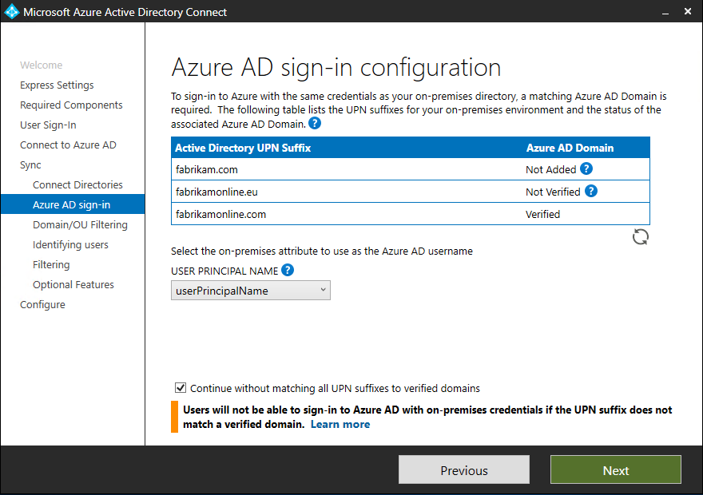  
Review every domain marked **Not Added** and **Not Verified**. Make sure those domains you use have been verified in Azure AD. Click the Refresh symbol when you have verified your domains. For more information, see [add and verify the domain](../active-directory-domains-add-azure-portal.md)

**UserPrincipalName** - The attribute userPrincipalName is the attribute users use when they sign in to Azure AD and Office 365. The domains used, also known as the UPN-suffix, should be verified in Azure AD before the users are synchronized. Microsoft recommends to keep the default attribute userPrincipalName. If this attribute is non-routable and cannot be verified, then it is possible to select another attribute. You can for example select email as the attribute holding the sign-in ID. Using another attribute than userPrincipalName is known as **Alternate ID**. The Alternate ID attribute value must follow the RFC822 standard. An Alternate ID can be used with password hash sync, pass-through authentication, and federation. The attribute must not be defined in Active Directory as multi-valued, even if it only has a single value. For more information on the Alternate ID, see the [Frequently asked questions](https://docs.microsoft.com/azure/active-directory/hybrid/how-to-connect-pta-faq#does-pass-through-authentication-support-alternate-id-as-the-username-instead-of-userprincipalname) topic.

>[!NOTE]
> When you enable Pass-through Authentication you must have at least one verified domain in order to continue through the wizard.

> [!WARNING]
> Using an Alternate ID is not compatible with all Office 365 workloads. For more information, refer to [Configuring Alternate Login ID](https://docs.microsoft.com/windows-server/identity/ad-fs/operations/configuring-alternate-login-id).
>
>

### Domain and OU filtering
By default all domains and OUs are synchronized. If there are some domains or OUs you do not want to synchronize to Azure AD, you can unselect these domains and OUs.  
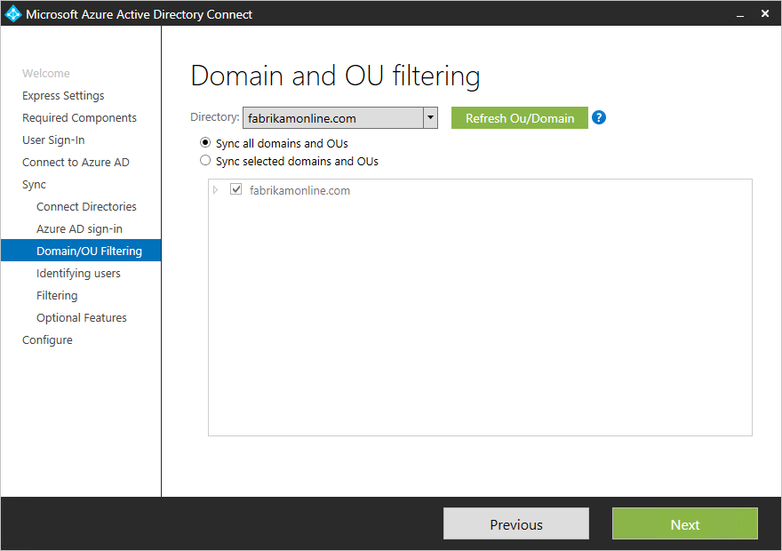  
This page in the wizard is configuring domain-based and OU-based filtering. If you plan to make changes, then see [domain-based filtering](how-to-connect-sync-configure-filtering.md#domain-based-filtering) and [ou-based filtering](how-to-connect-sync-configure-filtering.md#organizational-unitbased-filtering) before you make these changes. Some OUs are essential for the functionality and should not be unselected.

If you use OU-based filtering with Azure AD Connect version before 1.1.524.0, new OUs added later are synchronized by default. If you want the behavior that new OUs should not be synchronized, then you can configure it after the wizard has completed with [ou-based filtering](how-to-connect-sync-configure-filtering.md#organizational-unitbased-filtering). For Azure AD Connect version 1.1.524.0 or after, you can indicate whether you want new OUs to be synchronized or not.

If you plan to use [group-based filtering](#sync-filtering-based-on-groups), then make sure the OU with the group is included and not filtered with OU-filtering. OU filtering is evaluated before group-based filtering.

It is also possible that some domains are not reachable due to firewall restrictions. These domains are unselected by default and have a warning.  
  
If you see this warning, make sure that these domains are indeed unreachable and the warning is expected.

### Uniquely identifying your users

#### Select how users should be identified in your on-premises directories
The Matching across forests feature allows you to define how users from your AD DS forests are represented in Azure AD. A user might either be represented only once across all forests or have a combination of enabled and disabled accounts. The user might also be represented as a contact in some forests.

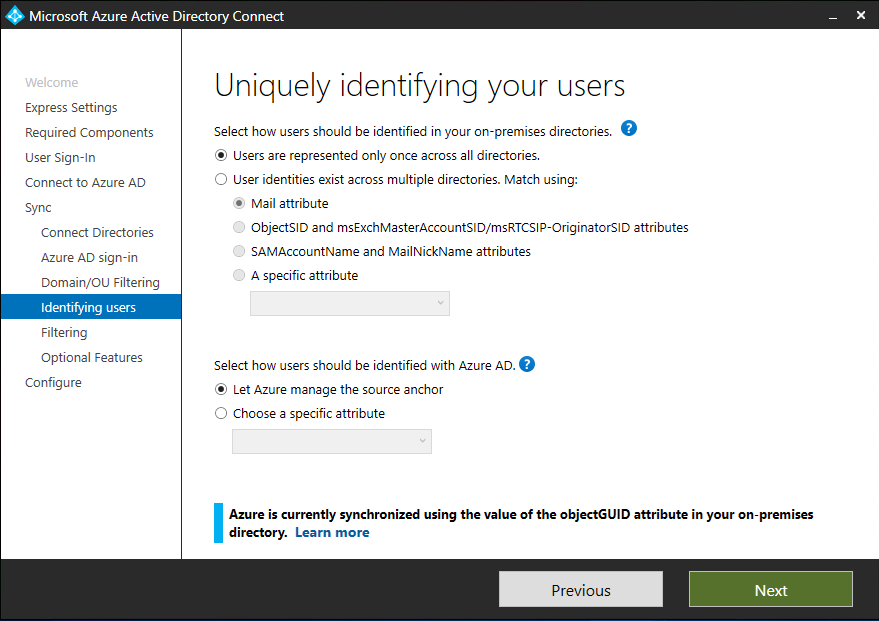

| Setting | Description |
| --- | --- |
| [Users are only represented once across all forests](plan-connect-topologies.md#multiple-forests-single-azure-ad-tenant) |All users are created as individual objects in Azure AD. The objects are not joined in the metaverse. |
| [Mail attribute](plan-connect-topologies.md#multiple-forests-single-azure-ad-tenant) |This option joins users and contacts if the mail attribute has the same value in different forests. Use this option when your contacts have been created using GALSync. If this option is chosen, User objects whose Mail attribute aren't populated will not be synchronized to Azure AD. |
| [ObjectSID and msExchangeMasterAccountSID/ msRTCSIP-OriginatorSid](plan-connect-topologies.md#multiple-forests-single-azure-ad-tenant) |This option joins an enabled user in an account forest with a disabled user in a resource forest. In Exchange, this configuration is known as a linked mailbox. This option can also be used if you only use Lync and Exchange is not present in the resource forest. |
| sAMAccountName and MailNickName |This option joins on attributes where it is expected the sign-in ID for the user can be found. |
| A specific attribute |This option allows you to select your own attribute. If this option is chosen, User objects whose (selected) attribute aren't populated will not be synchronized to Azure AD. **Limitation:** Only attributes that can already be found in the metaverse are available for this option.". |

#### Select how users should be identified with Azure AD - Source Anchor
The attribute sourceAnchor is an attribute that is immutable during the lifetime of a user object. It is the primary key linking the on-premises user with the user in Azure AD.

| Setting | Description |
| --- | --- |
| Let Azure manage the source anchor for me | Select this option if you want Azure AD to pick the attribute for you. If you select this option, Azure AD Connect wizard applies the sourceAnchor attribute selection logic described in article section [Azure AD Connect: Design concepts - Using ms-DS-ConsistencyGuid as sourceAnchor](plan-connect-design-concepts.md#using-ms-ds-consistencyguid-as-sourceanchor). The wizard informs you which attribute has been picked as the Source Anchor attribute after Custom installation completes. |
| A specific attribute | Select this option if you wish to specify an existing AD attribute as the sourceAnchor attribute. |

Since the attribute cannot be changed, you must plan for a good attribute to use. A good candidate is objectGUID. This attribute is not changed, unless the user account is moved between forests/domains. Avoid attributes that would change when a person marries or change assignments. You cannot use attributes with an @-sign, so email and userPrincipalName cannot be used. The attribute is also case-sensitive so when you move an object between forests, make sure to preserve the upper/lower case. Binary attributes are base64-encoded, but other attribute types remain in its unencoded state. In federation scenarios and some Azure AD interfaces, this attribute is also known as immutableID. More information about the source anchor can be found in the [design concepts](plan-connect-design-concepts.md#sourceanchor).

### Sync filtering based on groups
The filtering on groups feature allows you to sync only a small subset of objects for a pilot. To use this feature, create a group for this purpose in your on-premises Active Directory. Then add users and groups that should be synchronized to Azure AD as direct members. You can later add and remove users to this group to maintain the list of objects that should be present in Azure AD. All objects you want to synchronize must be a direct member of the group. Users, groups, contacts, and computers/devices must all be direct members. Nested group membership is not resolved. When you add a group as a member, only the group itself is added and not its members.

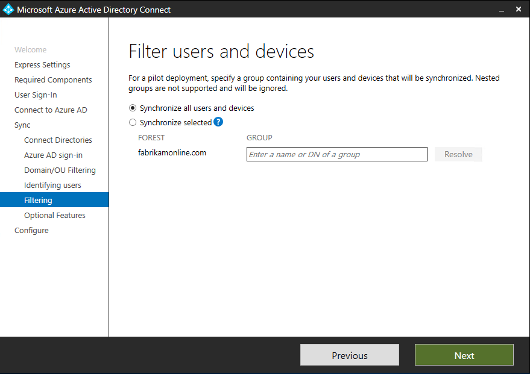

> [!WARNING]
> This feature is only intended to support a pilot deployment. Do not use it in a full-blown production deployment.
>
>

In a full-blown production deployment, it is going to be hard to maintain a single group with all objects to synchronize. Instead you should use one of the methods in [Configure filtering](how-to-connect-sync-configure-filtering.md).

### Optional Features
This screen allows you to select the optional features for your specific scenarios.

>[!WARNING]
>Azure AD Connect versions **1.0.8641.0** and older rely on the Azure Access Control service for password writeback.  This service will be retired on **November 7th 2018**.  If you are using any of these versions of Azure AD Connect and have enabled password writeback, users may lose the ability to change or reset their passwords once the service is retired. Password writeback with these versions of Azure AD Connect will not be supported.
>
>For more information on the Azure Access Control service see [How to: Migrate from the Azure Access Control service](../azuread-dev/active-directory-acs-migration.md)
>
>To download the latest version of Azure AD Connect click [here](https://www.microsoft.com/download/details.aspx?id=47594).

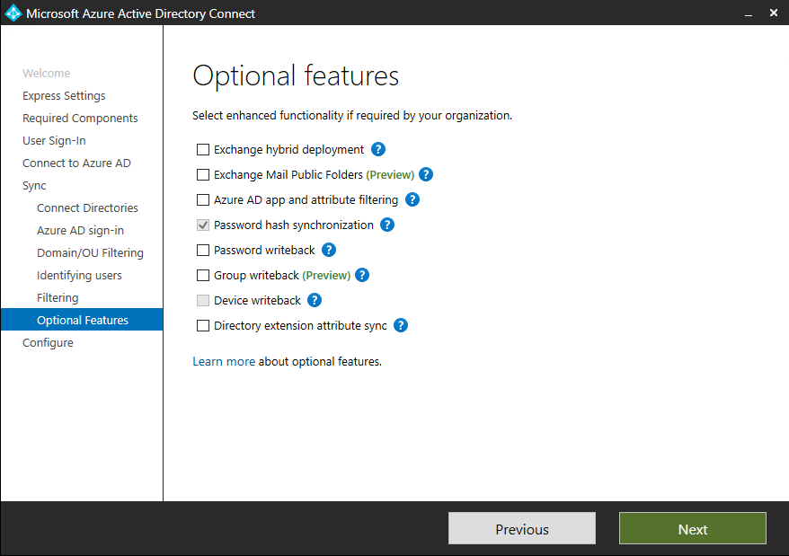

> [!WARNING]
> If you currently have DirSync or Azure AD Sync active, do not activate any of the writeback features in Azure AD Connect.

| Optional Features | Description |
| --- | --- |
| Exchange Hybrid Deployment |The Exchange Hybrid Deployment feature allows for the co-existence of Exchange mailboxes both on-premises and in Office 365. Azure AD Connect is synchronizing a specific set of [attributes](reference-connect-sync-attributes-synchronized.md#exchange-hybrid-writeback) from Azure AD back into your on-premises directory. |
| Exchange Mail Public Folders | The Exchange Mail Public Folders feature allows you to synchronize mail-enabled Public Folder objects from your on-premises Active Directory to Azure AD. |
| Azure AD app and attribute filtering |By enabling Azure AD app and attribute filtering, the set of synchronized attributes can be tailored. This option adds two more configuration pages to the wizard. For more information, see [Azure AD app and attribute filtering](#azure-ad-app-and-attribute-filtering). |
| Password hash synchronization |If you selected federation as the sign-in solution, then you can enable this option. Password hash synchronization can then be used as a backup option. For additional information, see [Password hash synchronization](how-to-connect-password-hash-synchronization.md).   If you selected Pass-through Authentication this option can also be enabled to ensure support for legacy clients and as a backup option. For additional information, see [Password hash synchronization](how-to-connect-password-hash-synchronization.md).|
| Password writeback |By enabling password writeback, password changes that originate in Azure AD is written back to your on-premises directory. For more information, see [Getting started with password management](../authentication/quickstart-sspr.md). |
| Group writeback |If you use the **Office 365 Groups** feature, then you can have these groups represented in your on-premises Active Directory. This option is only available if you have Exchange present in your on-premises Active Directory. For more information see [Azure AD Connect group writeback](how-to-connect-group-writeback.md)|
| Device writeback |Allows you to writeback device objects in Azure AD to your on-premises Active Directory for Conditional Access scenarios. For more information, see [Enabling device writeback in Azure AD Connect](how-to-connect-device-writeback.md). |
| Directory extension attribute sync |By enabling directory extensions attribute sync, attributes specified are synced to Azure AD. For more information, see [Directory extensions](how-to-connect-sync-feature-directory-extensions.md). |

### Azure AD app and attribute filtering
If you want to limit which attributes to synchronize to Azure AD, then start by selecting which services you are using. If you make configuration changes on this page, a new service has to be selected explicitly by rerunning the installation wizard.

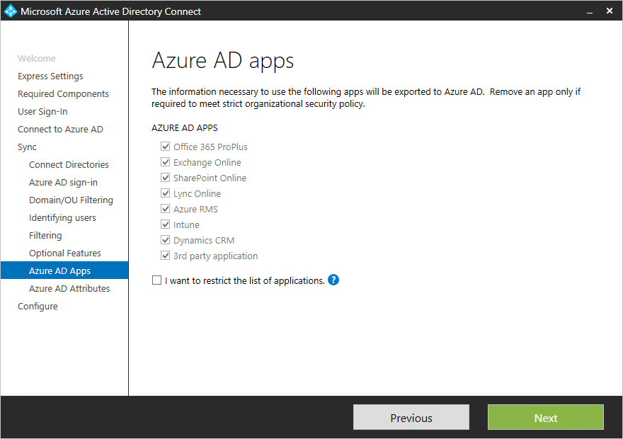

Based on the services selected in the previous step, this page shows all attributes that are synchronized. This list is a combination of all object types being synchronized. If there are some particular attributes you need to not synchronize, you can unselect those attributes.

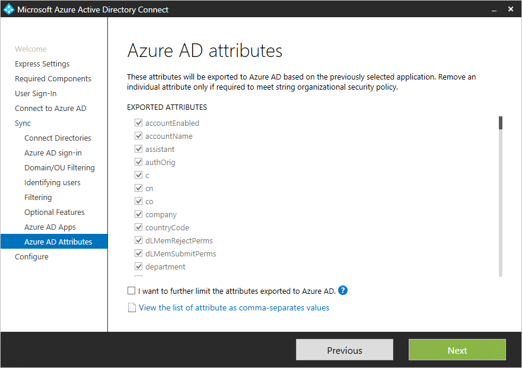

> [!WARNING]
> Removing attributes can impact functionality. For best practices and recommendations, see [attributes synchronized](reference-connect-sync-attributes-synchronized.md#attributes-to-synchronize).
>
>

### Directory Extension attribute sync
You can extend the schema in Azure AD with custom attributes added by your organization or other attributes in Active Directory. To use this feature, select **Directory Extension attribute sync** on the **Optional Features** page. You can select more attributes to sync on this page.

>[!NOTE]
>The Available attributes box is case sensitive.

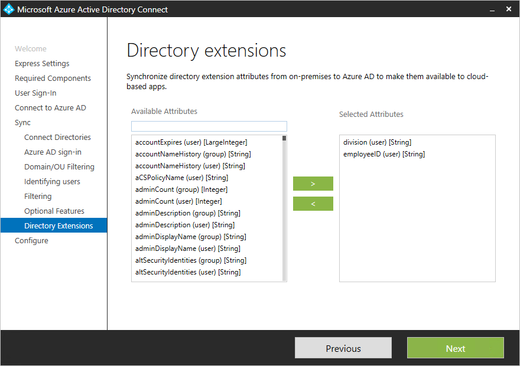

For more information, see [Directory extensions](how-to-connect-sync-feature-directory-extensions.md).

### Enabling Single sign on (SSO)
Configuring single sign-on for use with Password Synchronization or Pass-through authentication is a simple process that you only need to complete once for each forest that is being synchronized to Azure AD. Configuration involves two steps as follows:

1.	Create the necessary computer account in your on-premises Active Directory.
2.	Configure the intranet zone of the client machines to support single sign on.

#### Create the computer account in Active Directory
For each forest that has been added in Azure AD Connect, you will need to supply Domain Administrator credentials so that the computer account can be created in each forest. The credentials are only used to create the account and are not stored or used for any other operation. Simply add the credentials on the **Enable Single sign on** page of the Azure AD Connect wizard as shown:

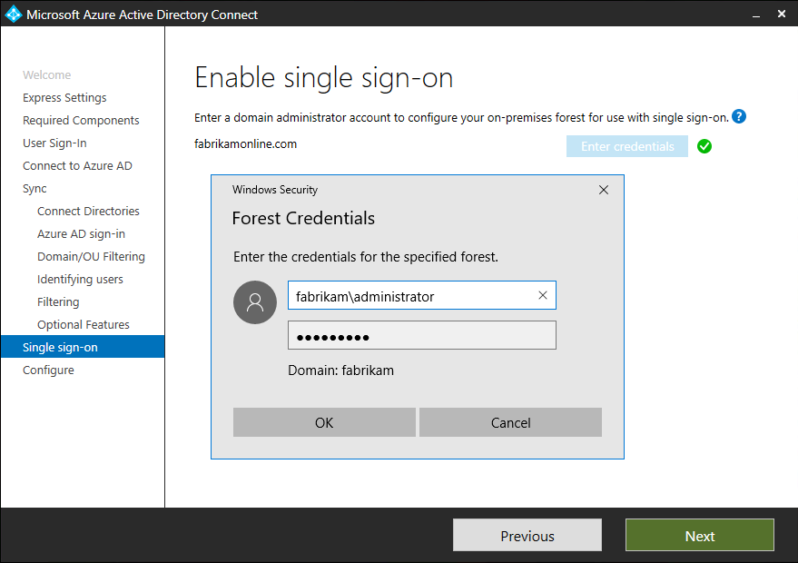

>[!NOTE]
>You can skip a particular forest if you do not wish to use Single sign on with that forest.

#### Configure the Intranet Zone for client machines
To ensure that the client sign-ins automatically in the intranet zone you need to ensure that the URL is part of the intranet zone. This ensures that the domain joined computer automatically sends a Kerberos ticket to Azure AD when it is connected to the corporate network.
On a computer that has the Group Policy management tools.

1.	Open the Group Policy Management tools
2.	Edit the Group policy that will be applied to all users. For example, the Default Domain Policy.
3.	Navigate to **User Configuration\Administrative Templates\Windows Components\Internet Explorer\Internet Control Panel\Security Page** and select **Site to Zone Assignment List** per the image below.
4.	Enable the policy, and enter the following item in the dialog box.

		Value: `https://autologon.microsoftazuread-sso.com`  
		Data: 1  

5.	It should look similar to the following:  

6.	Click **Ok** twice.

## Configuring federation with AD FS
Configuring AD FS with Azure AD Connect is simple and only requires a few clicks. The following is required before the configuration.

* A Windows Server 2012 R2 or later server for the federation server with remote management enabled
* A Windows Server 2012 R2 or later server for the Web Application Proxy server with remote management enabled
* A TLS/SSL certificate for the federation service name you intend to use (for example sts.contoso.com)

>[!NOTE]
>You can update a TLS/SSL certificate for your AD FS farm using Azure AD Connect even if you do not use it to manage your federation trust.

### AD FS configuration pre-requisites
To configure your AD FS farm using Azure AD Connect, ensure WinRM is enabled on the remote servers. Make sure you have completed the other tasks in [federation prerequisites](how-to-connect-install-prerequisites.md#prerequisites-for-federation-installation-and-configuration). In addition, go through the ports requirement listed in [Table 3 - Azure AD Connect and Federation Servers/WAP](reference-connect-ports.md#table-3---azure-ad-connect-and-ad-fs-federation-serverswap).

### Create a new AD FS farm or use an existing AD FS farm
You can use an existing AD FS farm or you can choose to create a new AD FS farm. If you choose to create a new one, you are required to provide the TLS/SSL certificate. If the TLS/SSL certificate is protected by a password, you are prompted for the password.

If you choose to use an existing AD FS farm, you are taken directly to the configuring the trust relationship between AD FS and Azure AD screen.

>[!NOTE]
>Azure AD Connect can be used to manage only one AD FS farm. If you have existing federation trust with Azure AD configured on the selected AD FS farm, the trust will be re-created again from scratch by Azure AD Connect.

### Specify the AD FS servers
Enter the servers that you want to install AD FS on. You can add one or more servers based on your capacity planning needs. Join all AD FS servers (not required for the WAP servers) to Active Directory before you perform this configuration. Microsoft recommends installing a single AD FS server for test and pilot deployments. Then add and deploy more servers to meet your scaling needs by running Azure AD Connect again after initial configuration.

> [!NOTE]
> Ensure that all your servers are joined to an AD domain before you do this configuration.
>
>

### Specify the Web Application Proxy servers
Enter the servers that you want as your Web Application proxy servers. The web application proxy server is deployed in your DMZ (extranet facing) and supports authentication requests from the extranet. You can add one or more servers based on your capacity planning needs. Microsoft recommends installing a single Web application proxy server for test and pilot deployments. Then add and deploy more servers to meet your scaling needs by running Azure AD Connect again after initial configuration. We recommend having an equivalent number of proxy servers to satisfy authentication from the intranet.

> [!NOTE]
> <li> If the account you use is not a local admin on the WAP servers, then you are prompted for admin credentials.</li>
> <li> Ensure that there is HTTP/HTTPS connectivity between the Azure AD Connect server and the Web Application Proxy server before you run this step.</li>
> <li> Ensure that there is HTTP/HTTPS connectivity between the Web Application Server and the AD FS server to allow authentication requests to flow through.</li>
>
>

You are prompted to enter credentials so that the web application server can establish a secure connection to the AD FS server. These credentials need to be a local administrator on the AD FS server.

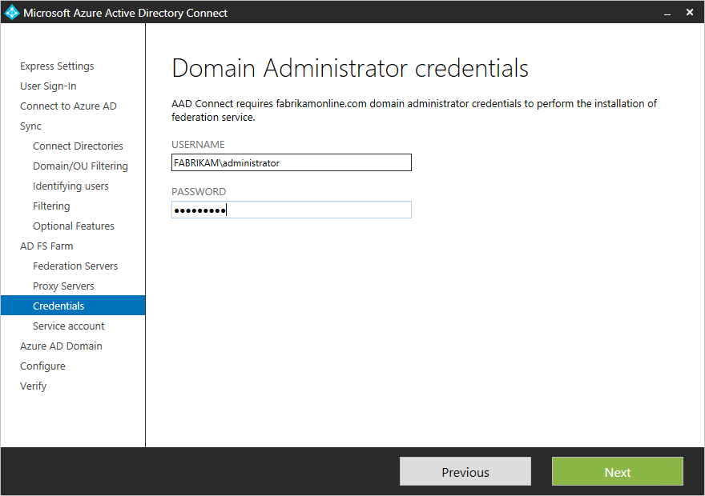

### Specify the service account for the AD FS service
The AD FS service requires a domain service account to authenticate users and lookup user information in Active Directory. It can support two types of service accounts:

* **Group Managed Service Account** - Introduced in Active Directory Domain Services with Windows Server 2012. This type of account provides services, such as AD FS, a single account without needing to update the account password regularly. Use this option if you already have Windows Server 2012 domain controllers in the domain that your AD FS servers belong to.
* **Domain User Account** - This type of account requires you to provide a password and regularly update the password when the password changes or expires. Use this option only when you do not have Windows Server 2012 domain controllers in the domain that your AD FS servers belong to.

If you selected Group Managed Service Account and this feature has never been used in Active Directory, you are prompted for Enterprise Admin credentials. These credentials are used to initiate the key store and enable the feature in Active Directory.

> [!NOTE]
> Azure AD Connect performs a check to detect if the AD FS service is already registered as a SPN in the domain.  AD DS will not allow duplicate SPN’s to be registered at once.  If a duplicate SPN is found, you will not be able to proceed further until the SPN is removed.

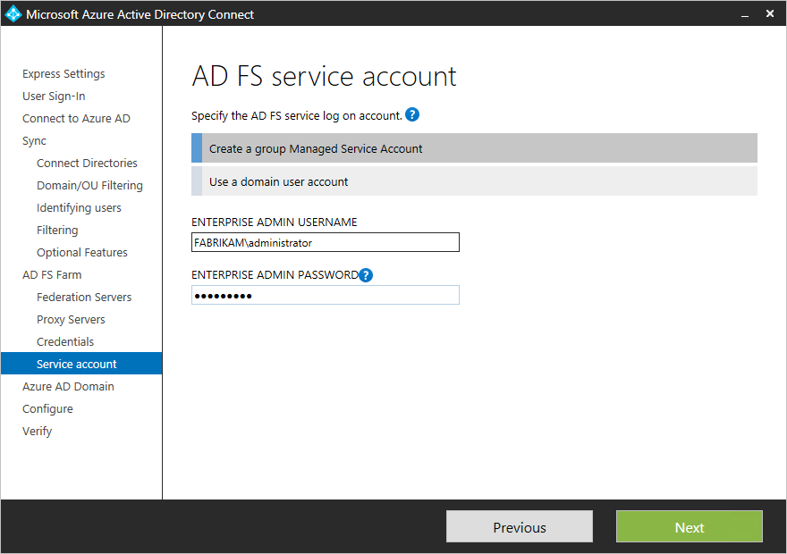

### Select the Azure AD domain that you wish to federate
This configuration is used to setup the federation relationship between AD FS and Azure AD. It configures AD FS to issue security tokens to Azure AD and configures Azure AD to trust the tokens from this specific AD FS instance. This page only allows you to configure a single domain in the initial installation. You can configure more domains later by running Azure AD Connect again.

### Verify the Azure AD domain selected for federation
When you select the domain to be federated, Azure AD Connect provides you with necessary information to verify an unverified domain. See [Add and verify the domain](../active-directory-domains-add-azure-portal.md) for how to use this information.

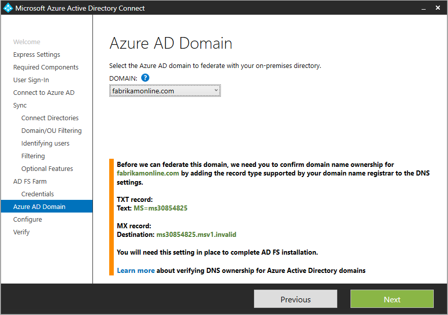

> [!NOTE]
> AD Connect tries to verify the domain during the configure stage. If you continue to configure without adding the necessary DNS records, the wizard is not able to complete the configuration.
>
>

## Configuring federation with PingFederate
Configuring PingFederate with Azure AD Connect is simple and only requires a few clicks. However, the following prerequisites are required.
- PingFederate 8.4 or higher.  For more information see [PingFederate Integration with Azure Active Directory and Office 365](https://docs.pingidentity.com/bundle/O365IG20_sm_integrationGuide/page/O365IG_c_integrationGuide.html)
- A TLS/SSL certificate for the federation service name you intend to use (for example sts.contoso.com)

### Verify the domain
After selecting Federation with PingFederate, you will be asked to verify the domain you want to federate.  Select the domain from the drop-down box.

### Export the PingFederate settings

PingFederate must be configured as the federation server for each federated Azure domain.  Click the Export Settings button and share this information with your PingFederate administrator.  The federation server administrator will update the configuration, then provide the PingFederate server URL and port number so Azure AD Connect can verify the metadata settings.  

Contact your PingFederate administrator to resolve any validation issues.  The following is an example of a PingFederate server that does not have a valid trust relationship with Azure:

### Verify federation connectivity
Azure AD Connect will attempt to validate the authentication endpoints retrieved from the PingFederate metadata in the previous step.  Azure AD Connect will first attempt to resolve the endpoints using your local DNS servers.  Next it will attempt to resolve the endpoints using an external DNS provider.  Contact your PingFederate administrator to resolve any validation issues.  

### Verify federation login
Finally, you can verify the newly configured federated login flow by signing in to the federated domain. When this succeeds, the federation with PingFederate is successfully configured.

## Configure and verify pages
The configuration happens on this page.

> [!NOTE]
> Before you continue installation and if you configured federation, make sure that you have configured [Name resolution for federation servers](how-to-connect-install-prerequisites.md#name-resolution-for-federation-servers).
>
>

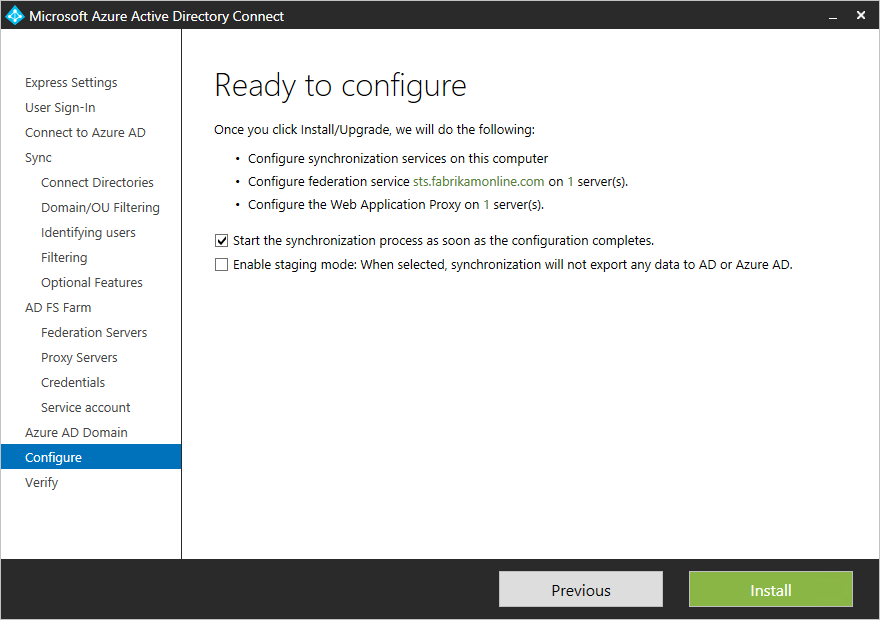

### Staging mode
It is possible to setup a new sync server in parallel with staging mode. It is only supported to have one sync server exporting to one directory in the cloud. But if you want to move from another server, for example one running DirSync, then you can enable Azure AD Connect in staging mode. When enabled, the sync engine import and synchronize data as normal, but it does not export anything to Azure AD or AD. The features password sync and password writeback are disabled while in staging mode.

While in staging mode, it is possible to make required changes to the sync engine and review what is about to be exported. When the configuration looks good, run the installation wizard again and disable staging mode. Data is now exported to Azure AD from this server. Make sure to disable the other server at the same time so only one server is actively exporting.

For more information, see [Staging mode](how-to-connect-sync-staging-server.md).

### Verify your federation configuration
Azure AD Connect verifies the DNS settings for you when you click the Verify button.

**Intranet connectivity checks**

* Resolve federation FQDN: Azure AD Connect checks if the  federation FQDN can be resolved by DNS to ensure connectivity. If Azure AD Connect cannot resolve the FQDN, the verification will fail. Ensure that a DNS record is present for the federation service FQDN in order to successfully complete the verification.
* DNS A record: Azure AD Connect checks if there is an A record for your federation service. In the absence of an A record, the verification will fail. Create an A record and not CNAME record for your federation FQDN in order to successfully complete the verification.

**Extranet connectivity checks**

* Resolve federation FQDN: Azure AD Connect checks if the  federation FQDN can be resolved by DNS to ensure connectivity.

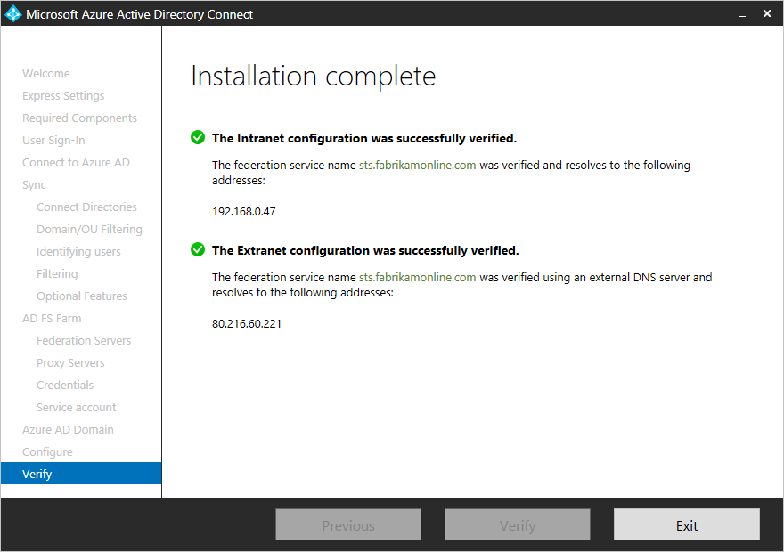

To validate end-to-end authentication is successful you should manually perform one or more the following tests:

* Once synchronization in complete, use the Verify federated login additional task in Azure AD Connect to verify authentication for an on-premises user account of your choice.
* Validate that you can sign in from a browser from a domain joined machine on the intranet: Connect to https://myapps.microsoft.com and verify the sign-in with your logged in account. The built-in AD DS administrator account is not synchronized and cannot be used for verification.
* Validate that you can sign in from a device from the extranet. On a home machine or a mobile device, connect to https://myapps.microsoft.com and supply your credentials.
* Validate rich client sign-in. Connect to https://testconnectivity.microsoft.com, choose the **Office 365** tab and chose the **Office 365 Single Sign-On Test**.

## Troubleshooting
The following section contains troubleshooting and information that you can use if you encounter an issue installing Azure AD Connect.

### “The ADSync database already contains data and cannot be overwritten”
When you custom install Azure AD Connect and select the option **Use an existing SQL server** on the **Install required components** page, you might encounter an error that states **The ADSync database already contains data and cannot be overwritten. Please remove the existing database and try again.**

This is because there is already an existing database named **ADSync** on the SQL instance of the SQL server, which you specified in the above textboxes.

This typically occurs after you have uninstalled Azure AD Connect.  The database will not be deleted from the SQL Server when you uninstall.

To fix this issue, first verify that the **ADSync** database that was used by Azure AD Connect prior to being uninstalled, is no longer being used.

Next, it is recommended that you backup the database prior to deleting it.

Finally, you need to delete the database.  You can do this by using **Microsoft SQL Server Management Studio** and connect to the SQL instance. Find the **ADSync** database, right click on it, and select **Delete** from the context menu.  Then click **OK** button to delete it.

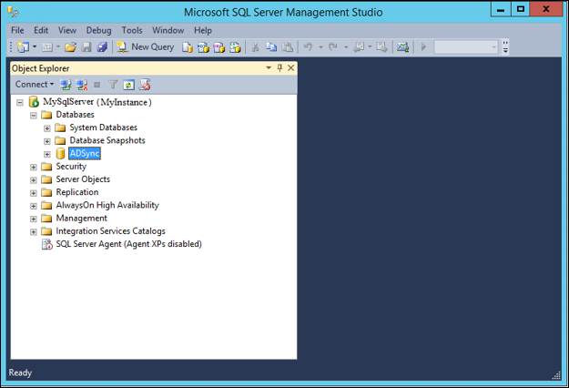

After you delete the **ADSync** database, you can click the **install** button, to retry installation.

## Next steps
After the installation has completed, sign out and sign in again to Windows before you use Synchronization Service Manager or Synchronization Rule Editor.

Now that you have Azure AD Connect installed you can [verify the installation and assign licenses](how-to-connect-post-installation.md).

Learn more about these features, which were enabled with the installation: [Prevent accidental deletes](how-to-connect-sync-feature-prevent-accidental-deletes.md) and [Azure AD Connect Health](how-to-connect-health-sync.md).

Learn more about these common topics: [scheduler and how to trigger sync](how-to-connect-sync-feature-scheduler.md).

Learn more about [Integrating your on-premises identities with Azure Active Directory](whatis-hybrid-identity.md).
