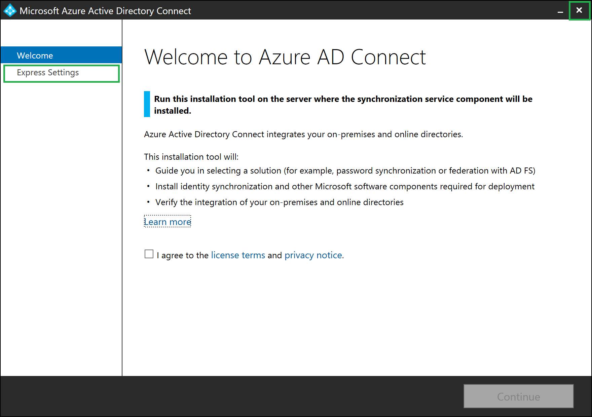
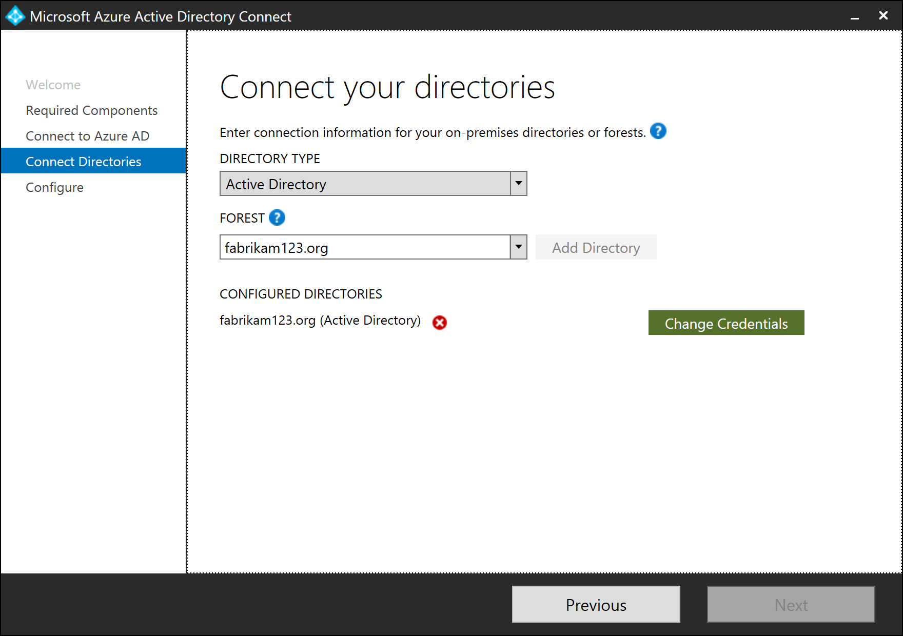
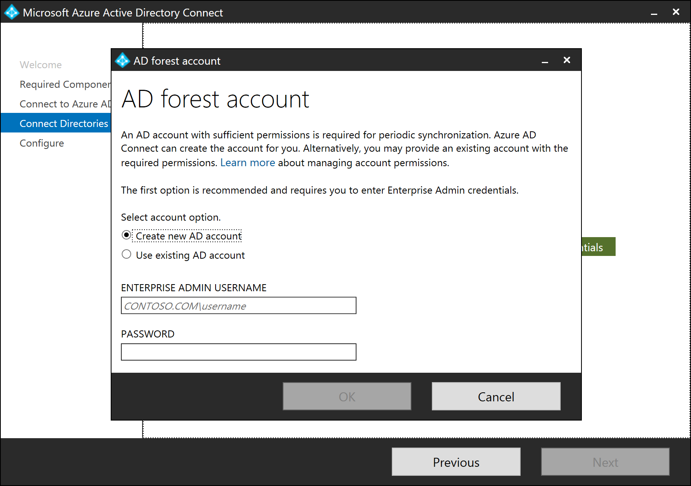

# Install Azure AD Connect using an existing ADSync database
Azure AD Connect requires a SQL Server database to store data. You can either use the default SQL Server 2012 Express LocalDB installed with Azure AD Connect or use your own full version of SQL. Previously, when you installed Azure AD Connect, a new database named ADSync was always created. With Azure AD Connect version 1.1.613.0 (or after), you have the option to install Azure AD Connect by pointing it to an existing ADSync database.

## Benefits of using an existing ADSync database
By pointing to an existing ADSync database:

- Except for credentials information, synchronization configuration stored in the ADSync database (including custom synchronization rules, connectors, filtering, and optional features configuration) is automatically recovered and used during installation. Credentials used by Azure AD Connect to synchronize changes with on-premises AD and Azure AD are encrypted and can only be accessed by the previous Azure AD Connect server.
- All the identity data (associated with connector spaces and metaverse) and synchronization cookies stored in the ADSync database are also recovered. The newly installed Azure AD Connect server can continue to synchronize from where the previous Azure AD Connect server left off, instead of having the need to perform a full sync.

## Scenarios where using an existing ADSync database is beneficial
These benefits are useful in the following scenarios:

- You have an existing Azure AD Connect deployment. Your existing Azure AD Connect server is no longer working but the SQL server containing the ADSync database is still functioning. You can install a new Azure AD Connect server and point it to the existing ADSync database. 
- You have an existing Azure AD Connect deployment. Your SQL server containing the ADSync database is no longer functioning. However, you have a recent back up of the database. You can restore the ADSync database to a new SQL server first. After which, you can install a new Azure AD Connect server and point it to the restored ADSync database.
- You have an existing Azure AD Connect deployment that is using LocalDB. Due to the 10-GB limit imposed by LocalDB, you would like to migrate to full SQL. You can back up the ADSync database from LocalDB and restore it to a SQL server. After which, you can reinstall a new Azure AD Connect server and point it to the restored ADSync database.
- You are trying to set up a staging server and wants to make sure its configuration matches that of the current active server. You can back up the ADSync database and restore it to another SQL server. After which, you can reinstall a new Azure AD Connect server and point it to the restored ADSync database.

## Prerequisite information

Important notes to take note of before you proceed:

- Make sure to review the pre-requisites for installing Azure AD Connect at Hardware and prerequisites, and account and permissions required for installing Azure AD Connect. The permissions required for installing Azure AD Connect using “use existing database” mode is the same as “custom” installation.
- Deploying Azure AD Connect against an existing ADSync database is only supported with full SQL. It is not supported with SQL Express LocalDB. If you have an existing ADSync database in LocalDB that you wish to use, you must first backup the ADSync database (LocalDB) and restore it to full SQL. After which, you can deploy Azure AD Connect against the restored database using this method.
- The version of the Azure AD Connect used for installation must satisfy the following criteria:
	- 1.1.613.0 or above, AND
	- Same or higher than the version of the Azure AD Connect last used with the ADSync database. If the Azure AD Connect version used for installation is higher than the version last used with the ADSync database, then a full sync may be required.  Full sync is required if there are schema or sync rule changes between the two versions. 
- The ADSync database used should contain a synchronization state that is relatively recent. The last synchronization activity with the existing ADSync database should be within the last three weeks.
- When installing Azure AD Connect using “use existing database” method, sign-in method configured on the previous Azure AD Connect server is not preserved. Further, you cannot configure sign-in method during installation. You can only configure sign-in method after installation is complete.
- You cannot have multiple Azure AD Connect servers share the same ADSync database. The “use existing database” method allows you to reuse an existing ADSync database with a new Azure AD Connect server. It does not support sharing.

## Steps to install Azure AD Connect with “use existing database” mode
1.	Download Azure AD Connect installer (AzureADConnect.MSI) to the Windows server. Double-click the Azure AD Connect installer to start installing Azure AD Connect.
2.	Once the MSI installation completes, the Azure AD Connect wizard starts with the Express mode setup. Close the screen by clicking the Exit icon.

3.	Start a new command prompt or PowerShell session. Navigate to folder "C:\Program Files\Microsoft Azure Active Directory Connect". Run command .\AzureADConnect.exe /useexistingdatabase to start the Azure AD Connect wizard in “Use existing database” setup mode.

> [!NOTE]
> Use the switch **/UseExistingDatabase** only when the database already contains data from an earlier Azure AD Connect installation. For instance, when you are moving from a local database to a full SQL Server database or when the Azure AD Connect server was rebuilt and you restored a SQL backup of the ADSync database from an earlier installation of Azure AD Connect. If the database is empty, that is, it doesn't contain any data from a previous Azure AD Connect installation, skip this step.

1. You are greeted with the Welcome to Azure AD Connect screen. Once you agree to the license terms and privacy notice, click **Continue**.
   
1. On the **Install required components** screen, the **Use an existing SQL Server** option is enabled. Specify the name of the SQL server that is hosting the ADSync database. If the SQL engine instance used to host the ADSync database is not the default instance on the SQL server, you must specify the SQL engine instance name. Further, if SQL browsing is not enabled, you must also specify the SQL engine instance port number. For example:         
              

1. On the **Connect to Azure AD** screen, you must provide the credentials of a global admin of your Azure AD directory. The recommendation is to use an account in the default onmicrosoft.com domain. This account is only used to create a service account in Azure AD and is not used after the wizard has completed.
   
 
1. On the **Connect your directories** screen, the existing AD forest configured for directory synchronization is listed with a red cross icon beside it. To synchronize changes from an on-premises AD forest, an AD DS account is required. The Azure AD Connect wizard is unable to retrieve the credentials of the AD DS account stored in the ADSync database because the credentials are encrypted and can only be decrypted by the previous Azure AD Connect server. Click **Change Credentials** to specify the AD DS account for the AD forest.
   
 
1. In the pop-up dialog, you can either (i) provide an Enterprise Admin credential and let Azure AD Connect create the AD DS account for you, or (ii) create the AD DS account yourself and provide its credential to Azure AD Connect. Once you have selected an option and provide the necessary credentials, click **OK** to close the pop-up dialog.
   
 
1. Once the credentials are provided, the red cross icon is replaced with a green tick icon. Click **Next**.
   
 
1. On the **Ready to configure** screen, click **Install**.
   
 
1. Once installation completes, the Azure AD Connect server is automatically enabled for Staging Mode. It is recommended that you review the server configuration and pending exports for unexpected changes before disabling Staging Mode. 

## Post installation tasks
When restoring a database backup created by a version of Azure AD Connect prior to 1.2.65.0, the staging server will automatically select a sign-in method of **Do Not Configure**. While your password hash sync and password writeback preferences will be restored, you must subsequently change the sign-in method to match the other policies in effect for your active synchronization server.  Failure to complete these steps may prevent users from signing in should this server becomes active.  

Use the table below to verify any additional steps that are required.

|Feature|Steps|
|-----|-----|
|Password Hash Synchronization| the Password Hash Synchronization and Password writeback settings are fully restored for versions of Azure AD Connect starting with 1.2.65.0.  If restoring using an older version of Azure AD Connect, review the synchronization option settings for these features to ensure they match your active synchronization server.  No other configuration steps should be necessary.|
|Federation with AD FS|Azure authentications will continue to use the AD FS policy configured for your active synchronization server.  If you use Azure AD Connect to manage your AD FS farm, you may optionally change the sign-in method to AD FS federation in preparation for your standby server becoming the active synchronization instance.   If device options are enabled on the active synchronization server, configure those options on this server by running the "Configure device options" task.|
|Pass-through authentication and Desktop Single Sign-On|Update the sign in method to match the configuration on your active synchronization server.  If this is not followed before promoting the server to primary, pass-through authentication along with Seamless Single Sign on will be disabled and your tenant might be locked out if you don’t have password hash sync as back-up sign in option. Also note that when you enable pass-through authentication in staging mode, a new authentication agent will be installed, registered and will run as a high-availability agent which will accept sign in requests.|
|Federation with PingFederate|Azure authentications will continue to use the PingFederate policy configured for your active synchronization server.  You may optionally change the sign-in method to PingFederate in preparation for your standby server becoming the active synchronization instance.  This step may be deferred until you need to federate additional domains with PingFederate.|

## Next steps

- Now that you have Azure AD Connect installed you can [verify the installation and assign licenses](how-to-connect-post-installation.md).
- Learn more about these features, which were enabled with the installation: [Prevent accidental deletes](how-to-connect-sync-feature-prevent-accidental-deletes.md) and [Azure AD Connect Health](how-to-connect-health-sync.md).
- Learn more about these common topics: [scheduler and how to trigger sync](how-to-connect-sync-feature-scheduler.md).
- Learn more about [Integrating your on-premises identities with Azure Active Directory](whatis-hybrid-identity.md).
