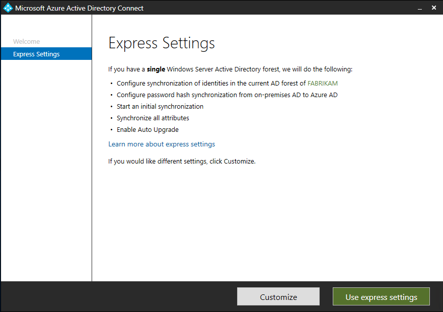
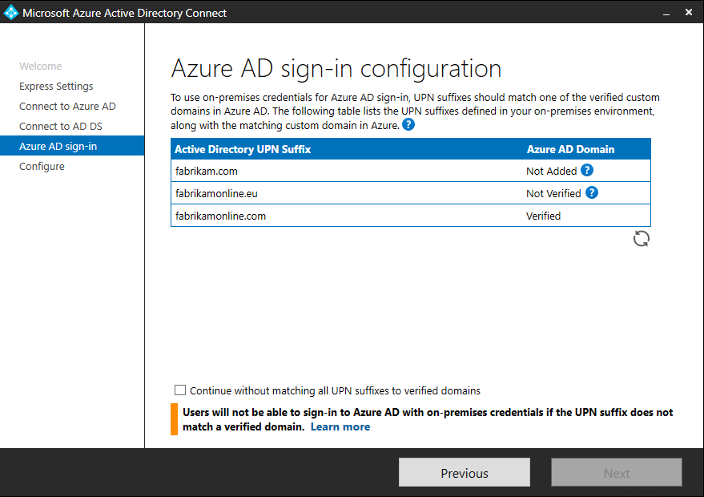
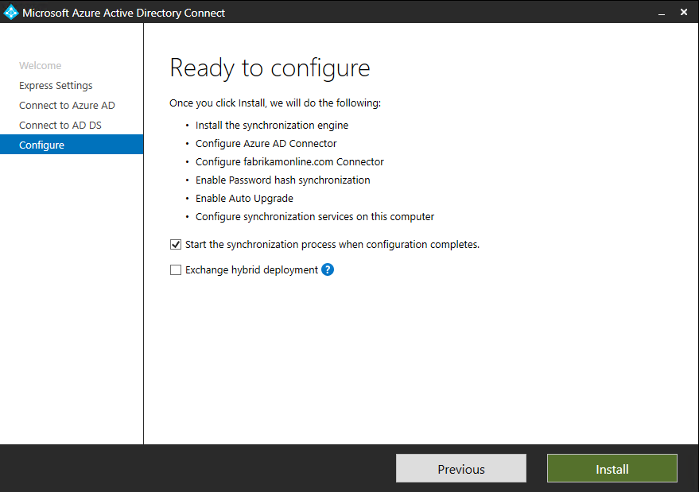

# Getting started with Azure AD Connect using express settings
Azure AD Connect **Express Settings** is used when you have a single-forest topology and [password hash synchronization](how-to-connect-password-hash-synchronization.md) for authentication. **Express Settings** is the default option and is used for the most commonly deployed scenario. You are only a few short clicks away to extend your on-premises directory to the cloud.

Before you start installing Azure AD Connect, make sure to [download Azure AD Connect](https://go.microsoft.com/fwlink/?LinkId=615771) and complete the pre-requisite steps in [Azure AD Connect: Hardware and prerequisites](how-to-connect-install-prerequisites.md).

If express settings does not match your topology, see [related documentation](#related-documentation) for other scenarios.

## Express installation of Azure AD Connect
You can see these steps in action in the [videos](#videos) section.

1. Sign in as a local administrator to the server you wish to install Azure AD Connect on. You should do this on the server you wish to be the sync server.
2. Navigate to and double-click **AzureADConnect.msi**.
3. On the Welcome screen, select the box agreeing to the licensing terms and click **Continue**.  
4. On the Express settings screen, click **Use express settings**.  
   
5. On the Connect to Azure AD screen, enter the username and password of a global administrator for your Azure AD. Click **Next**.  
     
   If you receive an error and have problems with connectivity, then see [Troubleshoot connectivity problems](tshoot-connect-connectivity.md).
6. On the Connect to AD DS screen, enter the username and password for an enterprise admin account. You can enter the domain part in either NetBios or FQDN format, that is, FABRIKAM\administrator or fabrikam.com\administrator. Click **Next**.  
   
7. The [**Azure AD sign-in configuration**](plan-connect-user-signin.md#azure-ad-sign-in-configuration) page only shows if you did not complete [verify your domains](../active-directory-domains-add-azure-portal.md) in the [prerequisites](how-to-connect-install-prerequisites.md).
     
   If you see this page, then review every domain marked **Not Added** and **Not Verified**. Make sure those domains you use have been verified in Azure AD. Click the Refresh symbol when you have verified your domains.
8. On the Ready to configure screen, click **Install**.
   * Optionally on the Ready to configure page, you can unselect the **Start the synchronization process as soon as configuration completes** checkbox. You should unselect this checkbox if you want to do additional configuration, such as [filtering](how-to-connect-sync-configure-filtering.md). If you unselect this option, the wizard configures sync but leaves the scheduler disabled. It does not run until you enable it manually by [rerunning the installation wizard](how-to-connect-installation-wizard.md).
   * Leaving the **Start the synchronization process as soon as configuration completes** checkbox enabled will immediately trigger a full synchronization to Azure AD of all users, groups, and contacts.
   * If you have Exchange in your on-premises Active Directory, then you also have an option to enable [**Exchange Hybrid deployment**](https://technet.microsoft.com/library/jj200581.aspx). Enable this option if you plan to have Exchange mailboxes both in the cloud and on-premises at the same time.
     
9. When the installation completes, click **Exit**.
10. After the installation has completed, sign off and sign in again before you use Synchronization Service Manager or Synchronization Rule Editor.

## Videos
For a video on using the express installation, see:

> [!VIDEO https://channel9.msdn.com/Series/Azure-Active-Directory-Videos-Demos/Azure-Active-Directory-Connect-Express-Settings/player]
>
>

## Next steps
Now that you have Azure AD Connect installed you can [verify the installation and assign licenses](how-to-connect-post-installation.md).

Learn more about these features, which were enabled with the installation: [Automatic upgrade](how-to-connect-install-automatic-upgrade.md), [Prevent accidental deletes](how-to-connect-sync-feature-prevent-accidental-deletes.md), and [Azure AD Connect Health](how-to-connect-health-sync.md).

Learn more about these common topics: [scheduler and how to trigger sync](how-to-connect-sync-feature-scheduler.md).

Learn more about [Integrating your on-premises identities with Azure Active Directory](whatis-hybrid-identity.md).

## Related documentation

| Topic | Link |
| --- | --- |
| Azure AD Connect overview | [Integrate your on-premises directories with Azure Active Directory](whatis-hybrid-identity.md)
| Install using customized settings | [Custom installation of Azure AD Connect](how-to-connect-install-custom.md) |
| Upgrade from DirSync | [Upgrade from Azure AD sync tool (DirSync)](how-to-dirsync-upgrade-get-started.md)|
| Accounts used for installation | [More about Azure AD Connect credentials and permissions](reference-connect-accounts-permissions.md) |
