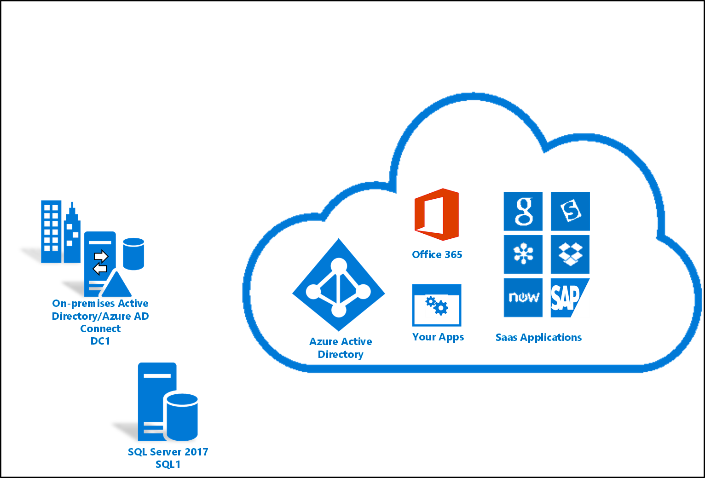
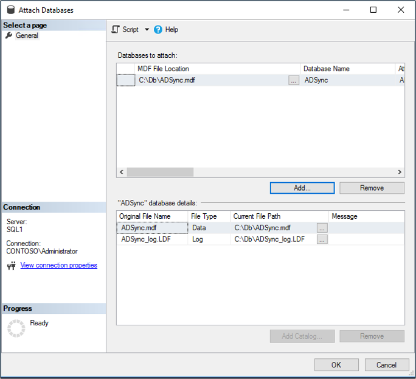
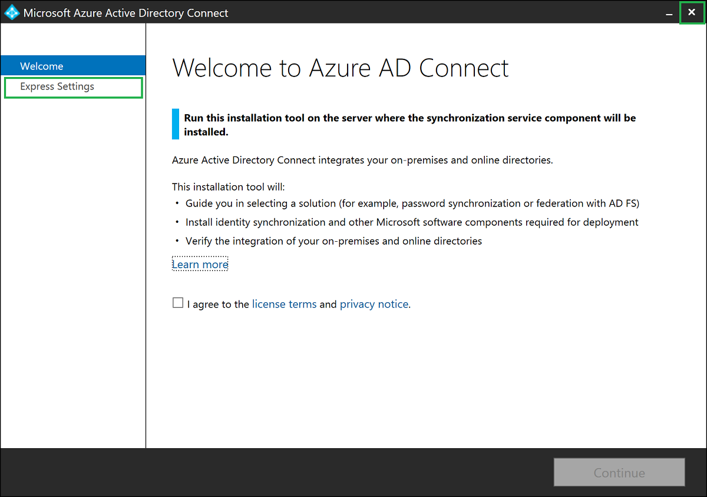
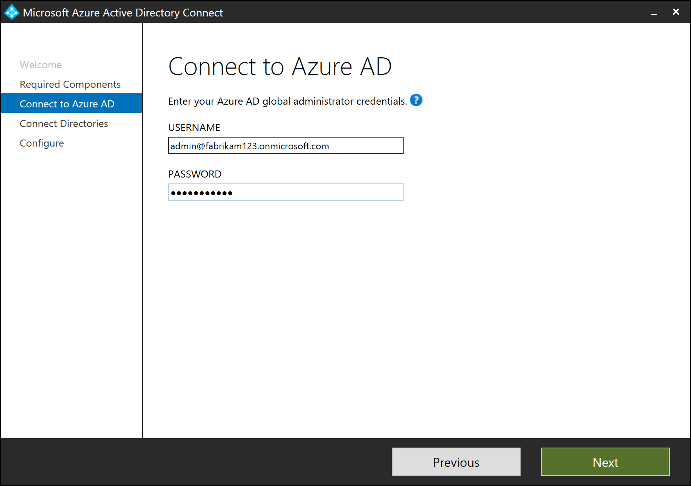
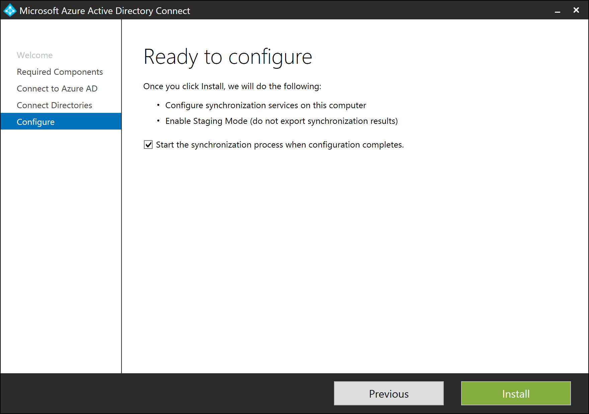

# Move Azure AD Connect database from SQL Server Express to SQL Server 

This document describes how to move the Azure AD Connect database from the local SQL Server Express server to a remote SQL Server.  You can use the following procedures below to accomplish this task.

## About this scenario
The following is some brief information about this scenario.  In this scenario, Azure AD Connect version (1.1.819.0) is installed on a single Windows Server 2016 domain controller.  It is using the built-in SQL Server 2012 Express Edition for its database.  The database will be moved to a SQL Server 2017 server.

## Move the Azure AD Connect database
Use the following steps to move the Azure AD Connect database to a remote SQL Server.

1. On the Azure AD Connect server, go to **Services** and stop the **Microsoft Azure AD Sync** service.
2. Locate the **%Program Files%\Microsoft Azure AD Sync/Data/** folder and copy the **ADSync.mdf** and **ADSync_log.ldf** files to the remote SQL Server.
3. Restart the **Microsoft Azure AD Sync** service on the Azure AD Connect server.
4. Un-install Azure AD Connect by going to Control Panel - - Programs - Programs and Features.  Select Microsoft Azure AD Connect and click uninstall at the top.
5. On the remote SQL server, open SQL Server Management Studio.
6. On Databases, right-click and select Attach.
7. On the **Attach Databases** screen, click **Add** and navigate to the ADSync.mdf file.  Click **OK**.
   

8. Once the database is attached, go back to the Azure AD Connect server and install Azure AD Connect.
9. Once the MSI installation completes, the Azure AD Connect wizard starts with the Express mode setup. Close the screen by clicking the Exit icon.
   
10.	Start a new command prompt or PowerShell session. Navigate to folder \<drive>\program files\Microsoft Azure AD Connect. Run command .\AzureADConnect.exe /useexistingdatabase to start the Azure AD Connect wizard in “Use existing database” setup mode.
    
11.	You are greeted with the Welcome to Azure AD Connect screen. Once you agree to the license terms and privacy notice, click **Continue**.
    
12.	On the **Install required components** screen, the **Use an existing SQL Server** option is enabled. Specify the name of the SQL server that is hosting the ADSync database. If the SQL engine instance used to host the ADSync database is not the default instance on the SQL server, you must specify the SQL engine instance name. Further, if SQL browsing is not enabled, you must also specify the SQL engine instance port number. For example:			
               

13.	On the **Connect to Azure AD** screen, you must provide the credentials of a global admin of your Azure AD directory. The recommendation is to use an account in the default onmicrosoft.com domain. This account is only used to create a service account in Azure AD and is not used after the wizard has completed.
    
 
14.	On the **Connect your directories** screen, the existing AD forest configured for directory synchronization is listed with a red cross icon beside it. To synchronize changes from an on-premises AD forest, an AD DS account is required. The Azure AD Connect wizard is unable to retrieve the credentials of the AD DS account stored in the ADSync database because the credentials are encrypted and can only be decrypted by the previous Azure AD Connect server. Click **Change Credentials** to specify the AD DS account for the AD forest.
    
 
 
15.	In the pop-up dialog, you can either (i) provide an Enterprise Admin credential and let Azure AD Connect create the AD DS account for you, or (ii) create the AD DS account yourself and provide its credential to Azure AD Connect. Once you have selected an option and provide the necessary credentials, click **OK** to close the pop-up dialog.
    
 
 
16.	Once the credentials are provided, the red cross icon is replaced with a green tick icon. Click **Next**.
    
 
 
17.	On the **Ready to configure** screen, click **Install**.
    
 
 
18.	Once installation completes, the Azure AD Connect server is automatically enabled for Staging Mode. It is recommended that you review the server configuration and pending exports for unexpected changes before disabling Staging Mode. 

## Next steps

- Learn more about [Integrating your on-premises identities with Azure Active Directory](whatis-hybrid-identity.md).
- [Install Azure AD Connect using an existing ADSync database](how-to-connect-install-existing-database.md)
- [Install Azure AD Connect using SQL delegated administrator permissions](how-to-connect-install-sql-delegation.md)

