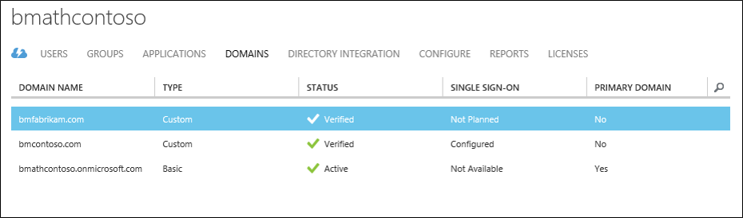
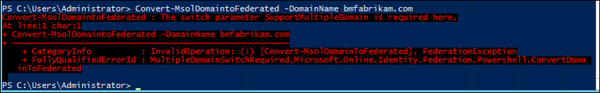
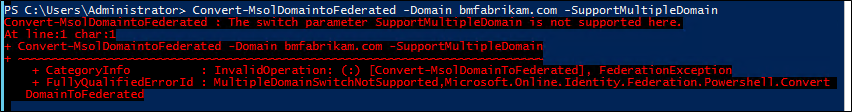
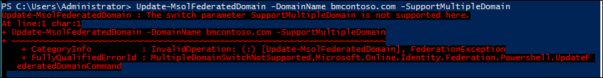

# Multiple Domain Support for Federating with Azure AD
The following documentation provides guidance on how to use multiple top-level domains and subdomains when federating with Office 365 or Azure AD domains.

## Multiple top-level domain support
Federating multiple, top-level domains with Azure AD requires some additional configuration that is not required when federating with one top-level domain.

When a domain is federated with Azure AD, several properties are set on the domain in Azure.  One important one is IssuerUri.  This property is a URI that is used by Azure AD to identify the domain that the token is associated with.  The URI doesn’t need to resolve to anything but it must be a valid URI.  By default, Azure AD sets the URI to the value of the federation service identifier in your on-premises AD FS configuration.

> [!NOTE]
> The federation service identifier is a URI that uniquely identifies a federation service.  The federation service is an instance of AD FS that functions as the security token service.
>
>

You can view the IssuerUri by using the PowerShell command `Get-MsolDomainFederationSettings -DomainName <your domain>`.

A problem arises when you add more than one top-level domain.  For example, let's say you have set up federation between Azure AD and your on-premises environment.  For this document, the domain, bmcontoso.com is being used.  Now a second, top-level domain, bmfabrikam.com has been added.

When you attempt to convert the bmfabrikam.com domain to be federated, an error occurs.  The reason is, Azure AD has a constraint that does not allow the IssuerUri property to have the same value for more than one domain.  

### SupportMultipleDomain Parameter
To work around this constraint, you need to add a different IssuerUri, which can be done by using the `-SupportMultipleDomain` parameter.  This parameter is used with the following cmdlets:

* `New-MsolFederatedDomain`
* `Convert-MsolDomaintoFederated`
* `Update-MsolFederatedDomain`

This parameter makes Azure AD configure the IssuerUri so that it is based on the name of the domain.  The IssuerUri will be unique across directories in Azure AD.  Using the parameter allows the PowerShell command to complete successfully.

Looking at the settings for the bmfabrikam.com domain you can see the following:

`-SupportMultipleDomain` does not change the other endpoints, which are still configured to point to the federation service on adfs.bmcontoso.com.

Another thing that `-SupportMultipleDomain` does is that it ensures that the AD FS system includes the proper Issuer value in tokens issued for Azure AD. This value is set by taking the domain portion of the users UPN and setting it as the domain in the IssuerUri, i.e. https://{upn suffix}/adfs/services/trust.

Thus during authentication to Azure AD or Office 365, the IssuerUri element in the user’s token is used to locate the domain in Azure AD.  If, a match cannot be found, the authentication will fail.

For example, if a user’s UPN is bsimon@bmcontoso.com, the IssuerUri element in the token, AD FS issues, will be set to http://bmcontoso.com/adfs/services/trust. This element will match the Azure AD configuration, and authentication will succeed.

The following is the customized claim rule that implements this logic:

    c:[Type == "http://schemas.xmlsoap.org/claims/UPN"] => issue(Type = "http://schemas.microsoft.com/ws/2008/06/identity/claims/issuerid", Value = regexreplace(c.Value, ".+@(?<domain>.+)", "http://${domain}/adfs/services/trust/"));

> [!IMPORTANT]
> In order to use the -SupportMultipleDomain switch when attempting to add new or convert already existing domains, your federated trust needs to have already been set up to support them.
>
>

## How to update the trust between AD FS and Azure AD
If you did not set up the federated trust between AD FS and your instance of Azure AD, you may need to re-create this trust.  The reason is, when it is originally set up without the `-SupportMultipleDomain` parameter, the IssuerUri is set with the default value.  In the screenshot below, you can see the IssuerUri is set to https://adfs.bmcontoso.com/adfs/services/trust.

If you have successfully added a new domain in the Azure AD portal and then attempt to convert it using `Convert-MsolDomaintoFederated -DomainName <your domain>`, you will get the following error.

If you try to add the `-SupportMultipleDomain` switch, you will receive the following error:

Simply trying to run `Update-MsolFederatedDomain -DomainName <your domain> -SupportMultipleDomain` on the original domain will also result in an error.

Use the steps below to add an additional top-level domain.  If you have already added a domain, and did not use the `-SupportMultipleDomain` parameter, start with the steps for removing and updating your original domain.  If you have not added a top-level domain yet, you can start with the steps for adding a domain using PowerShell of Azure AD Connect.

Use the following steps to remove the Microsoft Online trust and update your original domain.

1. On your AD FS federation server open **AD FS Management.**
2. On the left, expand **Trust Relationships** and **Relying Party Trusts**
3. On the right, delete the **Microsoft Office 365 Identity Platform** entry.
   
4. On a machine that has [Azure Active Directory Module for Windows PowerShell](https://msdn.microsoft.com/library/azure/jj151815.aspx) installed on it run the following: `$cred=Get-Credential`.  
5. Enter the username and password of a global administrator for the Azure AD domain you are federating with.
6. In PowerShell, enter `Connect-MsolService -Credential $cred`
7. In PowerShell, enter `Update-MSOLFederatedDomain -DomainName <Federated Domain Name> -SupportMultipleDomain`.  This update is for the original domain.  So using the above domains it would be:  `Update-MsolFederatedDomain -DomainName bmcontoso.com -SupportMultipleDomain`

Use the following steps to add the new top-level domain using PowerShell

1. On a machine that has [Azure Active Directory Module for Windows PowerShell](https://msdn.microsoft.com/library/azure/jj151815.aspx) installed on it run the following: `$cred=Get-Credential`.  
2. Enter the username and password of a global administrator for the Azure AD domain you are federating with
3. In PowerShell, enter `Connect-MsolService -Credential $cred`
4. In PowerShell, enter `New-MsolFederatedDomain –SupportMultipleDomain –DomainName`

Use the following steps to add the new top-level domain using Azure AD Connect.

1. Launch Azure AD Connect from the desktop or start menu
2. Choose “Add an additional Azure AD Domain”
   
3. Enter your Azure AD and Active Directory credentials
4. Select the second domain you wish to configure for federation.
   
5. Click Install

### Verify the new top-level domain
By using the PowerShell command `Get-MsolDomainFederationSettings -DomainName <your domain>`you can view the updated IssuerUri.  The screenshot below shows the federation settings were updated on the original domain http://bmcontoso.com/adfs/services/trust

And the IssuerUri on the new domain has been set to https://bmfabrikam.com/adfs/services/trust

## Support for subdomains
When you add a subdomain, because of the way Azure AD handled domains, it will inherit the settings of the parent.  So, the IssuerUri, needs to match the parents.

So lets say, for example, that I have bmcontoso.com and then add corp.bmcontoso.com.  The IssuerUri for a user from corp.bmcontoso.com will need to be **http://bmcontoso.com/adfs/services/trust.**  However the standard rule implemented above for Azure AD, will generate a token with an issuer as **http://corp.bmcontoso.com/adfs/services/trust.** which will not match the domain's required value and authentication will fail.

### How To enable support for subdomains
In order to work around this behavior, the AD FS relying party trust for Microsoft Online needs to be updated.  To do this, you must configure a custom claim rule so that it strips off any subdomains from the user’s UPN suffix when constructing the custom Issuer value.

The following claim will do this:

    c:[Type == "http://schemas.xmlsoap.org/claims/UPN"] => issue(Type = "http://schemas.microsoft.com/ws/2008/06/identity/claims/issuerid", Value = regexreplace(c.Value, "^.*@([^.]+\.)*?(?<domain>([^.]+\.?){2})$", "http://${domain}/adfs/services/trust/"));

[!NOTE]
The last number in the regular expression set is how many parent domains there are in your root domain. Here bmcontoso.com is used, so two parent domains are necessary. If three parent domains were to be kept (i.e.: corp.bmcontoso.com), then the number would have been three. Eventually a range can be indicated, the match will always be made to match the maximum of domains. "{2,3}" will match two to three domains (i.e.: bmfabrikam.com and corp.bmcontoso.com).

Use the following steps to add a custom claim to support subdomains.

1. Open AD FS Management
2. Right-click the Microsoft Online RP trust and choose Edit Claim rules
3. Select the third claim rule, and replace
   
4. Replace the current claim:

        c:[Type == "http://schemas.xmlsoap.org/claims/UPN"] => issue(Type = "http://schemas.microsoft.com/ws/2008/06/identity/claims/issuerid", Value = regexreplace(c.Value, ".+@(?<domain>.+)","http://${domain}/adfs/services/trust/"));

       with

        c:[Type == "http://schemas.xmlsoap.org/claims/UPN"] => issue(Type = "http://schemas.microsoft.com/ws/2008/06/identity/claims/issuerid", Value = regexreplace(c.Value, "^.*@([^.]+\.)*?(?<domain>([^.]+\.?){2})$", "http://${domain}/adfs/services/trust/"));

    

5. Click Ok.  Click Apply.  Click Ok.  Close AD FS Management.

## Next steps
Now that you have Azure AD Connect installed you can [verify the installation and assign licenses](how-to-connect-post-installation.md).

Learn more about these features, which were enabled with the installation: [Automatic upgrade](how-to-connect-install-automatic-upgrade.md), [Prevent accidental deletes](how-to-connect-sync-feature-prevent-accidental-deletes.md), and [Azure AD Connect Health](how-to-connect-health-sync.md).

Learn more about these common topics: [scheduler and how to trigger sync](how-to-connect-sync-feature-scheduler.md).

Learn more about [Integrating your on-premises identities with Azure Active Directory](whatis-hybrid-identity.md).