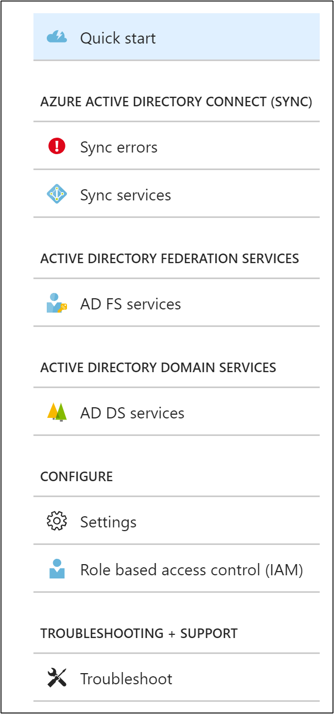

# Azure AD Connect and Azure AD Connect Health installation roadmap

## Install Azure AD Connect

> [!IMPORTANT]
> Microsoft doesn't support modifying or operating Azure AD Connect sync outside of the actions that are formally documented. Any of these actions might result in an inconsistent or unsupported state of Azure AD Connect sync. As a result, Microsoft can't provide technical support for such deployments.

You can find the download for Azure AD Connect on [Microsoft Download Center](https://go.microsoft.com/fwlink/?LinkId=615771).

| Solution | Scenario |
| --- | --- |
| Before you start - [Hardware and prerequisites](how-to-connect-install-prerequisites.md) |<li>Steps to complete before you start to install Azure AD Connect.</li> |
| [Express settings](how-to-connect-install-express.md) |<li>If you have a single forest AD then this is the recommended option to use.</li> <li>User sign in with the same password using password synchronization.</li> |
| [Customized settings](how-to-connect-install-custom.md) |<li>Used when you have multiple forests. Supports many on-premises [topologies](plan-connect-topologies.md).</li> <li>Customize your sign-in option, such as pass-through authentication, ADFS for federation or use a 3rd party identity provider.</li> <li>Customize synchronization features, such as filtering and writeback.</li> |
| [Upgrade from DirSync](how-to-dirsync-upgrade-get-started.md) |<li>Used when you have an existing DirSync server already running.</li> |
| [Upgrade from Azure AD Sync or Azure AD Connect](how-to-upgrade-previous-version.md) |<li>There are several different methods depending on your preference.</li> |

[After installation](how-to-connect-post-installation.md) you should verify it is working as expected and assign licenses to the users.

### Next steps to Install Azure AD Connect
|Topic |Link|  
| --- | --- |
|Download Azure AD Connect | [Download Azure AD Connect](https://go.microsoft.com/fwlink/?LinkId=615771)|
|Install using Express settings | [Express installation of Azure AD Connect](./how-to-connect-install-express.md)|
|Install using Customized settings | [Custom installation of Azure AD Connect](./how-to-connect-install-custom.md)|
|Upgrade from DirSync | [Upgrade from Azure AD sync tool (DirSync)](./how-to-dirsync-upgrade-get-started.md)|
|After installation | [Verify the installation and assign licenses](how-to-connect-post-installation.md)|

### Learn more about Install Azure AD Connect
You also want to prepare for [operational](how-to-connect-sync-operations.md) concerns. You might want to have a stand-by server so you easily can fail over if there is a [disaster](how-to-connect-sync-staging-server.md#disaster-recovery). If you plan to make frequent configuration changes, you should plan for a [staging mode](how-to-connect-sync-staging-server.md) server.

|Topic |Link|  
| --- | --- |
|Supported topologies | [Topologies for Azure AD Connect](plan-connect-topologies.md)|
|Design concepts | [Azure AD Connect design concepts](plan-connect-design-concepts.md)|
|Accounts used for installation | [More about Azure AD Connect credentials and permissions](reference-connect-accounts-permissions.md)|
|Operational planning | [Azure AD Connect sync: Operational tasks and considerations](how-to-connect-sync-operations.md)|
|User sign-in options | [Azure AD Connect User sign-in options](plan-connect-user-signin.md)|

## Configure sync features
Azure AD Connect comes with several features you can optionally turn on or are enabled by default. Some features might sometimes require more configuration in certain scenarios and topologies.

[Filtering](how-to-connect-sync-configure-filtering.md) is used when you want to limit which objects are synchronized to Azure AD. By default all users, contacts, groups, and Windows 10 computers are synchronized. You can change the filtering based on domains, OUs, or attributes.

[Password hash synchronization](how-to-connect-password-hash-synchronization.md) synchronizes the password hash in Active Directory to Azure AD. The  end-user can use the same password on-premises and in the cloud but only manage it in one location. Since it uses your on-premises Active Directory as the authority, you can also use your own password policy.

[Password writeback](../authentication/quickstart-sspr.md) will allow your users to change and reset their passwords in the cloud and have your on-premises password policy applied.

[Device writeback](how-to-connect-device-writeback.md) will allow a device registered in Azure AD to be written back to on-premises Active Directory so it can be used for Conditional Access.

The [prevent accidental deletes](how-to-connect-sync-feature-prevent-accidental-deletes.md) feature is turned on by default and protects your cloud directory from numerous deletes at the same time. By default it allows 500 deletes per run. You can change this setting depending on your organization size.

[Automatic upgrade](how-to-connect-install-automatic-upgrade.md) is enabled by default for express settings installations and ensures your Azure AD Connect is always up to date with the latest release.

### Next steps to configure sync features
|Topic |Link|  
| --- | --- |
|Configure filtering | [Azure AD Connect sync: Configure filtering](how-to-connect-sync-configure-filtering.md)|
|Password hash synchronization | [Password hash synchronization](how-to-connect-password-hash-synchronization.md)|
|Pass-through Authentication | [Pass-through authentication](how-to-connect-pta.md)
|Password writeback | [Getting started with password management](../authentication/quickstart-sspr.md)|
|Device writeback | [Enabling device writeback in Azure AD Connect](how-to-connect-device-writeback.md)|
|Prevent accidental deletes | [Azure AD Connect sync: Prevent accidental deletes](how-to-connect-sync-feature-prevent-accidental-deletes.md)|
|Automatic upgrade | [Azure AD Connect: Automatic upgrade](how-to-connect-install-automatic-upgrade.md)|

## Customize Azure AD Connect sync
Azure AD Connect sync comes with a default configuration that is intended to work for most customers and topologies. But there are always situations where the default configuration does not work and must be adjusted. It is supported to make changes as documented in this section and linked topics.

If you have not worked with a synchronization topology before you want to start to understand the basics and the terms used as described in the [technical concepts](how-to-connect-sync-technical-concepts.md). Azure AD Connect is the evolution of MIIS2003, ILM2007, and FIM2010. Even if some things are identical, a lot has changed as well.

The [default configuration](concept-azure-ad-connect-sync-default-configuration.md) assumes there might be more than one forest in the configuration. In those topologies a user object might be represented as a contact in another forest. The user might also have a linked mailbox in another resource forest. The behavior of the default configuration is described in [users and contacts](concept-azure-ad-connect-sync-user-and-contacts.md).

The configuration model in sync is called [declarative provisioning](concept-azure-ad-connect-sync-declarative-provisioning-expressions.md). The advanced attribute flows are using [functions](reference-connect-sync-functions-reference.md) to express attribute transformations. You can see and examine the entire configuration using tools which comes with Azure AD Connect. If you need to make configuration changes, make sure you follow the [best practices](how-to-connect-sync-best-practices-changing-default-configuration.md) so it is easier to adopt new releases.

### Next steps to customize Azure AD Connect sync
|Topic |Link|  
| --- | --- |
|All Azure AD Connect sync articles | [Azure AD Connect sync](how-to-connect-sync-whatis.md)|
|Technical concepts | [Azure AD Connect sync: Technical Concepts](how-to-connect-sync-technical-concepts.md)|
|Understanding the default configuration | [Azure AD Connect sync: Understanding the default configuration](concept-azure-ad-connect-sync-default-configuration.md)|
|Understanding users and contacts | [Azure AD Connect sync: Understanding Users and Contacts](concept-azure-ad-connect-sync-user-and-contacts.md)|
|Declarative provisioning | [Azure AD Connect Sync: Understanding Declarative Provisioning Expressions](concept-azure-ad-connect-sync-declarative-provisioning-expressions.md)|
|Change the default configuration | [Best practices for changing the default configuration](how-to-connect-sync-best-practices-changing-default-configuration.md)|

## Configure federation features

Azure AD Connect provides several features that simplify federating with Azure AD using AD FS and managing your federation trust. Azure AD Connect supports AD FS on Windows Server 2012R2 or later.

[Update SSL certificate of AD FS farm](how-to-connect-fed-ssl-update.md) even if you are not using Azure AD Connect to manage your federation trust.

[Add an AD FS server](how-to-connect-fed-management.md#addadfsserver) to your farm to expand the farm as required.

[Repair the trust](how-to-connect-fed-management.md#repairthetrust) with Azure AD in a few simple clicks.

ADFS can be configured to support [multiple domains](how-to-connect-install-multiple-domains.md). For example you might have multiple top domains you need to use for federation.

If your ADFS server has not been configured to automatically update certificates from Azure AD or if you use a non-ADFS solution, then you will be notified when you have to [update certificates](how-to-connect-fed-o365-certs.md).

### Next steps to configure federation features
|Topic |Link|  
| --- | --- |
|All AD FS articles | [Azure AD Connect and federation](how-to-connect-fed-whatis.md)|
|Configure ADFS with subdomains | [Multiple Domain Support for Federating with Azure AD](how-to-connect-install-multiple-domains.md)|
|Manage AD FS farm | [AD FS management and customization with Azure AD Connect](how-to-connect-fed-management.md)|
|Manually updating federation certificates | [Renewing Federation Certificates for Office 365 and Azure AD](how-to-connect-fed-o365-certs.md)|

## Get started with Azure AD Connect Health
To get started with Azure AD Connect Health, use the following steps:

1. [Get Azure AD Premium](../fundamentals/active-directory-get-started-premium.md) or [start a trial](https://azure.microsoft.com/trial/get-started-active-directory/).
2. [Download and install Azure AD Connect Health Agents](#download-and-install-azure-ad-connect-health-agent) on your identity servers.
3. View the Azure AD Connect Health dashboard at [https://aka.ms/aadconnecthealth](https://aka.ms/aadconnecthealth).

> [!NOTE]
> Remember that before you see data in your Azure AD Connect Health dashboard, you need to install the Azure AD Connect Health Agents on your targeted servers.
>
>

## Download and install Azure AD Connect Health Agent
* Make sure that you [satisfy the requirements](how-to-connect-health-agent-install.md#requirements) for Azure AD Connect Health.
* Get started using Azure AD Connect Health for AD FS
    * [Download Azure AD Connect Health Agent for AD FS.](https://go.microsoft.com/fwlink/?LinkID=518973)
    * [See the installation instructions](how-to-connect-health-agent-install.md#installing-the-azure-ad-connect-health-agent-for-ad-fs).
* Get started using Azure AD Connect Health for sync
    * [Download and install the latest version of Azure AD Connect](https://go.microsoft.com/fwlink/?linkid=615771). The Health Agent for sync will be installed as part of the Azure AD Connect installation (version 1.0.9125.0 or higher).
* Get started using Azure AD Connect Health for AD DS
    * [Download Azure AD Connect Health Agent for AD DS](https://go.microsoft.com/fwlink/?LinkID=820540).
    * [See the installation instructions](how-to-connect-health-agent-install.md#installing-the-azure-ad-connect-health-agent-for-ad-ds).

## Azure AD Connect Health portal
The Azure AD Connect Health portal shows views of alerts, performance monitoring, and usage analytics. The  https://aka.ms/aadconnecthealth URL takes you to the main blade of Azure AD Connect Health. You can think of a blade as a window. On The main blade, you see **Quick Start**, services within Azure AD Connect Health, and additional configuration options. See the following screenshot and brief explanations that follow the screenshot. After you deploy the agents, the health service automatically identifies the services that Azure AD Connect Health is monitoring.

> [!NOTE]
> For licensing information, see the [Azure AD Connect Health FAQ](reference-connect-health-faq.md) or the [Azure AD Pricing page](https://aka.ms/aadpricing).
    

* **Quick Start**: When you select this option, the **Quick Start** blade opens. You can download the Azure AD Connect Health Agent by selecting **Get Tools**. You can also access documentation and provide feedback.
* **Azure Active Directory Connect (sync)**: This option shows your Azure AD Connect servers that Azure AD Connect Health is currently monitoring. **Sync errors** entry will show basic sync errors of your first onboarded sync service  by categories. When you select the **Sync services** entry, the blade that opens shows information about your Azure AD Connect servers. Read more about the capabilities at [Using Azure AD Connect Health for sync](how-to-connect-health-sync.md).
* **Active Directory Federation Services**: This option shows all the AD FS services that Azure AD Connect Health is currently monitoring. When you select an instance, the blade that opens shows information about that service instance. This information includes an overview, properties, alerts, monitoring, and usage analytics. Read more about the capabilities at [Using Azure AD Connect Health with AD FS](how-to-connect-health-adfs.md).
* **Active Directory Domain Services**: This option shows all the AD DS forests that Azure AD Connect Health is currently monitoring. When you select a forest, the blade that opens shows information about that forest. This information includes an overview of essential information, the Domain Controllers dashboard, the Replication Status dashboard, alerts, and monitoring. Read more about the capabilities at [Using Azure AD Connect Health with AD DS](how-to-connect-health-adds.md).
* **Configure**: This section includes options to turn the following on or off:

  - **Settings** entry includes basic configurations of your agents. Auto upgrade setting enables automatically update the Azure AD Connect Health agent to the latest version: You will be automatically updated to the latest versions of the Azure AD Connect Health Agent when they become available. This is enabled by default. Allow Microsoft access to your Azure AD directory’s health data for troubleshooting purposes only: If this is enabled, Microsoft can see the same data that you see. This information can help with troubleshooting and assistance with issues. This is disabled by default.
* **Role based access control (IAM)** is the section to manage the access to Connect Health data in role base. 

## Next Steps

- [Hardware and prerequisites](how-to-connect-install-prerequisites.md) 
- [Express settings](how-to-connect-install-express.md)
- [Customized settings](how-to-connect-install-custom.md)
- [Password hash synchronization](how-to-connect-password-hash-synchronization.md)|
- [Pass-through authentication](how-to-connect-pta.md)
- [Azure AD Connect and federation](how-to-connect-fed-whatis.md)
- [Install Azure AD Connect Health agents](how-to-connect-health-agent-install.md) 
- [Azure AD Connect sync](how-to-connect-sync-whatis.md)
