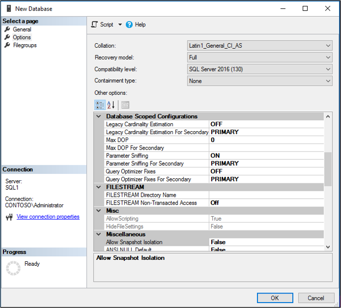

# Install Azure AD Connect using SQL delegated administrator permissions
Prior to the latest Azure AD Connect build, administrative delegation, when deploying configurations that required SQL, was not supported.  Users who wanted to install Azure AD Connect needed to have server administrator (SA) permissions on the SQL server.

With the latest release of Azure AD Connect, provisioning the database can now be performed out of band by the SQL administrator and then installed by the Azure AD Connect administrator with database owner rights.

## Before you begin
To use this feature, you need to realize that there are several moving parts and each one may involve a different administrator in your organization.  The following table summarizes the individual roles and their respective duties in deploying Azure AD Connect with this feature.

|Role|Description|
|-----|-----|
|Domain or Forest AD administrator|Creates the domain level service account that is used by Azure AD Connect to run the sync service.  For more information on service accounts, see [Accounts and permissions](reference-connect-accounts-permissions.md).
|SQL administrator|Creates the ADSync database and grants login + dbo access to the Azure AD Connect administrator and the service account created by the domain/forest admin.|
Azure AD Connect administrator|Installs Azure AD Connect and specifies the service account during custom installation.

## Steps for installing Azure AD Connect using SQL delegated permissions
To provision the database out of band and install Azure AD Connect with database owner permissions, use the following steps.

>[!NOTE]
>Although it is not required, it is **highly recommended** that the Latin1_General_CI_AS collation is selected when creating the database.

1. Have the SQL Administrator create the ADSync database with a case insensitive collation sequence **(Latin1_General_CI_AS)**.  The database must be named **ADSync**.  The recovery model, compatibility level, and containment type are updated to the correct values when Azure AD Connect is installed.  However the collation sequence must be set correctly by the SQL administrator otherwise Azure AD Connect will block the installation.  To recover the SA must delete and recreate the database.
 
   
2. Grant the Azure AD Connect administrator and the domain service account the following permissions:
   - SQL Login 
   - **database owner(dbo)** rights.
 
   

   >[!NOTE]
   >Azure AD Connect does not support logins with a nested membership.  This means your Azure AD Connect administrator account and domain service account must be linked to a login that is granted dbo rights.  It cannot simply be the member of a group that is assigned to a login with dbo rights.

3. Send an email to the Azure AD Connect administrator indicating the SQL server and instance name that should be used when installing Azure AD Connect.

## Additional information
Once the database is provisioned, the Azure AD Connect administrator can install and configure on-premises synchronization at their convenience.

In case the SQL Administrator has restored ADSync database from a previous Azure AD Connect backup, you will need to install the new Azure AD Connect server by using an existing database. For more information on installing Azure AD Connect with an existing database, see [Install Azure AD Connect using an existing ADSync database](how-to-connect-install-existing-database.md).

## Next steps
- [Getting started with Azure AD Connect using express settings](how-to-connect-install-express.md)
- [Custom installation of Azure AD Connect](how-to-connect-install-custom.md)
- [Install Azure AD Connect using an existing ADSync database](how-to-connect-install-existing-database.md)  
