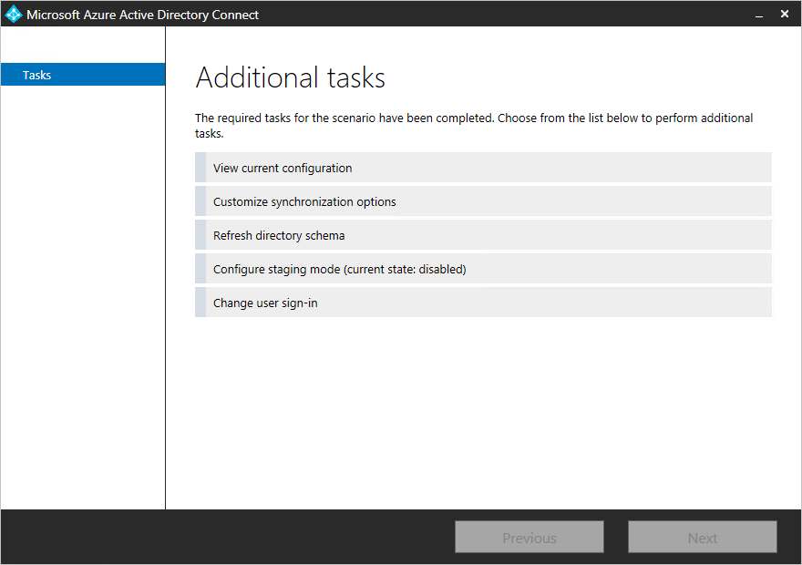
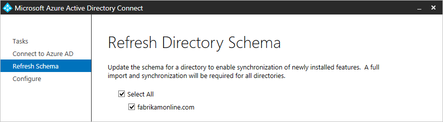
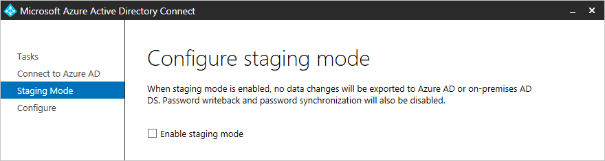

# Azure AD Connect sync: Running the installation wizard a second time
The first time you run the Azure AD Connect installation wizard, it walks you through how to configure your installation. If you run the installation wizard again, it offers options for maintenance.

You can find the installation wizard in the start menu named **Azure AD Connect**.

When you start the installation wizard, you see a page with these options:

If you have installed ADFS with Azure AD Connect, you have even more options. The additional options you have for ADFS are documented in [ADFS management](how-to-connect-fed-management.md#manage-ad-fs).

Select one of the tasks and click **Next** to continue.

> [!IMPORTANT]
> While you have the installation wizard open, all operations in the sync engine are suspended. Make sure you close the installation wizard as soon as you have completed your configuration changes.
>
>

## View current configuration
This option gives you a quick view of your currently configured options.

Click **Previous** to go back. If you select **Exit**, you close the installation wizard.

## Customize synchronization options
This option is used to make changes to the sync configuration. You see a subset of options from the custom configuration installation path. You see this option even if you used express installation initially.

* [Add more directories](how-to-connect-install-custom.md#connect-your-directories). For removing a directory, see [Delete a Connector](how-to-connect-sync-service-manager-ui-connectors.md#delete).
* [Change Domain and OU filtering](how-to-connect-install-custom.md#domain-and-ou-filtering).
* Remove Group filtering.
* [Change optional features](how-to-connect-install-custom.md#optional-features).

The other options from the initial installation cannot be changed and are not available. These options are:

* Change the attribute to use for userPrincipalName and sourceAnchor.
* Change the joining method for objects from different forest.
* Enable group-based filtering.

## Refresh directory schema
This option is used if you have changed the schema in one of your on-premises AD DS forests. For example, you might have installed Exchange or upgraded to a Windows Server 2012 schema with device objects. In this case, you need to instruct Azure AD Connect to read the schema again from AD DS and update its cache. This action also regenerates the Sync Rules. If you add the Exchange schema, as an example, the Sync Rules for Exchange are added to the configuration.

When you select this option, all the directories in your configuration are listed. You can keep the default setting and refresh all forests or unselect some of them.

## Configure staging mode
This option allows you to enable and disable staging mode on the server. More information about staging mode and how it is used can be found in [Operations](how-to-connect-sync-staging-server.md).

The option shows if staging is currently enabled or disabled:  

To change the state, select this option and select or unselect the checkbox.  

## Change user sign-in
This option allows you to change the user sign-in method to and from password hash sync, pass-through authentication or federation. You cannot change to **do not configure**.

For more information on this option, see [user sign-in](plan-connect-user-signin.md#changing-the-user-sign-in-method).

## Next steps
* Learn more about the configuration model used by Azure AD Connect sync in [Understanding Declarative Provisioning](concept-azure-ad-connect-sync-declarative-provisioning.md).

**Overview topics**

* [Azure AD Connect sync: Understand and customize synchronization](how-to-connect-sync-whatis.md)
* [Integrating your on-premises identities with Azure Active Directory](whatis-hybrid-identity.md)
