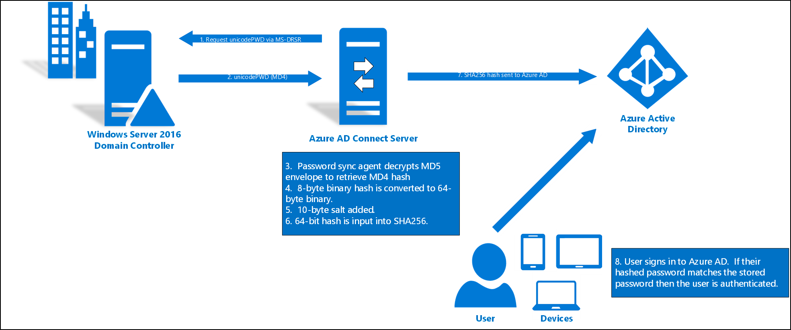

# Implement password hash synchronization with Azure AD Connect sync
This article provides information that you need to synchronize your user passwords from an on-premises Active Directory instance to a cloud-based Azure Active Directory (Azure AD) instance.

## How password hash synchronization works
The Active Directory domain service stores passwords in the form of a hash value representation, of the actual user password. A hash value is a result of a one-way mathematical function (the *hashing algorithm*). There is no method to revert the result of a one-way function to the plain text version of a password. 

To synchronize your password, Azure AD Connect sync extracts your password hash from the on-premises Active Directory instance. Extra security processing is applied to the password hash before it is synchronized to the Azure Active Directory authentication service. Passwords are synchronized on a per-user basis and in chronological order.

The actual data flow of the password hash synchronization process is similar to the synchronization of user data. However, passwords are synchronized more frequently than the standard directory synchronization window for other attributes. The password hash synchronization process runs every 2 minutes. You cannot modify the frequency of this process. When you synchronize a password, it overwrites the existing cloud password.

The first time you enable the password hash synchronization feature, it performs an initial synchronization of the passwords of all in-scope users. You cannot explicitly define a subset of user passwords that you want to synchronize. However, if there are multiple connectors, it is possible to disable password hash sync for some connectors but not others using the [Set-ADSyncAADPasswordSyncConfiguration](https://docs.microsoft.com/azure/active-directory-domain-services/active-directory-ds-getting-started-password-sync-synced-tenant) cmdlet.

When you change an on-premises password, the updated password is synchronized, most often in a matter of minutes.
The password hash synchronization feature automatically retries failed synchronization attempts. If an error occurs during an attempt to synchronize a password, an error is logged in your event viewer.

The synchronization of a password has no impact on the user  who is currently signed in.
Your current cloud service session is not immediately affected by a synchronized password change that occurs, while you are signed in, to a cloud service. However, when the cloud service requires you to authenticate again, you need to provide your new password.

A user must enter their corporate credentials a second time to authenticate to Azure AD, regardless of whether they're signed in to their corporate network. This pattern can be minimized, however, if the user selects the Keep me signed in (KMSI) check box at sign-in. This selection sets a session cookie that bypasses authentication for 180 days. KMSI behavior can be enabled or disabled by the Azure AD administrator. In addition, you can reduce password prompts by turning on [Seamless SSO](how-to-connect-sso.md), which automatically signs users in when they are on their corporate devices connected to your corporate network.

> [!NOTE]
> Password sync is only supported for the object type user in Active Directory. It is not supported for the iNetOrgPerson object type.

### Detailed description of how password hash synchronization works

The following section describes, in-depth, how password hash synchronization works between Active Directory and Azure AD.



1. Every two minutes, the password hash synchronization agent on the AD Connect server requests stored password hashes (the unicodePwd attribute) from a DC.  This request is via the standard [MS-DRSR](https://msdn.microsoft.com/library/cc228086.aspx) replication protocol used to synchronize data between DCs. The service account must have Replicate Directory Changes and Replicate Directory Changes All AD permissions (granted by default on installation) to obtain the password hashes.
2. Before sending, the DC encrypts the MD4 password hash by using a key that is a [MD5](https://www.rfc-editor.org/rfc/rfc1321.txt) hash of the RPC session key and a salt. It then sends the result to the password hash synchronization agent over RPC. The DC also passes the salt to the synchronization agent by using the DC replication protocol, so the agent will be able to decrypt the envelope.
3. After the password hash synchronization agent has the encrypted envelope, it uses [MD5CryptoServiceProvider](https://msdn.microsoft.com/library/System.Security.Cryptography.MD5CryptoServiceProvider.aspx) and the salt to generate a key to decrypt the received data back to its original MD4 format. The password hash synchronization agent never has access to the clear text password. The password hash synchronization agent’s use of MD5 is strictly for replication protocol compatibility with the DC, and it is only used on premises between the DC and the password hash synchronization agent.
4. The password hash synchronization agent expands the 16-byte binary password hash to 64 bytes by first converting the hash to a 32-byte hexadecimal string, then converting this string back into binary with UTF-16 encoding.
5. The password hash synchronization agent adds a per user salt, consisting of a 10-byte length salt, to the 64-byte binary to further protect the original hash.
6. The password hash synchronization agent then combines the MD4 hash plus the per user salt, and inputs it into the [PBKDF2](https://www.ietf.org/rfc/rfc2898.txt) function. 1000 iterations of the [HMAC-SHA256](https://msdn.microsoft.com/library/system.security.cryptography.hmacsha256.aspx) keyed hashing algorithm are used. 
7. The password hash synchronization agent takes the resulting 32-byte hash, concatenates both the per user salt and the number of SHA256 iterations to it (for use by Azure AD), then transmits the string from Azure AD Connect to Azure AD over SSL.</br> 
8. When a user attempts to sign in to Azure AD and enters their password, the password is run through the same MD4+salt+PBKDF2+HMAC-SHA256 process. If the resulting hash matches the hash stored in Azure AD, the user has entered the correct password and is authenticated.

> [!NOTE]
> The original MD4 hash is not transmitted to Azure AD. Instead, the SHA256 hash of the original MD4 hash is transmitted. As a result, if the hash stored in Azure AD is obtained, it cannot be used in an on-premises pass-the-hash attack.

### Security considerations

When synchronizing passwords, the plain-text version of your password is not exposed to the password hash synchronization feature, to Azure AD, or any of the associated services.

User authentication takes place against Azure AD rather than against the organization's own Active Directory instance. The SHA256 password data stored in Azure AD--a hash of the original MD4 hash--is more secure than what is stored in Active Directory. Further, because this SHA256 hash cannot be decrypted, it cannot be brought back to the organization's Active Directory environment and presented as a valid user password in a pass-the-hash attack.

### Password policy considerations

There are two types of password policies that are affected by enabling password hash synchronization:

* Password complexity policy
* Password expiration policy

#### Password complexity policy

When password hash synchronization is enabled, the password complexity policies in your on-premises Active Directory instance override complexity policies in the cloud for synchronized users. You can use all of the valid passwords from your on-premises Active Directory instance to access Azure AD services.

> [!NOTE]
> Passwords for users that are created directly in the cloud are still subject to password policies as defined in the cloud.

#### Password expiration policy

If a user is in the scope of password hash synchronization, by default the cloud account password is set to *Never Expire*.

You can continue to sign in to your cloud services by using a synchronized password that is expired in your on-premises environment. Your cloud password is updated the next time you change the password in the on-premises environment.

##### Public preview of the *EnforceCloudPasswordPolicyForPasswordSyncedUsers* feature

If there are synchronized users that only interact with Azure AD integrated services and must also comply with a password expiration policy, you can force them to comply with your Azure AD password expiration policy by enabling the *EnforceCloudPasswordPolicyForPasswordSyncedUsers* feature.

When *EnforceCloudPasswordPolicyForPasswordSyncedUsers* is disabled (which is the default setting), Azure AD Connect sets the PasswordPolicies attribute of synchronized users to "DisablePasswordExpiration". This is done every time a user's password is synchronized and instructs Azure AD to ignore the cloud password expiration policy for that user. You can check the value of the attribute using the Azure AD PowerShell module with the following command:

`(Get-AzureADUser -objectID <User Object ID>).passwordpolicies`


To enable the EnforceCloudPasswordPolicyForPasswordSyncedUsers feature, run the following command using the MSOnline PowerShell module as shown below. You would have to type yes for the Enable parameter as shown below :
```
`Set-MsolDirSyncFeature -Feature EnforceCloudPasswordPolicyForPasswordSyncedUsers`
`cmdlet Set-MsolDirSyncFeature at command pipeline position 1`
`Supply values for the following parameters:`
`Enable: yes`
`Confirm`
`Continue with this operation?`
`[Y] Yes [N] No [S] Suspend [?] Help (default is "Y"): y`
```

Once enabled, Azure AD does not go to each synchronized user to remove the `DisablePasswordExpiration` value from the PasswordPolicies attribute. Instead, the value is set to `None` during the next password sync for each user when they next change their password in on-premises AD.  

It is recommended to enable EnforceCloudPasswordPolicyForPasswordSyncedUsers, prior to enabling password hash sync, so that the initial sync of password hashes does not add the `DisablePasswordExpiration` value to the PasswordPolicies attribute for the users.

The default Azure AD password policy requires users to change their passwords every 90 days. If your policy in AD is also 90 days, the two policies should match. However, if the AD policy is not 90 days, you can update the Azure AD password policy to match by using the Set-MsolPasswordPolicy PowerShell command.

Azure AD supports a separate password expiration policy per registered domain.

Caveat: If there are synchronized accounts that need to have non-expiring passwords in Azure AD, you must explicitly add the `DisablePasswordExpiration` value to the PasswordPolicies attribute of the user object in Azure AD.  You can do this by running the following command.

`Set-AzureADUser -ObjectID <User Object ID> -PasswordPolicies "DisablePasswordExpiration"`

> [!NOTE]
> This feature is in Public Preview right now.

#### Public Preview of synchronizing temporary passwords and "Force Password Reset on Next Logon"

It is typical to force a user to change their password during their first logon, especially after an admin password reset occurs.  It is commonly known as setting a "temporary" password and is completed by checking the "User must change password at next logon" flag on a user object in Active Directory (AD).
  
The temporary password functionality helps to ensure that the transfer of ownership of the credential is completed on first use, to minimize the duration of time in which more than one individual has knowledge of that credential.

To support temporary passwords in Azure AD for synchronized users, you can enable the *ForcePasswordResetOnLogonFeature* feature, by running the following command on your Azure AD Connect server:

`Set-ADSyncAADCompanyFeature  -ForcePasswordResetOnLogonFeature $true`

> [!NOTE]
> Forcing a user to change their password on next logon requires a password change at the same time.  AD Connect will not pick up the force password change flag by itself; it is supplemental to the detected password change that occurs during password hash sync.

> [!CAUTION]
> If you do not enable Self-service Password Reset (SSPR) in Azure AD users will have a confusing experience when they reset their password in Azure AD and then attempt to sign in in Active Directory with the new password, as the new password isn’t valid in Active Directory. You should only use this feature when SSPR and Password Writeback is enabled on the tenant.

> [!NOTE]
> This feature is in public preview right now.

#### Account expiration

If your organization uses the accountExpires attribute as part of user account management, this attribute is not synchronized to Azure AD. As a result, an expired Active Directory account in an environment configured for password hash synchronization will still be active in Azure AD. We recommend that if the account is expired, a workflow action should trigger a PowerShell script that disables the user's Azure AD account (use the [Set-AzureADUser](https://docs.microsoft.com/powershell/module/azuread/set-azureaduser?view=azureadps-2.0) cmdlet). Conversely, when the account is turned on, the Azure AD instance should be turned on.

### Overwrite synchronized passwords

An administrator can manually reset your password by using Windows PowerShell.

In this case, the new password overrides your synchronized password, and all password policies defined in the cloud are applied to the new password.

If you change your on-premises password again, the new password is synchronized to the cloud, and it overrides the manually updated password.

The synchronization of a password has no impact on the Azure user who is signed in. Your current cloud service session is not immediately affected by a synchronized password change that occurs while you're signed in to a cloud service. KMSI extends the duration of this difference. When the cloud service requires you to authenticate again, you need to provide your new password.

### Additional advantages

- Generally, password hash synchronization is simpler to implement than a federation service. It doesn't require any additional servers, and eliminates dependence on a highly available federation service to authenticate users.
- Password hash synchronization can also be enabled in addition to federation. It may be used as a fallback if your federation service experiences an outage.

## Password hash sync process for Azure AD Domain Services

If you use Azure AD Domain Services to provide legacy authentication for applications and services that need to use Kerberos, LDAP, or NTLM, some additional processes are part of the password hash synchronization flow. Azure AD Connect uses the additional following process to synchronize password hashes to Azure AD for use in Azure AD Domain Services:

> [!IMPORTANT]
> Azure AD Connect should only be installed and configured for synchronization with on-premises AD DS environments. It's not supported to install Azure AD Connect in an Azure AD DS managed domain to synchronize objects back to Azure AD.
>
> Azure AD Connect only synchronizes legacy password hashes when you enable Azure AD DS for your Azure AD tenant. The following steps aren't used if you only use Azure AD Connect to synchronize an on-premises AD DS environment with Azure AD.
>
> If your legacy applications don't use NTLM authentication or LDAP simple binds, we recommend that you disable NTLM password hash synchronization for Azure AD DS. For more information, see [Disable weak cipher suites and NTLM credential hash synchronization](../../active-directory-domain-services/secure-your-domain.md).

1. Azure AD Connect retrieves the public key for the tenant's instance of Azure AD Domain Services.
1. When a user changes their password, the on-premises domain controller stores the result of the password change (hashes) in two attributes:
    * *unicodePwd* for the NTLM password hash.
    * *supplementalCredentials* for the Kerberos password hash.
1. Azure AD Connect detects password changes through the directory replication channel (attribute changes needing to replicate to other domain controllers).
1. For each user whose password has changed, Azure AD Connect performs the following steps:
    * Generates a random AES 256-bit symmetric key.
    * Generates a random initialization vector needed for the first round of encryption.
    * Extracts Kerberos password hashes from the *supplementalCredentials* attributes.
    * Checks the Azure AD Domain Services security configuration *SyncNtlmPasswords* setting.
        * If this setting is disabled, generates a random, high-entropy NTLM hash (different from the user's password). This hash is then combined with the exacted Kerberos password hashes from the *supplementalCrendetials* attribute into one data structure.
        * If enabled, combines the value of the *unicodePwd* attribute with the extracted Kerberos password hashes from the *supplementalCredentials* attribute into one data structure.
    * Encrypts the single data structure using the AES symmetric key.
    * Encrypts the AES symmetric key using the tenant's Azure AD Domain Services public key.
1. Azure AD Connect transmits the encrypted AES symmetric key, the encrypted data structure containing the password hashes, and the initialization vector to Azure AD.
1. Azure AD stores the encrypted AES symmetric key, the encrypted data structure, and the initialization vector for the user.
1. Azure AD pushes the encrypted AES symmetric key, the encrypted data structure, and the initialization vector using an internal synchronization mechanism over an encrypted HTTP session to Azure AD Domain Services.
1. Azure AD Domain Services retrieves the private key for the tenant's instance from Azure Key vault.
1. For each encrypted set of data (representing a single user's password change), Azure AD Domain Services then performs the following steps:
    * Uses its private key to decrypt the AES symmetric key.
    * Uses the AES symmetric key with the initialization vector to decrypt the encrypted data structure that contains the password hashes.
    * Writes the Kerberos password hashes it receives to the Azure AD Domain Services domain controller. The hashes are saved into the user object's *supplementalCredentials* attribute that is encrypted to the Azure AD Domain Services domain controller's public key.
    * Azure AD Domain Services writes the NTLM password hash it received to the Azure AD Domain Services domain controller. The hash is saved into the user object's *unicodePwd* attribute that is encrypted to the Azure AD Domain Services domain controller's public key.

## Enable password hash synchronization

>[!IMPORTANT]
>If you are migrating from AD FS (or other federation technologies) to Password Hash Synchronization, we highly recommend that you follow our detailed deployment guide published [here](https://aka.ms/adfstophsdpdownload).

When you install Azure AD Connect by using the **Express Settings** option, password hash synchronization is automatically enabled. For more information, see [Getting started with Azure AD Connect using express settings](how-to-connect-install-express.md).

If you use custom settings when you install Azure AD Connect, password hash synchronization is available on the user sign-in page. For more information, see [Custom installation of Azure AD Connect](how-to-connect-install-custom.md).


### Password hash synchronization and FIPS
If your server has been locked down according to Federal Information Processing Standard (FIPS), then MD5 is disabled.

**To enable MD5 for password hash synchronization, perform the following steps:**

1. Go to %programfiles%\Azure AD Sync\Bin.
2. Open miiserver.exe.config.
3. Go to the configuration/runtime node at the end of the file.
4. Add the following node: `<enforceFIPSPolicy enabled="false"/>`
5. Save your changes.

For reference, this snippet is what it should look like:

```
    <configuration>
        <runtime>
            <enforceFIPSPolicy enabled="false"/>
        </runtime>
    </configuration>
```

For information about security and FIPS, see [Azure AD password hash sync, encryption, and FIPS compliance](https://blogs.technet.microsoft.com/enterprisemobility/2014/06/28/aad-password-sync-encryption-and-fips-compliance/).

## Troubleshoot password hash synchronization
If you have problems with password hash synchronization, see [Troubleshoot password hash synchronization](tshoot-connect-password-hash-synchronization.md).

## Next steps
* [Azure AD Connect sync: Customizing synchronization options](how-to-connect-sync-whatis.md)
* [Integrating your on-premises identities with Azure Active Directory](whatis-hybrid-identity.md)
* [Get a step-by-step deployment plan for migrating from ADFS to Password Hash Synchronization](https://aka.ms/authenticationDeploymentPlan)
