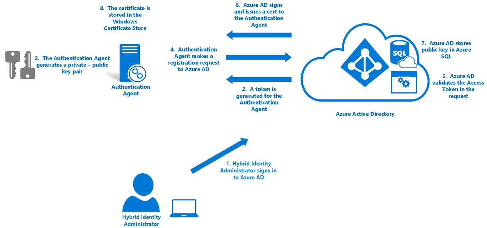
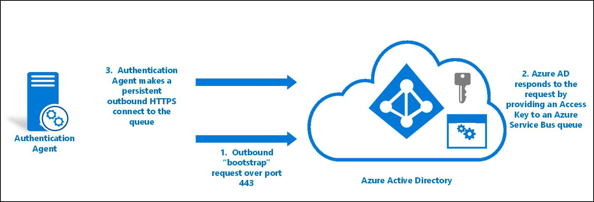
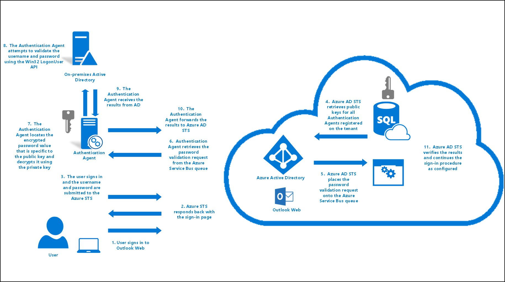
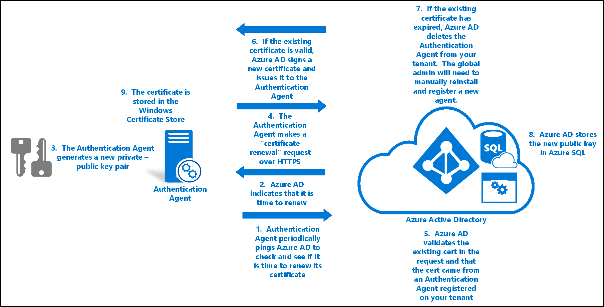
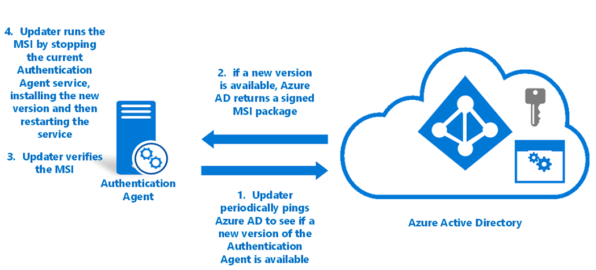

# Azure Active Directory Pass-through Authentication security deep dive

This article provides a more detailed description of how Azure Active Directory (Azure AD) Pass-through Authentication works. It focuses on the security aspects of the feature. This article is for security and IT administrators, chief compliance and security officers, and other IT professionals who are responsible for IT security and compliance at small-to-medium sized organizations or large enterprises.

The topics addressed include:
- Detailed technical information about how to install and register the Authentication Agents.
- Detailed technical information about the encryption of passwords during user sign-in.
- The security of the channels between on-premises Authentication Agents and Azure AD.
- Detailed technical information about how to keep the Authentication Agents operationally secure.
- Other security-related topics.

## Key security capabilities

These are the key security aspects of this feature:
- It's built on a secure multi-tenanted architecture that provides isolation of sign-in requests between tenants.
- On-premises passwords are never stored in the cloud in any form.
- On-premises Authentication Agents that listen for, and respond to, password validation requests only make outbound connections from within your network. There is no requirement to install these Authentication Agents in a perimeter network (DMZ). As best practice, treat all servers running Authentication Agents as Tier 0 systems (see [reference](https://docs.microsoft.com/windows-server/identity/securing-privileged-access/securing-privileged-access-reference-material)).
- Only standard ports (80 and 443) are used for outbound communication from the Authentication Agents to Azure AD. You don't need to open inbound ports on your firewall. 
  - Port 443 is used for all authenticated outbound communication.
  - Port 80 is used only for downloading the Certificate Revocation Lists (CRLs) to ensure that none of the certificates used by this feature have been revoked.
  - For the complete list of the network requirements, see [Azure Active Directory Pass-through Authentication: Quick start](how-to-connect-pta-quick-start.md#step-1-check-the-prerequisites).
- Passwords that users provide during sign-in are encrypted in the cloud before the on-premises Authentication Agents accept them for validation against Active Directory.
- The HTTPS channel between Azure AD and the on-premises Authentication Agent is secured by using mutual authentication.
- Protects your user accounts by working seamlessly with [Azure AD Conditional Access policies](../active-directory-conditional-access-azure-portal.md), including Multi-Factor Authentication (MFA), [blocking legacy authentication](../conditional-access/conditions.md) and by [filtering out brute force password attacks](../authentication/howto-password-smart-lockout.md).

## Components involved

For general details about Azure AD operational, service, and data security, see the [Trust Center](https://azure.microsoft.com/support/trust-center/). The following components are involved when you use Pass-through Authentication for user sign-in:
- **Azure AD STS**: A stateless security token service (STS) that processes sign-in requests and issues security tokens to users' browsers, clients, or services as required.
- **Azure Service Bus**: Provides cloud-enabled communication with enterprise messaging and relays communication that helps you connect on-premises solutions with the cloud.
- **Azure AD Connect Authentication Agent**: An on-premises component that listens for and responds to password validation requests.
- **Azure SQL Database**: Holds information about your tenant's Authentication Agents, including their metadata and encryption keys.
- **Active Directory**: On-premises Active Directory, where your user accounts and their passwords are stored.

## Installation and registration of the Authentication Agents

Authentication Agents are installed and registered with Azure AD when you either:
   - [Enable Pass-through Authentication through Azure AD Connect](https://docs.microsoft.com/azure/active-directory/connect/active-directory-aadconnect-pass-through-authentication-quick-start#step-2-enable-the-feature)
   - [Add more Authentication Agents to ensure the high availability of sign-in requests](https://docs.microsoft.com/azure/active-directory/connect/active-directory-aadconnect-pass-through-authentication-quick-start#step-4-ensure-high-availability) 
   
Getting an Authentication Agent working involves three main phases:

1. Authentication Agent installation
2. Authentication Agent registration
3. Authentication Agent initialization

The following sections discuss these phases in detail.

### Authentication Agent installation

Only global administrators can install an Authentication Agent (by using Azure AD Connect or standalone) on an on-premises server. Installation adds two new entries to the **Control Panel** > **Programs** > **Programs and Features** list:
- The Authentication Agent application itself. This application runs with [NetworkService](https://msdn.microsoft.com/library/windows/desktop/ms684272.aspx) privileges.
- The Updater application that's used to auto-update the Authentication Agent. This application runs with [LocalSystem](https://msdn.microsoft.com/library/windows/desktop/ms684190.aspx) privileges.

### Authentication Agent registration

After you install the Authentication Agent, it needs to register itself with Azure AD. Azure AD assigns each Authentication Agent a unique, digital-identity certificate that it can use for secure communication with Azure AD.

The registration procedure also binds the Authentication Agent with your tenant. This ensures that Azure AD knows that this specific Authentication Agent is the only one authorized to handle password validation requests for your tenant. This procedure is repeated for each new Authentication Agent that you register.

The Authentication Agents use the following steps to register themselves with Azure AD:

1. Azure AD first requests that a global administrator sign in to Azure AD with their credentials. During sign-in, the Authentication Agent acquires an access token that it can use on behalf of the global administrator.
2. The Authentication Agent then generates a key pair: a public key and a private key.
    - The key pair is generated through standard RSA 2048-bit encryption.
    - The private key stays on the on-premises server where the Authentication Agent resides.
3. The Authentication Agent makes a “registration” request to Azure AD over HTTPS, with the following components included in the request:
    - The access token acquired in step 1.
    - The public key generated in step 2.
    - A Certificate Signing Request (CSR or Certificate Request). This request applies for a digital identity certificate, with Azure AD as its certificate authority (CA).
4. Azure AD validates the access token in the registration request and verifies that the request came from a global administrator.
5. Azure AD then signs and sends a digital identity certificate back to the Authentication Agent.
    - The root CA in Azure AD is used to sign the certificate. 

     >[!NOTE]
     > This CA is _not_ in the Windows Trusted Root Certificate Authorities store.
    - The CA is used only by the Pass-through Authentication feature. The CA is used only to sign CSRs during the Authentication Agent registration.
    -  None of the other Azure AD services use this CA.
    - The certificate’s subject (Distinguished Name or DN) is set to your tenant ID. This DN is a GUID that uniquely identifies your tenant. This DN scopes the certificate for use only with your tenant.
6. Azure AD stores the public key of the Authentication Agent in an Azure SQL database, which only Azure AD has access to.
7. The certificate (issued in step 5) is stored on the on-premises server in the Windows certificate store (specifically in the [CERT_SYSTEM_STORE_LOCAL_MACHINE](https://msdn.microsoft.com/library/windows/desktop/aa388136.aspx#CERT_SYSTEM_STORE_LOCAL_MACHINE) location). It is used by both the Authentication Agent and the Updater applications.

### Authentication Agent initialization

When the Authentication Agent starts, either for the first time after registration or after a server restart, it needs a way to communicate securely with the Azure AD service and start accepting password validation requests.

Here is how Authentication Agents are initialized:

1. The Authentication Agent makes an outbound bootstrap request to Azure AD. 
    - This request is made over port 443 and is over a mutually authenticated HTTPS channel. The request uses the same certificate that was issued during the Authentication Agent registration.
2. Azure AD responds to the request by providing an access key to an Azure Service Bus queue that's unique to your tenant and that's identified by your tenant ID.
3. The Authentication Agent makes a persistent outbound HTTPS connection (over port 443) to the queue. 
    - The Authentication Agent is now ready to retrieve and handle password-validation requests.

If you have multiple Authentication Agents registered on your tenant, then the initialization procedure ensures that each one connects to the same Service Bus queue. 

## Process sign-in requests 

The following diagram shows how Pass-through Authentication processes user sign-in requests.

Pass-through Authentication handles a user sign-in request as follows: 

1. A user tries to access an application, for example, [Outlook Web App](https://outlook.office365.com/owa).
2. If the user is not already signed in, the application redirects the browser to the Azure AD sign-in page.
3. The Azure AD STS service responds back with the **User sign-in** page.
4. The user enters their username into the **User sign-in** page, and then selects the **Next** button.
5. The user enters their password into the **User sign-in** page, and then selects the **Sign-in** button.
6. The username and password are submitted to Azure AD STS in an HTTPS POST request.
7. Azure AD STS retrieves public keys for all the Authentication Agents registered on your tenant from the Azure SQL database and encrypts the password by using them. 
    - It produces "N" encrypted password values for "N" Authentication Agents registered on your tenant.
8. Azure AD STS places the password validation request, which consists of the username and the encrypted password values, onto the Service Bus queue specific to your tenant.
9. Because the initialized Authentication Agents are persistently connected to the Service Bus queue, one of the available Authentication Agents retrieves the password validation request.
10. The Authentication Agent locates the encrypted password value that's specific to its public key, by using an identifier, and decrypts it by using its private key.
11. The Authentication Agent attempts to validate the username and the password against on-premises Active Directory by using the [Win32 LogonUser API](https://msdn.microsoft.com/library/windows/desktop/aa378184.aspx) with the **dwLogonType** parameter set to **LOGON32_LOGON_NETWORK**. 
    - This API is the same API that is used by Active Directory Federation Services (AD FS) to sign in users in a federated sign-in scenario.
    - This API relies on the standard resolution process in Windows Server to locate the domain controller.
12. The Authentication Agent receives the result from Active Directory, such as success, username or password incorrect, or password expired.
13. The Authentication Agent forwards the result back to Azure AD STS over an outbound mutually authenticated HTTPS channel over port 443. Mutual authentication uses the certificate previously issued to the Authentication Agent during registration.
14. Azure AD STS verifies that this result correlates with the specific sign-in request on your tenant.
15. Azure AD STS continues with the sign-in procedure as configured. For example, if the password validation was successful, the user might be challenged for Multi-Factor Authentication or redirected back to the application.

## Operational security of the Authentication Agents

To ensure that Pass-through Authentication remains operationally secure, Azure AD periodically renews Authentication Agents' certificates. Azure AD triggers the renewals. The renewals are not governed by the Authentication Agents themselves.

To renew an Authentication Agent's trust with Azure AD:

1. The Authentication Agent periodically pings Azure AD every few hours to check if it's time to renew its certificate. The certificate is renewed 30 days prior to its expiration.
    - This check is done over a mutually authenticated HTTPS channel and uses the same certificate that was issued during registration.
2. If the service indicates that it's time to renew, the Authentication Agent generates a new key pair: a public key and a private key.
    - These keys are generated through standard RSA 2048-bit encryption.
    - The private key never leaves the on-premises server.
3. The Authentication Agent then makes a “certificate renewal” request to Azure AD over HTTPS, with the following components included in the request:
    - The existing certificate that's retrieved from the CERT_SYSTEM_STORE_LOCAL_MACHINE location on the Windows certificate store. There is no global administrator involved in this procedure, so there is no access token needed on behalf of the global administrator.
    - The public key generated in step 2.
    - A Certificate Signing Request (CSR or Certificate Request). This request applies for a new digital identity certificate, with Azure AD as its certificate authority.
4. Azure AD validates the existing certificate in the certificate renewal request. Then it verifies that the request came from an Authentication Agent registered on your tenant.
5. If the existing certificate is still valid, Azure AD then signs a new digital identity certificate, and issues the new certificate back to the Authentication Agent. 
6. If the existing certificate has expired, Azure AD deletes the Authentication Agent from your tenant’s list of registered Authentication Agents. Then a global administrator needs to manually install and register a new Authentication Agent.
    - Use the Azure AD root CA to sign the certificate.
    - Set the certificate’s subject (Distinguished Name or DN) to your tenant ID, a GUID that uniquely identifies your tenant. The DN scopes the certificate to your tenant only.
6. Azure AD stores the new public key of the Authentication Agent in an Azure SQL database that only it has access to. It also invalidates the old public key associated with the Authentication Agent.
7. The new certificate (issued in step 5) is then stored on the server in the Windows certificate store (specifically in the [CERT_SYSTEM_STORE_CURRENT_USER](https://msdn.microsoft.com/library/windows/desktop/aa388136.aspx#CERT_SYSTEM_STORE_CURRENT_USER) location).
    - Because the trust renewal procedure happens non-interactively (without the presence of the global administrator), the Authentication Agent no longer has access to update the existing certificate in the CERT_SYSTEM_STORE_LOCAL_MACHINE location. 
    
   > [!NOTE]
   > This procedure does not remove the certificate itself from the CERT_SYSTEM_STORE_LOCAL_MACHINE location.
8. The new certificate is used for authentication from this point on. Every subsequent renewal of the certificate replaces the certificate in the CERT_SYSTEM_STORE_LOCAL_MACHINE location.

## Auto-update of the Authentication Agents

The Updater application automatically updates the Authentication Agent when a new version is released. The application does not handle any password validation requests for your tenant. 

Azure AD hosts the new version of the software as a signed **Windows Installer package (MSI)**. The MSI is signed by using [Microsoft Authenticode](https://msdn.microsoft.com/library/ms537359.aspx) with SHA256 as the digest algorithm. 

To auto-update an Authentication Agent:

1. The Updater application pings Azure AD every hour to check if there is a new version of the Authentication Agent available. 
    - This check is done over a mutually authenticated HTTPS channel by using the same certificate that was issued during registration. The Authentication Agent and the Updater share the certificate stored on the server.
2. If a new version is available, Azure AD returns the signed MSI back to the Updater.
3. The Updater verifies that the MSI is signed by Microsoft.
4. The Updater runs the MSI. This action involves the following steps:

 > [!NOTE]
 > The Updater runs with [Local System](https://msdn.microsoft.com/library/windows/desktop/ms684190.aspx) privileges.

    - Stops the Authentication Agent service
    - Installs the new version of the Authentication Agent on the server
    - Restarts the Authentication Agent service

>[!NOTE]
>If you have multiple Authentication Agents registered on your tenant, Azure AD does not renew their certificates or update them at the same time. Instead, Azure AD does so gradually to ensure the high availability of sign-in requests.
>

## Next steps
- [Current limitations](how-to-connect-pta-current-limitations.md): Learn which scenarios are supported and which ones are not.
- [Quick start](how-to-connect-pta-quick-start.md): Get up and running on Azure AD Pass-through Authentication.
- [Migrate from AD FS to Pass-through Authentication](https://github.com/Identity-Deployment-Guides/Identity-Deployment-Guides/blob/master/Authentication/Migrating%20from%20Federated%20Authentication%20to%20Pass-through%20Authentication.docx) - A detailed guide to migrate from AD FS (or other federation technologies) to Pass-through Authentication.
- [Smart Lockout](../authentication/howto-password-smart-lockout.md): Configure the Smart Lockout capability on your tenant to protect user accounts.
- [How it works](how-to-connect-pta-how-it-works.md): Learn the basics of how Azure AD Pass-through Authentication works.
- [Frequently asked questions](how-to-connect-pta-faq.md): Find answers to frequently asked questions.
- [Troubleshoot](tshoot-connect-pass-through-authentication.md): Learn how to resolve common problems with the Pass-through Authentication feature.
- [Azure AD Seamless SSO](how-to-connect-sso.md): Learn more about this complementary feature.
