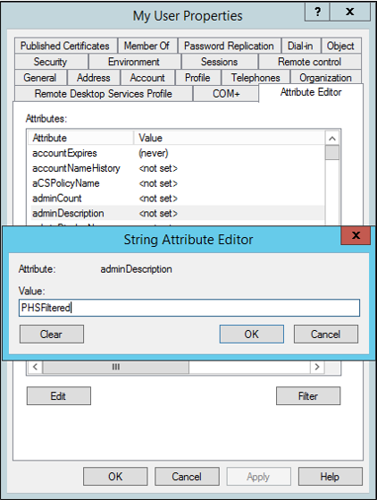

# Selective Password Hash Synchronization Configuration for Azure AD Connect

[Password hash synchronization](whatis-phs.md) is one of the sign-in methods used to accomplish hybrid identity. Azure AD Connect synchronizes a hash, of the hash, of a user's password from an on-premises Active Directory instance to a cloud-based Azure AD instance.  By default, once it has been setup, password hash synchronization will occur on all of the users you are synchronizing.

If you’d like to have a subset of users excluded from synchronizing their password hash to Azure AD, you can configure selective password hash synchronization using the guided steps provided in this article.

>[!Important]
> Microsoft doesn't support modifying or operating Azure AD Connect sync outside of the configurations or actions that are formally documented. Any of these configurations or actions might result in an inconsistent or unsupported state of Azure AD Connect sync. As a result, Microsoft cannot guarantee that we will be able to provide efficient technical support for such deployments. 


## Consider your implementation  
To reduce the configuration administrative effort, you should first consider the number of user objects you wish to exclude from password hash synchronization. Verify which of the scenarios below, which are mutually exclusive, aligns with your requirements to select the right configuration option for you.
- If the number of users to **exclude** is **smaller** than the number of users to **include**, follow the steps in this section.
- If the number of users to **exclude** is **greater** than the number of users to **include**, follow the steps in this section.

> [!Important]
> With either configuration option chosen, a required initial sync (Full Sync) to apply the changes, will be performed automatically over the next sync cycle.

### Disable the synchronization scheduler:
Before you start, it is recommended to disable the synchronization scheduler while you are making changes to sync rules.
 1.	Start windows PowerShell enter.

     ```Set-ADSyncScheduler -SyncCycleEnabled $false``` 
 
2.	Confirm the scheduler is disabled by running the following cmblet:
     
    ```Get-ADSyncScheduler```

For more information on the scheduler see [Azure AD Connect sync scheduler](how-to-connect-sync-feature-scheduler.md).


>[!Important]
>The steps provided to configure selective password hash synchronization will only effect user objects that have 
the attribute **adminDescription** populated in Active Directory with the value of **PHSFiltered**.
>If this attribute is not populated or the value is something other than **PHSFiltered** then these rules will not be applied to the user objects.


## Excluded users is smaller than included users
The following section describes how to enable selective password hashword synchronization when the number of users to **exclude** is **smaller** than the number of users to **include**.

>[!Important]
> Before you proceed ensure the synchronization scheduler is disabled as outlined above.

   

### Configure the necessary synchronization rules:

 1.	Start the Synchronization Rules Editor and set the filters **Password Sync** to **On** and **Rule Type** to **Standard**.

 
 2.	Select the rule **In from AD – User AccountEnabled** for the Active Directory forest Connector you want to configure selective password had hash synchronization on and click **Edit**. Select **yesYes** in the next dialog box to create an editable copy of the original rule.
 
 
 3.	The first rule will disable password hash sync.
 Provide the following name to the new custom rule: **In from AD - User AccountEnabled - Filter Users from PHS**.
 Change the precedence value to a number lower than 100 (for example **90** or whichever is the lowest value available in your environmentdeployment).
 Make sure the checkboxes **Enable Password Sync** and **Disabled** are unchecked and c.
 Click **Next**.

 
 4.	In **Scoping filter**, click **Add clause**.
 Select **adminDescription** in the attribute column, **EQUAL** in the Operator column and enter **PHSFiltered** as the value.

 
 5. No further changes are required. **Join rules** and **Transformations** should be left with the default copied settings so you can click **Save** now.
 Click **OK** in the warning dialog box informing a full synchronization will be run on the next synchronization cycle of the connector.

  
 6.	Next, create another custom rule with password hash synchronization enabled. Select again the default rule **In from AD – User AccountEnabled** for the Active Directory forest you want to configure selective password had synchronization on and click **Edit**. Select **yes** in the next dialog box to create an editable copy of the original rule.

  
 7. Provide the following name to the new custom rule: **In from AD - User AccountEnabled - Users included for PHS**.
 Change the precedence value to a number lower than the rule previously created (In this example that’ll be **89**).
 Make sure the checkbox **Enable Password Sync** is checked and the **Disabled** checkbox is unchecked.
 Click **Next**.  
 
 
 8. In **Scoping filter**, click **Add clause**.
 Select **adminDescription** in the attribute column, **NOTEQUAL** in the Operator column and enter **PHSFiltered** as the value.
 
 
 9. No further changes are required. **Join rules** and **Transformations** should be left with the default copied settings so you can click **Save** now.
 Click **OK** in the warning dialog box informing a full synchronization will be run on the next synchronization cycle of the connector.
 
 
 10. Confirm the rules creation. Remove the filters **Password Sync** **On** and **Rule Type** **Standard**. And you should see both new rules you just created.

  


### Re-Enable synchronization scheduler:  
Once you completed the steps to configure the necessary synchronization rules, re-enable the synchronization scheduler with the following steps:
 1.	In Windows PowerShell run:

     ```Set-ADSyncScheduler -SyncCycleEnabled $true```
 2.	Then confirm it has been successfully enabled by running:

     ```Get-ADSyncScheduler```

For more information on the scheduler see [Azure AD Connect sync scheduler](how-to-connect-sync-feature-scheduler.md).

### Edit users **adminDescription** attribute:
Once all configurations are complete, you need edit the attribute **adminDescription** for all users you wish to **exclude** from password hash synchronization in Active Directory and add the string used in the scoping filter: **PHSFiltered**.
   
  


## Excluded users is larger than included users
The following section describes how to enable selective password hashword synchronization when the number of users to **exclude** is **larger** than the number of users to **include**.

>[!Important]
> Before you proceed ensure the synchronization scheduler is disabled as outlined above.

### Configure the necessary synchronization rules:

 1.	Start the Ssynchronization Rules Editor and set the filters **Password Sync** **On** and **Rule Type** **Standard**.
 
 
 2.	Select the rule **In from AD – User AccountEnabled** for the Active Directory forest you want to configure selective password had synchronization on and click **Edit**. Select **yes** in the next dialog box to create an editable copy of the original rule.

 
 3.	The first rule will disable password hash sync.
 Provide the following name to the new custom rule: **In from AD - User AccountEnabled - Filter Users from PHS**.
 Change the precedence value to a number lower than 100 (for example **90** or whichever is the lowest value available in your environment).
 Make sure the checkboxes **Enable Password Sync** and **Disabled** are unchecked.
 Click **Next**.

 
 4.	In **Scoping filter**, click **Add clause**.
Select **adminDescription** in the attribute column, **NOTEQUAL** in the Operator column and enter **PHSIncluded** as the value.

 
 5. No further changes are required. **Join rules** and **Transformations** should be left with the default copied settings so you can click **Save** now.
 Click **OK** in the warning dialog box informing a full synchronization will be run on the next synchronization cycle of the connector.

 
 6.	Next, create another custom rule with password hash synchronization enabled. Select again the default rule **In from AD – User AccountEnabled** for the Active Directory forest you want to configure selective password had synchronization on and click **Edit**. Select **yes** in the next dialog box to create an editable copy of the original rule.

 
 7.	Provide the following name to the new custom rule: **In from AD - User AccountEnabled - Users included for PHS**.
 Change the precedence value to a number lower than the rule previously created (In this example that’ll be **89**).
 Make sure the checkbox **Enable Password Sync** is checked and the **Disabled** checkbox is unchecked.
 Click **Next**.

 
 8.	In **Scoping filter**, click **Add clause**.
 Select **adminDescription** in the attribute column, **EQUAL** in the Operator column and enter **PHSIncluded** as the value.

 
 9. No further changes are required. **Join rules** and **Transformations** should be left with the default copied settings so you can click **Save** now.
 Click **OK** in the warning dialog box informing a full synchronization will be run on the next synchronization cycle of the connector.

 
 10.	Confirm the rules creation. Remove the filters **Password Sync** **On** and **Rule Type** **Standard**. And you should see both new rules you just created.

 

### Re-Enable synchronization scheduler:  
Once you completed the steps to configure the necessary synchronization rules, re-enable the synchronization scheduler with the following steps:
 1.	In Windows PowerShell run:

     ```Set-ADSyncScheduler -SyncCycleEnabled $true```
 2.	Then confirm it has been successfully enabled by running:

     ```Get-ADSyncScheduler```

For more information on the scheduler see [Azure AD Connect sync scheduler](how-to-connect-sync-feature-scheduler.md).

### Edit users **adminDescription** attribute:
Once all configurations are complete, you need edit the attribute **adminDescription** for all users you wish to **include** for password hash synchronization in Active Directory and add the string used in the scoping filter: **PHSFiltered**.

  
 
 

## Next Steps
- [What is password hash syncronization?](whatis-phs.md)
- [How password hash sync works](how-to-connect-password-hash-synchronization.md)
