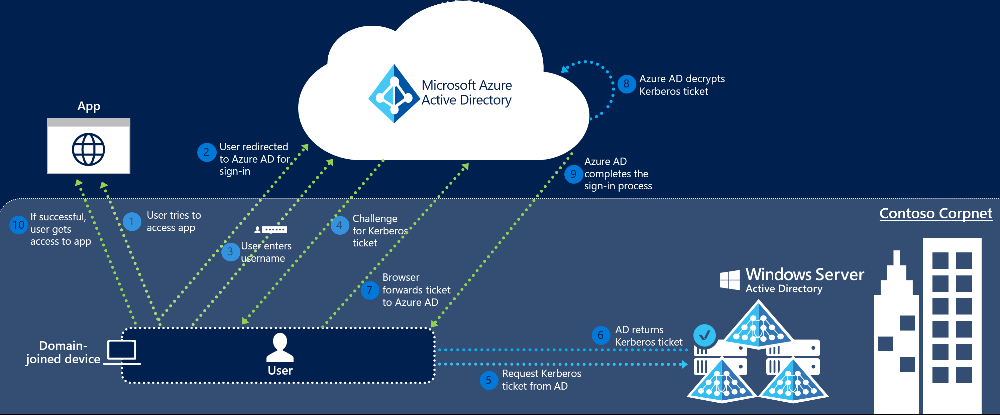

# Azure Active Directory Seamless Single Sign-On: Technical deep dive

This article gives you technical details into how the Azure Active Directory Seamless Single Sign-On (Seamless SSO) feature works.

## How does Seamless SSO work?

This section has three parts to it:
1. The setup of the Seamless SSO feature.
2. How a single user sign-in transaction on a web browser works with Seamless SSO.
3. How a single user sign-in transaction on a native client works with Seamless SSO.

### How does set up work?

Seamless SSO is enabled using Azure AD Connect as shown [here](how-to-connect-sso-quick-start.md). While enabling the feature, the following steps occur:
- A computer account named `AZUREADSSOACC` (which represents Azure AD) is created in your on-premises Active Directory (AD) in each AD forest.
- The computer account's Kerberos decryption key is shared securely with Azure AD. If there are multiple AD forests, each one will have its own Kerberos decryption key.
- In addition, two Kerberos service principal names (SPNs) are created to represent two URLs that are used during Azure AD sign-in.

>[!NOTE]
> The computer account and the Kerberos SPNs are created in each AD forest you synchronize to Azure AD (using Azure AD Connect) and for whose users you want Seamless SSO. Move the `AZUREADSSOACC` computer account to an Organization Unit (OU) where other computer accounts are stored to ensure that it is managed in the same way and is not deleted.

>[!IMPORTANT]
>We highly recommend that you [roll over the Kerberos decryption key](how-to-connect-sso-faq.md#how-can-i-roll-over-the-kerberos-decryption-key-of-the-azureadssoacc-computer-account) of the `AZUREADSSOACC` computer account at least every 30 days.

Once the set-up is complete, Seamless SSO works the same way as any other sign-in that uses Integrated Windows Authentication (IWA).

### How does sign-in on a web browser with Seamless SSO work?

The sign-in flow on a web browser is as follows:

1. The user tries to access a web application (for example, the Outlook Web App - https://outlook.office365.com/owa/) from a domain-joined corporate device inside your corporate network.
2. If the user is not already signed in, the user is redirected to the Azure AD sign-in page.
3. The user types in their user name into the Azure AD sign-in page.

  >[!NOTE]
  >For [certain applications](./how-to-connect-sso-faq.md#what-applications-take-advantage-of-domainhint-or-loginhint-parameter-capability-of-seamless-sso), steps 2 & 3 are skipped.

4. Using JavaScript in the background, Azure AD challenges the browser, via a 401 Unauthorized response, to provide a Kerberos ticket.
5. The browser, in turn, requests a ticket from Active Directory for the `AZUREADSSOACC` computer account (which represents Azure AD).
6. Active Directory locates the computer account and returns a Kerberos ticket to the browser encrypted with the computer account's secret.
7. The browser forwards the Kerberos ticket it acquired from Active Directory to Azure AD.
8. Azure AD decrypts the Kerberos ticket, which includes the identity of the user signed into the corporate device, using the previously shared key.
9. After evaluation, Azure AD either returns a token back to the application or asks the user to perform additional proofs, such as Multi-Factor Authentication.
10. If the user sign-in is successful, the user is able to access the application.

The following diagram illustrates all the components and the steps involved.

Seamless SSO is opportunistic, which means if it fails, the sign-in experience falls back to its regular behavior - i.e, the user needs to enter their password to sign in.

### How does sign-in on a native client with Seamless SSO work?

The sign-in flow on a native client is as follows:

1. The user tries to access a native application (for example, the Outlook client) from a domain-joined corporate device inside your corporate network.
2. If the user is not already signed in, the native application retrieves the username of the user from the device's Windows session.
3. The app sends the username to Azure AD, and retrieves your tenant's WS-Trust MEX endpoint.
4. The app then queries the WS-Trust MEX endpoint to see if integrated authentication endpoint is available.
5. If step 4 succeeds, a Kerberos challenge is issued.
6. If the app is able to retrieve the Kerberos ticket, it forwards it up to Azure AD's integrated authentication endpoint.
7. Azure AD decrypts the Kerberos ticket and validates it.
8. Azure AD signs the user in, and issues a SAML token to the app.
9. The app then submits the SAML token to Azure AD's OAuth2 token endpoint.
10. Azure AD validates the SAML token, and issues to the app an access token and a refresh token for the specified resource, and an id token.
11. The user gets access to the app's resource.

The following diagram illustrates all the components and the steps involved.

## Next steps

- [**Quick Start**](how-to-connect-sso-quick-start.md) - Get up and running Azure AD Seamless SSO.
- [**Frequently Asked Questions**](how-to-connect-sso-faq.md) - Answers to frequently asked questions.
- [**Troubleshoot**](tshoot-connect-sso.md) - Learn how to resolve common issues with the feature.
- [**UserVoice**](https://feedback.azure.com/forums/169401-azure-active-directory/category/160611-directory-synchronization-aad-connect) - For filing new feature requests.
