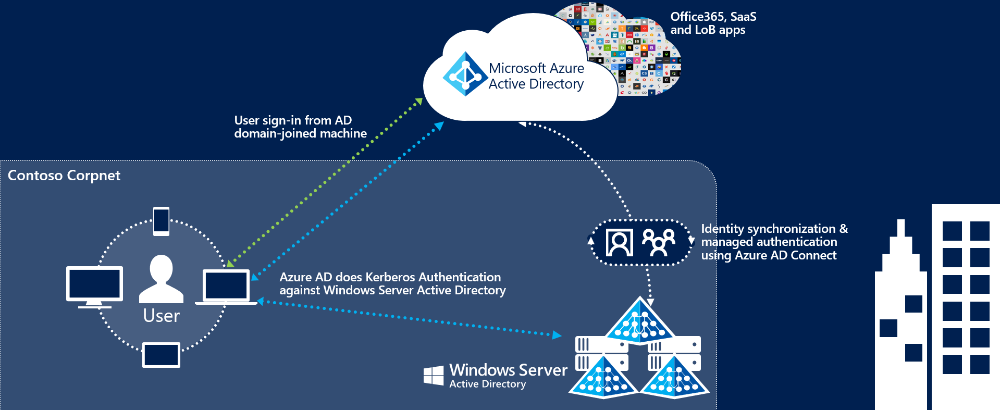

# Azure Active Directory Seamless Single Sign-On

## What is Azure Active Directory Seamless Single Sign-On?

Azure Active Directory Seamless Single Sign-On (Azure AD Seamless SSO) automatically signs users in when they are on their corporate devices connected to your corporate network. When enabled, users don't need to type in their passwords to sign in to Azure AD, and usually, even type in their usernames. This feature provides your users easy access to your cloud-based applications without needing any additional on-premises components.

>[!VIDEO https://www.youtube.com/embed/PyeAC85Gm7w]

Seamless SSO can be combined with either the [Password Hash Synchronization](how-to-connect-password-hash-synchronization.md) or [Pass-through Authentication](how-to-connect-pta.md) sign-in methods. Seamless SSO is _not_ applicable to Active Directory Federation Services (ADFS).

>[!IMPORTANT]
>Seamless SSO needs the user's device to be **domain-joined** only, but it is not used on [Azure AD Joined](../devices/concept-azure-ad-join.md) or [Hybrid Azure AD joined](../devices/concept-azure-ad-join-hybrid.md) devices. SSO on Azure AD joined, Hybrid Azure AD joined, and Azure AD registered devices works based on the [primary refresh token](../devices/concept-primary-refresh-token.md).

## Key benefits

- *Great user experience*
  - Users are automatically signed into both on-premises and cloud-based applications.
  - Users don't have to enter their passwords repeatedly.
- *Easy to deploy & administer*
  - No additional components needed on-premises to make this work.
  - Works with any method of cloud authentication - [Password Hash Synchronization](how-to-connect-password-hash-synchronization.md) or [Pass-through Authentication](how-to-connect-pta.md).
  - Can be rolled out to some or all your users using Group Policy.
  - Register non-Windows 10 devices with Azure AD without the need for any AD FS infrastructure. This capability needs you to use version 2.1 or later of the [workplace-join client](https://www.microsoft.com/download/details.aspx?id=53554).

## Feature highlights

- Sign-in username can be either the on-premises default username (`userPrincipalName`) or another attribute configured in Azure AD Connect (`Alternate ID`). Both use cases work because Seamless SSO uses the `securityIdentifier` claim in the Kerberos ticket to look up the corresponding user object in Azure AD.
- Seamless SSO is an opportunistic feature. If it fails for any reason, the user sign-in experience goes back to its regular behavior - i.e, the user needs to enter their password on the sign-in page.
- If an application (for example,  `https://myapps.microsoft.com/contoso.com`) forwards a `domain_hint` (OpenID Connect) or `whr` (SAML) parameter - identifying your tenant, or `login_hint` parameter - identifying the user, in its Azure AD sign-in request, users are automatically signed in without them entering usernames or passwords.
- Users also get a silent sign-on experience if an application (for example, `https://contoso.sharepoint.com`) sends sign-in requests to Azure AD's endpoints set up as tenants - that is, `https://login.microsoftonline.com/contoso.com/<..>` or `https://login.microsoftonline.com/<tenant_ID>/<..>` - instead of Azure AD's common endpoint - that is, `https://login.microsoftonline.com/common/<...>`.
- Sign out is supported. This allows users to choose another Azure AD account to sign in with, instead of being automatically signed in using Seamless SSO automatically.
- Office 365 Win32 clients (Outlook, Word, Excel, and others) with versions 16.0.8730.xxxx and above are supported using a non-interactive flow. For OneDrive, you will have to activate the [OneDrive silent config feature](https://techcommunity.microsoft.com/t5/Microsoft-OneDrive-Blog/Previews-for-Silent-Sync-Account-Configuration-and-Bandwidth/ba-p/120894) for a silent sign-on experience.
- It can be enabled via Azure AD Connect.
- It is a free feature, and you don't need any paid editions of Azure AD to use it.
- It is supported on web browser-based clients and Office clients that support [modern authentication](https://docs.microsoft.com/office365/enterprise/modern-auth-for-office-2013-and-2016) on platforms and browsers capable of Kerberos authentication:

| OS\Browser |Internet Explorer|Microsoft Edge|Google Chrome|Mozilla Firefox|Safari|
| --- | --- |--- | --- | --- | -- 
|Windows 10|Yes\*|Yes|Yes|Yes\*\*\*|N/A
|Windows 8.1|Yes\*|N/A|Yes|Yes\*\*\*|N/A
|Windows 8|Yes\*|N/A|Yes|Yes\*\*\*|N/A
|Windows 7|Yes\*|N/A|Yes|Yes\*\*\*|N/A
|Windows Server 2012 R2 or above|Yes\*\*|N/A|Yes|Yes\*\*\*|N/A
|Mac OS X|N/A|N/A|Yes\*\*\*|Yes\*\*\*|Yes\*\*\*

\*Requires Internet Explorer versions 10 or above

\*\*Requires Internet Explorer versions 10 or above. Disable Enhanced Protected Mode

\*\*\*Requires [additional configuration](how-to-connect-sso-quick-start.md#browser-considerations)

>[!NOTE]
>For Windows 10, the recommendation is to use [Azure AD Join](../devices/concept-azure-ad-join.md) for the optimal single sign-on experience with Azure AD.

## Next steps

- [**Quick Start**](how-to-connect-sso-quick-start.md) - Get up and running Azure AD Seamless SSO.
- [**Deployment Plan**](https://aka.ms/deploymentplans/sso) - Step-by-step deployment plan.
- [**Technical Deep Dive**](how-to-connect-sso-how-it-works.md) - Understand how this feature works.
- [**Frequently Asked Questions**](how-to-connect-sso-faq.md) - Answers to frequently asked questions.
- [**Troubleshoot**](tshoot-connect-sso.md) - Learn how to resolve common issues with the feature.
- [**UserVoice**](https://feedback.azure.com/forums/169401-azure-active-directory/category/160611-directory-synchronization-aad-connect) - For filing new feature requests.

