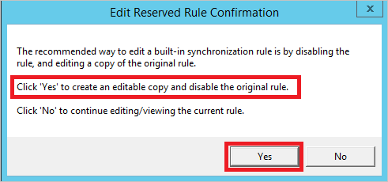
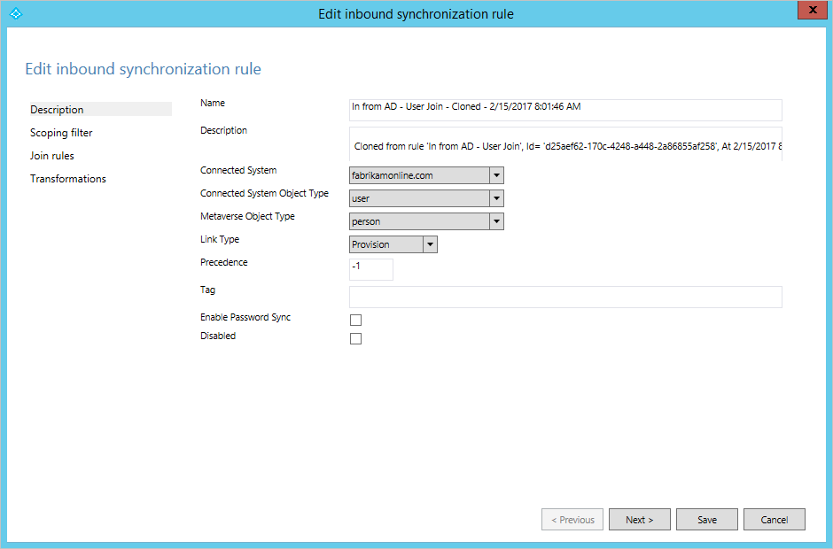

# Azure AD Connect sync: Best practices for changing the default configuration
The purpose of this topic is to describe supported and unsupported changes to Azure AD Connect sync.

The configuration created by Azure AD Connect works “as is” for most environments that synchronize on-premises Active Directory with Azure AD. However, in some cases, it is necessary to apply some changes to a configuration to satisfy a particular need or requirement.

## Changes to the service account
Azure AD Connect sync is running under a service account created by the installation wizard. This service account holds the encryption keys to the database used by sync. It is created with a 127 characters long password and the password is set to not expire.

* It is **unsupported** to change or reset the password of the service account. Doing so destroys the encryption keys and the service is not able to access the database and is not able to start.

## Changes to the scheduler
Starting with the releases from build 1.1 (February 2016) you can configure the [scheduler](how-to-connect-sync-feature-scheduler.md) to have a different sync cycle than the default 30 minutes.

## Changes to Synchronization Rules
The installation wizard provides a configuration that is supposed to work for the most common scenarios. In case you need to make changes to the configuration, then you must follow these rules to still have a supported configuration.

> [!WARNING]
> If you make changes to the default sync rules then these changes will be overwritten the next time Azure AD Connect is updated, resulting in unexpected and likely unwanted synchronization results.

* You can [change attribute flows](how-to-connect-sync-change-the-configuration.md#other-common-attribute-flow-changes) if the default direct attribute flows are not suitable for your organization.
* If you want to [not flow an attribute](how-to-connect-sync-change-the-configuration.md#do-not-flow-an-attribute) and remove any existing attribute values in Azure AD, then you need to create a rule for this scenario.
* [Disable an unwanted Sync Rule](#disable-an-unwanted-sync-rule) rather than deleting it. A deleted rule is recreated during an upgrade.
* To [change an out-of-box rule](#change-an-out-of-box-rule), you should make a copy of the original rule and disable the out-of-box rule. The Sync Rule Editor prompts and helps you.
* Export your custom synchronization rules using the Synchronization Rules Editor. The editor provides you with a PowerShell script you can use to easily recreate them in a disaster recovery scenario.

> [!WARNING]
> The out-of-box sync rules have a thumbprint. If you make a change to these rules, the thumbprint is no longer matching. You might have problems in the future when you try to apply a new release of Azure AD Connect. Only make changes the way it is described in this article.

### Disable an unwanted Sync Rule
Do not delete an out-of-box sync rule. It is recreated during next upgrade.

In some cases, the installation wizard has produced a configuration that is not working for your topology. For example, if you have an account-resource forest topology but you have extended the schema in the account forest with the Exchange schema, then rules for Exchange are created for the account forest and the resource forest. In this case, you need to disable the Sync Rule for Exchange.

In the picture above, the installation wizard has found an old Exchange 2003 schema in the account forest. This schema extension was added before the resource forest was introduced in Fabrikam's environment. To ensure no attributes from the old Exchange implementation are synchronized, the sync rule should be disabled as shown.

### Change an out-of-box rule
The only time you should change an out-of-box rule is when you need to change the join rule. If you need to change an attribute flow, then you should create a sync rule with higher precedence than the out-of-box rules. The only rule you practically need to clone is the rule **In from AD - User Join**. You can override all other rules with a higher precedence rule.

If you need to make changes to an out-of-box rule, then you should make a copy of the out-of-box rule and disable the original rule. Then make the changes to the cloned rule. The Sync Rule Editor is helping you with those steps. When you open an out-of-box rule, you are presented with this dialog box:  

Select **Yes** to create a copy of the rule. The cloned rule is then opened.  

On this cloned rule, make any necessary changes to scope, join, and transformations.

## Next steps
**Overview topics**

* [Azure AD Connect sync: Understand and customize synchronization](how-to-connect-sync-whatis.md)
* [Integrating your on-premises identities with Azure Active Directory](whatis-hybrid-identity.md)
