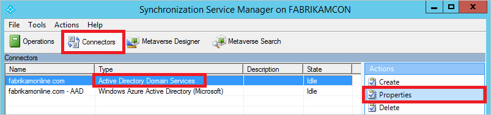
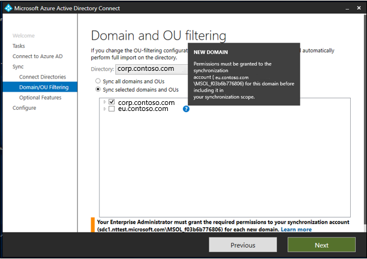
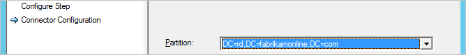
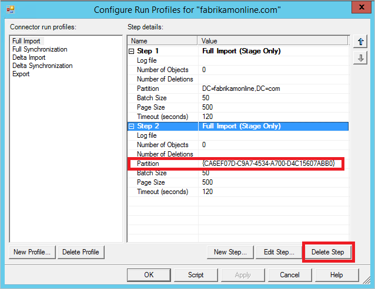
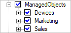
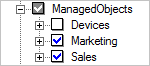
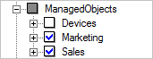
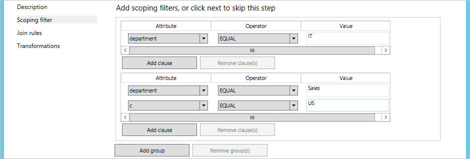
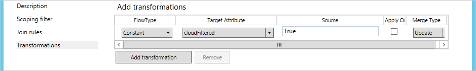
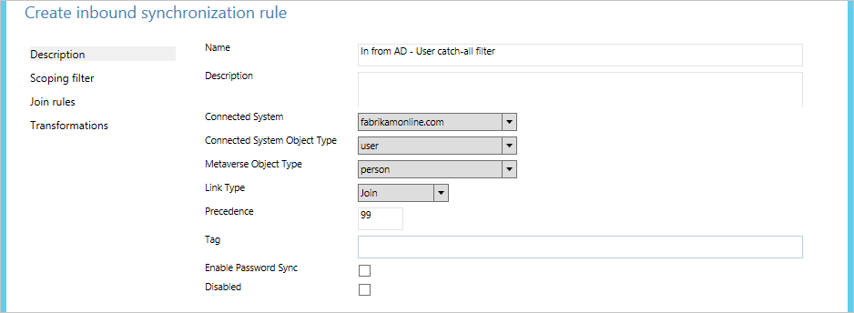

# Azure AD Connect sync: Configure filtering
By using filtering, you can control which objects appear in Azure Active Directory (Azure AD) from your on-premises directory. The default configuration takes all objects in all domains in the configured forests. In general, this is the recommended configuration. Users using Office 365 workloads, such as Exchange Online and Skype for Business, benefit from a complete Global Address List so they can send email and call everyone. With the default configuration, they would have the same experience that they would have with an on-premises implementation of Exchange or Lync.

In some cases however, you're required make some changes to the default configuration. Here are some examples:

* You plan to use the [multi-Azure AD directory topology](plan-connect-topologies.md#each-object-only-once-in-an-azure-ad-tenant). Then you need to apply a filter to control which objects are synchronized to a particular Azure AD directory.
* You run a pilot for Azure or Office 365 and you only want a subset of users in Azure AD. In the small pilot, it's not important to have a complete Global Address List to demonstrate the functionality.
* You have many service accounts and other nonpersonal accounts that you don't want in Azure AD.
* For compliance reasons, you don't delete any user accounts on-premises. You only disable them. But in Azure AD, you only want active accounts to be present.

This article covers how to configure the different filtering methods.

> [!IMPORTANT]
> Microsoft doesn't support modifying or operating Azure AD Connect sync outside of the actions that are formally documented. Any of these actions might result in an inconsistent or unsupported state of Azure AD Connect sync. As a result, Microsoft can't provide technical support for such deployments.

## Basics and important notes
In Azure AD Connect sync, you can enable filtering at any time. If you start with a default configuration of directory synchronization and then configure filtering, the objects that are filtered out are no longer synchronized to Azure AD. Because of this change, any objects in Azure AD that were previously synchronized but were then filtered are deleted in Azure AD.

Before you start making changes to filtering, make sure that you [disable the scheduled task](#disable-the-scheduled-task) so you don't accidentally export changes that you haven't yet verified to be correct.

Because filtering can remove many objects at the same time, you want to make sure that your new filters are correct before you start exporting any changes to Azure AD. After you've completed the configuration steps, we strongly recommend that you follow the [verification steps](#apply-and-verify-changes) before you export and make changes to Azure AD.

To protect you from deleting many objects by accident, the feature "[prevent accidental deletes](how-to-connect-sync-feature-prevent-accidental-deletes.md)" is on by default. If you delete many objects due to filtering (500 by default), you need to follow the steps in this article to allow the deletes to go through to Azure AD.

If you use a build before November 2015 ([1.0.9125](reference-connect-version-history.md#1091250)), make a change to a filter configuration, and use password hash synchronization, then you need to trigger a full sync of all passwords after you've completed the configuration. For steps on how to trigger a password full sync, see [Trigger a full sync of all passwords](tshoot-connect-password-hash-synchronization.md#trigger-a-full-sync-of-all-passwords). If you're on build 1.0.9125 or later, then the regular **full synchronization** action also calculates whether passwords should be synchronized and if this extra step is no longer required.

If **user** objects were inadvertently deleted in Azure AD because of a filtering error, you can recreate the user objects in Azure AD by removing your filtering configurations. Then you can synchronize your directories again. This action restores the users from the recycle bin in Azure AD. However, you can't undelete other object types. For example, if you accidentally delete a security group and it was used to ACL a resource, the group and its ACLs can't be recovered.

Azure AD Connect only deletes objects that it has once considered to be in scope. If there are objects in Azure AD that were created by another sync engine and these objects aren't in scope, adding filtering doesn't remove them. For example, if you start with a DirSync server that created a complete copy of your entire directory in Azure AD, and you install a new Azure AD Connect sync server in parallel with filtering enabled from the beginning, Azure AD Connect doesn't remove the extra objects that are created by DirSync.

The filtering configuration is retained when you install or upgrade to a newer version of Azure AD Connect. It's always a best practice to verify that the configuration wasn't inadvertently changed after an upgrade to a newer version before running the first synchronization cycle.

If you have more than one forest, then you must apply the filtering configurations that are described in this topic to every forest (assuming that you want the same configuration for all of them).

### Disable the scheduled task
To disable the built-in scheduler that triggers a synchronization cycle every 30 minutes, follow these steps:

1. Go to a PowerShell prompt.
2. Run `Set-ADSyncScheduler -SyncCycleEnabled $False` to disable the scheduler.
3. Make the changes that are documented in this article.
4. Run `Set-ADSyncScheduler -SyncCycleEnabled $True` to enable the scheduler again.

**If you use an Azure AD Connect build before 1.1.105.0**  
To disable the scheduled task that triggers a synchronization cycle every three hours, follow these steps:

1. Start **Task Scheduler** from the **Start** menu.
2. Directly under **Task Scheduler Library**, find the task named **Azure AD Sync Scheduler**, right-click, and select **Disable**.  
     
3. You can now make configuration changes and run the sync engine manually from the **Synchronization Service Manager** console.

After you've completed all your filtering changes, don't forget to come back and **Enable** the task again.

## Filtering options
You can apply the following filtering configuration types to the directory synchronization tool:

* [**Group-based**](#group-based-filtering): Filtering based on a single group can only be configured on initial installation by using the installation wizard.
* [**Domain-based**](#domain-based-filtering): By using this option, you can select which domains synchronize to Azure AD. You can also add and remove domains from the sync engine configuration when you make changes to your on-premises infrastructure after you install Azure AD Connect sync.
* [**Organizational unit (OU)–based**](#organizational-unitbased-filtering): By using this option, you can select which OUs synchronize to Azure AD. This option is for all object types in selected OUs.
* [**Attribute-based**](#attribute-based-filtering): By using this option, you can filter objects based on attribute values on the objects. You can also have different filters for different object types.

You can use multiple filtering options at the same time. For example, you can use OU-based filtering to only include objects in one OU. At the same time, you can use attribute-based filtering to filter the objects further. When you use multiple filtering methods, the filters use a logical "AND" between the filters.

## Domain-based filtering
This section provides you with the steps to configure your domain filter. If you added or removed domains in your forest after you installed Azure AD Connect, you also have to update the filtering configuration.

The preferred way to change domain-based filtering is by running the installation wizard and changing [domain and OU filtering](how-to-connect-install-custom.md#domain-and-ou-filtering). The installation wizard automates all the tasks that are documented in this topic.

You should only follow these steps if you're unable to run the installation wizard for some reason.

Domain-based filtering configuration consists of these steps:

1. Select the domains that you want to include in the synchronization.
2. For each added and removed domain, adjust the run profiles.
3. [Apply and verify changes](#apply-and-verify-changes).

### Select the domains to be synchronized
There are two ways to select the domains to be synchronized:
	- Using the Synchronization Service
	- Using the Azure AD Connect wizard.

#### Select the domains to be synchronized using the Synchronization Service
To set the domain filter, do the following steps:

1. Sign in to the server that is running Azure AD Connect sync by using an account that is a member of the **ADSyncAdmins** security group.
2. Start **Synchronization Service** from the **Start** menu.
3. Select **Connectors**, and in the **Connectors** list, select the Connector with the type **Active Directory Domain Services**. In **Actions**, select **Properties**.  
     
4. Click **Configure Directory Partitions**.
5. In the **Select directory partitions** list, select and unselect domains as needed. Verify that only the partitions that you want to synchronize are selected.  
     
   If you've changed your on-premises Active Directory infrastructure and added or removed domains from the forest, then click the **Refresh** button to get an updated list. When you refresh, you're asked for credentials. Provide any credentials with read access to Windows Server Active Directory. It doesn't have to be the user that is prepopulated in the dialog box.  
     
6. When you're done, close the **Properties** dialog by clicking **OK**. If you removed domains from the forest, a message pop-up says that a domain was removed and that configuration will be cleaned up.
7. Continue to adjust the run profiles.

#### Select the domains to be synchronized using the Azure AD Connect wizard
To set the domain filter, do the following steps:

1.  Start the Azure AD Connect wizard
2.  Click **Configure**.
3.  Select **Customize Synchronization Options** and click **Next**.
4.  Enter your Azure AD credentials
5.  On the **Connected Directories** screen click **Next**.
6.  On the **Domain and OU filtering page** click **Refresh**.  New domains ill now appear and deleted domains will disappear.
     

### Update the run profiles
If you've updated your domain filter, you also need to update the run profiles.

1. In the **Connectors** list, make sure that the Connector that you changed in the previous step is selected. In **Actions**, select **Configure Run Profiles**.  
     
2. Find and identify the following profiles:
    * Full Import
    * Full Synchronization
    * Delta Import
    * Delta Synchronization
    * Export
3. For each profile, adjust the **added** and **removed** domains.
    1. For each of the five profiles, do the following steps for each **added** domain:
        1. Select the run profile and click **New Step**.
        2. On the **Configure Step** page, in the **Type** drop-down menu, select the step type with the same name as the profile that you're configuring. Then click **Next**.  
          
        3. On the **Connector Configuration** page, in the **Partition** drop-down menu, select the name of the domain that you've added to your domain filter.  
          
        4. To close the **Configure Run Profile** dialog, click **Finish**.
    2. For each of the five profiles, do the following steps for each **removed** domain:
        1. Select the run profile.
        2. If the **Value** of the **Partition** attribute is a GUID, select the run step and click **Delete Step**.  
          
    3. Verify your change. Each domain that you want to synchronize should be listed as a step in each run profile.
4. To close the **Configure Run Profiles** dialog, click **OK**.
5.  To complete the configuration, you need to run a **Full import** and a **Delta sync**. Continue reading the section [Apply and verify changes](#apply-and-verify-changes).

## Organizational unit–based filtering
The preferred way to change OU-based filtering is by running the installation wizard and changing [domain and OU filtering](how-to-connect-install-custom.md#domain-and-ou-filtering). The installation wizard automates all the tasks that are documented in this topic.

You should only follow these steps if you're unable to run the installation wizard for some reason.

To configure organizational unit–based filtering, do the following steps:

1. Sign in to the server that is running Azure AD Connect sync by using an account that is a member of the **ADSyncAdmins** security group.
2. Start **Synchronization Service** from the **Start** menu.
3. Select **Connectors**, and in the **Connectors** list, select the Connector with the type **Active Directory Domain Services**. In **Actions**, select **Properties**.  
     
4. Click **Configure Directory Partitions**, select the domain that you want to configure, and then click **Containers**.
5. When you're prompted, provide any credentials with read access to your on-premises Active Directory. It doesn't have to be the user that is prepopulated in the dialog box.
6. In the **Select Containers** dialog box, clear the OUs that you don’t want to synchronize with the cloud directory, and then click **OK**.  
     
   * The **Computers** container should be selected for your Windows 10 computers to be successfully synchronized to Azure AD. If your domain-joined computers are located in other OUs, make sure those are selected.
   * The **ForeignSecurityPrincipals** container should be selected if you have multiple forests with trusts. This container allows cross-forest security group membership to be resolved.
   * The **RegisteredDevices** OU should be selected if you enabled the device writeback feature. If you use another writeback feature, such as group writeback, make sure these locations are selected.
   * Select any other OU where Users, iNetOrgPersons, Groups, Contacts, and Computers are located. In the picture, all these OUs are located in the ManagedObjects OU.
   * If you use group-based filtering, then the OU where the group is located must be included.
   * Note that you can configure whether new OUs that are added after the filtering configuration finishes are synchronized or not synchronized. See the next section for details.
7. When you're done, close the **Properties** dialog by clicking **OK**.
8. To complete the configuration, you need to run a **Full import** and a **Delta sync**. Continue reading the section [Apply and verify changes](#apply-and-verify-changes).

### Synchronize new OUs
New OUs that are created after filtering has been configured are synchronized by default. This state is indicated by a selected check box. You can also unselect some sub-OUs. To get this behavior, click the box until it becomes white with a blue check mark (its default state). Then unselect any sub-OUs that you don't want to synchronize.

If all sub-OUs are synchronized, then the box is white with a blue check mark.  

If some sub-OUs have been unselected, then the box is gray with a white check mark.  

With this configuration, a new OU that was created under ManagedObjects is synchronized.

The Azure AD Connect installation wizard always creates this configuration.

### Don't synchronize new OUs
You can configure the sync engine to not synchronize new OUs after the filtering configuration has finished. This state is indicated in the UI by the box appearing solid gray with no check mark. To get this behavior, click the box until it becomes white with no check mark. Then select the sub-OUs that you want to synchronize.

With this configuration, a new OU that was created under ManagedObjects isn't synchronized.

## Attribute-based filtering
Make sure that you're using the November 2015 ([1.0.9125](reference-connect-version-history.md#1091250)) or later build for these steps to work.

> [!IMPORTANT]
>Microsoft recommends to not modify the default rules created by **Azure AD Connect**. If you want to modify the rule, then clone it, and disable the original rule. Make any changes to the cloned rule. Please note that by doing so (disabling original rule) you will miss any bug fixes or features enabled through that rule.

Attribute-based filtering is the most flexible way to filter objects. You can use the power of [declarative provisioning](concept-azure-ad-connect-sync-declarative-provisioning.md) to control almost every aspect of when an object is synchronized to Azure AD.

You can apply [inbound](#inbound-filtering) filtering from Active Directory to the metaverse, and [outbound](#outbound-filtering) filtering from the metaverse to Azure AD. We recommend that you apply inbound filtering because that is the easiest to maintain. You should only use outbound filtering if it's required to join objects from more than one forest before the evaluation can take place.

### Inbound filtering
Inbound filtering uses the default configuration, where objects going to Azure AD must have the metaverse attribute cloudFiltered not set to a value to be synchronized. If this attribute's value is set to **True**, then the object isn't synchronized. It shouldn't be set to **False**, by design. To make sure other rules have the ability to contribute a value, this attribute is only supposed to have the values **True** or **NULL** (absent).

In inbound filtering, you use the power of **scope** to determine which objects to synchronize or not synchronize. This is where you make adjustments to fit your own organization's requirements. The scope module has a **group** and a **clause** to determine when a sync rule is in scope. A group contains one or many clauses. There is a logical "AND" between multiple clauses, and a logical "OR" between multiple groups.

Let us look at an example:  
  
This should be read as **(department = IT) OR (department = Sales AND c = US)**.

In the following samples and steps, you use the user object as an example, but you can use this for all object types.

In the following samples, the precedence value starts with 50. This can be any number not used, but should be lower than 100.

#### Negative filtering: "do not sync these"
In the following example, you filter out (not synchronize) all users where **extensionAttribute15** has the value **NoSync**.

1. Sign in to the server that is running Azure AD Connect sync by using an account that is a member of the **ADSyncAdmins** security group.
2. Start **Synchronization Rules Editor** from the **Start** menu.
3. Make sure **Inbound** is selected, and click **Add New Rule**.
4. Give the rule a descriptive name, such as "*In from AD – User DoNotSyncFilter*". Select the correct forest, select **User** as the **CS object type**, and select **Person** as the **MV object type**. In **Link Type**, select **Join**. In **Precedence**, type a value that isn't currently used by another synchronization rule (for example 50), and then click **Next**.  
     
5. In **Scoping filter**, click **Add Group**, and click **Add Clause**. In **Attribute**, select **ExtensionAttribute15**. Make sure that **Operator** is set to **EQUAL**, and type the value **NoSync** in the **Value** box. Click **Next**.  
     
6. Leave the **Join** rules empty, and then click **Next**.
7. Click **Add Transformation**, select the **FlowType** as **Constant**, and select **cloudFiltered** as the **Target Attribute**. In the **Source** text box, type **True**. Click **Add** to save the rule.  
   
8. To complete the configuration, you need to run a **Full sync**. Continue reading the section [Apply and verify changes](#apply-and-verify-changes).

#### Positive filtering: "only sync these"
Expressing positive filtering can be more challenging because you also have to consider objects that aren't obvious to be synchronized, such as conference rooms. You are also going to override the default filter in the out-of-box rule **In from AD - User Join**. When you create your custom filter, make sure to not include critical system objects, replication conflict objects, special mailboxes, and the service accounts for Azure AD Connect.

The positive filtering option requires two sync rules. You need one rule (or several) with the correct scope of objects to synchronize. You also need a second catch-all sync rule that filters out all objects that haven't yet been identified as an object that should be synchronized.

In the following example, you only synchronize user objects where the department attribute has the value **Sales**.

1. Sign in to the server that is running Azure AD Connect sync by using an account that is a member of the **ADSyncAdmins** security group.
2. Start **Synchronization Rules Editor** from the **Start** menu.
3. Make sure **Inbound** is selected, and click **Add New Rule**.
4. Give the rule a descriptive name, such as "*In from AD – User Sales sync*". Select the correct forest, select **User** as the **CS object type**, and select **Person** as the **MV object type**. In **Link Type**, select **Join**. In **Precedence**, type a value that isn't currently used by another synchronization rule (for example 51), and then click **Next**.  
     
5. In **Scoping filter**, click **Add Group**, and click **Add Clause**. In **Attribute**, select **department**. Make sure that Operator is set to **EQUAL**, and type the value **Sales** in the **Value** box. Click **Next**.  
     
6. Leave the **Join** rules empty, and then click **Next**.
7. Click **Add Transformation**, select **Constant** as the **FlowType**, and select the **cloudFiltered** as the **Target Attribute**. In the **Source** box, type **False**. Click **Add** to save the rule.  
     
   This is a special case where you explicitly set cloudFiltered to **False**.
8. We now have to create the catch-all sync rule. Give the rule a descriptive name, such as "*In from AD – User Catch-all filter*". Select the correct forest, select **User** as the **CS object type**, and select **Person** as the **MV object type**. In **Link Type**, select **Join**. In **Precedence**, type a value that isn't currently used by another Synchronization Rule (for example 99). You've selected a precedence value that is higher (lower precedence) than the previous sync rule. But you've also left some room so that you can add more filtering sync rules later when you want to start synchronizing additional departments. Click **Next**.  
     
9. Leave **Scoping filter** empty, and click **Next**. An empty filter indicates that the rule is to be applied to all objects.
10. Leave the **Join** rules empty, and then click **Next**.
11. Click **Add Transformation**, select **Constant** as the **FlowType**, and select **cloudFiltered** as the **Target Attribute**. In the **Source** box, type **True**. Click **Add** to save the rule.  
      
12. To complete the configuration, you need to run a **Full sync**. Continue reading the section [Apply and verify changes](#apply-and-verify-changes).

If you need to, you can create more rules of the first type where you include more objects in the synchronization.

### Outbound filtering
In some cases, it's necessary to do the filtering only after the objects have joined in the metaverse. For example, it might be necessary to look at the mail attribute from the resource forest, and the userPrincipalName attribute from the account forest, to determine if an object should be synchronized. In these cases, you create the filtering on the outbound rule.

In this example, you change the filtering so that only users that have both their mail and userPrincipalName ending in @contoso.com are synchronized:

1. Sign in to the server that is running Azure AD Connect sync by using an account that is a member of the **ADSyncAdmins** security group.
2. Start **Synchronization Rules Editor** from the **Start** menu.
3. Under **Rules Type**, click **Outbound**.
4. Depending on the version of Connect you use, either find the rule named **Out to AAD – User Join** or **Out to AAD - User Join SOAInAD**, and click **Edit**.
5. In the pop-up, answer **Yes** to create a copy of the rule.
6. On the **Description** page, change **Precedence** to an unused value, such as 50.
7. Click **Scoping filter** on the left-hand navigation, and then click **Add clause**. In **Attribute**, select **mail**. In **Operator**, select **ENDSWITH**. In **Value**, type **\@contoso.com**, and then click **Add clause**. In **Attribute**, select **userPrincipalName**. In **Operator**, select **ENDSWITH**. In **Value**, type **\@contoso.com**.
8. Click **Save**.
9. To complete the configuration, you need to run a **Full sync**. Continue reading the section [Apply and verify changes](#apply-and-verify-changes).

## Apply and verify changes
After you've made your configuration changes, you must apply them to the objects that are already present in the system. It might also be that the objects that aren't currently in the sync engine should be processed (and the sync engine needs to read the source system again to verify its content).

If you changed the configuration by using **domain** or **organizational-unit** filtering, then you need to do a **Full import**, followed by **Delta synchronization**.

If you changed the configuration by using **attribute** filtering, then you need to do a **Full synchronization**.

Do the following steps:

1. Start **Synchronization Service** from the **Start** menu.
2. Select **Connectors**. In the **Connectors** list, select the Connector where you made a configuration change earlier. In **Actions**, select **Run**.  
     
3. In **Run profiles**, select the operation that was mentioned in the previous section. If you need to run two actions, run the second after the first one has finished. (The **State** column is **Idle** for the selected connector.)

After the synchronization, all changes are staged to be exported. Before you actually make the changes in Azure AD, you want to verify that all these changes are correct.

1. Start a command prompt, and go to `%ProgramFiles%\Microsoft Azure AD Sync\bin`.
2. Run `csexport "Name of Connector" %temp%\export.xml /f:x`.  
   The name of the Connector is in Synchronization Service. It has a name similar to "contoso.com – AAD" for Azure AD.
3. Run `CSExportAnalyzer %temp%\export.xml > %temp%\export.csv`.
4. You now have a file in %temp% named export.csv that can be examined in Microsoft Excel. This file contains all the changes that are about to be exported.
5. Make the necessary changes to the data or configuration, and run these steps again (Import, Synchronize, and Verify) until the changes that are about to be exported are what you expect.

When you're satisfied, export the changes to Azure AD.

1. Select **Connectors**. In the **Connectors** list, select the Azure AD Connector. In **Actions**, select **Run**.
2. In **Run profiles**, select **Export**.
3. If your configuration changes delete many objects, then you see an error in the export when the number is more than the configured threshold (by default 500). If you see this error, then you need to temporarily disable the "[prevent accidental deletes](how-to-connect-sync-feature-prevent-accidental-deletes.md)" feature.

Now it's time to enable the scheduler again.

1. Start **Task Scheduler** from the **Start** menu.
2. Directly under **Task Scheduler Library**, find the task named **Azure AD Sync Scheduler**, right-click, and select **Enable**.

## Group-based filtering
You can configure group-based filtering the first time that you install Azure AD Connect by using [custom installation](how-to-connect-install-custom.md#sync-filtering-based-on-groups). It's intended for a pilot deployment where you want only a small set of objects to be synchronized. When you disable group-based filtering, it can't be enabled again. It's *not supported* to use group-based filtering in a custom configuration. It's only supported to configure this feature by using the installation wizard. When you've completed your pilot, then use one of the other filtering options in this topic. When using OU-based filtering in conjunction with group-based filtering, the OU(s) where the group and its members are located must be included.

When synchronizing multiple AD forests, you can configure group-based filtering by specifying a different group for each AD connector. If you wish to synchronize a user in one AD forest and the same user has one or more corresponding objects in other AD forests, you must ensure that the user object and all its corresponding objects are within group-based filtering scope. For examples:

* You have a user in one forest that has a corresponding FSP (Foreign Security Principal) object in another forest. Both objects must be within group-based filtering scope. Otherwise, the user will not be synchronized to Azure AD.

* You have a user in one forest that has a corresponding resource account (e.g., linked mailbox) in another forest. Further, you have configured Azure AD Connect to link the user with the resource account. Both objects must be within group-based filtering scope. Otherwise, the user will not be synchronized to Azure AD.

* You have a user in one forest that has a corresponding mail contact in another forest. Further, you have configured Azure AD Connect to link the user with the mail contact. Both objects must be within group-based filtering scope. Otherwise, the user will not be synchronized to Azure AD.

## Next steps
- Learn more about [Azure AD Connect sync](how-to-connect-sync-whatis.md) configuration.
- Learn more about [integrating your on-premises identities with Azure AD](whatis-hybrid-identity.md).
