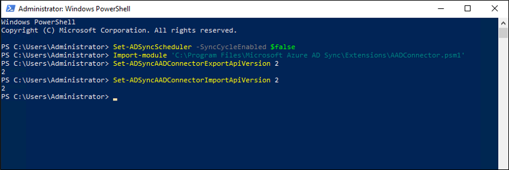
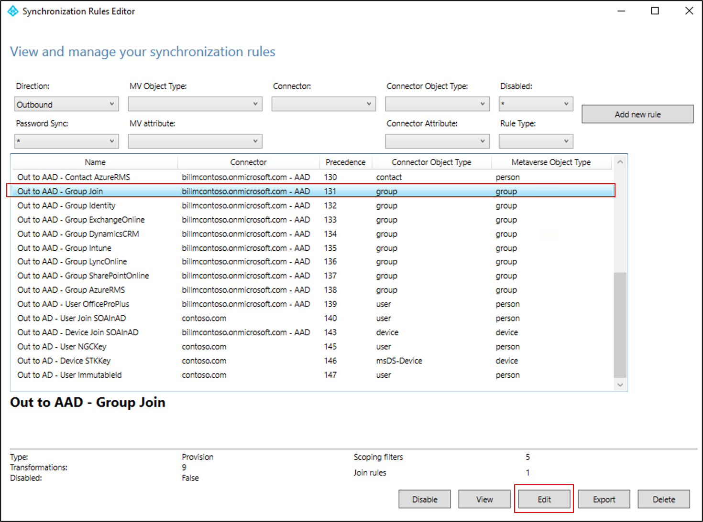
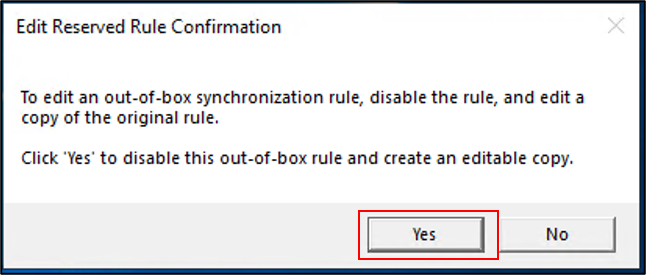
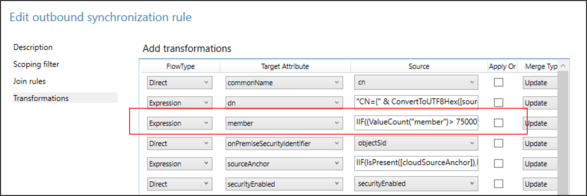

# Azure AD Connect sync V2 endpoint API (public preview) 
Microsoft has deployed a new endpoint (API) for Azure AD Connect that improves the performance of the synchronization service operations to Azure Active Directory. By utilizing the new V2 endpoint, you will experience noticeable performance gains on export and import to Azure AD. This new endpoint supports the following:
    
 -  syncing groups with up to 250k members
 - performance gains on export and import to Azure AD
 
> [!NOTE]
> Currently, the new endpoint does not have a configured  group size limit for O365 groups that are written back. This may have an effect on your Active Directory and sync cycle latencies.  It is recommended to increase your group sizes incrementally.  

## Pre-requisites  
In order to use the new V2 endpoint, you will need to use [Azure AD Connect version 1.5.30.0](https://www.microsoft.com/download/details.aspx?id=47594) or later and follow the deployment steps provided below to enable the V2 endpoint for your Azure AD Connect server.   

>[!NOTE]
>Currently, this public preview is only available in the Azure global cloud and not available for [national clouds](https://docs.microsoft.com/azure/active-directory/develop/authentication-national-cloud).

### Public preview limitations  
While this release has undergone extensive testing, you may still encounter issues. One of the goals of this public preview release is to find and fix any such issues.  

>[!IMPORTANT]
> While support is provided for this public preview release, Microsoft may not always be able to fix all issues you may encounter immediately. For this reason, it is recommended that you use your best judgement before deploying this release in your production environment. 

## Deployment guidance 
You will need to deploy [Azure AD Connect version 1.5.30.0](https://www.microsoft.com/download/details.aspx?id=47594) or later to use the V2 endpoint. Use the link provided to download. 

It is recommended that you follow the [swing migration](https://docs.microsoft.com/azure/active-directory/hybrid/how-to-upgrade-previous-version#swing-migration) method for rolling out the new endpoint in your environment. This will provide a clear contingency plan in the event, that a major rollback is necessary. The following example illustrates how a swing migration can be used in this scenario. For more information on the swing migration deployment method, refer to the link provided. 

### Swing migration for deploying V2 endpoint
The following steps will guide you through deploying the v2 endpoint using the swing method.

1. Deploy the V2 endpoint on the current staging server. This server will be known as the **V2 server** in the steps below. The current active server will continue to process the production workload using the V1 endpoint, which will be called the **V1 server** below.
1. Validate that the **V2 server** is still processing imports as expected. At this stage, large groups will not be provisioned to Azure AD or on-prem AD, but you will be able to verify that the upgrade did not result in any other unexpected impact to the existing synchronization process. 
2. Once validation is complete, switch the **V2 server** to be the active server and the **V1 server** to be the staging server. At this time, large groups that are in scope to be synced will be provisioned to Azure AD, as well as large O365 unified groups will be provisioned to AD, if group writeback is enabled.
3. Validate that the **V2 server** is performing and processing large groups successfully. You may choose to stay at this step and monitor the synchronization process for a period.
  >[!NOTE]
  > If you need to transition back to your previous configuration, you can perform a swing migration from the **V2 server** back to the **V1 server**. Since the V1 endpoint does not support groups with over 50k members, any large group that was provisioned by Azure AD Connect, in either Azure AD or on-prem AD, will be subsequently deleted. 
4. Once you are confident in using the V2 endpoint, upgrade the **V1 server** to begin using the V2 endpoint. 
 

## Expectations of performance impact  
When using the V2 endpoint, performance gains are a function of the number of synced groups, size of those groups, and their group churn (the activity resulting from adding and removing users as members of the group). Using the new endpoint, without increasing the number, size, or churn of the synced groups, should result in shorter times for export and import to Azure AD. 
 
However, the performance gains can be negated by the additional processing required when syncing large groups. You could end up increasing the overall sync time by adding a too many large groups to the sync process.  

To gain a better understanding of how the addition of the new groups will impact your sync performance, it is recommended that you start by syncing only a few large groups with less than 100k members. You can then increase the number and size of groups by bringing more of them in scope, through OU, attribute, or max group size filtering. The performance improvements will be realized on the export and import tasks for the Azure AD connector, not the on-premises AD connector. 

## Deployment step by step 
The following three phases are an in-depth example of deploying the new V2 endpoint.  Use the phases as a guideline for your deployment.

### Phase 1 – install and validate Azure AD Connect 
It is recommended that you first perform the steps to install or upgrade to [Azure AD Connect version 1.5.30.0](https://www.microsoft.com/download/details.aspx?id=47594) or later and validate the sync process before you go to the second phase where you will enable the V2 endpoint. 
On the Azure AD Connect server: 

1. [Optional] Take database backup 
2. Install or upgrade to [Azure AD Connect version 1.5.30.0](https://www.microsoft.com/download/details.aspx?id=47594) or later.
3. Validate the installation 

### Phase 2 – enable the V2 endpoint 
The next step is to enable the V2 endpoint. 

> [!NOTE]
> After you have enabled the V2 endpoint for your server you will be able to see some performance improvements for your existing workload. You will not yet be able to sync groups with more that 50K members though. 

To switch to the V2 endpoint, use the following steps: 

1. Open a PowerShell prompt as administrator. 
2. Disable the sync scheduler after verifying that no synchronization operations are running: 
 
 `Set-ADSyncScheduler -SyncCycleEnabled $false`
 
3. Import the new module: 
 
 `Import-Module 'C:\Program Files\Microsoft Azure AD Sync\Extensions\AADConnector.psm1'` 
 
4.  Switch to the v2 endpoint:

 `Set-ADSyncAADConnectorExportApiVersion 2` 
 
 `Set-ADSyncAADConnectorImportApiVersion 2` 

 
 
You have now enabled the V2 endpoint for your server. Take some time to verify that there are no unexpected results after enabling the V2 endpoint before you move to the next phase where you will increase the group size limit. 
>[!NOTE]
>The file / module paths may use a different drive letter, depending on the installation path provided when installing Azure AD Connect. 

### Phase 3 – increase the group membership limit 
After you have verified that the service is running without unexpected results, you can proceed to raising the group membership limit. It is recommended to first raise the membership limit to a slightly higher value, e g. 75K members, to see the larger groups syncing to Azure AD. Once you are satisfied with the results you can further raise the member limit.  

The maximum limit is 250K members per group. 

The following steps can be used to increase the membership limit:  

1. Open Azure AD Synchronization Rules Editor 
2. In the editor, choose **Outbound** for Direction 
3. Click on the **Out to AAD – Group Join** sync rule 
4. Click the **Edit** button 
 

6. Click the **Yes** button to disable the default rule and create an editable copy.
 

7. In the pop-up window on the **Description** page, set the precedence to an available value between 1 and 99

8. On the **Transformations** page, update the **Source** value for the **member** transformation, replacing ‘50000’ with a value between 50001 and 250000. This replacement will increase the maximum membership size of groups that will sync to Azure AD. We suggest starting with a number of 100k, to understand the impact that syncing large groups will have on your sync performance. 
 
 **Example** 
 
 `IIF((ValueCount("member")> 75000),Error("Maximum Group member count exceeded"),IgnoreThisFlow)` 
 
 

9. Click Save 
10. Open admin PowerShell prompt 
11. Re-enable the Sync Scheduler 
 
 `Set-ADSyncScheduler -SyncCycleEnabled $true` 
 
>[!NOTE]
> If Azure AD Connect Health is not enabled, change the windows application event log settings to archive the logs, instead of overwriting them. The logs may be used to assist in future troubleshooting efforts. 

>[!NOTE]
> After enabling the new endpoint, you may see additional export errors on the AAD connector with name ‘dn-attributes-failure’. There will be a corresponding event log entry for each error with id 6949, . The errors are informational and do not indicate a problem with your installation, but rather that the sync process could not add certain members to a group in Azure AD because the member object itself was not synced to Azure AD. 

The new V2 endpoint code handles some types of export errors slightly different from how the V1 code did.  You may see more of the informational error messages when you use the V2 endpoint. 

>[!NOTE]
> When upgrading Azure AD Connect, ensure that the steps in Phase 2 are rerun, as the changes are not preserved through the upgrade process. 

During subsequent increases to the group member limit in the **Out to AAD – Group Join** sync rule, a full sync is not necessary, so you can elect to suppress the full sync by running the following command in PowerShell. 

 `Set-ADSyncSchedulerConnectorOverride -FullSyncRequired $false -ConnectorName "<AAD Connector Name>" `
 
>[!NOTE]
> If you have O365 unified groups that have more than 50k members, the groups will be read into Azure AD Connect, and if group writeback is enabled, they will be written to your on-premises AD. 

## Rollback 
If you have enabled the v2 endpoint and need to rollback, follow these steps: 

1. On the Azure AD Connect server: 
    a. [Optional] Take database backup 
2. Open an admin PowerShell prompt:
3. Disable the sync scheduler after verifying that no synchronization operations are running
 
 `Set-ADSyncScheduler -SyncCycleEnabled $false`

4. Switch to the V1 endpoint * 
 
 `Import-Module 'C:\Program Files\Microsoft Azure AD Sync\Extensions\AADConnector.psm1'` 

 `Set-ADSyncAADConnectorExportApiVersion 1`

 `Set-ADSyncAADConnectorImportApiVersion 1`
 
5. Open Azure AD Synchronization Rules Editor 
6. Delete the editable copy of the **Out to AAD – Group Join** sync rule 
7. Enable the default copy of the **Out to AAD – Group Join** sync rule 
8. Open an admin PowerShell prompt 
9. Re-enable the Sync Scheduler 
 
 `Set-ADSyncScheduler -SyncCycleEnabled $true`
 
>[!NOTE]
> When switching back from the V2 to V1 endpoints, groups synced with more than 50k members will be deleted after a full sync is run, for both AD groups provisioned to Azure AD and O365 unified groups provisioned to AD. 

## Frequently asked questions  
**Q: Can a customer use this feature in production?**  
 Yes, this can be used in production environments, with the caveat as mentioned before.
 
**Q: Who can the customer contact when things go wrong?**  
 If you need support when using this feature you should open a support case. 
 
**Q: Can I expect frequent updates to the public preview?**  
 There is a limited degree of ongoing changes during a Public Preview. You should assess this risk when deploying Public Preview features in production.  
 
**Q: Time to next milestone?**  
 Public Preview capabilities may be withdrawn and possibly redesigned before reaching further milestones.  
 
## Next steps

* [Azure AD Connect sync: Understand and customize synchronization](how-to-connect-sync-whatis.md)
* [Integrating your on-premises identities with Azure Active Directory](whatis-hybrid-identity.md)
