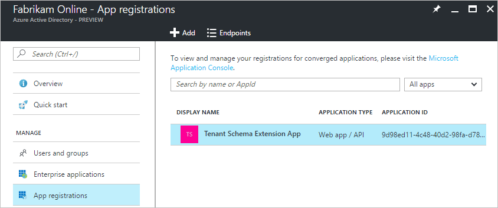
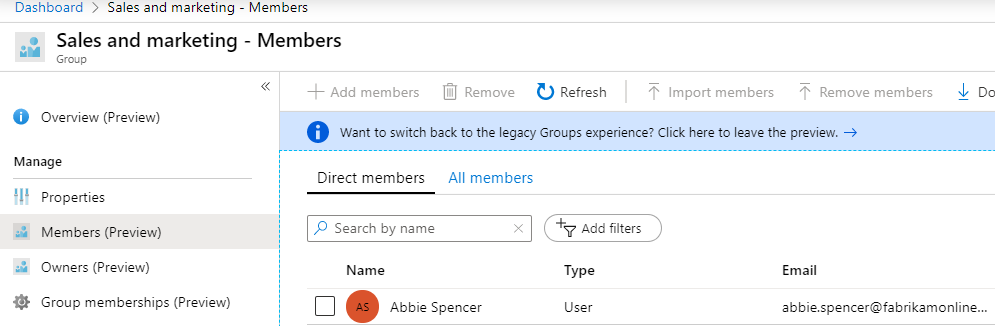

# Azure AD Connect sync: Directory extensions
You can use directory extensions to extend the schema in Azure Active Directory (Azure AD) with your own attributes from on-premises Active Directory. This feature enables you to build LOB apps by consuming attributes that you continue to manage on-premises. These attributes can be consumed through [extensions](https://docs.microsoft.com/graph/extensibility-overview
). You can see the available attributes by using [Microsoft Graph Explorer](https://developer.microsoft.com/graph/graph-explorer). You can also use this feature to create dynamic groups in Azure AD.

At present, no Office 365 workload consumes these attributes.

## Customize which attributes to synchronize with Azure AD

You configure which additional attributes you want to synchronize in the custom settings path in the installation wizard.

>[!NOTE]
>The Available Attributes box is case-sensitive.

  

The installation shows the following attributes, which are valid candidates:

* User and Group object types
* Single-valued attributes: String, Boolean, Integer, Binary
* Multi-valued attributes: String, Binary

>[!NOTE]
> Although Azure AD Connect supports synchronizing multi-valued Active Directory attributes to Azure AD as multi-valued directory extensions, there is currently no way to retrieve/consume the data uploaded in multi-valued directory extension attributes.

The list of attributes is read from the schema cache that's created during installation of Azure AD Connect. If you have extended the Active Directory schema with additional attributes, you must [refresh the schema](how-to-connect-installation-wizard.md#refresh-directory-schema) before these new attributes are visible.

An object in Azure AD can have up to 100 attributes for directory extensions. The maximum length is 250 characters. If an attribute value is longer, the sync engine truncates it.

## Configuration changes in Azure AD made by the wizard

During installation of Azure AD Connect, an application is registered where these attributes are available. You can see this application in the Azure portal. Its name is always **Tenant Schema Extension App**.

Make sure you select **All applications** to see this app.

The attributes are prefixed with **extension \_{ApplicationId}\_**. ApplicationId has the same value for all attributes in your Azure AD tenant. You will need this value for all other scenarios in this topic.

## Viewing attributes using the Microsoft Graph API

These attributes are now available through the Microsoft Graph API, by using [Microsoft Graph Explorer](https://developer.microsoft.com/graph/graph-explorer#).

>[!NOTE]
> In the Microsoft Graph API, you need to ask for the attributes to be returned. Explicitly select the attributes like this: `https://graph.microsoft.com/beta/users/abbie.spencer@fabrikamonline.com?$select=extension_9d98ed114c4840d298fad781915f27e4_employeeID,extension_9d98ed114c4840d298fad781915f27e4_division`.
>
> For more information, see [Microsoft Graph: Use query parameters](https://developer.microsoft.com/graph/docs/concepts/query_parameters#select-parameter).

## Use the attributes in dynamic groups

One of the more useful scenarios is to use these attributes in dynamic security or Office 365 groups.

1. Create a new group in Azure AD. Give it a good name and make sure the **Membership type** is **Dynamic User**.

   

2. Select to **Add dynamic query**. If you look at the properties, then you will not see these extended attributes. You need to add them first. Click **Get custom extension properties**, enter the Application ID, and click **Refresh properties**.

    

3. Open the property drop-down and note that the attributes you added are now visible.

   

   Complete the expression to suit your requirements. In our example, the rule is set to **(user.extension_9d98ed114c4840d298fad781915f27e4_division -eq "Sales and marketing")**.

4. After the group has been created, give Azure AD some time to populate the members and then review the members.

     

## Next steps
Learn more about the [Azure AD Connect sync](how-to-connect-sync-whatis.md) configuration.

Learn more about [Integrating your on-premises identities with Azure Active Directory](whatis-hybrid-identity.md).
