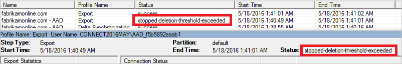

# Azure AD Connect sync: Prevent accidental deletes
This topic describes the prevent accidental deletes (preventing accidental deletions) feature in Azure AD Connect.

When installing Azure AD Connect, prevent accidental deletes is enabled by default and configured to not allow an export with more than 500 deletes. This feature is designed to protect you from accidental configuration changes and changes to your on-premises directory that would affect many users and other objects.

## What is prevent accidental deletes
Common scenarios when you see many deletes include:

* Changes to [filtering](how-to-connect-sync-configure-filtering.md) where an entire [OU](how-to-connect-sync-configure-filtering.md#organizational-unitbased-filtering) or [domain](how-to-connect-sync-configure-filtering.md#domain-based-filtering) is unselected.
* All objects in an OU are deleted.
* An OU is renamed so all objects in it are considered to be out of scope for synchronization.

The default value of 500 objects can be changed with PowerShell using `Enable-ADSyncExportDeletionThreshold`, which is part of the AD Sync module installed with Azure Active Directory Connect. You should configure this value to fit the size of your organization. Since the sync scheduler runs every 30 minutes, the value is the number of deletes seen within 30 minutes.

If there are too many deletes staged to be exported to Azure AD, then the export stops and you receive an email like this:

> *Hello (technical contact). At (time) the Identity synchronization service detected that the number of deletions exceeded the configured deletion threshold for (organization name). A total of (number) objects were sent for deletion in this Identity synchronization run. This met or exceeded the configured deletion threshold value of (number) objects. We need you to provide confirmation that these deletions should be processed before we will proceed. Please see the preventing accidental deletions for more information about the error listed in this email message.*
>
> 

You can also see the status `stopped-deletion-threshold-exceeded` when you look in the **Synchronization Service Manager** UI for the Export profile.

If this was unexpected, then investigate and take corrective actions. To see which objects are about to be deleted, do the following:

1. Start **Synchronization Service** from the Start Menu.
2. Go to **Connectors**.
3. Select the Connector with type **Azure Active Directory**.
4. Under **Actions** to the right, select **Search Connector Space**.
5. In the pop-up under **Scope**, select **Disconnected Since** and pick a time in the past. Click **Search**. This page provides a view of all objects about to be deleted. By clicking each item, you can get additional information about the object. You can also click **Column Setting** to add additional attributes to be visible in the grid.

If all the deletes are desired, then do the following:

1. To retrieve the current deletion threshold, run the PowerShell cmdlet `Get-ADSyncExportDeletionThreshold`. Provide an Azure AD Global Administrator account and password. The default value is 500.
2. To temporarily disable this protection and let those deletes go through, run the PowerShell cmdlet: `Disable-ADSyncExportDeletionThreshold`. Provide an Azure AD Global Administrator account and password.
   
3. With the Azure Active Directory Connector still selected, select the action **Run** and select **Export**.
4. To re-enable the protection, run the PowerShell cmdlet: `Enable-ADSyncExportDeletionThreshold -DeletionThreshold 500`. Replace 500 with the value you noticed when retrieving the current deletion threshold. Provide an Azure AD Global Administrator account and password.

## Next steps
**Overview topics**

* [Azure AD Connect sync: Understand and customize synchronization](how-to-connect-sync-whatis.md)
* [Integrating your on-premises identities with Azure Active Directory](whatis-hybrid-identity.md)
