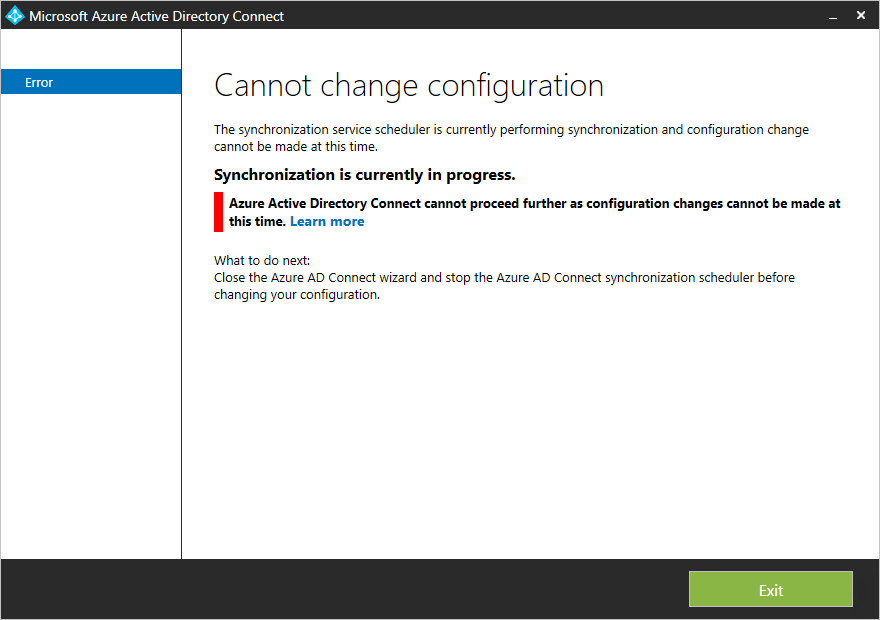

# Azure AD Connect sync: Scheduler
This topic describes the built-in scheduler in Azure AD Connect sync (sync engine).

This feature was introduced with build 1.1.105.0 (released February 2016).

## Overview
Azure AD Connect sync synchronize changes occurring in your on-premises directory using a scheduler. There are two scheduler processes, one for password sync and another for object/attribute sync and maintenance tasks. This topic covers the latter.

In earlier releases, the scheduler for objects and attributes was external to the sync engine. It used Windows task scheduler or a separate Windows service to trigger the synchronization process. The scheduler is with the 1.1 releases built-in to the sync engine and do allow some customization. The new default synchronization frequency is 30 minutes.

The scheduler is responsible for two tasks:

* **Synchronization cycle**. The process to import, sync, and export changes.
* **Maintenance tasks**. Renew keys and certificates for Password reset and Device Registration Service (DRS). Purge old entries in the operations log.

The scheduler itself is always running, but it can be configured to only run one or none of these tasks. For example, if you need to have your own synchronization cycle process, you can disable this task in the scheduler but still run the maintenance task.

## Scheduler configuration
To see your current configuration settings, go to PowerShell and run `Get-ADSyncScheduler`. It shows you something like this picture:


If you see **The sync command or cmdlet is not available** when you run this cmdlet, then the PowerShell module is not loaded. This problem could happen if you run Azure AD Connect on a domain controller or on a server with higher PowerShell restriction levels than the default settings. If you see this error, then run `Import-Module ADSync` to make the cmdlet available.

* **AllowedSyncCycleInterval**. The shortest time interval between synchronization cycles allowed by Azure AD. You cannot synchronize more frequently than this setting and still be supported.
* **CurrentlyEffectiveSyncCycleInterval**. The schedule currently in effect. It has the same value as CustomizedSyncInterval (if set) if it is not more frequent than AllowedSyncInterval. If you use a build before 1.1.281 and you change CustomizedSyncCycleInterval, this change takes effect after next synchronization cycle. From build 1.1.281 the change takes effect immediately.
* **CustomizedSyncCycleInterval**. If you want the scheduler to run at any other frequency than the default 30 minutes, then you configure this setting. In the picture above, the scheduler has been set to run every hour instead. If you set this setting to a value lower than AllowedSyncInterval, then the latter is used.
* **NextSyncCyclePolicyType**. Either Delta or Initial. Defines if the next run should only process delta changes, or if the next run should do a full import and sync. The latter would also reprocess any new or changed rules.
* **NextSyncCycleStartTimeInUTC**. Next time the scheduler starts the next sync cycle.
* **PurgeRunHistoryInterval**. The time operation logs should be kept. These logs can be reviewed in the synchronization service manager. The default is to keep these logs for 7 days.
* **SyncCycleEnabled**. Indicates if the scheduler is running the import, sync, and export processes as part of its operation.
* **MaintenanceEnabled**. Shows if the maintenance process is enabled. It updates the certificates/keys and purges the operations log.
* **StagingModeEnabled**. Shows if [staging mode](how-to-connect-sync-staging-server.md) is enabled. If this setting is enabled, then it suppresses the exports from running but still run import and synchronization.
* **SchedulerSuspended**. Set by Connect during an upgrade to temporarily block the scheduler from running.

You can change some of these settings with `Set-ADSyncScheduler`. The following parameters can be modified:

* CustomizedSyncCycleInterval
* NextSyncCyclePolicyType
* PurgeRunHistoryInterval
* SyncCycleEnabled
* MaintenanceEnabled

In earlier builds of Azure AD Connect, **isStagingModeEnabled** was exposed in Set-ADSyncScheduler. It is **unsupported** to set this property. The property **SchedulerSuspended** should only be modified by Connect. It is **unsupported** to set this with PowerShell directly.

The scheduler configuration is stored in Azure AD. If you have a staging server, any change on the primary server also affects the staging server (except IsStagingModeEnabled).

### CustomizedSyncCycleInterval
Syntax: `Set-ADSyncScheduler -CustomizedSyncCycleInterval d.HH:mm:ss`  
d - days, HH - hours, mm - minutes, ss - seconds

Example: `Set-ADSyncScheduler -CustomizedSyncCycleInterval 03:00:00`  
Changes the scheduler to run every 3 hours.

Example: `Set-ADSyncScheduler -CustomizedSyncCycleInterval 1.0:0:0`  
Changes change the scheduler to run daily.

### Disable the scheduler  
If you need to make configuration changes, then you want to disable the scheduler. For example, when you [configure filtering](how-to-connect-sync-configure-filtering.md) or [make changes to synchronization rules](how-to-connect-sync-change-the-configuration.md).

To disable the scheduler, run `Set-ADSyncScheduler -SyncCycleEnabled $false`.


When you've made your changes, do not forget to enable the scheduler again with `Set-ADSyncScheduler -SyncCycleEnabled $true`.

## Start the scheduler
The scheduler is by default run every 30 minutes. In some cases, you might want to run a sync cycle in between the scheduled cycles or you need to run a different type.

### Delta sync cycle
A delta sync cycle includes the following steps:


- Delta import on all Connectors
- Delta sync on all Connectors
- Export on all Connectors

### Full sync cycle
A full sync cycle includes the following steps:

- Full Import on all Connectors
- Full Sync on all Connectors
- Export on all Connectors

It could be that you have an urgent change that must be synchronized immediately, which is why you need to manually run a cycle. 

If you need to manually run a sync cycle, then from PowerShell run `Start-ADSyncSyncCycle -PolicyType Delta`.

To initiate a full sync cycle, run `Start-ADSyncSyncCycle -PolicyType Initial` from a PowerShell prompt.   

Running a full sync cycle can be very time consuming, read the next section to read how to optimize this process.

### Sync steps required for different configuration changes
Different configuration changes require different sync steps to ensure the changes are correctly applied to all objects.

- Added more objects or attributes to be imported from a source directory (by adding/modifying the sync rules)
    - A Full Import is required on the Connector for that source directory
- Made changes to the Synchronization rules
    - A Full Sync is required on the Connector for the changed Synchronization rules
- Changed [filtering](how-to-connect-sync-configure-filtering.md) so a different number of objects should be included
    - A Full Import is required on the Connector for each AD Connector UNLESS you are using Attribute-based filtering based on attributes that are already being imported into the sync engine

### Customizing a sync cycle run the right mix of Delta and Full sync steps
To avoid running a full sync cycle you can mark specific Connectors to run a Full step using the following cmdlets.

`Set-ADSyncSchedulerConnectorOverride -Connector <ConnectorGuid> -FullImportRequired $true`

`Set-ADSyncSchedulerConnectorOverride -Connector <ConnectorGuid> -FullSyncRequired $true`

`Get-ADSyncSchedulerConnectorOverride -Connector <ConnectorGuid>` 

Example:  If you made changes to the synchronization rules for Connector “AD Forest A” that don’t require any new attributes to be imported you would run the following cmdlets to run a delta sync cycle which also did a Full Sync step for that Connector.

`Set-ADSyncSchedulerConnectorOverride -ConnectorName “AD Forest A” -FullSyncRequired $true`

`Start-ADSyncSyncCycle -PolicyType Delta`

Example:  If you made changes to the synchronization rules for Connector “AD Forest A” so that they now require a new attribute to be imported you would run the following cmdlets to run a delta sync cycle which also did a Full Import, Full Sync step for that Connector.

`Set-ADSyncSchedulerConnectorOverride -ConnectorName “AD Forest A” -FullImportRequired $true`

`Set-ADSyncSchedulerConnectorOverride -ConnectorName “AD Forest A” -FullSyncRequired $true`

`Start-ADSyncSyncCycle -PolicyType Delta`


## Stop the scheduler
If the scheduler is currently running a synchronization cycle, you might need to stop it. For example if you start the installation wizard and you get this error:



When a sync cycle is running, you cannot make configuration changes. You could wait until the scheduler has finished the process, but you can also stop it so you can make your changes immediately. Stopping the current cycle is not harmful and pending changes are processed with next run.

1. Start by telling the scheduler to stop its current cycle with the PowerShell cmdlet `Stop-ADSyncSyncCycle`.
2. If you use a build before 1.1.281, then stopping the scheduler does not stop the current Connector from its current task. To force the Connector to stop, take the following actions:
   
   * Start **Synchronization Service** from the start menu. Go to **Connectors**, highlight the Connector with the state **Running**, and select **Stop** from the Actions.

The scheduler is still active and starts again on next opportunity.

## Custom scheduler
The cmdlets documented in this section are only available in build [1.1.130.0](reference-connect-version-history.md#111300) and later.

If the built-in scheduler does not satisfy your requirements, then you can schedule the Connectors using PowerShell.

### Invoke-ADSyncRunProfile
You can start a profile for a Connector in this way:

```
Invoke-ADSyncRunProfile -ConnectorName "name of connector" -RunProfileName "name of profile"
```

The names to use for [Connector names](how-to-connect-sync-service-manager-ui-connectors.md) and [Run Profile Names](how-to-connect-sync-service-manager-ui-connectors.md#configure-run-profiles) can be found in the [Synchronization Service Manager UI](how-to-connect-sync-service-manager-ui.md).

  

The `Invoke-ADSyncRunProfile` cmdlet is synchronous, that is, it does not return control until the Connector has completed the operation, either successfully or with an error.

When you schedule your Connectors, the recommendation is to schedule them in the following order:

1. (Full/Delta) Import from on-premises directories, such as Active Directory
2. (Full/Delta) Import from Azure AD
3. (Full/Delta) Synchronization from on-premises directories, such as Active Directory
4. (Full/Delta) Synchronization from Azure AD
5. Export to Azure AD
6. Export to on-premises directories, such as Active Directory

This order is how the built-in scheduler runs the Connectors.

### Get-ADSyncConnectorRunStatus
You can also monitor the sync engine to see if it is busy or idle. This cmdlet returns an empty result if the sync engine is idle and is not running a Connector. If a Connector is running, it returns the name of the Connector.

```
Get-ADSyncConnectorRunStatus
```

  
In the picture above, the first line is from a state where the sync engine is idle. The second line from when the Azure AD Connector is running.

## Scheduler and installation wizard
If you start the installation wizard, then the scheduler is temporarily suspended. This behavior is because it is assumed you make configuration changes and these settings cannot be applied if the sync engine is actively running. For this reason, do not leave the installation wizard open since it stops the sync engine from performing any synchronization actions.

## Next steps
Learn more about the [Azure AD Connect sync](how-to-connect-sync-whatis.md) configuration.

Learn more about [Integrating your on-premises identities with Azure Active Directory](whatis-hybrid-identity.md).
